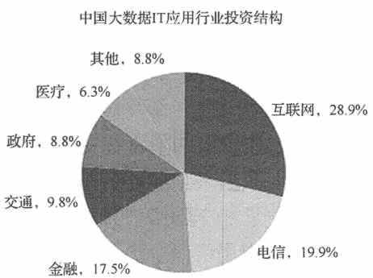

# 大数据可以应用在哪些行业？

> 原文：[`c.biancheng.net/view/3728.html`](http://c.biancheng.net/view/3728.html)

经过近几年的发展，大数据技术已经慢慢地渗透到各个行业。不同行业的大数据应用进程的速度，与行业的信息化水平、行业与消费者的距离、行业的数据拥有程度有着密切的关系。总体看来，应用大数据技术的行业可以分为以下 4 大类。

#### 1）第一大类是互联网和营销行业。

互联网行业是离消费者距离最近的行业，同时拥有大量实时产生的数据。业务数据化是其企业运营的基本要素，因此，互联网行业的大数据应用的程度是最高的。与互联网行业相伴的营销行业，是围绕着互联网用户行为分析，以为消费者提供个性化营销服务为主要目标的行业。

#### 2）第二大类是信息化水平比较高的行业。

如金融、电信等行业。它们比较早地进行信息化建设，内部业务系统的信息化相对比较完善，对内部数据有大量的历史积累，并且有一些深层次的分析类应用，目前正处于将内外部数据结合起来共同为业务服务的阶段。

#### 3）第三类是政府及公用事业行业。

不同部门的信息化程度和数据化程度差异较大，例如，交通行业目前已经有了不少大数据应用案例，但有些行业还处在数据采集和积累阶段。政府将会是未来整个大数据产业快速发展的关键，通过政府及公用数据开放可以使政府数据在线化走得更快，从而激发大数据应用的大发展。

#### 4）第四类是制造业、物流、医疗、农业等行业。

它们的大数据应用水平还处在初级阶段，但未来消费者驱动的 C2B 模式会倒逼着这些行业的大数据应用进程逐步加快。

据统计，目前中国大数据 IT 应用投资规模最高的有五大行业，其中，互联网行业占比最高，占大数据 IT 应用投资规模的 28.9%，其次是电信领域（19.9%），第三为金融领域（17.5%），政府和医疗分别为第四和第五。如图 1 所示。
图 1  中国大数据 IT 应用行业投资结构
国际知名咨询公司麦肯锡在《大数据的下一个前沿：创新、竞争和生产力》报告中指出，在大数据应用综合价值潜力方面，信息技术、金融保险、政府及批发贸易四大行业的潜力最高，信息、金融保险、计算机及电子设备、公用事业 4 类的数据量最大。