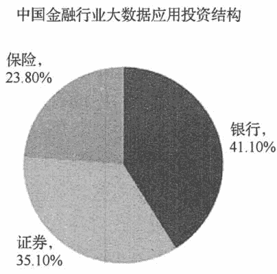
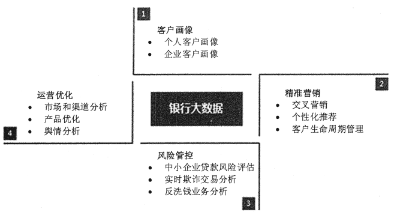
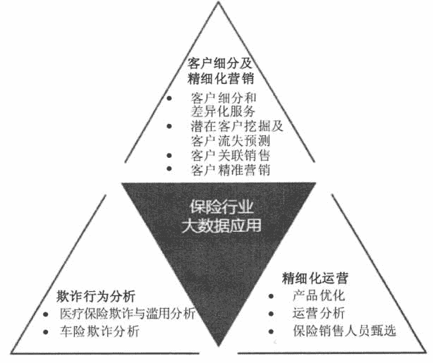

# 大数据在金融行业的应用

> 原文：[`c.biancheng.net/view/3736.html`](http://c.biancheng.net/view/3736.html)

金融行业是典型的数据驱动行业，每天都会产生大量的数据，包括交易、报价、业绩报告、消费者研究报告、各类统计数据、各种指数等。所以，金融行业拥有丰富的数据，数据维度比较广泛，数据质量也很高，利用自身的数据就可以开发出很多应用场景。

如果能够引入外部数据，还可以进一步加快数据价值的变现。外部数据中比较好的有社交数据、电商交易数据、移动大数据、运营商数据、工商司法数据、公安数据、教育数据和银联交易数据等。

大数据在金融行业的应用范围较广，典型的案例有花旗银行利用 IBM 沃森电脑为财富管理客户推荐产品，并预测未来计算机推荐理财的市场将超过银行专业理财师；摩根大通银行利用决策树技术，降低了不良贷款率，转化了提前还款客户，一年为摩根大通银行增加了 6 亿美金的利润。

从投资结构上来看，银行将会成为金融类企业中的重要部分，证券和保险分列第二和第三位，如图 1 所示。下面将分别介绍银行、证券和保险行业的大数据应用情况。
图 1  中国金融行业大数据应用投资结构

## 银行大数据应用场景

比较典型的银行的大数据应用场景集中在数据库营销、用户经营、数据风控、产品设计和决策支持等。目前来讲，大数据在银行的商业应用还是以其自身的交易数据和客户数据为主，外部数据为辅以描述性数据分析为主，预测性数据建模为辅，以经营客户为主，经营产品为辅。

银行的数据按类型可以分为交易数据、客户数据、信用数据、资产数据等 4 大类。银行数据大部分是结构化数据，具有很强的金融属性，都存储在传统关系型数据库和数据仓库中，通过数据挖掘可分析出其中的一些具有商业价值的隐藏在交易数据之中的知识。

国内不少银行已经开始尝试通过大数据来驱动业务运营，如中信银行信用卡中心使用大数据技术实现了实时营销，光大银行建立了社交网络信息数据库，招商银行则利用大数据发展小微贷款。如图 2 所示，银行大数据应用可以分为 4 大方面：客户画像、精准营销、风险管控、运营优化。

图 2  银行大数据应用的 4 大方面

#### 1）客户画像

客户画像应用主要分为个人客户画像和企业客户画像。个人客户画像包括人口统计学特征、消费能力、兴趣、风险偏好等数据；企业客户画像包括企业的生产、流通、运营、财务、销售和客户数据，以及相关产业链的上下游等数据。需要指出银行拥有的客户信息并不全面，基于银行自身拥有的数据有时候难以得出理想的结果，甚至可能得出错误的结论。

例如，如果某位信用卡客户月均刷卡 8 次，平均每次刷卡金额 800 元，平均每年打 4 次客服电话，从未有过投诉，如果按照传统的数据分析，该客户是一位满意度较高，流失风险较低的客户，但是，如果看到该客户的微博，得到的真实情况是，工资卡和信用卡不在同一家银行，还款不方便，好几次打客服电话没接通，客户多次在微博上抱怨，该客户的流失风险较高。所以银行不仅仅要考虑银行自身业务所采集到的数据，更应整合外部更多的数据，以扩展对客户的了解。

**① 客户在社交媒体上的行为数据**

通过打通银行内部数据和外部社会化的数据，可以获得更为完整的客户画像，从而进行更为精准的营销和管理，例如，光大银行建立了社交网络信息数据库。

**② 客户在电商网站的交易数据**

通过客户在电商网站上的交易数据就可以了解客户的购买能力和购买习惯，从而帮助银行评判客户的信贷能力。例如，建设银行将自己的电子商务平台和信贷业务结合起来，阿里金融根据用户过去的信用即可为阿里巴巴用户提供无抵押贷款。

**③ 企业客户的产业链的上下游的数据**

如果银行掌握了企业所在的产业链的上下游的数据，则可以更好地掌握企业的外部环境发展情况，从而预测企业未来的状况。

**④ 其他有利于扩展银行对客户兴趣爱好的数据**

还有其他有利于扩展银行对客户兴趣爱好的数据，如网络广告界目前正在兴起的 DMP 数据平台的互联网用户行为数据。

#### 2）精准营销

在客户画像的基础上，银行可以有效地开展精准营销

**① 实时营销**

实时营销是根据客户的实时状态来进行营销的，例如，根据客户当时的所在地、客户最近一次消费等信息有针对性地进行营销。当某客户采用信用卡采购孕妇用品时，可以通过建模推测怀孕的概率，并推荐孕妇类喜欢的业务。也可以将客户改变生活状态的事件（换工作、改变婚姻状况、置居等）视为营销机会。

**② 交叉营销**

交叉营销就是进行不同业务或产品的交叉推荐，例如，招商银行可以根据客户交易记录进行分析，有效地识别小微企业客户，然后用远程银行来实施交叉销售。

**③ 个性化推荐**

银行可以根据客户的喜好进行服务或者银行产品的个性化推荐，例如，根据客户的年龄、资产规模、理财偏好等，对客户群进行精准定位，分析出其潜在的金融服务需求，进而有针对性地营销推广。

**④ 客户生命周期管理**

客户生命周期管理包括新客户获取、客户防流失和客户赢回等。例如，招商银行通过构建客户流失预警模型，对流失率等级前 20% 的客户发售高收益理财产品予以挽留，使得金卡和金葵花卡客户流失率分别降低了 15 个和 7 个百分点。

现代化的商业银行正在从经营产品转向经营客户，因此目标客户的寻找，已经成为银行数据商业应用的主要方向。通过数据挖掘和分析，发现高端财富管理和理财客户成为吸收存款和理财产品销售的主要应用领域。

**① 利用数据库营销，挖掘高端财富客户**

利用数据库营销是一种挖掘高端财富客户的有效方法。银行可以从物业费代缴服务中寻找高端理财客户。通过帮助一些物业公司，特别是包含较多高档楼盘的物业公司，进行物业费的代扣代缴，银行可以依据物业费的多少，来识别高档住宅的业主。

例如，银行可以从数据库中发现物业费代扣金额超过 4000 元的客户，然后结合其在本行的资产余额，进行针对性的分析，从而可以帮助银行找到一些主要资产不在本行的高端用户，为这些用户提供理财服务和资产管理服务。某家股份制商业银行曾经利用该营销方法，在两个月内吸引到十多亿的存款。

**② 利用刷卡记录来寻找财富管理人群**

高端财富人群是所有银行财富管理重点发展的人群。中国具有上百万的高端财富人群，他们平均可支配的金融资产在一千万人民币。高端财富人群具有典型的高端消费习惯，覆盖奢侈品、游艇、豪车、手表、高尔夫、古玩、字画等消费场景。银行可以参考 POS 机的消费记录，结合移动设备的位置数据识别出这些高端财富管理人群，为其提供定制的财富管理方案，吸收其成为财富管理客户，增加存款和理财产品销售。

**③ 利用外部数据找到白金卡用户**

白金信用卡主要面对高端消费人群，是信用卡公司希望获得的高价值用户。尽管这些人群很难通过线下的方式进行接触，但是银行可以通过参考客户乘坐头等舱的次数、出境游消费金额、境外数据漫游费用等来发现这些潜在的白金卡客户。通过与其他行业的消费信息进行关联分析发现潜在客户是典型的大数据关联应用消费场景。

#### 3）风险管控

利用大数据技术可以进行对中小企业贷款风险的评估和对欺诈交易的识别，从而帮助银行降低风险。

**① 中小企业贷款风险评估**

信贷险一直是金融机构需要努力化解的一个重要问题。为数众多的中小企业是金融机构不可忽视的客户群体，市场潜力巨大。但是，中小企业贷款偿还能力差，财务制度普遍不健全，难以有效评估其真实经营状况，生存能力相对比较低，信用度低。

据测算，对中小企业贷款的平均管理成本是大型企业的 5 倍左右，而风险成本却高很多。这种成本、收益和险的不对称导致金融机构不愿意向中小企业全面敞开大门。

现在，通过使用大数据分析技术，银行可通过将企业的生产、流通、销售、财务等相关信息与大数据挖掘方法相结合的方式进行贷款风险分析，从而量化企业的信用额度，更有效地开展中小企业贷款。例如，“阿里小贷”依据会员在阿里巴巴平台上的网络活跃度、交易量、网上信用评价等，结合企业自身经营的财务健康状况进行贷款决定。

“阿里小贷”首先通过阿里巴巴 B2B、淘宝、天猫、支付宝等电子商务平台，收集客户积累的信用数据，包括客户评价数据、货运数据、口碑评价等，同时引入海关、税务、电力等外部数据加以匹配，建立数据模。

其次，通过交叉检验技术辅以第三方验证确认客户的真实性，将客户在电子商务平台上的行为数据映射为企业和个人的信用评价，并通过评分卡体系、微贷通用规则决策引擎、风险定量化分析等技术，对地区客户进行评级分层。

最后，在风险监管方面，开发了网络人际爬虫系统，可获取和整合相关人际关系信息，并通过设计规则及其关联性分析得到风险评估结论，再通过与贷前评级系统的交叉验证，构成风险控制的双保险。

**② 欺诈交易识别**

银行可以利用持卡人基本信息、卡基本信息、交易历史、客户历史行为模式、正在发生行为模式等，结合智能规则引擎进行实时的交易反欺诈分析，例如，IBM 金融犯罪管理解决方案帮助银行利用大数据有效地预防与管理金融犯罪；摩根大通银行利用大数据技术追踪盗取客户账号或侵入自动柜员机（ATM）系统的罪犯。

#### 4）运营优化

大数据分析方法可以改善经营决策，为管理层提供可靠的数据支撑，使经营决策更加高效、敏捷，精确性更高。

**① 市场和渠道分析优化**

通过大数据，银行可以监控不同市场推广渠道尤其是网络渠道推广的质量，从而进行合作渠道的调整和优化，同时，银行也可以分析哪些渠道更适合推广哪类银行产品或者服务，从而进行渠道推广策略的优化。

**② 产品和服务优化**

银行可以将客户行为转化为信息流，并从中分析客户的个性特征和风险偏好，更深层次地理解客户的习惯，智能化分析和预测客户需求，从而进行产品创新和服务优化。例如，兴业银行通过对还款数据的挖掘来比较区分优质客户，根据客户还款数额的差别，提供差异化的金融产品和服务方式。

**③ 舆情分析**

银行可以通过爬虫技术，抓取社区、论坛和微博上关于银行以及银行产品和服务的相关信息，并通过自然语言处理技术进行正负面判断，尤其是及时掌握银行以及银行产品和服务的负面信息，及时发现和处理问题；对于正面信息，可以加以总结并继续强化。同时，银行也可以抓取同行业的正负面信息，及时了解同行做得好的方面，以作为自身业务优化的借鉴。

## 证券行业数据应用场景

证券行业的主要收入来源于经纪业务、资产管理、投融资服务和自由资金投资等。外部数据的分析，特别是行业数据的分析有助于其投融资服务和投资业务。

证券行业拥有的数据类型有个人属性信息（如用户名称、手机号码、家庭地址、邮件地址等）、交易用户的资产和交易纪录、用户收益数据。证券公司可以利用这些数据和外部数据来建立业务场景，筛选目标客户，为用户提供适合的产品，提高单个客户收入。

证券行业需要通过数据挖掘和分析找到高频交易客户、资产较高的客户和理财客户。借助于数据分析的结果，证券公司就可以根据客户的特点进行精准营销，推荐针对性服务。

如果客户平均年收益低于 5%，交易频率很低，就可以建议其购买证券公司提供的理财产品。如果客户交易比较频繁，收益也比较高，那么就可以主动推送融资服务。如果客户交易不频繁，但是资金量较大，就可以为客户提供投资咨询服务，激活客户的交易兴趣。客户交易的频率、客户的资产规模和客户交易量都是证券公司的主要收入来源，通过对客户交易习惯和行为的分析，可以帮助证券公司获得更多的收益。

除了利用企业财务数据来判断企业经营情况以外，证券公司还可以利用外部数据来分析企业的经营情况，为投融资以及自身投资业务提供有力支持。

例如，利用移动 App 的活跃和覆盖率来判断移动互联网企业的经营情况，电商、手游、旅游等行业的 App 活跃情况完全可以说明企业的运营情况。另外，海关数据、物流数据、电力数据、交通数据、社交舆情、邮件服务器容量等数据可以说明企业经营情况，为投资提供重要参考。

目前，国内外证券行业的大数据应用大致有以下 3 个方向：股价预测，客户关系管理和投资景气指数预测。

#### 1）股价预测

2011 年 5 月，英国对冲基金 Derwent Capital Markets 建立了规模为 4 000 美金的对冲基金。该基金是基于社交网络的对冲基金，通过分析 Twitter 的数据内容来感知市场情绪，从而指导进行投资，并在首月的交易中实现盈利，其以 1.85% 的收益率，让平均数只有 0.76% 的其他对冲基金相形见绌。

麻省理工学院的学者，根据情绪词将 Twitter 内容标定为正面或负面情绪。结果发现，无论是如“希望”的正面情绪，还是如“害怕”“担心”的负面情绪，其占总 Twitter 内容数的比例，都预示着道琼斯指数、标准普尔 500 指数、纳斯达克指数的下跌。

美国佩斯大学的一位博士则采用了另外一种思路，他追踪了星巴克、可口可乐和耐克三家公司在社交媒体上的受欢迎程度，同时比较它们的股价。他发现，Facebook 上的粉丝数、Twitter 上的听众数和 Youtube 上的观看人数都和股价密切相关。另外，根据品牌的受欢迎程度，还能预测股价在 10 天、30 天之后的上涨情况。

#### 2）客户关系管理

**① 客户细分**

客户细分是指通过分析客户的账户状态（类型、生命周期、投资时间）、账户价值（资产峰值、资产均值、交易量、佣金贡献和成本等）、一交易习惯（周转率、市场关注度、仓位、平均持股市值、平均持股时间、单笔交易均值和日均成交量等）、投资偏好（偏好品种、下单渠道和是否申购）及投资收益（本期相对和收益、今年相对和收益和投资能力等），来进行客户聚类和细分，从而发现客户交易模式类型，找岀最有价值和盈利潜力的客户群，以及他们最需要的服务，更好地配置资源和政策，改进服务，抓住最有价值的客户。

**② 流失客户预测**

券商可根据客户历史交易行为和流失情况来建模，从而预测客户流失的概率。例如，2012 年海通证券自主开发的“给予数据挖掘算法的证券客户行为特征分析技术”主要应用在客户深度画像及基于画像的用户流失概率预测中。

通过对海通 100 多万样本客户、半年交易记录的海量信息分析，建立了客户分类、客户偏好、客户流失概率的模型。该项技术通过客户行为的量化分析来测算客户将来可能流失的概率。

#### 3）投资景气指数预测

2012 年，国泰君安推出了“个人投资者投资景气指数”（简称“31 指数”），其通过一个独特的视角传递个人投资者对市场的预期、当期的风险偏好等信息。国泰君安研究所通过对海量个人投资者样本进行持续性跟踪监测，对账本投资收益率、持仓率、资金流动情况等一系列指标进行统计、加权汇总后，得到了综合性投资景气指数。

“31 指数”通过对海量个人投资者真实投资交易信息的深入挖掘分析，来了解交易个人投资者交易行为的变化、投资信心的状态与发展趋势、对市场的预期及当前的风险偏好等信息。在样本选择上，国泰君安研究所选择了资金在 100 万元以下、投资年限在 5 年以上的中小投资者，样本规模高达 10 万，覆盖全国不同地区，所以，这个指数较为有代表性，在参数方面，主要根据中小投资者持仓率的高低、是否追加资金、是否盈利这几个指标，来看投资者对市场是乐观还是悲观。

“31 指数”每月发布一次，以 100 为中间值，100~120 属于正常区间，120 以上表示趋热，100 以下则是趋冷。从实验数据看，从 2007 年至今，“31 指数”的涨跌波动与上证指数走势的拟合度相当高。

## 保险行业数据应用场景

保险行业主要通过保险代理人与保险客户进行连接，对客户的基本信息和需求掌握很少，因此极端依赖外部保险代理人和渠道（银行）。在竞争不激烈的情况下，这种连接客户的方式是可行的。但是随着互联网保险的兴起，用户会被分流到互联网渠道，特别是年轻人会更加喜欢通过互联网这个渠道来满足自己的需求。未来线上客户将成为保险公司客户的重要来源。

保险行业的产品是一个长周期性产品，保险客户再次购买保险产品的转化率很高,所以，经营好老客户是保险公司的一项重要任务。保险公司内部的交易系统不多，交易方式比较简单，数据主要集中在产品系统和交易系统之中。保险公司的主要数据有人口属性信息、信用信息、产品销售信息和客户家人信息等，但是缺少客户兴趣爱好、消费特征、社交等信息。

保险行业的数据业务场景是围绕保险产品和保险客户进行的，典型的数据应用有，利用用户行为数据来制定车险价格，利用客户外部行为数据来了解客户需求，向目标用户推荐产品等。

例如，依据个人属性和外部养车 App 的活跃情况，为保险公司找到车险客户；依据个人属性和移动设备位置信息，为保险企业找到商旅人群，推销意外险和保障险等；依据家人数据和人生阶段信息，为用户推荐理财保险，寿险，保障保险，养老险，教育险等；依据自身数据和外部数据，为高端人士提供财产险和寿险等；利用外部数据，提升保险产品的精算水平，提高利润水平和投资收益。

保险公司也需要同外部渠道进行合作，以开发出适合不同业务场景的保险产品，如航班延误险、旅游天气险、手机被盗险等新的险种。目的不仅仅是靠这些险种盈利，还是找到潜在客户，为客户提供其他保险产品。另外，保险公司应该借助于移动互联网连接客户，利用数据分析来了解客户，降低对外部渠道的依赖，降低保险营销费用，提高直销渠道投入和直销销售比。

总而言之，保险行业的大数据应用可以分为 3 大方面：客户细分及精细化营销、欺诈行为分析和精细化运营。如图 1 所示。
图 1  保险行业的大数据应用

#### 1）客户细分和精细化营销

**① 客户细分和差异化服务**

风险偏好是确定保险需求的关键。风险喜好者、风险中立者和风险厌恶者对于保险需求有不同的态度。一般来讲，风险厌恶者有更大的保险需求。在进行客户细分时，除了利用风险偏好数据外，还要结合客户职业、爱好、习惯、家庭结构、消费方式偏好数据，利用机器学习算法来对客户进行分类，并针对分类后的客户提供不同的产品和服务策略。

**② 潜在客户挖掘及流失用户预测**

保险公司可通过大数据整合客户线上和线下的相关行为，通过数据挖掘手段对潜在客户进行分类，细化销售重点。保险公司通过大数据进行挖掘时，可综合考虑客户的信息、险种信息、既往出险情况、销售人员信息等，筛选出影响客户退保或续期的关键因素，并通过这些因素和建立的模型“对客户的退保概率或续期概率进行估计，找出高风险流失客户，及时预警，制定挽留策略，提高保单续保率。

**③ 客户关联销售**

保险公司可以通过关联规则找出较佳的险种销售组合，利用时序规则找出顾客生命周期中购买保险的时间顺序，从而把握保户提高保额的时机，建立既有保户再销售清单与规则，促进保单的销售。借助大数据，保险业还可以直接锁定客户需求。

以淘宝运费退货险为例，据统计，淘宝用户运费险索赔率在 50%以上，该产品给保险公司带来的利润只有 5%左右。但是客户购买运费险后，保险公司就可以获得该客户的个人基本信息，包括手机号和银行账户信息等，并能够了解该客户购买的产品信息，从而实现精准推送。假设该客户购买并退货的是婴儿奶粉，我们就可以估计该客户家里有小孩，可以向其推荐儿童疾病险、教育险等利润率更高的产品。

**④ 客户精准营销**

在网络营销领域,保险公司可以通过收集互联网用户的各类数据，如地域分布等属性数据，搜索关键词等即时数据，购物行为、浏览行为等行为数据，以及兴趣爱好、人脉关系等社交数据，在广告推送中实现地域定向、需求定向、偏好定向、关系定向等定向方式，实现精准营销。

#### 2）欺诈行为分析

欺诈行为分析是指基于企业内外部交易和历史数据，实时或准实时预测和分析欺诈等非法行为，包括医疗保险欺诈与滥用分析，以及车险欺诈分析等。

**① 医疗保险欺诈与滥用分析**

医疗保险欺诈与滥用通常可分为两种：一种是非法骗取保险金，即保险欺诈；另一种则是在保额限度內重复就医、浮报理赔金额等，即医疗保险滥用。保险公司能够利用过去数据，寻找影响保险欺诈的更为显著的因素及这些因素的取值区间，建立预测模型，并通过自动化计分功能，快速将理赔案件依照滥用欺诈可能性进行分类处理。

**② 车险欺诈分析**

保险公司能够利用过去的欺诈事件建立预测模型，将理赔申请分级处理，可以很大程度上解决车险欺诈问题，包括车险理赔申请欺诈侦测、业务员及修车厂勾结欺诈侦测等。

#### 3）精细化运营

**① 产品优化**

过去保险公司把很多人都放在同一风险水平之上，客户的保单并没有完全解决客户的各种风险问题。使用精细化的数据分析，保险公司可以通过自有数据及客户在社交网络的数据，解决现有的风险控制问题，为客户制定个性化的保单，获得更准确及更高利润率的保单模型，给每一位顾客提供个性化的解决方案。

**② 运营分析**

运营分析是指基于企业内外部运营、管理和交互数据分析，借助大数据平台，全方位统计和预测企业经营和管理绩效，基于保险保单和客户交互数据进行建模，借助大数据平台快速分析和预测再次发生的或新的市场风险、操作风险等。

**③ 保险销售人员甄选**

保险销售人员甄选是指根据保险销售人员业绩数据、性别、年龄、入司前工作年限、其他保险公司经验和代理人人员思维性向测试等，找出销售业绩相对较好的销售人员的特征，优选高潜力销售人员。