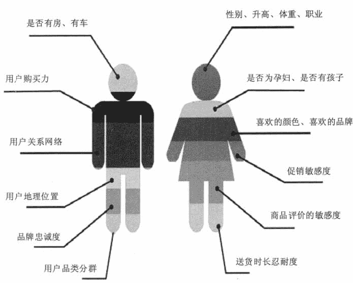
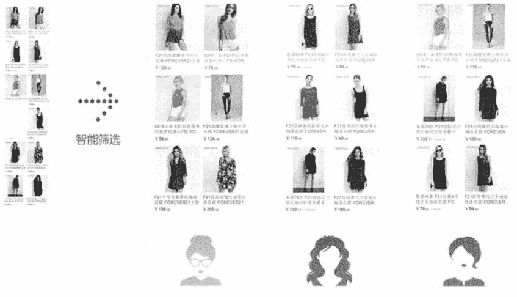
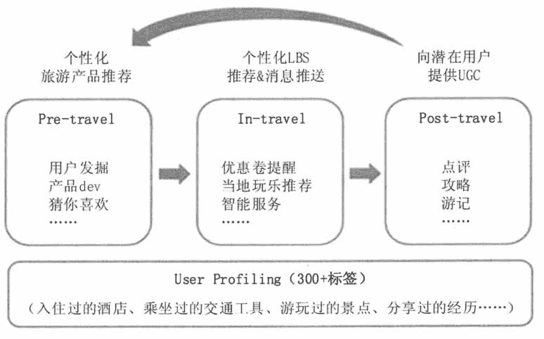
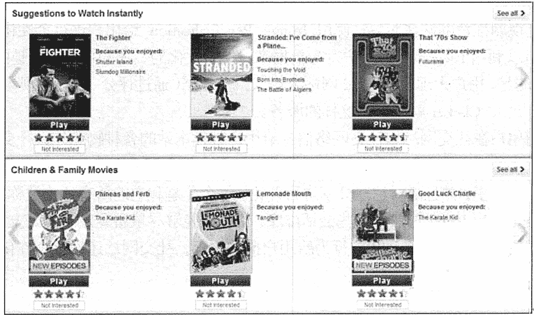

# 大数据在互联网行业的应用

> 原文：[`c.biancheng.net/view/3746.html`](http://c.biancheng.net/view/3746.html)

互联网企业拥有大量的线上数据，而且数据量还在快速增长，除了利用大数据提升自己的业务之外，互联网企业已经开始实现数据业务化，利用大数据发现新的商业价值。

以阿里巴巴为例，它不仅在不断加强个性化推荐、“千人千面”这种面向消费者的大数据应用，并且还在尝试利用大数据进行智能客户服务，这种应用场景会逐渐从内部应用延展到外部很多企业的呼叫中心之中。

在面向商家的大数据应用中，以“生意参谋”为例，超过 600 万商家在利用“生意参谋”提升自己的电商店面运营水平。除了面向自己的生态之外，阿里巴巴数据业务化也在不断加速，“芝麻信用”这种基于收集的个人数据进行个人信用评估的应用获得了长足发展，应用场景从阿里巴巴的内部延展到越来越多的外部场景，如租车、酒店、签证等。

因为客户的所有行为都会在互联网平台上留下痕迹，所以互联网企业可以方便地获取大量的客户行为信息。由互联网商务平台产生的信息一般具有真实性和确定性，通过运用大数据技术对这些数据进行分析，可以帮助企业制定出具有针对性的服务策略，从而获取更大的效益。近年来的实践证明，合理地运用大数据技术能够将电子商务的营业效率提高 60% 以上。

大数据在过去几年中已经改变了电子商务的面貌，具体来讲，电子商务行业的大数据应用有以下几个方面：精准营销、个性化服务、商品个性化推荐。

**1\. 精准营销**

互联网企业使用大数据技术采集有关客户的各类数据，并通过大数据分析建立“用户画像”来抽象地描述一个用户的信息全貌，从而可以对用户进行个性化推荐、精准营销和广告投放等。

当用户登录网站的瞬间，系统就能预测出该用户今天为何而来，然后从商品库中把合适的商品找出来，并推荐给他。图 1 显示了用户画像会包括哪些用户基本信息和特性。
图 1  用户画像
大数据支持下的营销核心在于，让企业的业务在合适的时间，通过合适的载体，以合适的方式，推送给最需要此业务的用户。

首先，大数据营销具有很强的时效性。在互联网时代，用户的消费行为极易在短时间内发生变化，大数据营销可以在用户需求最旺盛时及时进行营销策略实施。

其次，可以实施个性化、差异化营销。大数据营销可以根据用户的兴趣爱好、在某一时间点的需求，做到对细分用户的一对一的营销，让业务的营销做到有的放矢，并可以根据实时性的效果反馈，及时调整营销策略。

最后，大数据营销对目标用户的信息可以进行关联性分析。大数据可以对用户的各种信息进行多维度的关联分析，从大量数据中发现数据项集之间有趣的关联和相关联系。

例如，通过发现用户购物篮中的不同商品之间的联系，分析出用户的其他消费习惯。通过了解哪些商品频繁地被用户同时购买，帮助营销人员从用户的一种商品消费习惯，发现用户另外的商品消费规律，从而针对此用户制定出相关商品的营销策略。图 2 显示了网站会根据用户画像为不同客户推荐不同商品。

图 2  精准营销
例如，某电子商务平台通过客户的网络浏览记录和购买记录等掌握客户的消费模式，从而分析并分类客户的消费相关特性。如收入、家庭特征、购买习惯等，最终掌握客户特征，并基于这些特征判断其可能关注的产品与服务。

从消费者进入网站开始，网站在列表页、单品页、购物车页等 4 个页面，部署了 5 种应用不同算法的推荐栏为其推荐感兴趣的商品，从而提高商品曝光率，促进交叉和向上销售。从多个角度对网站进行全面优化后，商城下定订单转化率增长了 66.7%，下定商品转化率增长了 18%，总销量增长了 46%。

在美国的沃尔玛大卖场，当收银员扫描完顾客所选购的商品后，POS 机上会显示出一些附加信息，然后售货员会根据这些信息提醒顾客还可以购买哪些商品。沃尔玛在大数据系统支持下实现的“顾问式营销”系统能够建立预测模型，例如，如果顾客的购物车中有不少啤酒、红酒和沙拉，则有 80% 的可能需要买配酒小菜、作料。

**2\. 个性化服务**

电子商务具有提供个性化服务的先天优势，可以通过技术支持实时获得用户的在线记录，并及时为他们提供定制化服务。

许多电商都已经尝试了依靠数据分析，在首页为用户提供全面的个性化的商品推荐。海尔和天猫提供了让用户在网上定制电视的功能，顾客可以在电视机生产以前选择尺寸、边框、清晰度、能耗、颜色、接口等属性，再由厂商组织生产并送货到顾客家中。这样的个性化服务受到了广泛欢迎。

类似的定制服务还岀现在空调、服装等行业。这些行业通过满足个性化需求使顾客得到更满意的产品和服务，进而缩短设计、生产、运输、销售等周期，提升商业运转效率。

企业要为用户提供理想的个性化服务，首先必须通过数据充分了解用户的个性，其次是合理地掌控和设计服务的个性。了解用户个性是为用户提供他们想要的产品和服务的基础。企业需要在庞大的数据库中，找出最具有含金量的数据，然后，通过数据挖掘方法对用户进行聚类，再依据用户类型的特征设计针对性的服务。

个性化分散的单位可大可小，大到一个有同样需求的客户群体，小到每一个用户都是一个个性化需求单位。企业必须掌握好个性化服务的粒度，过于分散的个性化服务，会增加企业的服务成本和管理的复杂程度，所增加的个性化成本和实际收益需要成正比。

图 3  提供个性化旅游服务
携程的大数据应用从用户的角度岀发，分析基于携程所有用户的数据，包括用户在查询、浏览、预订、出行、评论等一系列旅行前后行为中所产生的数据。携程在剔除无效数据的同时，保证用户所留下的数据的真实性，然后将大量的数据进行实时筛选、分拣与重新组织并应用到用户的出行前、出行中、出行后的个性化需求中，如图 3 所示。

要做到个性化，明确用户的目标需求是至关重要的，不仅要看订单，还要关心用户所关心的内容。例如，同样是预订五星级酒店，有些用户对酒店设施十分敏感，有些看重酒店位置，有些则更在意酒店服务，对此，携程会根据用户的需求推荐不同的酒店。

美国塔吉特（Target）百货设立了一个迎婴聚会登记表，并对登记表中顾客的消费数据进行建模分析。他们发现，许多孕妇在第二个妊娠期的开始会买许多大包装的无香味护手霜，在怀孕的最初 20 周会大量购买补充钙、锌之类的保健品。

塔吉特最终选出了 25 种典型商品的消费数据，构建了“怀孕预测指数”。通过这个预测指数，塔吉特能够在很小的误差范围内预测到顾客的怀孕情况，从而就能在合适的时间把孕妇优惠广告寄发给顾客。

“Nike 跑鞋或腕带传感器”使耐克逐渐成为大数据营销的创新公司。运动者只要穿着 Nike 的跑鞋运动，与之关联的 iPod 就可以存储并显示运动日期、时间、距离、热量消耗值等数据。

Nike 通过跑步者上传的跑步路线掌握了主要城市最佳跑步路线的数据库，而且组织城市的跑步活动效果更好。目前，Nike 的运动网上社区有超过 500 万名活跃用户每天不停地上传数据，Nike 借此与消费者建立了前所未有的牢固关系。同时，海量的数据对于 Nike 了解用户习惯、改进产品、精准投放和精准营销也起到了不可替代的作用，Nike 甚至掌握了跑步者最喜欢听的歌是哪些。个性化服务离不开顾客的主动参与和分享，来源于客户的数据也能更精准地服务于客户。

“三只松鼠”近几年的快速发展，一方面是依靠品牌推广，另一方面是在数据分析的基础上不断完善细节，包括个性化的称呼、“三只松鼠”的卡通形象、赠品的差别化、不同的顾客标签分类以及用户体验等。“三只松鼠”通过 ERP 系统能够了解所有顾客在商城的购买记录，通过 CRM 系统能够准确抓取用户的评价，一些不经意的留言和评级会反映出他们的需求。

通过分析顾客过去在商城的购买习惯，用户的购买评价，来判断哪种口味的产品在哪个地区卖得最好，哪种产品是消费者最乐于接受的，从而进行更有针对性的产品首页推荐。同时，他们会对顾客进行个性化、人性化的标签分类和细化分析，从而根据这些分类，推送不同的产品类型。例如，爱老婆型顾客购买的产品主要是以老婆食用为主的，“三只松鼠”会在包裹里放上书信，以“松鼠”的口吻代替顾客给他老婆写一封信。

**3\. 商品个性化推荐**

随着电子商务规模的不断扩大，商品数量和种类快速增长，顾客需要花费大量的时间才能找到自己想买的商品。

个性化推荐系统通过分析用户的行为，包括反馈意见、购买记录和社交数据等，以分析和挖掘顾客与商品之间的相关性，从而发现用户的个性化需求、兴趣等，然后将用户感兴趣的信息、产品推荐给用户。

个性化推荐系统针对用户特点及兴趣爱好进行商品推荐，能有效地提高电子商务系统的服务能力，从而保留客户。

#### 1）电子商务网站

随着电子商务的蓬勃发展，推荐系统在互联网中的优势地位也越来越明显。

在国际方面，Amazon 平台中采用的推荐算法被认为是非常成功的。在国内，比较大型的电子商务平台网站有淘宝网（包括天猫商城）、京东商城、当当网、苏宁易购等。

在这些电子商务平台中，网站提供的商品数量不计其数，网站中的用户规模也非常巨大。据不完全统计，天猫商城中的商品数量已经超过了 4 000 万。

在如此庞大的电商网站中，用户根据自己的购买意图输入关键字查询后，会得到很多相似的结果。用户在这些结果中也很难区分异同，难于选择合适的物品，推荐系统能够根据用户兴趣为用户推荐一些用户感兴趣的商品。电子商务网站利用推荐系统为用户推荐商品，方便了用户，从而也提高了网站的销售额。

#### 2）电影视频网站

个性化推荐系统在电影和视频网站中的应用也很广泛，能够帮助用户在浩瀚的视频库中找到令他们感兴趣的视频。在该领域成功使用推荐系统的一家公司就是 Netflix。

Netflix 原先是一家 DVD 租赁网站，后来开始涉足在线视频业务。Netflix 非常重视个性化推荐技术，并且在 2006 年开始举办著名的 Netflix Prize 推荐系统比赛，希望研究人员能够将 Netflix 的推荐算法的预测准确度提升 10%。

该比赛对推荐系统的发展起到了重要的推动作用：一方面该比赛给学术界提供了一个实际系统中的大规模用户行为数据集（40 万用户对 2 万部电影的上亿条评分记录）；另一方面，在 3 年的比赛中，参赛者提出了很多推荐算法，大大降低了推荐系统的预测误差。

图 4 是 Netflix 的电影推荐界面，包含了电影的标题和海报、用户反馈和推荐理由三部分。Netflix 使用的是基于物品的推荐算法，即给用户推荐和他们曾经喜欢的电影相似的电影。Netflix 宣称有 60% 的用户是通过其推荐系统找到感兴趣的电影和视频的。

图 4  Netflix 电影推荐
YouTube 作为美国最大的视频网站，拥有大量用户上传的视频内容。为了解决视频库的信息过载问题，YouTube 在个性化推荐领域也进行了深入研究，现在使用的也是基于物品的推荐算法。实验证明，YouTube 个性化推荐的点击率是热门视频点击率的两倍。

#### 3）网络电台

个性化网络电台也很适合进行个性化推荐。首先，音乐很多，用户不可能听完所有的音乐再决定自己喜欢听什么，而且每年新的歌曲在以很快的速度增加，因此用户无疑面临着信息过载的问题。其次，人们听音乐时，一般都是把音乐作为一种背景乐来听，很少有人必须听某首特定的歌。对于普通用户来说，听什么歌都可以，只要能够符合他们当时的心情就可以了。因此，个性化音乐网络电台是非常符合个性化推荐技术的产品。

目前有很多知名的个性化音乐网络电台。国际上著名的有 Pandora 和 Last.fm，国内的代表则是豆瓣电台。这 3 个个性化网络电台都不允许用户点歌，而是给用户几种反馈方式：喜欢、不喜欢和跳过。经过用户一定时间的反馈，电台就可以从用户的历史行为中获得用户的兴趣模型，从而使用户的播放列表越来越符合用户对歌曲的兴趣。

Pandora 的算法主要是基于内容的，其音乐家和研究人员亲自听了上万首来自不同歌手的歌，然后对歌曲的不同特性（如旋律、节奏、编曲和歌词等）进行标注，这些标注被称为音乐的基因。然后，Pandora 会根据专家标注的基因计算歌曲的相似度，并给用户推荐和他之前喜欢的音乐在基因上相似的其他音乐。

Last.fm 记录了所有用户的听歌记录及用户对歌曲的反馈，在这一基础上计算出不同用户在歌曲上的喜好相似度，从而给用户推荐和他有相似听歌爱好的其他用户喜欢的歌曲。同时，Last.fm 也建立了一个社交网络，来让用户能够和其他用户建立联系，以及让用户给好友推荐自己喜欢的歌曲。Last.fm 没有使用专家标注，而是主要利用用户行为计算歌曲的相似度。

#### 4）社交网络

社交网络中的个性化推荐技术主要应用在 3 个方面：利用用户的社交网络信息对用户进行个性化的物品推荐，信息流的会话推荐和给用户推荐好友。

Facebook 保存着两类最宝贵的数据：一类是用户之间的社交网络关系，另一类是用户的偏好信息。

Facebook 推出了一个称为 Instant Personalization 的推荐 API，它能根据用户好友喜欢的信息，给用户推荐他们的好友最喜欢的物品。很多网站都使用了 Facebook 的推荐 API 来实现网站的个性化。

著名的电视剧推荐网站 Clicker 使用 Instant Personalization 给用户进行个性化视频推荐。Clicker 现在可以利用 Facebook 的用户行为数据来提供个性化的、用户可能感兴趣的内容“'流”了，而更重要的是，用户无须在 Clicker 网站上输入太多数据（通过评分、评论或观看 Clicker.com 上的视频等方式），Clicker 就能提供这样的服务。

除了利用用户在社交网站的社交网络信息给用户推荐本站的各种物品外，社交网站本身也会利用社交网络给用户推荐其他用户在社交网站的会话。每个用户在 Facebook 的个人首页都能看到好友的各种分享，并且能对这些分享进行评论。每个分享和它的所有评论被称为一个会话，Facebook 开发了 EdgeRank 算法对这些会话排序，使用户能够尽量看到熟悉的好友的最新会话。

除了根据用户的社交网络及用户行为给用户推荐内容，社交网站还通过个性化推荐服务给用户推荐好友。

#### **5）其他应用**

因为电子商务企业基本上实现了业务流程的各个环节的数据化，所以可以充分利用大数据技术对这些数据进行挖掘分析来优化其业务流程，提高业务利润。除了前面介绍的几个应用之外，大数据在电子商务行业还可以应用在其他许多方面。

#### ① 动态定价和特价优惠

电子商务企业可以通过使用数据构建客户资料，并发现用户喜欢花费多少费用和喜欢购买什么产品，从而通过跟踪客户的消费行为，使用大数据分析来开发灵活的定价和折扣政策。例如，如果分析显示用户对特定类别商品的兴趣飙升，则电子商务企业可以提供打折或买一送一优惠。

#### ② 定制优惠

电子商务企业可以通过使用数据来确定客户的购买习惯，并根据以前的购买方式向他们发送有针对性的特价优惠和折扣代码。数据也可以用于在客户中止购买或只看不买时重新吸引客户，例如，通过发送电子邮件提醒客户他们查看过的产品或邀请他们完成购买。

#### ③ 供应链管理

电子商务企业可以使用大数据更有效地管理供应链。数据分析可以揭示供应链中的任何延迟或潜在的库存问题。如果某个项目存在问题，则可以立即将其从销售中删除，以免破坏客户服务问题。

#### ④ 预测分析

预测分析是指利用大数据技术分析电子商务业务的各种渠道，帮助企业制定未来运营的业务计划。数据分析可能会显示电商企业在线商店部门的新购买趋势或销售减缓的商品。

使用这些信息就可以帮助规划下一阶段的库存，并制定新的市场目标。随时了解电子商务的最新趋势具有一定的挑战性，但是利用大数据技术可以大大提高企业的利润，并帮助企业建立一个成功的前瞻性思维业务。如果不利用挖掘大数据的力量，就可能会错过市场成功的机遇。