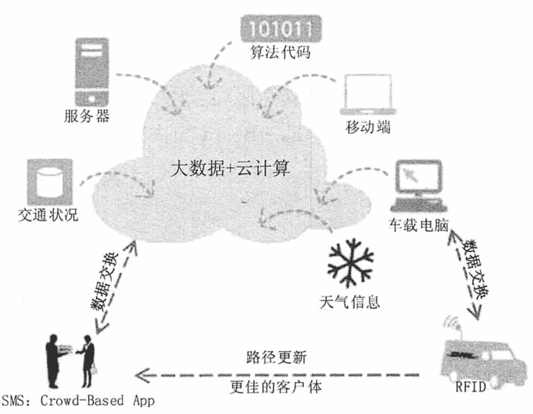
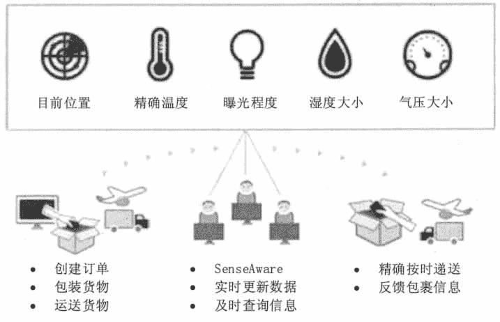
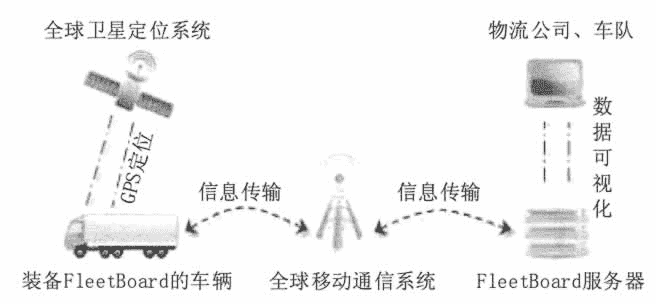
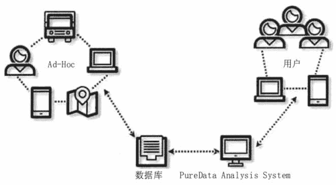
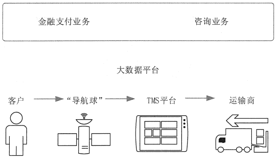
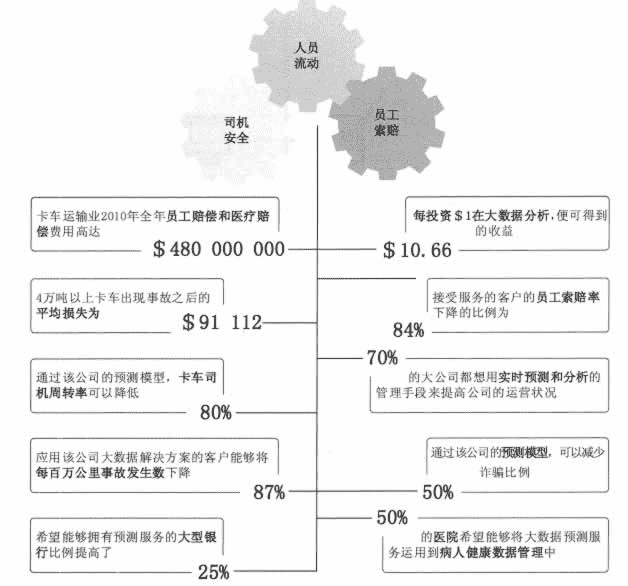

# 大数据在物流行业的应用

> 原文：[`c.biancheng.net/view/3748.html`](http://c.biancheng.net/view/3748.html)

物流大数据就是通过海量的物流数据，即运输、仓储、搬运装卸、包装及流通加工等物流环节中涉及的数据、信息等，挖掘出新的增值价值，通过大数据分析可以提高运输与配送效率，减少物流成本，更有效地满足客户服务要求。

**1\. 物流大数据的作用**

物流大数据应用对于物流企业来讲具有以下 3 个方面的重要作用。

#### 1）提高物流的智能化水平

通过对物流数据的跟踪和分析，物流大数据应用可以根据情况为物流企业做出智能化的决策和建议。在物流决策中，大数据技术应用涉及竞争环境分析、物流供给与需求匹配、物流资源优化与配置等。

在竞争环境分析中，为了达到利益的最大化，需要对竞争对手进行全面的分析，预测其行为和动向，从而了解在某个区域或是在某个特殊时期，应该选择的合作伙伴。

在物流供给与需求匹配方面，需要分析特定时期、特定区域的物流供给与需求情况，从而进行合理的配送管理。在物流资源优化与配置方面，主要涉及运输资源、存储资源等。物流市场有很强的动态性和随机性，需要实时分析市场变化情况，从海量的数据中提取当前的物流需求信息，同时对已配置和将要配置的资源进行优化，从而实现对物流资源的合理利用。

#### 2）降低物流成本

由于交通运输、仓储设施、货物包装、流通加工和搬运等环节对信息的交互和共享要求比较高，因此可以利用大数据技术优化配送路线、合理选择物流中心地址、优化仓库储位，从而大大降低物流成本，提高物流效率。

#### 3）提高用户服务水平

随着网购人群的急剧膨胀，客户越来越重视物流服务的体验。通过对数据的挖掘和分析，以及合理地运用这些分析成果，物流企业可以为客户提供最好的服务，提供物流业务运作过程中商品配送的所有信息，进一步巩固和客户之间的关系，增加客户的信赖，培养客户的黏性，避免客户流失。

**2\. 物流大数据应用案例**

针对物流行业的特性，大数据应用主要体现在车货匹配、运输路线优化、库存预测、设备修理预测、供应链协同管理等方面。

#### 1）车货匹配

通过对运力池进行大数据分析，公共运力的标准化和专业运力的个性化需求之间可以产生良好的匹配，同时，结合企业的信息系统也会全面整合与优化。通过对货主、司机和任务的精准画像，可实现智能化定价、为司机智能推荐任务和根据任务要求指派配送司机等。

从客户方面来讲，大数据应用会根据任务要求，如车型、配送公里数、配送预计时长、附加服务等自动计算运力价格并匹配最符合要求的司机，司机接到任务后会按照客户的要求进行高质量的服务。在司机方面，大数据应用可以根据司机的个人情况、服务质量、空闲时间为他自动匹配合适的任务，并进行智能化定价。基于大数据实现车货高效匹配，不仅能减少空驶带来的损耗，还能减少污染。

#### 2）运输路线优化

通过运用大数据，物流运输效率将得到大幅提高，大数据为物流企业间搭建起沟通的桥梁，物流车辆行车路径也将被最短化、最优化定制。

美国 UPS 公司使用大数据优化送货路线，配送人员不需要自己思考配送路径是否最优。UPS 采用大数据系统可实时分析 20 万种可能路线，3 秒找出最佳路径。

UPS 通过大数据分析，规定卡车不能左转，所以，UPS 的司机会宁愿绕个圈，也不往左转。根据往年的数据显示，因为执行尽量避免左转的政策，UPS 货车在行驶路程减少 2.04 亿的前提下，多送出了 350000 件包裹。

#### 3）库存预测

互联网技术和商业模式的改变带来了从生产者直接到顾客的供应渠道的改变。这样的改变，从时间和空间两个维度都为物流业创造新价值奠定了很好的基础。大数据技术可优化库存结构和降低库存存储成本。

运用大数据分析商品品类，系统会自动分解用来促销和用来引流的商品；同时，系统会自动根据以往的销售数据进行建模和分析，以此判断当前商品的安全库存，并及时给岀预警，而不再是根据往年的销售情况来预测当前的库存状况。总之，使用大数据技术可以降低库存存货，从而提高资金利用率。

#### 4）设备修理预测

美国 UPS 公司从 2000 年就开始使用预测性分析来检测自己全美 60 000 辆车规模的车队，这样就能及时地进行防御性的修理。如果车在路上抛锚，损失会非常大，因为那样就需要再派一辆车，会造成延误和再装载的负担，并消耗大量的人力、物力。

以前，UPS 每两三年就会对车辆的零件进行定时更换，但这种方法不太有效，因为有的零件并没有什么毛病就被换掉了。通过监测车辆的各个部位，UPS 如今只需要更换需要更换的零件，从而节省了好几百万美元。

#### 5）供应链协同管理

随着供应链变得越来越复杂，使用大数据技术可以迅速高效地发挥数据的最大价值，集成企业所有的计划和决策业务，包括需求预测、库存计划、资源配置、设备管理、渠道优化、生产作业计划、物料需求与采购计划等，这将彻底变革企业市场边界、业务组合、商业模式和运作模式等。

良好的供应商关系是消灭供应商与制造商间不信任成本的关键。双方库存与需求信息的交互，将降低由于缺货造成的生产损失。通过将资源数据、交易数据、供应商数据、质量数据等存储起来用于跟踪和分析供应链在执行过程中的效率、成本，能够控制产品质量；通过数学模型、优化和模拟技术综合平衡订单、产能、调度、库存和成本间的关系，找到优化解决方案，能够保证生产过程的有序与匀速，最终达到最佳的物料供应分解和生产订单的拆分。

**3\. Amazon 物流大数据应用**

Amazon 是全球商品品种最多的网上零售商，坚持走自建物流方向，其将集成物流与大数据紧紧相连，从而在营销方面实现了更大的价值。由于 Amazon 有完善、优化的物流系统作为保障，它才能将物流作为促销的手段，并有能力严格地控制物流成本和有效地进行物流过程的组织运作。

Amazon 在业内率先使用了大数据、人工智能和云技术进行仓储物流的管理，创新地推出预测性调拨、跨区域配送、跨国境配送等服务。

#### 1）订单与客户服务中的大数据应用

Amazon 了完整的端到端的 5 大类服务：浏览、购物、仓配、送货和客户服务等。

#### ① 浏览

Amazon 基于大数据分析技术来精准分析客户的需求。通过系统记录的客户浏览历史，后台会随之把顾客感兴趣的库存放在离他们最近的运营中心，这样方便客户下单。

#### ② 购物

不管客户在哪个角落，Amazon 都可以帮助客户快速下单，也可以很快知道他们喜欢的商品。

#### ③ 仓配

Amazon 运营中心最快可以在 30 分钟之内完成整个订单的处理。大数据驱动的仓储订单运营非常高效，订单处理、快速拣选、快速包装、分拣等一切过程都由大数据驱动，且全程可视化。

#### ④ 送货

Amazon 的物流体系会根据客户的具体需求时间进行科学配载，调整配送计划，实现用户定义的时间范围内的精准送达。Amazon 还可以根据大数据的预测，提前发货，赢得绝对的竞争力。

#### ⑤ 客户服务

Amazon 利用大数据驱动客户服务，创建了技术系统来识别和预测客户需求。根据用户的浏览记录、订单信息、来电问题，定制化地向用户推送不同的自助服务工具，大数据可以保证客户能随时随地电话联系到对应的客户服务团队。

#### 2）智能入库管理技术

在 Amazon 全球的运营中心，从入库这一时刻就开始使用大数据技术。

#### ① 入库

Amazon 采用独特的采购入库监控策略，基于自己过去的经验和所有历史数据的收集，来了解什么样的品类容易坏，坏在哪里，然后给其进行预包装。这都是在收货环节提供的增值服务。

#### ② 商品测量

Amazon 的 Cubi Scan 仪器会对新入库的中小体积商品进行长宽高和体积的测量，并根据这些商品信息优化入库。这给供应商提供了很大方便，客户不需要自己测量新品，这样能够大大提升新品上线速度。Amazon 数据库存储下这些数据，在全国范围内共享，这样其他库房就可以直接利用这些后台数据进行后续的优化、设计和区域规划。

#### 3）智能拣货和智能算法

Amazon 使用大数据分析实现了智能拣货，主要应用在以下几个方面。

#### ① 智能算法驱动物流作业，保障最优路径

Amazon 的大数据物流平台的数据算法会给每个人随机地优化他的拣货路径。系统会告诉员工应该去哪个货位拣货，并且可以确保全部拣选完之后的路径最少。通过这种智能的计算和智能的推荐，可以把传统作业模式的拣货行走路径减少至少 60%。

#### ② 图书仓的复杂的作业方法

图书仓采用的是加强版监控，会限制那些相似品尽量不要放在同一个货位。批量的图书的进货量很大“Amazon 通过对数据的分析发现，穿插摆放可以保证每个员工出去拣货的任务比较平均。

#### ③ 畅销品的运营策略

Amazon 根据后台的大数据，可以知道哪些物品的需求量比较高，然后会把它们放在离发货区比较近的地方，有些是放在货架上的，有些是放在托拍位上的，这样可以减少员工的负重行走路程。

#### 4）智能随机存储

随机存储是 Amazon 运营的重要技术，但是随机存储不是随便存储，而是有一定的原则性的。随机存储要考虑畅销商品与非畅销商品，还要考虑先进先出的原则，同时随机存储还与最佳路径有重要关系。

随机上架是 Amazon 的运营中心的一大特色，实现的是见缝插针的最佳存储方式。看似杂乱，实则乱中有序。乱是指可以打破品类和品类之间的界线，可以把它们放在一起。有序是指库位的标签就是它的 GPS，这个货位里面所有的商品其实在系统里面都是各就其位，非常精准地被记录在它所在的区域。

#### 5）智能分仓和智能调拨

Amazon 智能分仓和智能调拨拥有独特的技术优势，在 Amazon 中国的 10 多个平行仓的调拨完全是在精准的供应链计划的驱动下进行的，它实现了智能分仓、就近备货和预测式调拨。

全国各个省市包括各大运营中心之间有干线的运输调配，以确保库存已经提前调拨到离客户最近的运营中心。整个智能化全国调拨运输网络很好地支持了平行仓的概念，全国范围内只要有货用户就可以下单购买，这是大数据体系支持全国运输调拨网络的充分表现。

#### 6）精准库存预测

Amazon 的智能仓储管理技术能够实现连续动态盘点，对库存预测的精准率可达 99.99%。在业务高峰期，Amazon 通过大数据分析可以做到对库存需求的精准预测，在配货规划、运力调配，以及末端配送等方面做好准备，从而平衡了订单运营能力，大大降低爆仓的风险。

#### 7）可视化订单作业、，包裹追踪

Amazon 实现了全球可视化的供应链管理，在中国就能看到来自大洋彼岸的库存。Amazon 平台可以让国内消费者、合作商和 Amazon 的工作人员全程监控货物、包裹位置和订单状态。从前端的预约到收货到內部存储管理、库存调拨、拣货、包装，再到配送发货，送到客户手中，整个过程环环相扣，每个流程都有数据的支持，并通过系统实现对其的可视化管理。

**4\. 国际物流大数据应用**

DHL 应用大数据加快了自身反应速度，通过分析客户数据做到了精准服务；UPS 通过大数据调整了配送策略节省了大量燃油成本；Fleet Risk Advisors 可对车队管理做全程监控，甚至能觉察到司机的心理变化。

#### 1）DHL

DHL 速递货运公司的快运卡车被特别改装成为 Smart Truck，并装有摩托罗拉的 XR48ORFIO 阅读器。每当运输车辆装载和卸载货物时，车载计算机会将货物上的 RFID 传感器的信息上传至数据中心服务器，服务器会在更新数据之后动态计算出最新最优的配送序列和路径。

此外，在运送途中，远程信息处理数据库会根据即时交通状况和 GPS 数据实时更新配送路径，做到更精确的取货和交货，对随时接收的订单做出更灵活的反应，以及向客户提供有关取货时间的精确信息。如图 1 所示。

图 1  DHL 物流大数据应用
DHL 通过对末端运营大数据的采集，实现了全程可视化的监控，以及最优路径的调度，同时精确到了每一个运营结点。此外，拥有 Crowd-Based 手机应用程序的顾客可以实时更新他们的位置或即将到达的目的地，DHL 的包裹配送人员能够实时收到顾客的位置信息，防止配送失败，甚至按需更新配送目的地。

#### 2）FedEx

FedEx 联邦快递可以让包裹主动传递信息。通过灵活的感应器（如 SenseAware）来实现近乎实时的反馈，包括温度、地点和光照，使得客户在任何时间都能了解到包裹所处的位置和环境，而司机也可在车里直接修改订单物流信息。

除此以外，联邦快递正在努力推动更加智能的递送服务；实现在被允许的情况下对客户所处的地理位置的实时更新和了解，使包裹更快速和精确地送达客户的手中。FedEx 将来可以根据收集到的历史数据和实时增量数据，通过大数据解决方案解决 FedEx 更多的问题，从而提升竞争力。如图 2 所示。

图 2  FedEx 物流大数据应用

#### 3）FleetBoard

FleetBoard 致力于通过大数据处理为物流行业用户提供远程信息化车队管理解决方案，实现数据采集和全程监控，包括驾驶司机的驾驶动作、车辆温度、车门打开等细节。车辆上的终端通过移动通信系统与 FleetBoard 的服务器建立联系，互换数据。

物流公司或车队管理者可直接访问 GPS 及其他若干实时数据，如车辆行驶方向，停车/行驶时间和装/卸货等信息。此外，通过计算驾驶员急加速、急刹车的次数，经济转速区行驶时间和怠速长短等信息，可以直接帮助驾驶员发现驾驶命令中的问题并改进提高。FleetBoard 的物流大数据应用如图 3 所示。
图 3  FleetBoard 物流大数据应用
对于冷链运输的用户，FleetBoard 有专门的数据管理系统来实时监测冷藏车的温度、车门是否打开等情况，自动向手机或电子邮箱发送警示信息。

#### 4）Con—Way Freight

Con-Way Freight 可提供零担运输、第三方物流和大宗货物运输等服务，范围覆盖了全美及北美五大洲的 18 个国家。

Con-Way Freight 通过使用大数据解决方案使得系统能够集成实时增量数据，并通过询问和处理非结构化数据快速得出准确的答案。

Ad-Hoc 系统使得公司可以定义需要监控的配送流程，预测商业活动内部和外部因素的影响，以及为 CRM 和营销计划提供消费者划分，甚至可以定位到任何一位客户，实时分析送达率和具体的货运损失等信息。而 Score Carding 系统能够将原定目标和实时表现进行对比，使 Con-Way Freight 能够随时根据对比结果全面调整和提高运营表现。如图 4 所示。

图 4  Con-Way Freight 物流大数据应用
Con-way Freight 高管能够通过大数据解决方案快速得出准确的数据报告，做岀恰当及时的运营决策。

#### 5）C.H.Robinson

C.H.Robmson 第三方物流公司拥有全美最大的卡车运输网络，却没有一辆货车。它用 1.5 亿美元的固定资产，创造了 114 亿美元的收入、4.5 亿美元的利润。它的新生始于 1997 年的商 业模式变革，主动放弃了自有货车，建立了专门整合其他运输商的物流系统，通过系统对社会 资源进行整合建立新的平台经济。如图 5 所示，C.H.Robmson 的平台模式由 3 部分构成：TMS 平台，用来链接运输商；“导航球” Navisphere 平台，用来连接客户；做支付的中间账户， 同时提供咨询服务。2012 年，支付服务带来大约 5 亿美元的净收入，咨询服务带来了 12 亿美 元的收入。

C.H.Robinson 通过系统的两大平台：导航球（Navisphere）和 TMS 平台，来对接客户群和运输商，沉淀形成的大数据库可支持 C.H.Robinson 的增值服务。

图 5  C.H.Robinson 物流大数据应用

#### 6）FRA

FRA（Fleet Risk Advisors）为运输行业提供了预测分析和风险预防或补救解决方案。FRA 根据历史数据和实时增量数据可得出司机工作表现模型和若干预测模型，能够准确地预测可避免的事故、员工流动等问题。

例如，根据司机实时的工作表现波动情况，预测司机疲劳程度和排班安排等，为客户提供合理的解决方案以便提高司机安全系数，此外还能根据司机和机动车的实时状况预测可能发生的风险，并及时提供预防或补救解决方案。FRA 利用大数据预测模型取得了很好的效果，如图 6 所示。

图 6  FRA 物流大数据应用
FRA 通过大数据解决方案得出司机工作表现的若干预测模型，解决了事故发生率和人员流动等人事部门的问题。