# VS2017 下载地址和安装教程（图解）

> 原文：[`c.biancheng.net/view/456.html`](http://c.biancheng.net/view/456.html)

继 VS2015 版本后，微软又推出了功能更加强大的 VS 2017。

Visual Studio 2017 不仅支持 C#、C++、Python、Visual Basic、Node.js、HTML、JavaScript 等各大编程语言，还能开发 iOS、Android 的移动平台应用，VS 2017 甚至还自带了 iOS 模拟器（之前为 MAC 独享的开发环境）。

VS 2017 版本同 15 版一样，细分为三个版本，分别是：

*   社区版（Community）：免费提供给单个开发人员，给予初学者及大部分程序员支持，可以无任何经济负担、合法地使用。
*   企业版：为正规企业量身定做，能够提供点对点的解决方案，充分满足企业的需求。企业版官方售价 2999 美元/年 或者 250 美元/月。
*   专业版：适用于专业用户或者小团体。虽没有企业版全面的功能，但相比于免费的社区版，有更强大的功能。专业版官方售价 539 美元/年 或者 45 美元/月。

对于大部分程序开发，以上版本区别不大，免费的社区版一样可以满足程序员需求，所以我推荐大家使用社区版，无需破解，轻松安装，快速使用。

## 下载 VS 2017

VS 2017 社区版（Community）下载地址：

*   迅雷下载：

ed2k://|file|en_visual_studio_community_2015_x86_dvd_6847364.iso|3965825024|6A7D8489BB2877E6BB8ACB2DD187B637|/

*   百度网盘：

链接: [`pan.baidu.com/s/1jJXyRMA`](https://pan.baidu.com/s/1jJXyRMA) 密码: ub6c
下载的文件，其大小不足 1 MB，只是 VS 2017 Community 简体中文版的一个安装引导程序。启动后勾选需要的组建即可进行在线下载安装。

## .NET Framework 安装

下载 VS 2017 的安装引导程序后，双击运行，如果出现下面的 Visual Studio 提示（如不出现此提示，可直接省略此环节）：

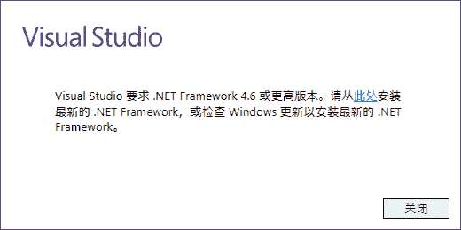
 则在安装 VS 2017 之前，需要首先自行安装版本较高的 .Net Framework 。建议直接下载. Net Framework 4.6 安装包进行安装，速度较快。

.Net Framework 4.6 版的下载地址:

*   迅雷下载(较快):

ed2k://|file|mu_.net_fx_4_6_2_for_win_7sp1_8dot1_10_win_server_2008sp2_2008r2sp1_2012_2012r2_x86_x64_9058211.exe|62008080|D36FDF083FF2970FD8B0080664AD32C6|/

*   百度网盘下载（较慢）：

链接: [`pan.baidu.com/s/1mj2mGgo`](https://pan.baidu.com/s/1mj2mGgo) 密码: bhf7
下载完成后，会得到一个 .net framework 的安装包，双击打开，会出现下面的一个安装进度条：

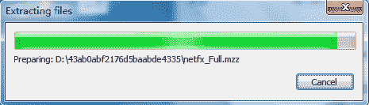
 进度条达到 100% 后，会自动跳到下面的页面：
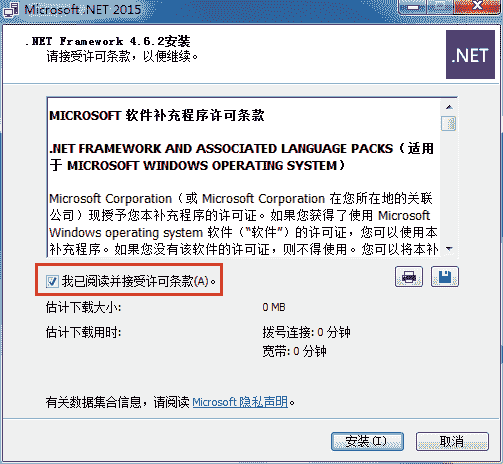
 勾选 “我已阅读并接受许可条款”，然后点击 “安装” 按钮，进行安装：
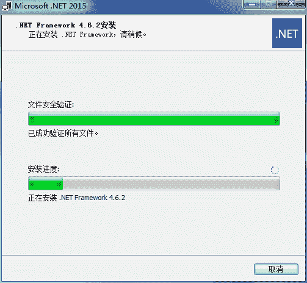
 待 “文件安全验证" 进度条和 “安装进度" 进度条全部达到 100%，程序会提示你安装完成，点击关闭即可（此时可能需要重启计算机，没关系，重启即可）。

## 安装 VS 2017

VS 2017 下载完成后，会得到一个用于引导用户安装的可执行文件，双击该文件，在 .Net Framework 版本没有问题的前提下，会进入安装页面：
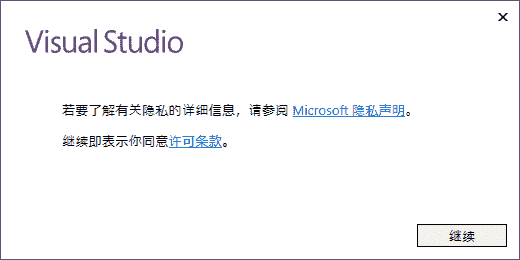
 直接点击 “继续” 按钮，此时会弹出一个进度条：
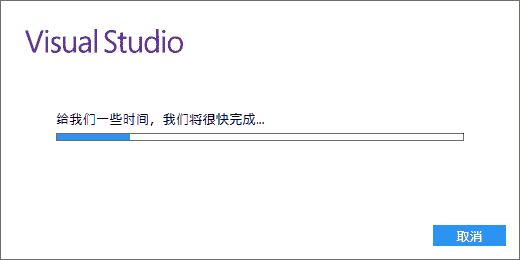
 等 Visual Studio 准备完成后，会直接跳到下面的页面：
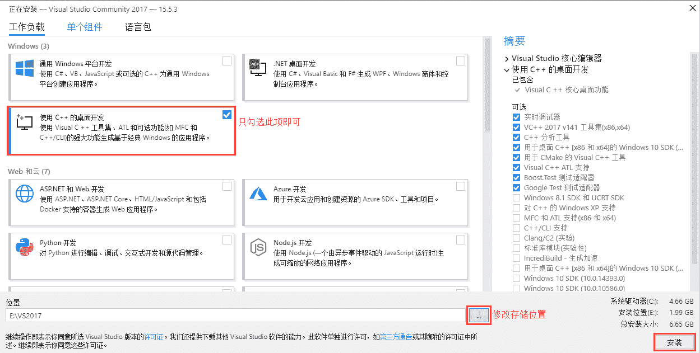
 VS 2017 除了支持 C/C++ 开发，还支持 C#、F#、Visual Basic 等开发语言，我们没有必要安装所有的组件，只需要安装 “使用 C++ 的桌面开发” 即可。

同时在这个页面，还可以选择 VS 2017 的存储位置，建议不要安装在 C 盘，可选择其他盘。然后直接点击安装，安装过程可能需要一段时间，大家耐心等待。

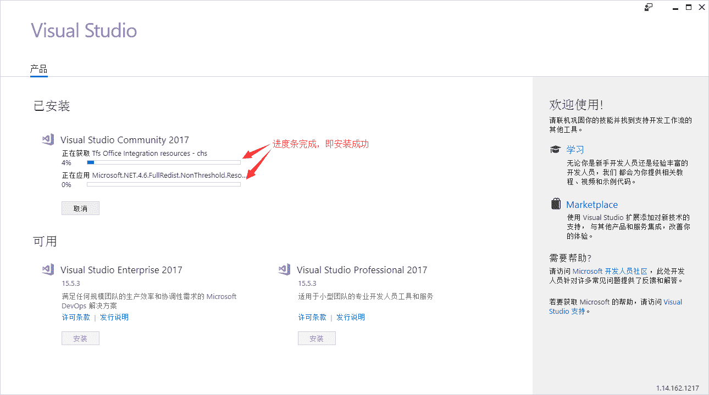
 安装完成后，VS 2017 会要求重启计算机，该保存的保存，按要求重启即可。
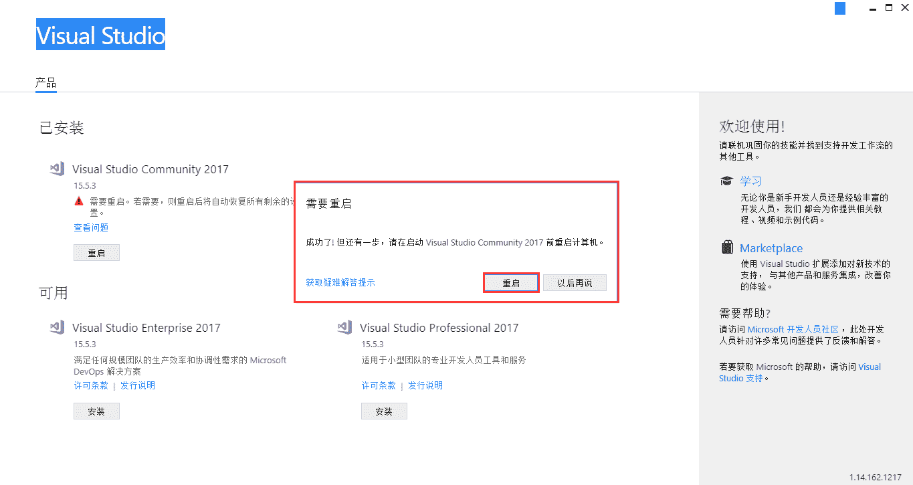
 重启完成后，打开 “开始菜单”，会发现多了一个叫 “Visual Studio 2017” 的图标，证明你安装成功啦。

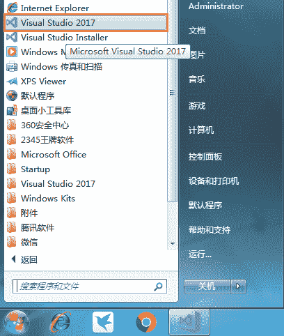

## 首次使用 VS2017

安装成功后，首次使用 VS 2017 还需要对其进行简单的配置，包括开发环境和软件本身的主题风格。

双击启动 Visual Studio 2017，会提示让你登陆：
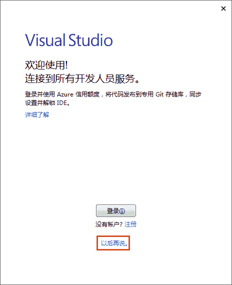
 可以直接略过，以后再说。接下来选择配置开发环境：
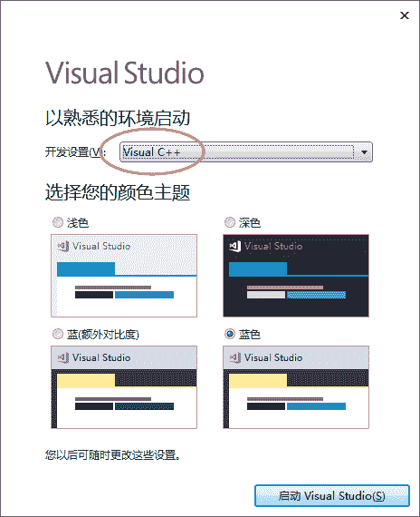
 我们使用 VS 2017，主要进行的是 C/C++ 程序开发，所以选择 “Visual C++” 这个选项，至于颜色主题，随你喜欢，4 选 1 即可，然后点击 “启动 Visual Studio” 按钮。

最后，等待几分钟的准备过程，VS2017 就启动成功啦！

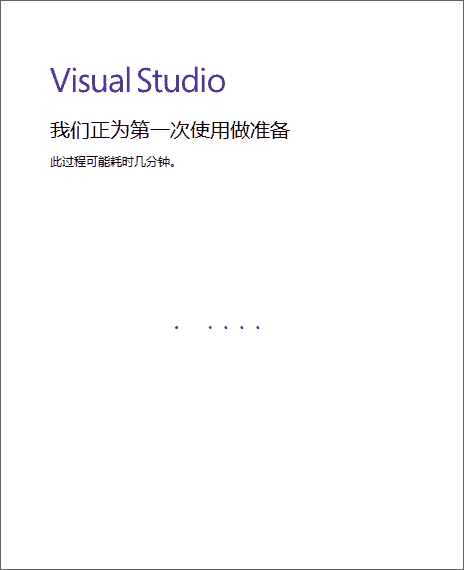