# VS2017 使用教程（使用 VS2017 编写 C 语言程序）

> 原文：[`c.biancheng.net/view/457.html`](http://c.biancheng.net/view/457.html)

本节，我们学习如何在新版 VS 2017 中编写程序输出“C 语言中文网”，程序代码如下：

```

#include <stdio.h>
int main()
{
    puts("C 语言中文网");
    return 0;
}
```

## 创建项目（Project）

在 VS 2017 下开发程序首先要创建项目，不同类型的程序对应不同类型的项目，初学者应该从控制台程序学起。
打开 VS 2017，在菜单栏中依次选择 “文件 --> 新建 --> 项目”：
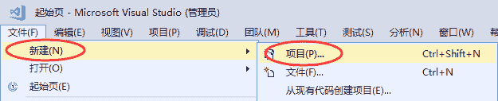
 或者直接按下 `Ctrl+Shift+N` 组合键，都会弹出下面的对话框：

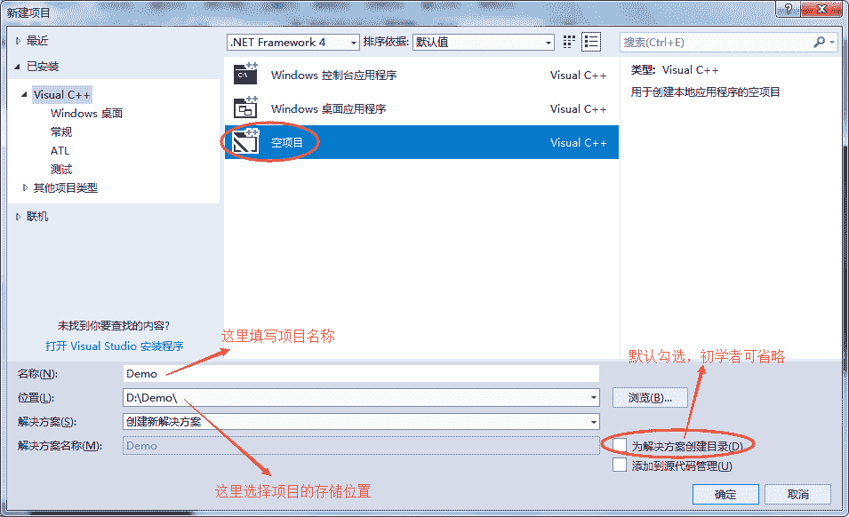
 选择 “空项目”，填写好项目名称，选择好存储路径，同时对于初学者来说，可取消勾选 “为解决方案创建目录”，点击 “确定” 按钮即可。

> 注意：这里一定要选择 “空项目” 而不是 “Windows 控制台应用程序”，因为后者会导致项目中自带有很多莫名其妙的文件，不利于初学者对项目的理解。另外，项目名称和存储路径中最好不要包含中文。

点击 “确定” 按钮后，会直接进入项目可操作界面，我们将在这个界面完成所有的编程工作。

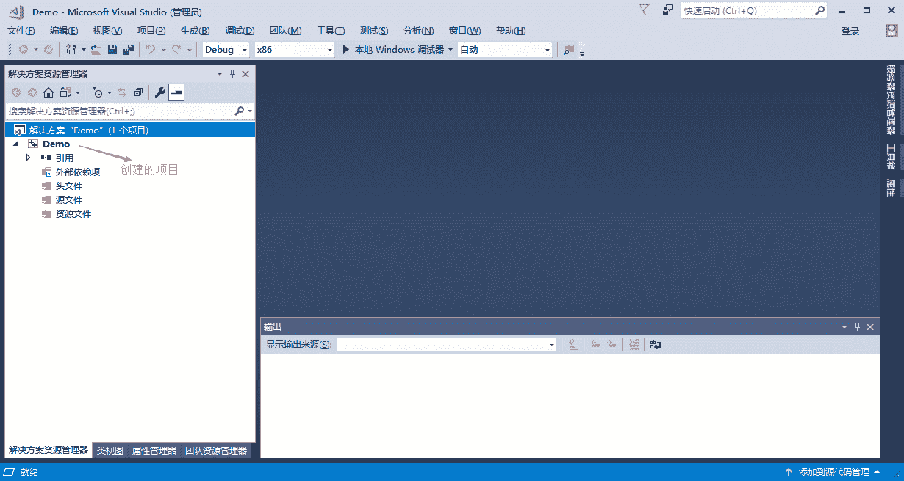
 有兴趣的同学可以打开项目的存储路径（本文的项目存储路径为 D:\Demo\），会发现多了一个 Demo 文件夹，这就是存储整个项目的文件夹。

## 添加源文件

在 “源文件” 处右击鼠标，在弹出菜单中选择 “添加 --> 新建项” ，如下图所示：

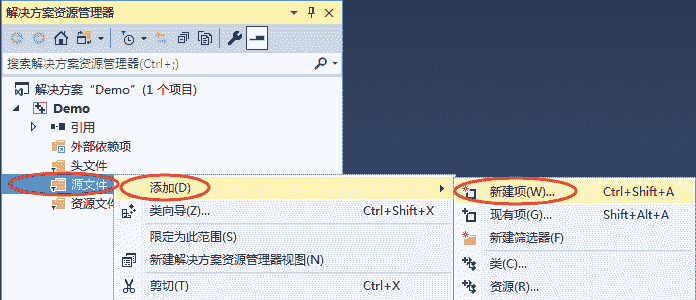
或者直接按下 `Ctrl + shift + A` 组合键，都会弹出添加源文件的对话框，如下图所示：

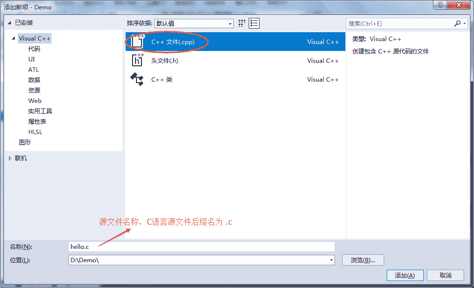
 在此分类中，我们选择 “C++文件（.cpp）”，编写 C 语言程序时，注意源文件后缀名为 `.c` ,点击 “添加” 按钮，就添加上了一个新的源文件。

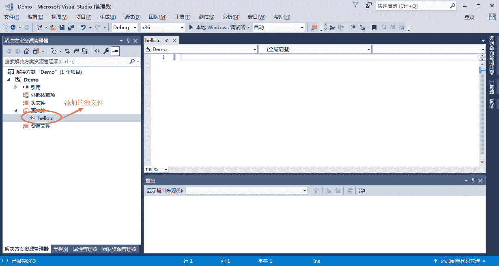

> 注意：C++ 是在 C 语言的基础上进行的扩展，所有在本质上，C++ 已经包含了 C 语言的所有内容，所以大部分 IDE 会默认创建后缀名为 `.cpp` 的 C++ 源文件。为了大家养成良好的规范，写 C 语言代码，就创建后缀名为 `.c` 的源文件。

## 编写代码并生成程序

打开 hello.c ，将本节开头的代码输入到该源文件中，如下图所示：

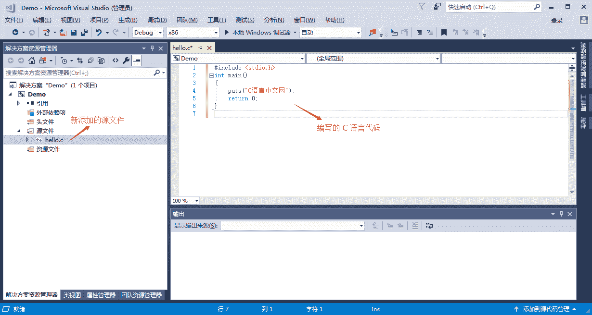

> 注意：虽然可以将整段代码复制到编辑器，但是我还是强烈建议你手动输入，我敢保证你第一次输入代码会有各种各样的错误，只有把这些错误都纠正了，你才会进步。

## 编译（Complie）

在上方菜单栏中选择 “生成 --> 编译”，就完成了 hello.c 源文件的编译工作，如下图所示：
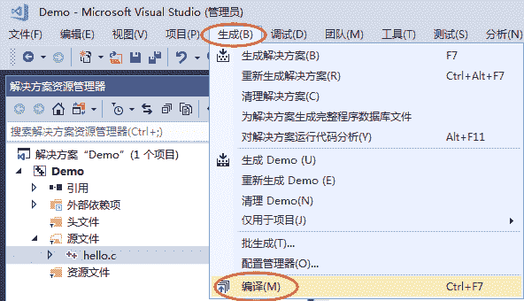
 或者直接按下 `Ctrl + F7` 组合键，也能够完成编译工作，这样更加便捷。

如果代码没有任何错误，会在下方的 “输出窗口” 中看到编译成功的提示：

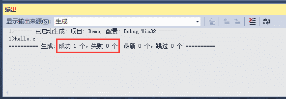
 编译完成后，打开项目目录下（本教程中是 D:\Demo\ ）的 Debug 文件夹，会看到一个名为 `hello.obj` 的文件，此文件就是经过编译产生的中间文件，这种中间文件的专业称呼是目标文件(Object File)，在 VS 和 VC 下，目标文件的后缀都是 `.obj` 。

## 链接（Link）

在菜单栏中选择 “项目 --> 仅用于项目 --> 仅连接 Demo” ， 就完成了 hello.obj 链接工作，如下图所示：


 如果代码没有错误，会在下方的 “输入窗口” 中看到链接成功的提示：

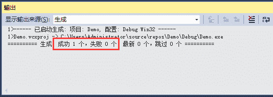

> 本项目中只有一个目标文件，链接的作用是将 hello.obj 和系统组件（专业讲是静态链接库）结合起来，形成可执行文件。如果有多个目标文件，这些文件之间还要相互结合。

当你再次打开项目目录下（本教程中是 D:\Demo\ ）的 Debug 文件夹，会看到一个名为 `Demo.exe` 的文件，这就是最终生成的可执行文件，就是我们想要的结果。

双击 Demo.exe 运行，并没有输出“C 语言中文网”几个字，而是会看到一个黑色窗口一闪而过。这是因为，程序输出“C 语言中文网”后就运行结束了，窗口会自动关闭，时间非常短暂，所以看不到输出结果，只能看到一个“黑影”。

对上面的代码稍作修改，让程序输出 “C 语言中文网” 后暂停下来：

```

#include <stdio.h>
#include <stdlib.h>
int main()
{
    puts("C 语言中文网");
    system("pause");
    return 0;
}
```

system("pause"); 的作用就是让程序暂停一下。注意代码开头部分还添加了 #include <stdlib.h> 语句，否则 system("pause"); 无效。

再次编译并链接，运行生成的 Demo.exe，终于如愿以偿，看到输出结果了，如下图所示：
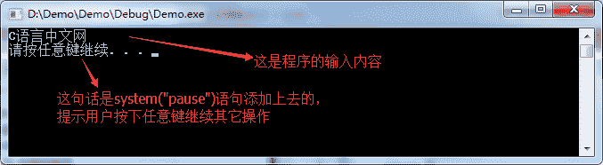
 按下键盘上的任意一个键，程序就会关闭。

## 更加快捷的办法

我们把上面的步骤总结一下，可以发现一个完整的编程过程是：

1.  编写源文件：这是编程的主要工作，我们要保证代码的语法 100% 正确，不能有任何差错；
2.  编译：将源文件转换为目标文件；
3.  链接：将目标文件和系统库组合在一起，转换为可执行文件；
4.  运行：可以检验代码的正确性。

不过 VS 提供了一种更加快捷的方式，可以一键完成编译、链接、运行三个动作，点击菜单栏中的 “本地 Windows 调试器” 按钮，或者按下 `F5` 键也能做到这一点。

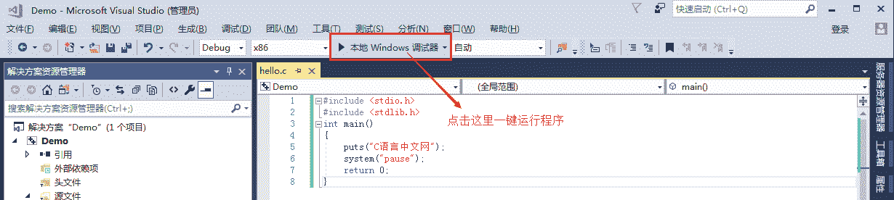

## 总结

现在，你就可以将 Demo.exe 分享给你的朋友了，告诉他们这是你编写的第一个 C 语言程序。虽然这个程序非常简单，但是你已经越过了第一道障碍，学会了如何编写代码，如何将代码生成可执行程序，这是一个完整的体验。

在本教程的基础部分，教大家编写的程序都是这样的“黑窗口”，与我们平时使用的软件不同，它们没有漂亮的界面，没有复杂的功能，只能看到一些文字，这就是控制台程序（Console Application），它与 DOS 非常相似，早期的计算机程序都是这样的。

控制台程序虽然看起来枯燥无趣，但是它非常简单，适合入门，能够让大家学会编程的基本知识；只有夯实基本功，才能开发出健壮的 GUI（Graphical User Interface，图形用户界面）程序，也就是带界面的程序。