# VS2010 下载地址和安装教程（图解）

> 原文：[`c.biancheng.net/view/458.html`](http://c.biancheng.net/view/458.html)

为了更好地支持 Win7 程序的开发，微软于 2010 年 4 月 12 日发布了 VS2010，它的界面被重新设计，变得更加简洁。

需要注意的是，VS2010 可以在 XP、Win7 和 Win8 下完美运行，但在 Win10 下**可能**会有兼容性问题，使用 Win10 的读者建议安装 VS2015 或者 VS2017。

为了满足不同需求的用户，VS2010 又被细分成了五个版本，分别是专业版(Professional)、高级版(Premium)、旗舰版(Ultimate)、学习版(Express)和测试版(Test)，其中：

*   学习版是免费的，功能也相对简单，主要供初学者使用（也足够使用了）。
*   旗舰版是最高版本，功能最强大，收费也最贵，主要供专业的开发人员使用。如果您由于种种原因不能支持正版，就只能使用破解版了。

## 虚拟光驱的安装

正版的 VS 安装程序是刻录在光盘里面的，我们从互联网上下载的都是`.iso`格式的镜像文件。所谓镜像文件，就是将光盘上的全部内容复制到电脑上后形成的文件。镜像文件不能直接打开，需要借助虚拟光驱才能使用。

虚拟光驱软件用来模拟真实的光盘驱动，用虚拟光驱打开镜像文件，就相当于把光盘插入到电脑中。

常见的虚拟光驱软件有很多，这里我们推荐使用 DVDFab，它是一款国人开发的、简单易用的、免费的虚拟光驱。

DVDFab 下载地址：

*   官网下载地址为：[`zh.dvdfab.cn/download.htm?trackID=navmenu`](http://zh.dvdfab.cn/download.htm?trackID=navmenu)
*   百度网盘下载地址：[`pan.baidu.com/s/1kVRyk8R`](https://pan.baidu.com/s/1kVRyk8R)  提取密码：2eap

DVDFab 的安装非常简单，这里不再赘述，大家只需要注意一点，安装过程中 Windows 安全中心会发出警告，询问我们是否确定安装，如下图所示：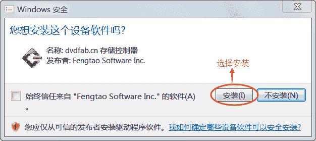毋庸置疑，选择“安装”即可。

## 下载 VS2010

VS2010 旗舰版（Ultimate）（包含 Key，已破解）下载地址：

*   迅雷下载（较快）：ed2k://|file|cn_visual_studio_2010_ultimate_x86_dvd_532347.iso|2685982720|4AE6228933DDE49D9BFA4C3467C831C2|/
*   百度网盘（较慢）：[`pan.baidu.com/s/1eTQOgWq`](https://pan.baidu.com/s/1eTQOgWq)  提取密码：f9xr

VS2010 的安装包大约有 2.5G，下载时间有点长，请大家耐心等待。

## 安装 VS2010

VS2010 下载完成后会得到一个镜像文件（.iso 文件），双击该文件即可开始安装。

> 提示：必须安装虚拟光驱才能打开该镜像文件。

1) 双击镜像文件后会弹出如下的对话框：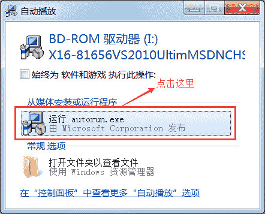选择“运行 autorun.exe”，即可进入安装程序。

2) 开始安装后，会出现如下的界面：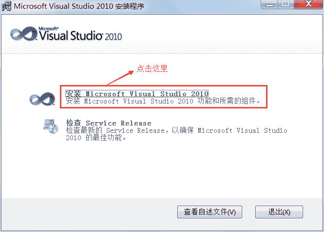选择“安装 Microsoft Visual Studio 2010”，继续安装。

3) 安装程序正在加载安装组件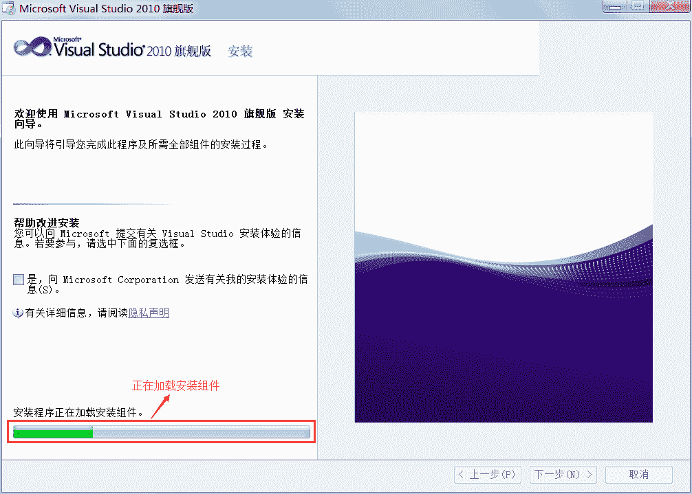
4) 接受许可条款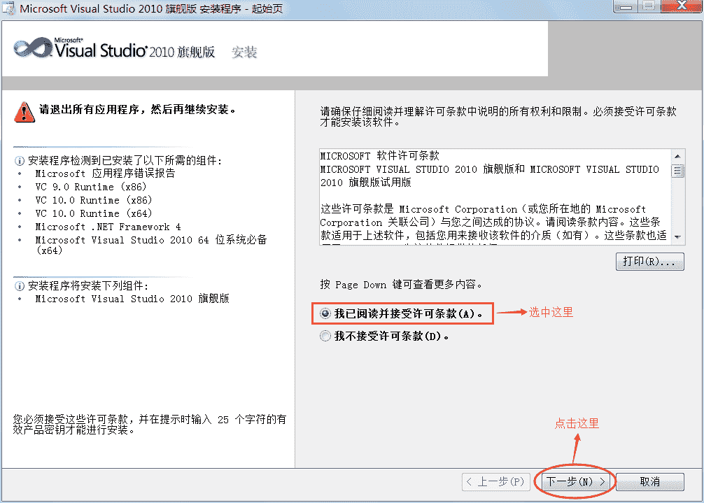
5) 选择要安装的功能，并设置安装路径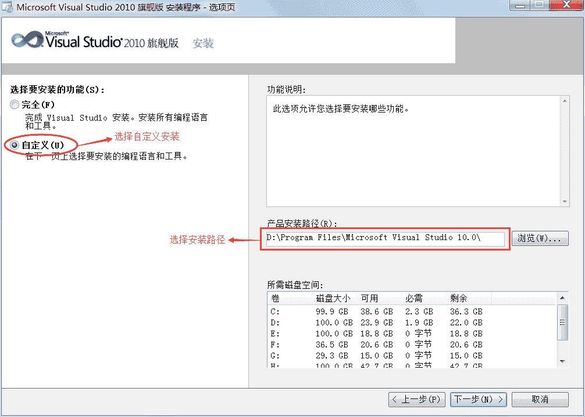
VS 除了支持 C/C++ 开发，还支持 C#、F#、VB 等其他语言，我们没必要安装所有的组件，只需要安装与 C/C++ 相关的组件即可，所以这里选择“自定义”。

VS 默认安装在 C 盘（系统盘），这里大家可以更改安装路径，将 VS 安装到 D、E、F 等其他分区。

> 小小的建议：我们在给学员安装 VS2010 的过程中，发现有个别学员的电脑只能安装在 C 盘，安装在其它分区不能使用，所以我在这里也建议大家将 VS2010 安装到 C 盘，也就是保持默认的安装路径不变。

6) 选择要安装的组件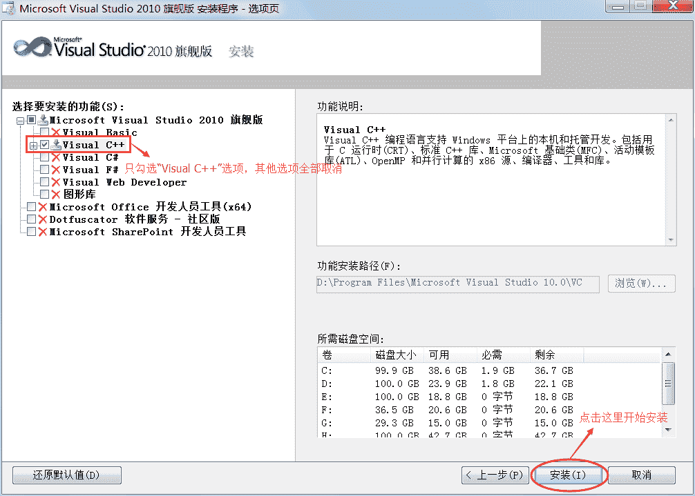
我们不需要 VS2010 的全部组件，只需要与 C/C++ 相关的组件，所以这里只选择了“Visual C++”，将其它用不到的组件全部取消勾选了。

7) 等待安装（需要点时间）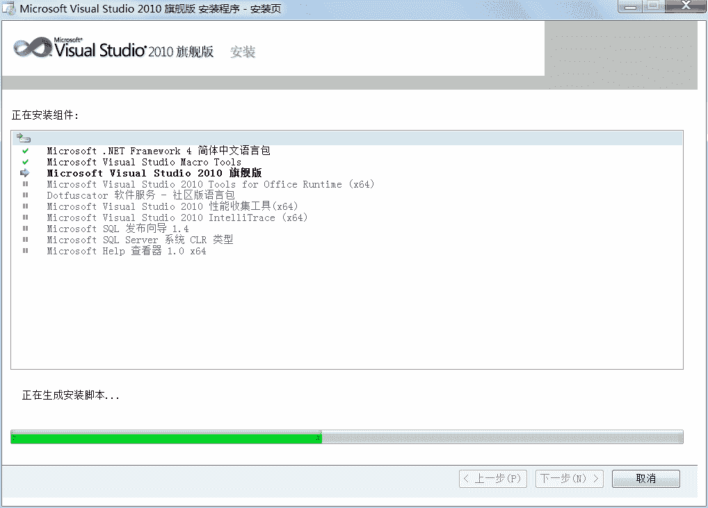
8) 安装成功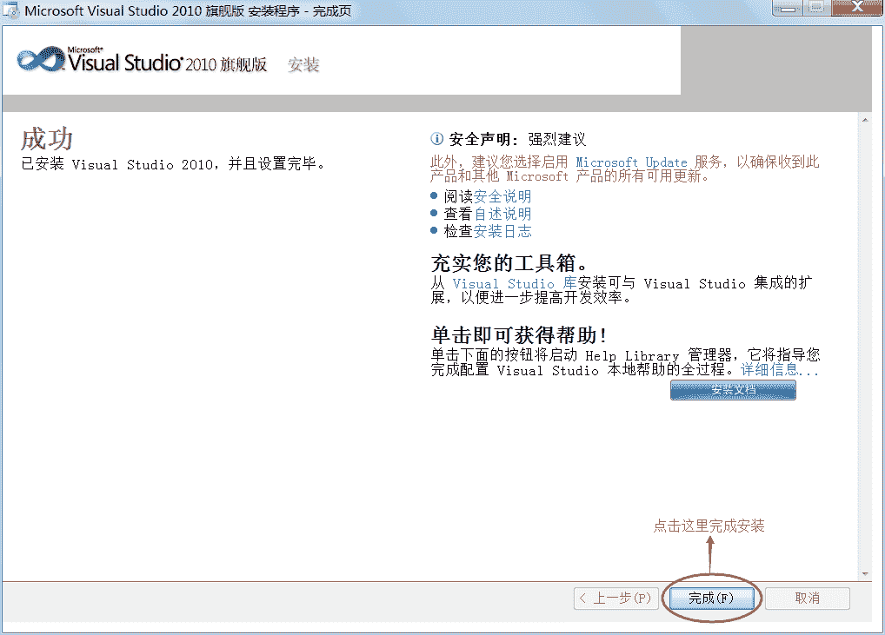
所有的组件安装完成后，VS2010 就安装成功了，点击“完成”按钮即可。

提示：如果随后弹出了如下的对话框，请点击“退出”按钮。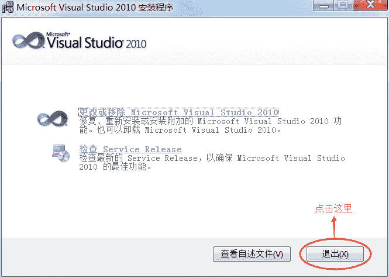
9) 打开“开始菜单”，发现多了一个叫“Microsoft Visual Studio 2010”的文件夹，就证明安装成功了。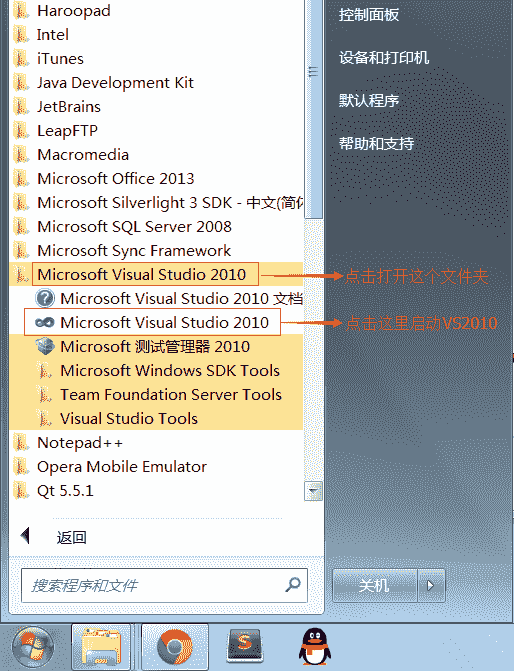