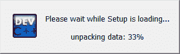
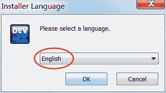
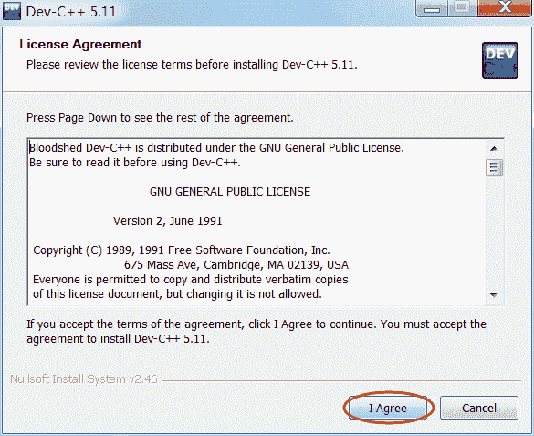
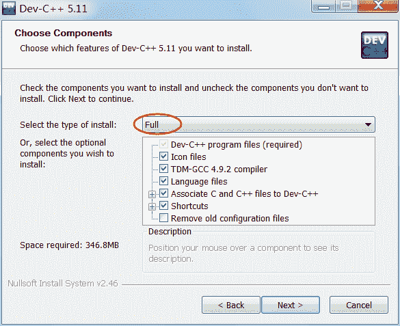
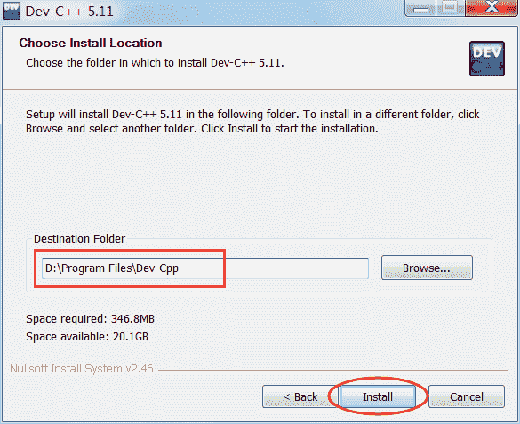
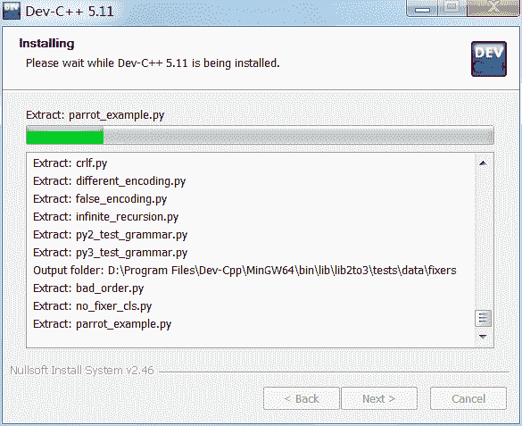
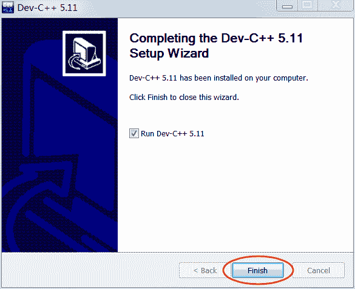
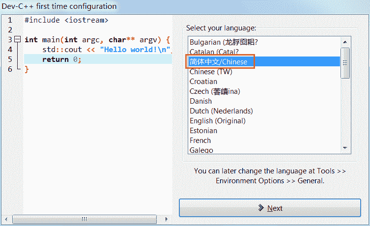
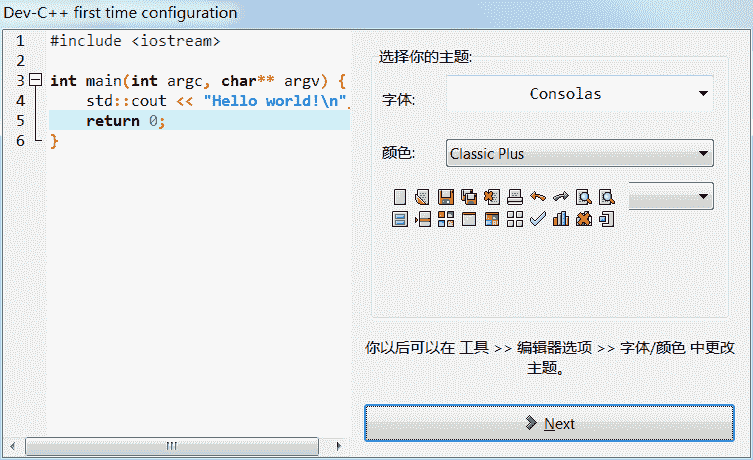
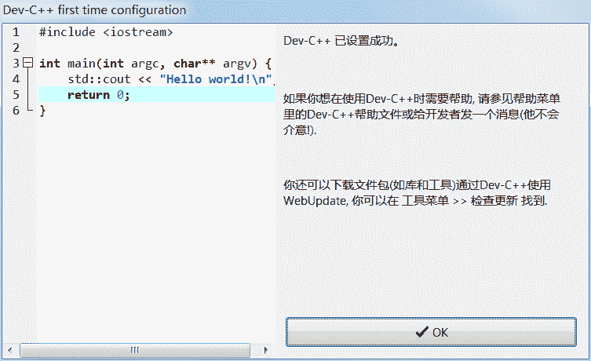

# Dev C++下载地址和安装教程（图解）

> 原文：[`c.biancheng.net/view/461.html`](http://c.biancheng.net/view/461.html)

Dev C++ 是一款免费开源的 C/C++ IDE，内嵌 GCC 编译器（GCC 编译器的 Windows 移植版），是 NOI、NOIP 等比赛的指定工具。Dev C++ 的优点是体积小（只有几十兆）、安装卸载方便、学习成本低，缺点是调试功能弱。

安装 Dev C++ 跟安装普通软件一样，远没有安装 VS 那么复杂。

截止到 2017 年 06 月 07 日，Dev C++ 的最新版本是 5.11。

Dev C++ 5.11 简体中文版下载地址：

*   官方下载：[`sourceforge.net/projects/orwelldevcpp/`](https://sourceforge.net/projects/orwelldevcpp/)
*   百度网盘：[`pan.baidu.com/s/1mhHDjO8`](https://pan.baidu.com/s/1mhHDjO8)    提取密码：mken

火墙之内，有时候无法访问 SourceForge 这个网站，建议大家去百度网盘下载。

## 开始安装 Dev C++

Dev C++ 下载完成后会得到一个安装包（.exe 程序），双击该文件即可开始安装。

1) 首先加载安装程序（只需要几十秒）
2) 开始安装
Dev C++ 支持多国语言，包括简体中文，但是要等到安装完成以后才能设置，在安装过程中不能使用简体中文，所以这里我们选择英文（English）。

3) 同意 Dev C++ 的各项条款
4) 选择要安装的组件选择“Full”，全部安装。

5) 选择安装路径你可以将 Dev C++ 安装在任意位置，但是路径中最好不要包含中文。

6) 等待安装
7) 安装完成

## 开始配置 Dev C++

首次使用 Dev C++ 还需要简单的配置，包括设置语言、字体、和主题风格。

1) 第一次启动 Dev C++ 后，提示选择语言。这里我们选择简体中文，英语给力的朋友也可以选择英文。

2) 选择字体和主题风格这里保持默认即可。

3) 提示设置成功点击“OK”按钮，进入 Dev C++，就可以编写代码了。