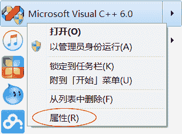
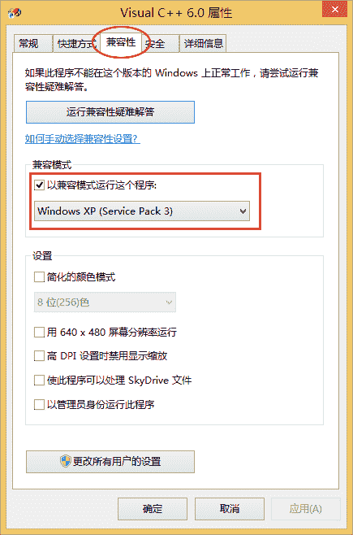
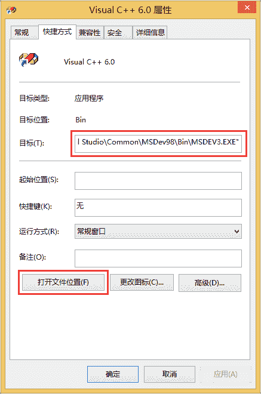
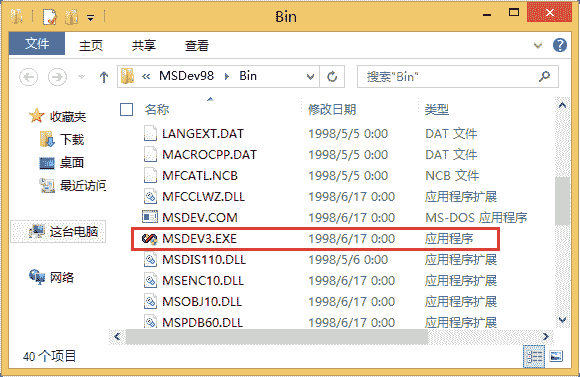
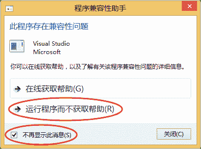

# VC6.0（VC++6.0）下载地址和安装教程（图解）

> 原文：[`c.biancheng.net/view/463.html`](http://c.biancheng.net/view/463.html)

截止到 2016 年 07 月 06 日，C 语言中文网提供的 VC6.0 安装包，下载量已超过 150 万次，收到反馈超过 300 条。

微软原版的 VC6.0 已经不容易找到，网上提供的都是经过第三方修改的版本，删除了一些使用不到的功能，增强了兼容性。这里我们使用 VC6.0 完整绿色版，它能够支持一般的 C/C++ 应用程序开发以及计算机二级考试。

VC6.0 完整绿色版下载地址 1：[`pan.baidu.com/s/1nxee1AD`](https://pan.baidu.com/s/1nxee1AD)  提取密码：wdhk

VC6.0 完整绿色版下载地址 2：[`pan.baidu.com/s/1qZGYtiO`](https://pan.baidu.com/s/1qZGYtiO)  提取密码：ix5p

该软件仅 31M，下载快速，安装简单，无需设置各种组件，还能够卸载干净。

VC6.0 能够在 XP 下很好的运行，无需进行额外的设置，但在 Win7、Win8 和 Win10 下，安装完成后还要修改兼容模式才可以。

## 在 Win7 或 Win10 下使用 VC6.0

对于 Win7 和 Win10，需要将 VC6.0 的兼容模式修改为 Windows XP SP3 或 SP2，下面是具体的操作步骤。

在 VC6.0 的快捷方式或开始菜单上单击鼠标右键，选择“属性”：
图 1：在 VC6.0 的开始菜单上单击鼠标右键
在弹出的对话框中，将兼容模式修改为 Windows XP SP3 或 SP2，如下图所示：
图 2：设置为兼容 Windows XP（Service Pack 3）
兼容模式从 Windows XP 开始提出，目的是让旧版的软件能够运行在较新的操作系统上，和虚拟机的原理有点类似。

## 在 Win8 下使用 VC6.0

相比 Win7 和 Win10，Win8 稍微麻烦一些，要先将 MSDEV.EXE 重命名为 MSDEV3.EXE，再按照上面的步骤设置兼容模式。

MSDEV.EXE 是 VC6.0 的主程序，位于 VC6.0 的安装目录下，可以在属性面板中快速找到 MSDEV.EXE，请看下图：
图 3：快速定位 MSDE.EXE

图 4：将 MSDEV.EXE 改成 MSDEV3.EXE
重命名完成后，还要修改快捷方式指向的目标文件，也就是图 3 中第一个红色方框圈起来的地方。最后，按照前面介绍的方法再将兼容模式修改为“Windows XP SP3”。

启动 VC6.0，如果报错，关闭后再次启动，一般就正常了。成功启动一次后，以后就可以正常运行了。

如果依然启动失败，可以尝试将 MSDEV.EXE 改为其他名字。

在 VC6.0 运行过程中，如果弹出下面的兼容性提示框，勾选“不再显示此消息”，关闭即可。
图 5：兼容性提示框

## 最后的总结

VC6.0 可以在 XP 下完美运行，不用进行额外的设置。在 Win7 和 Win10 下，设置兼容模式才可以运行。Win8 相对麻烦一些，要先修改 MSDEV.EXE 的名字，再设置兼容模式。

通过以上的设置如果还不能使用，那么请更换其它编译器，或者安装 Windows XP 吧，实在是没办法了。VC 6.0 太老了，在高版本的 Windows 系统中有时候就是死活都用不了，谁也没辙，微软早就不维护它了，也不再对它进行升级或者打补丁了，只能说明你的教学资料或者教学体制太落后了。