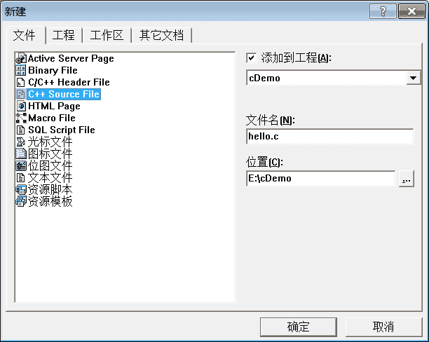

# VC6.0（VC++6.0）使用教程（使用 VC6.0 编写 C 语言程序）

> 原文：[`c.biancheng.net/view/464.html`](http://c.biancheng.net/view/464.html)

Visual C++ 6.0 简称 VC 或者 VC6.0，是微软 1998 年推出的一款 C/C++ IDE，界面友好，调试功能强大。VC6.0 是一款革命性的产品，非常经典，至今仍然有很多企业和个人在使用，很多高校也将 VC6.0 作为 C 语言的教学基础，作为上机实验的工具。本教程中的代码，也都是在 VC6.0 下运行通过。

VC6.0 确实有点老了，如果不是学校要求或者项目需要，建议使用 Visual Studio 代替，这里之所以讲解 VC6.0，是为了照顾在校生或者有特殊需求的读者。

## 安装 VC6.0

微软原版的 VC6.0 已经不容易找到，网上提供的都是经过第三方修改的版本，删除了一些使用不到的功能，增强了兼容性。这里我们使用 VC6.0 完整绿色版，它能够支持一般的 C/C++ 应用程序开发以及计算机二级考试。

下载地址：VC 6.0 中文版下载

## 在 VC6.0 下运行 C 语言程序

C-Free 支持单个源文件的编译和链接，但是在 VC6.0 下，必须先创建工程（Project），然后再添加源文件。

> 一个真正的软件，往往需要多个源文件和多种资源，例如图片、视频、控件等，通常是把它们放到一个文件夹下，进行有效的管理。你可以把工程理解为这样的一个文件夹，IDE 通过工程来管理这些文件。工程有不同的类型，例如开发“黑窗口”的控制台程序，需要创建`Win32 Console Application`工程；开发带界面的 GUI 程序，需要创建`Win32 Application`工程。

#### 1) 新建 Win32 Console Application 工程

打开 VC6.0，在菜单栏中选择“文件 -> 新建”，或者 Ctrl+N，弹出下面的对话框：
切换到“工程”选项卡，选择“Win32 Console Application”，填写工程名称和路径，点击“确定”，会弹出一个对话框询问类型，这里选择“一个空工程”，如下图所示：
点击“完成”按钮完成工程的创建。

#### 2) 新建 C 源文件

在菜单栏中选择“文件 -> 新建”，或者 Ctrl+N，弹出下面的对话框：切换到“文件”选项卡，选择“C++ Source File”，填写文件名，点击确定完成。

该步骤是向刚才创建的工程添加源文件。

#### 3) 编写 C 语言代码

在工作空间中可以看到刚才创建的工程和源文件，如下图所示：
双击 hello.c，进入编辑界面，输入上节中的代码。

#### 4) 编译并运行代码

你可以在“组建”菜单中找到编译、组建和运行的功能，如下图所示：
更加简单的方法是使用快捷方式，如下图所示：
保存编写好的源代码，点击运行按钮或 Ctrl+F5，如果程序正确，可以看到运行结果，如下图所示：
注意：编译生成的 .exe 文件在工程目录下的 Debug 文件夹内。以上面的工程为例，路径为 E:\cDemo，打开看到有一个 Debug 文件夹，进入可以看到 cDemo.exe。

在 Debug 目录中还会看到一个名为 hello.obj 的文件。`.obj`是 VC/VS 生成的目标文件，类似于 C-Free 下的`.o`文件。

## 工程文件说明

进入工程目录 E:\cDemo，除了 hello.c，还会看到很多其他文件，它们是 VC6.0 创建的，用来支持当前工程，不属于 C 语言的范围，你可以忽略它们。

如果读者感兴趣，我们也提供了简单的说明：
1) .dsp 文件：DeveloperStudio Project，工程文件（文本格式），用来保存当前工程的信息，例如编译参数、包含的源文件等，不建议手动编辑。当需要打开一个工程时，打开该文件即可。

2) .dsw 文件：DeveloperStudio Workspace，工作区文件，和 DSP 类似。

3) .opt 文件：IDE 的 Option 文件，保存了与当前工程有关的开发环境的配置，例如工具条位置、打开的文件、光标位置等。

4) .plg 文件：日志文件（HTML 文件），保存了程序的编译信息，例如错误和警告等。

一个工程可以包含多个源文件和资源文件（图片、视频等），但只能生成一个二进制文件，例如可执行程序`.exe`、动态链接库`.dll`、静态链接库`.lib`等。工程类型决定了不同的配置信息，也决定了生成不同的二进制文件。

一个工作区可以包含多个工程，能够批量生成多个二进制文件。

我们安装的较大的程序，安装目录中一般包含多个 EXE 和 DLL。对于这样的程序，可以先创建一个工作区，再创建多个工程，这样就能一次性生成所需的多个二进制文件。