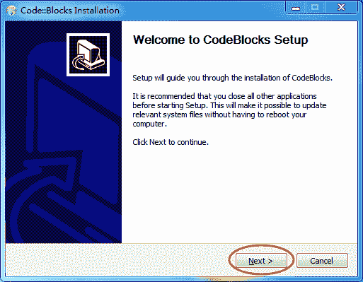
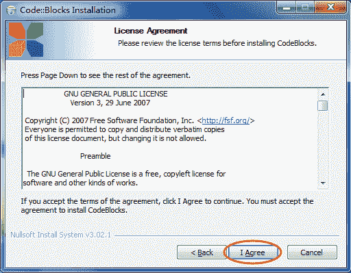
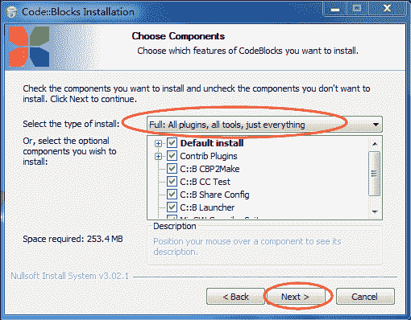
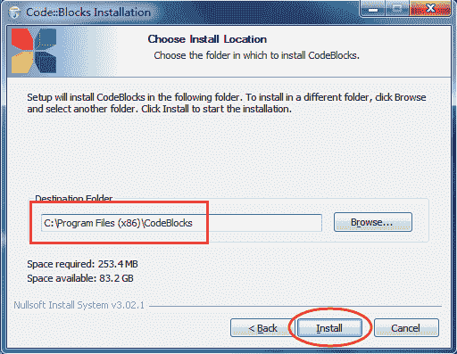
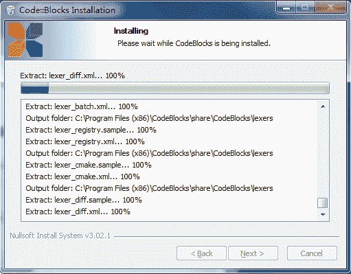
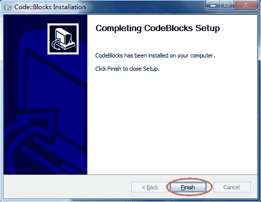
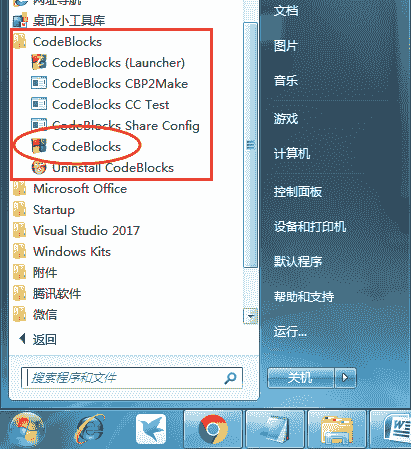

# Code::Blocks 下载地址和安装教程（图解）

> 原文：[`c.biancheng.net/view/465.html`](http://c.biancheng.net/view/465.html)

Code::Blocks 是一款免费开源的 C/C++ IDE，支持 GCC、MSVC++ 等多种编译器，还可以导入 Dev-C++ 的项目。Code::Blocks  的优点是：跨平台，在 Linux、Mac、Windows 上都可以运行，且自身体积小，安装非常方便。

安装  Code::Blocks  跟安装普通软件一样，完全的傻瓜式操作，远没有安装 VS 那么复杂。

截止到  2018 年 01 月 12 号，Code::Blocks 的最新版本是 17.12 。

对于 Windows 用户，其 Code::Blocks 17.12 下载地址：

*   官方下载：

[`sourceforge.net/projects/codeblocks/files/Binaries/17.12/Windows/codeblocks-17.12mingw-setup.exe/download`](https://sourceforge.net/projects/codeblocks/files/Binaries/17.12/Windows/codeblocks-17.12mingw-setup.exe/download)

*   百度网盘：

链接: [`pan.baidu.com/s/1hsU4ZRm`](https://pan.baidu.com/s/1hsU4ZRm) 密码: vntd
对于 Mac 用户，其 Code::Blocks 13.12 的下载地址：

*   官方下载：

[`sourceforge.net/projects/codeblocks/files/Binaries/13.12/MacOS/CodeBlocks-13.12-mac.zip/download`](https://sourceforge.net/projects/codeblocks/files/Binaries/13.12/MacOS/CodeBlocks-13.12-mac.zip/download)

*   百度网盘：

链接: [`pan.baidu.com/s/1i7iWuFV`](https://pan.baidu.com/s/1i7iWuFV) 密码: rm6n

> 注意：火墙之内，有时候可能无法访问 SourceForge 这个网站，建议大家去百度网盘下载。

## 开始安装 Code::Blocks

Code::Blocks 下载完成后会得到一个安装包（`.exe` 可执行文件），双击该文件即可开始安装。

1） 双击 `.exe` 程序，直接进入安装程序，如下图所示，点击 `Next` 按钮：

2） 直接同意 Code::Blocks 的各项条款，如下图所示：

3） 选择要安装的组建。这里选择 Full ，即全部安装，如下图所示：

 安装程序默认就是 Full 全部安装，可直接选择 `Next` 下一步。
4） 选择安装路径，如下图所示：

 你可以将 Code::Blocks 安装在任意位置，但是注意路径中不要包含中文。
5） 等待安装

安装完成后，点击 `Next` 按钮即可。

6） 安装完成，点击 `finish` 按钮即可，如下图所示：

安装完成后，打开“开始 --> 所有程序”，发现多了一个名为 “CodeBlocks” 的文件夹，如下图所示，证明 Code::Blocks 安装成功啦（桌面上也会产生 CodeBlocks 的快捷打开图标）。
