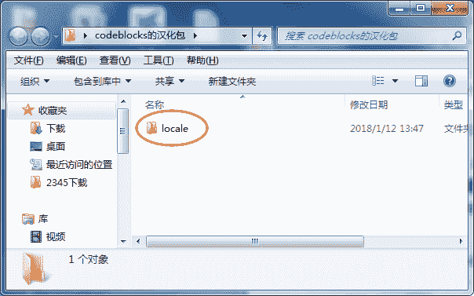
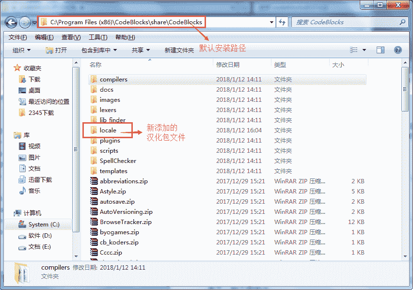
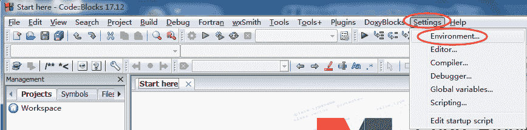
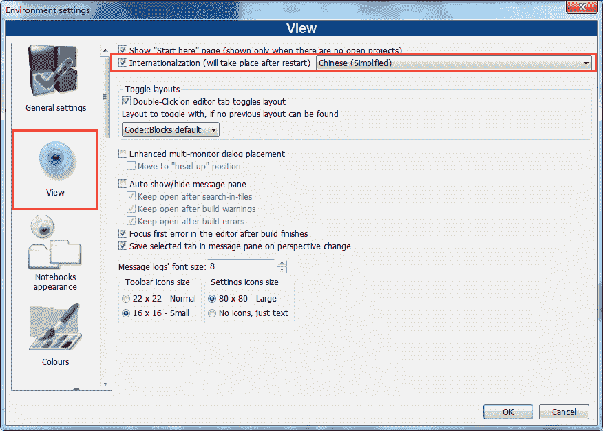
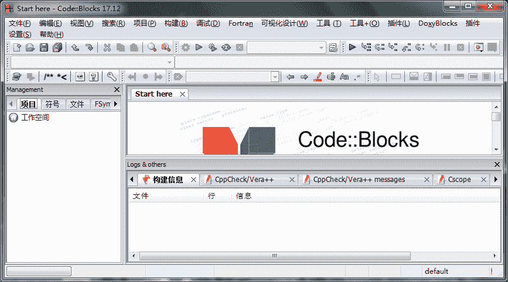

# Code::Blocks 汉化教程（附带汉化包）

> 原文：[`c.biancheng.net/view/466.html`](http://c.biancheng.net/view/466.html)

由于官方下载的 CodeBlocks 全部都是英文版，本教程中给大家推荐的 CodeBlocks 17.12 版本也是官方英文版，所以本节给大家介绍：如何将英文版设置为简体中文版。

## 下载 CodeBlocks 汉化包

首先，大家需要下载一个 CodeBlocks 汉化包，下载地址为：
百度网盘：
链接: [`pan.baidu.com/s/1sniGc01`](https://pan.baidu.com/s/1sniGc01) 密码: 7e9m

> 提示：汉化包大小不足 200KB，建议使用百度网盘下载。

## 汉化 CodeBlocks

1) 汉化包下载完成后，是一个压缩包，将其解压，其中包含有一个 locale 文件夹，如下图所示，这是我们需要的。

 2) 进入 CodeBlocks 安装目录（其默认安装目录为 C:\Program Files (x86)\CodeBlocks），依次进入 share --> CodeBlocks 文件夹，然后将解压汉化包得到的 locale 文件夹，复制到 CodeBlocks 文件夹下，如下图所示：

 如果上述过程，你都没有打开 CodeBlocks，这个时候你直接打开，应该就可以看到，你的 CodeBlocks 已经汉化成功啦。如果还没有成功，继续以下操作。

## 更改 CodeBlocks 设置

3) 打开 CodeBlocks，选择 “Settings --> Environmen”，如下图所示：

 4) 会弹出用于设置 CodeBlocks 的对话框，如下图所示：

 选择 View 选项，勾选 Internationalization 选项，同时选择其中的 Chinese(Simplified)。然后点击 OK 按钮。

设置完成后，直接重新启动 CodeBlocks，此时 CodeBlocks 会出现一个提示框，提示你是否保存更改，选择保存即可。

5) 再次启动 CodeBlocks，你会看到全新的汉化的 CodeBlocks，虽然没有完全汉化，但起码不会影响日常的正常使用。
