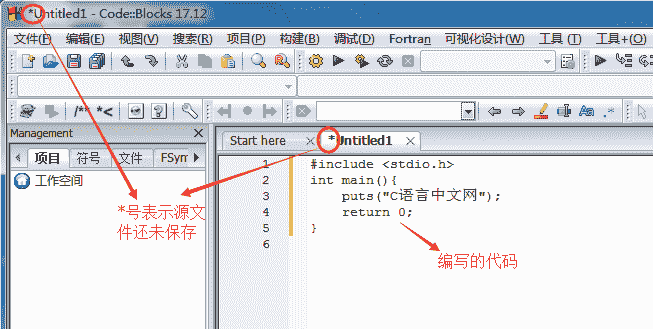

# Code::Blocks 使用教程（使用 Code::Blocks 编写 C 语言程序）

> 原文：[`c.biancheng.net/view/467.html`](http://c.biancheng.net/view/467.html)

前面我们给出了一段完整的 C 语言代码，就是在显示器上输出 “C 语言中文网”，如下所示：

```

#include <stdio.h>
int main(){
    puts("C 语言中文网");
    return 0;
}
```

本节，我们就来看看如何通过 CodeBlocks 来运行这段代码。
CodeBlocks 完全支持单个源文件的编译，如果你的程序只有一个源文件(初学者基本上都是在单个源文件下编写代码)，那么不用创建项目，直接运行即可；如果有多个源文件，才需要创建项目。

## 1) 新建源文件

打开 CodeBlocks ，在上方菜单栏中选择 “文件 --> 新建 --> 空白文件”，如下图所示：

 或者直接按下 `Ctrl + Shift + N` 组合键，都会新建一个空白的源文件，如下图所示：

 在空白源文件中输入本文开头的代码：

 在上方菜单栏中选择 “文件 -->保存文件”，或者按下 `Ctrl + S` 组合键，都可以保存源文件，如下图所示。


> 注意：保存时，将源文件后缀名改为 .c。

## 2) 生成可执行程序

在上方菜单栏中选择 构建 --> 构建，就可以完成 hello.c 的编译工作。

 或者直接按 `Ctrl + F9` 组合键，也能够完成编译工作，这样更加便捷。

如果代码没有错误，CodeBlocks 会在下方的  “构建信息” 窗口中看到编译成功的提示，如下图所示：

 编译完成后，打开源文件所在的目录（本教程是 D:\Demo\），会看到多了两个文件：

*   hello.o 文件：这是编译过程产生的中间文件，这种中间文件的专业称呼是目标文件（Object File）。
*   hello.exe 文件：是我们最终需要的可执行文件。CodeBlocks 在编译过程就会生成此文件，以便在运行时直接调用此文件。

这说明，CodeBlocks 在编译阶段整合了 ”编译+链接” 的过程。双击 hello.exe 运行，并没有看到 “C 语言中文”几个字，而是会看到一个边框一闪而过。这是因为，程序输出 “C 语言中文网” 后就运行结束了，窗口会自动关闭，时间非常短暂，所以看不到输出结果，只能看到一个 ”边框” 一闪而过。

对上面的代码稍作修改，让程序输出 “C 语言中文网”后暂停下来：

```

#include<stdio.h>
#include<stdlib.h>
int main(){
    puts("C 语言中文网");
    system("pause");
    return 0;
}
```

system("pause"); 语句的作用就是让程序暂停一下。注意开头部分还添加了 #include<stdlib.h> 语句，否则当你重新编译时，构建信息窗口会提示有关 system 函数的警告，如下图所示：

 再次编译、运行生成的 hello.exe ，终于如愿以偿，看到输出结果，如下图所示：

 按下键盘上的任意一个键，程序就会关闭。

## 更加快捷的方式

实际开发中我们一般使用菜单中的”构建 --> 构建并运行”选项：

 或者直接按下 `F9` 键，这样能够一键完成 “编译 --> 链接 --> 运行”的全过程。这样做的好处是，编译器会让程序自动暂停，我们也不用再添加 “system(“pause”)” 语句啦。

删除上面代码中的 “system(“pause”)” 语句，按下 `F9` 再次运行程序，结果如下：


## 3) 总结

现在，你就可以将 hello.exe 分享给你的朋友了，告诉他们这是你编写的第一个 C 语言程序。虽然这个程序非常简单，但是你已经越过了第一道障碍，学会了如何编写代码，如何将代码生成可执行程序，这是一个完整的体验。

在本教程的基础部分，教大家编写的程序都是这样的“黑窗口”，与我们平时使用的软件不同，它们没有漂亮的界面，没有复杂的功能，只能看到一些文字，这就是控制台程序（Console Application），它与 DOS 非常相似，早期的计算机程序都是这样的。

控制台程序虽然看起来枯燥无趣，但是它非常简单，适合入门，能够让大家学会编程的基本知识；只有夯实基本功，才能开发出健壮的 GUI（Graphical User Interface，图形用户界面）程序，也就是带界面的程序。