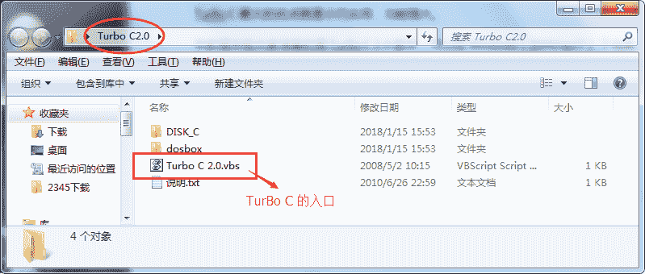
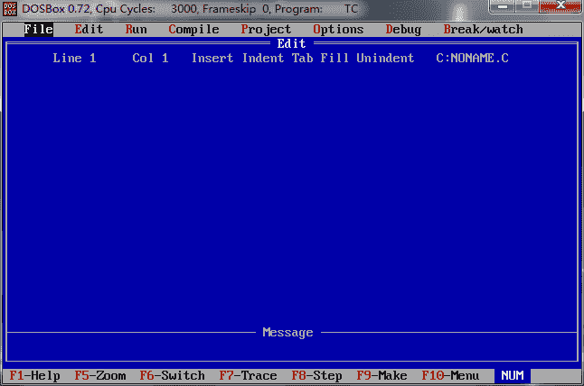

# Turbo C 2.0 下载地址和安装教程（图解）

> 原文：[`c.biancheng.net/view/468.html`](http://c.biancheng.net/view/468.html)

Turbo C 是美国 Borland 公司开发，应用于 DOS 平台上的一个 Ｃ 语言集成开发环境，它集编辑、编译，链接于一身，使得 Ｃ 语言的编辑，调试和测试都非常简捷，编译和链接速度极快，使用也很方便。

Turbo C 最大的优点就是小巧实用，运行速度快。

本教程中给大家准备的是 Turbo C 2.0 版本，可以在 Windows（2000/xp/7） 下完美运行，所有环境都已经配置好，不需要大家修改。

Turbo C 2.0 下载地址：

*   百度网盘：

链接: [`pan.baidu.com/s/1nwGye6H`](https://pan.baidu.com/s/1nwGye6H) 密码: u3pp

## 打开 Turbo C

下载的文件是一个压缩包，将其解压后，会得到如下图所示的文件夹：

 双击 “Turbo C 2.0.vbs”，会弹出一个窗口，如下图所示：

 此为 Turbo C 的编程环境，类似于命令行窗口，整个操作过程无法使用鼠标，只能用键盘去操控。