# Turbo C 2.0 使用教程（使用 Turbo C 2.0 编写 C 语言程序）

> 原文：[`c.biancheng.net/view/469.html`](http://c.biancheng.net/view/469.html)

首先，我们给出一段完整的 C 语言代码：

```

#include <stdio.h>
int main()
{
    puts("hello，world!");
    return 0;
}
```

本节我们来看看如何通过 Turbo C 来运行这段代码。

> 注意：Turbo C  本身不支持中文输入。

## 1) 新建源文件

打开 Turbo C，你看到的是 Turbo C 的初始操作界面，如下图所示：

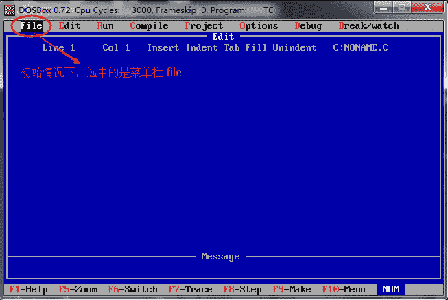

直接按 “回车” 键，并由键盘方向键控制，选择 “New” 选项，如下图所示：

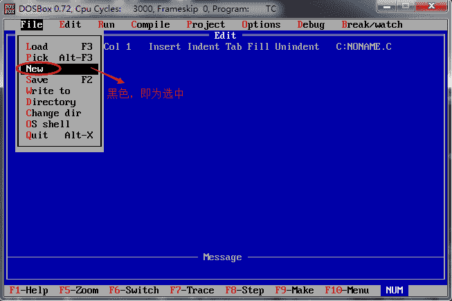

直接回车，此时编辑器中显示出一个文件 “NONAME.C”，同时可见光标在不停的闪烁，如下图所示：

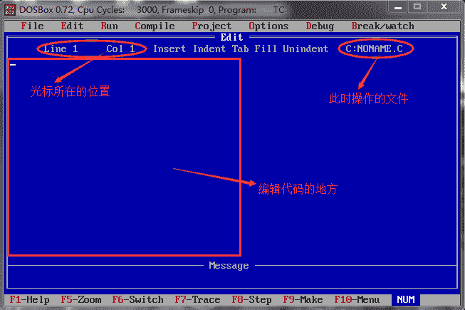

> 提示：当使用 New 选项创建新文件时，其默认临时的文件名为 NONAME，在保存时可进行更改。

现在，我们需要在空白文件中输入本文开头的代码，如下图所示：

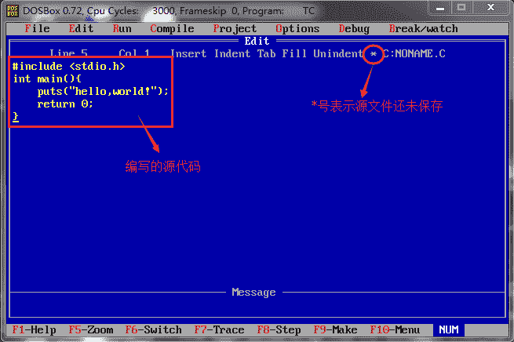

输入完成后，按 `F10` 键，可由代码编辑状态，转入菜单选择状态。

在上方菜单栏中选择  “File --> Save”，或者直接按下 `F2` 键，都可以保存源文件，如下图所示：

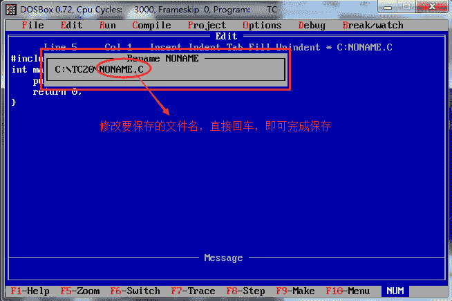

此时，文件名可改为”HELLO.C”。

> 注意：文件名由大写的英文字母组成。同时，在保存时，Turbo C 会自动为文件添加后缀名 `.C`，所以即使不写后缀名，保存后的文件也会自带有后缀名。

## 编译

在菜单栏中选择 ”Compile --> Compile to OBJ”，就完成了 HELLO.C 源文件的编译工作。

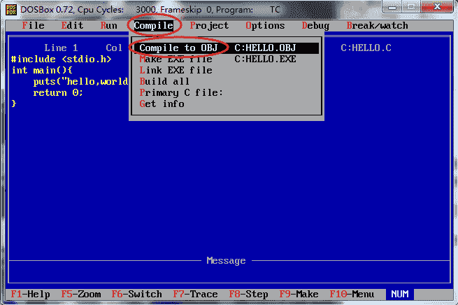

回车，如果代码没有错误，会给出编译成功的提示，如下图所示：

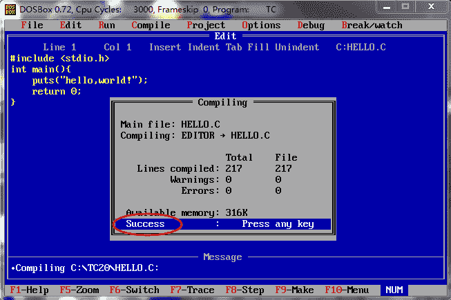

编译完成后，打开源文件所在的目录，会看到多了一个名为 HELLO.OBJ 的文件，此为编译过程产生的目标文件。

> 源文件所在的目录，默认的存储位置为 Turbo C2.0 --> DISK_C --> TC20，所有创建的文件都会存储在名为 TC20 的文件夹中。

## 链接

在菜单栏中选择 “Compile --> Link EXE file”，就完成了 HELLO.OBJ 目标文件的链接工作。

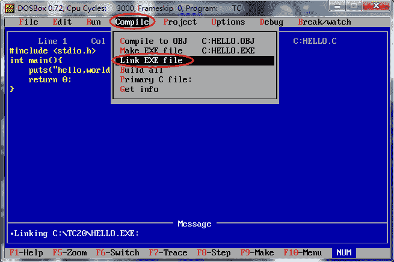

链接完成后，打开目标文件，也就是源文件所在目录，会看到多了一个名为 “HELLO.EXE”的文件，这就是最终生成的可执行文件。

> 提示：生成的 EXE 可执行文件并不能直接 Windows 平台上双击运行，但是这并不妨碍我们在 Turbo C 上运行它。

## 运行

在菜单栏上选择  “Run --> Run”，或者直接按下 `Ctrl + F9` 组合键，就完成了让 EXE 文件运行的工作。

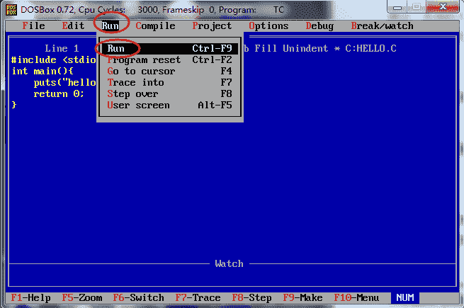

但是运行后发现，并没有输出 ”hello world!” 的字样，而是会感觉一个黑色窗口一闪而过。这是因为，程序输出 “hello world!” 后就运行结束了，窗口自动关闭，时间非常短暂，所以看到输出结果，只能看到一个”黑影”（或者根本看不到）。

对上面的代码稍作修改，让程序输出 “hello,world!” 后暂停下来：

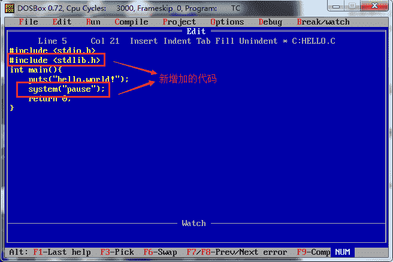

system(“pause”); 语句的作用就是让程序暂时停一下，注意：使用该语句，程序开头需添加 #include<stdlib.h> 头文件。

再次编译 --> 链接 --> 运行，会发现，可以看到输出结果了，如下图所示：

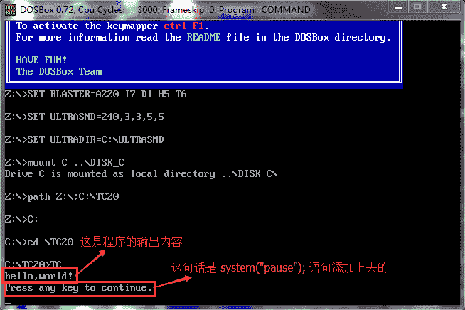

按键盘的任意一个键，窗口返回到操作界面。

> 提示：除了使用上面这种方式，查看输出结果，还可以通过菜单栏 “Run --> User screen” ，或者直接按下 `Alt+F5` 组合键，也可以看到输出结果。

## 更加便捷的方式

在实际使用时，我们一般使用菜单中的  “Run --> Run” 选项，可以一键完成 “编译 --> 链接 --> 运行”的全过程，避免频繁的使用 `F10` 切换状态。