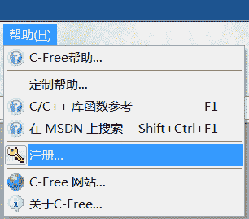

# C-Free 5.0 下载地址和激活教程（图解）

> 原文：[`c.biancheng.net/view/470.html`](http://c.biancheng.net/view/470.html)

C-Free 是一款国产的 C、C++开发工具，堪称神器，让你爱不释手。

如果你受够了 Visual Studio 的庞大臃肿，Visual C++ 6.0 在 Win7、Win8 下的兼容性问题，那么 C-Free 将是一个让你惊喜的选择。C-Free 整个软件才 14M，非常轻巧，安装简单，可以自由切换编译器。

C-Free 最新版本是 5.0，注册需要 80RMB，可以免费试用 30 天，过期不注册将无法使用。虽然本教程提供了，但是如果你不缺银子，还是为国产软件做点贡献，购买正版吧。

C-Free 也提供了永久免费版，可以无限使用，版本号为 4.0。当然功能多少会有折扣。

C-Free 支持多种编译器，可以轻松地编辑、编译、连接、运行、调试 C/C++程序。

C-Free 5 主要有以下特性：

1.  支持多编译器，可以配置添加其他编译器。目前支持的编译器类型：
    *   MinGW 2.95/3.x/4.x/5.0
    *   Cygwin
    *   Borland C++ Compiler
    *   Microsoft C++ Compiler
    *   Open Watcom C/C++
    *   Digital Mars C/C++
    *   Ch Interpreter
    *   Lcc-Win32
    *   Intel C++ Compiler
2.  增强的 C/C++语法加亮器，(可加亮函数名，类型名，常量名等)；
3.  增强的智能输入功能；
4.  可添加语言加亮器，支持其他编程语言；
5.  可添加工程类型，可定制其他的工程向导；
6.  完善的代码定位功能(查找声明、实现和引用)；
7.  代码完成功能和函数参数提示功能；
8.  能够列出代码文件中包含的所有符号(函数、类/结构、变量等)；
9.  帮助手册完善，附带 C、C++函数库；
10.  彩色、带语法加亮打印功能；
11.  在调试时显示控制台窗口；
12.  工程转化功能，可将其他类型的工程转化为 C-Free 格式的工程，并在 C-Free 中打开。

#### 百度网盘

C-Free 5.0（专业版，需要付费）下载地址：[`pan.baidu.com/s/1cBTdN4`](http://pan.baidu.com/s/1cBTdN4)  提取密码：uqmf

C-Free 4.0（永久免费版）下载地址：[`pan.baidu.com/s/1qXOb87M`](http://pan.baidu.com/s/1qXOb87M)  提取密码：hrxx

#### 360 云盘

C-Free 5.0（专业版，需要付费）下载地址：[`yunpan.cn/cMkDyHQWwDLIP`](https://yunpan.cn/cMkDyHQWwDLIP)（提取码：0a68）

C-Free 4.0（永久免费版）下载地址：[`yunpan.cn/cMkDwxAbeRWQR`](https://yunpan.cn/cMkDwxAbeRWQR)（提取码：77ed）

## 安装后的工作

安装软件后，选择“帮助->注册”菜单软件，如下图所示：

下面提供了一组 C-Free 5.0 的，如果注册失败，请百度其他的（截止到 2014 年 06 月 11 日，网上公开的有两组，经笔者验证，只有下面这一组有效）。

用户名：tianfang
电子邮件：quart@163.com
：2NnUqd3shO2agta0xNjcusfK1LXO

如果最终没有找到有效的，请到万能的淘宝吧，10 元以下搞定。