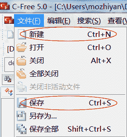
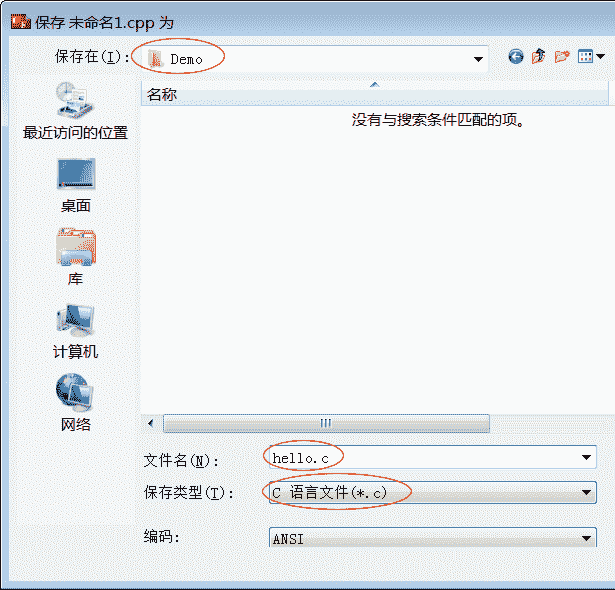
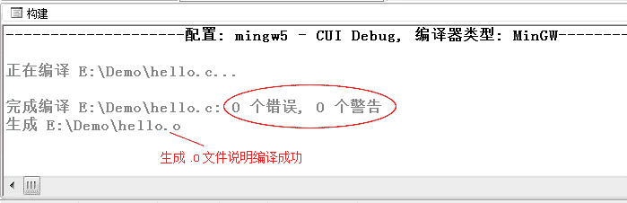
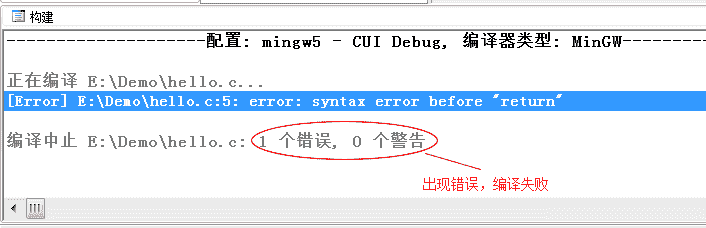
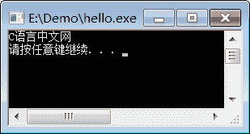
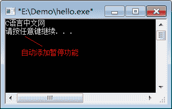

# C-Free 使用教程（使用 C-Free 编写 C 语言程序）

> 原文：[`c.biancheng.net/view/472.html`](http://c.biancheng.net/view/472.html)

## 安装 C-Free 5.0

C-Free 是一款国产的 Windows 下的 C/C++ IDE，最新版本是 5.0，整个软件才 14M，非常轻巧，安装简单。

下载地址：C-Free 5.0 下载

按照教程中的说明安装并 C-Free 5.0。

需要注意的是：C-Free 5.0 在 XP、Win7 下能够完美运行，在 Win8、Win10 下可能会存在兼容性问题，读者可以先尝试安装，不行的话再使用 VS、Dev C++、Code::Blocks 等代替。

## 运行 C 语言代码

前面我们给出了一段完整的 C 语言代码，就是在显示器上输出“C 语言中文网”，如下：

```

#include <stdio.h>
int main()
{
    puts("C 语言中文网");
    return 0;
}
```

接下来，我们就来看看如何通过 C-Free 5.0 来运行这段代码。

#### 1) 新建源文件

打开 C-Free，通过`新建`菜单或`Ctrl+N`新建文件，然后通过`保存`菜单或`Ctrl+S`将文件保存到`E:\Demo`目录，并命名为`hello.c`，如下图所示：
图 1：新建菜单和保存菜单


图 2：命名为 hello.c，并保存到 E:\Demo 目录

> C 语言源文件的后缀为`.c`。不过你也可以保存为`hello.cpp`，它将以 C++的方式运行，因为 C++兼容 C 语言，所以不会出现错误，不过我依然建议大家保存为`hello.c`。

#### 2) 编写源代码

新建文件后，就可以输入本文开头给出的代码了。

注意：虽然可以将整段代码复制到编辑器，但是我还是强烈建议你手动输入，我敢保证你第一次输入代码会有各种各样的错误，只有把这些错误都纠正了，你才会进步。本教程后续章节还会给出很多示例代码，这些代码一定要手动输入，不要复制后运行成功了就万事大吉。

#### 3) 编译和链接

在 C-Free 的工具栏中，有三个按钮特别重要，分别为“运行”“编译”和“构建”，如下图所示：
图 4：常用的几个按钮
代码输入完成后，点击“编译”按钮或者按`F11`键，就完成了源文件的编译，下方控制台中会显示编译信息：
图 5：编译成功
如果我们的代码语法有错误，比如`puts("C 语言中文网");`语句最后忘记写`;`，编译就会失败：
图 6：编译失败
编译成功后，打开 E:\Demo 目录，发现新生成了一个文件`hello.o`，而不是我们期望的`hello.exe`。这是因为，编译虽然生成了二进制文件，但是它还不能独立运行，还需要系统库（暂时可以理解为系统中的一些组件）的支持，.o 必须和系统库组合在一起才能生成 .exe，这个组合的过程就叫做链接（Link）。

`.o`文件叫做目标文件（Object File），它是编译的结果，是中间文件，已经是非常接近 .exe 的二进制文件了，只是还缺少一些东西，必须由系统库提供。

点击“构建”按钮或者按`Ctrl+F11`组合键，就完成了 hello.o 和系统库的链接，打开 E:\Demo，终于看到了期待已久的 hello.exe。至此，我们就将 C 语言代码转换成了可执行文件了。

#### 4) 运行程序

运行生成的 hello.exe 程序，并没有输出“C 语言中文网”几个字，而是会看到一个黑色窗口一闪而过。这是因为，程序输出“C 语言中文网”后就运行结束了，窗口会自动关闭，时间非常短暂，所以看不到输出结果，只能看到一个“黑影”。

我们对上面的代码稍作修改，让程序输出“C 语言中文网”后暂停一下：

```

#include <stdio.h>
#include <stdlib.h>
int main()
{
    puts("C 语言中文网");
    system("pause");
    return 0;
}
```

`system("pause");`语句的作用就是让程序暂停一下。注意代码开头部分还添加了`#include <stdlib.h>`语句，否则`system("pause");`无效。

再次编译并链接，运行生成的 hello.exe，终于如愿以偿，看到输出结果了，如下图所示：
图 7：第一个 C 语言程序
按下键盘上的任意一个键，程序就会关闭。

现在，你就可以将 hello.exe 分享给你的朋友了，告诉他们这是你编写的第一个 C 语言程序。虽然这个程序非常简单，但是你已经越过了第一道障碍，学会了如何编写代码，如何将代码生成 .exe 程序，这是一个完整的体验。

在本教程的基础部分，教大家编写的程序都是这样的“黑窗口”，与我们平时使用的软件不同，它们没有漂亮的界面，没有复杂的功能，只能看到一些文字，这就是控制台程序（Console Application），它与 DOS 非常相似，早期的计算机程序都是这样的。

控制台程序虽然看起来枯燥无趣，但是它非常简单，适合入门，能够让大家学会编程的基本知识；只有夯实基本功，才能开发出健壮的 GUI（Graphical User Interface，图形用户界面）程序，也就是带界面的程序。

#### 5) 更加快捷的方法

我们把上面的步骤总结一下，可以发现一个完整的编程过程是：

1.  编写源文件：这是编程的主要工作，我们要保证代码的语法 100%正确，不能有任何差错；
2.  编译：将源文件转换为目标文件；
3.  链接：将目标文件和系统库组合在一起并转换为可执行文件；
4.  运行：可以检验代码的正确性。

不过，实际开发中我们最常用的是“运行”按钮或`F5`快捷键，它会一次性完成编译、链接和运行的操作，并让程序运行结束后自动暂停，这样我们就不必额外增加`system("pause");`语句了。

再次将本文开头部分的代码输入编辑器，点击“运行”按钮或按`F5`键，就可以看到运行结果，如下图所示：
图 8：点击“运行”按钮

> 你可以认为，是编译器在程序最后自动添加了`system("pause");`语句。