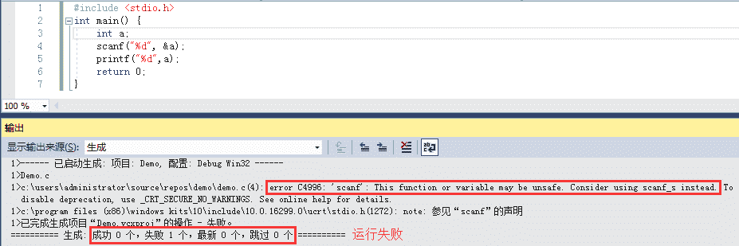
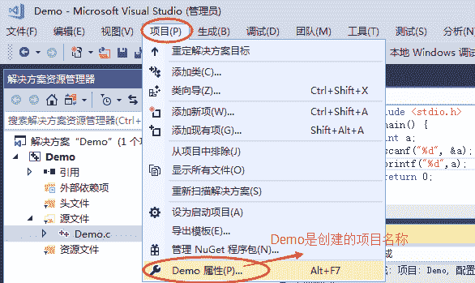
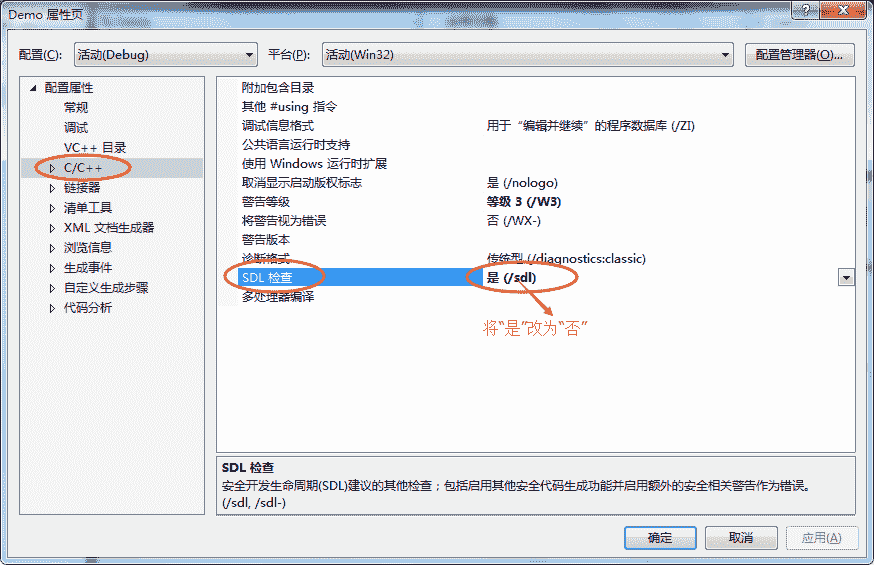
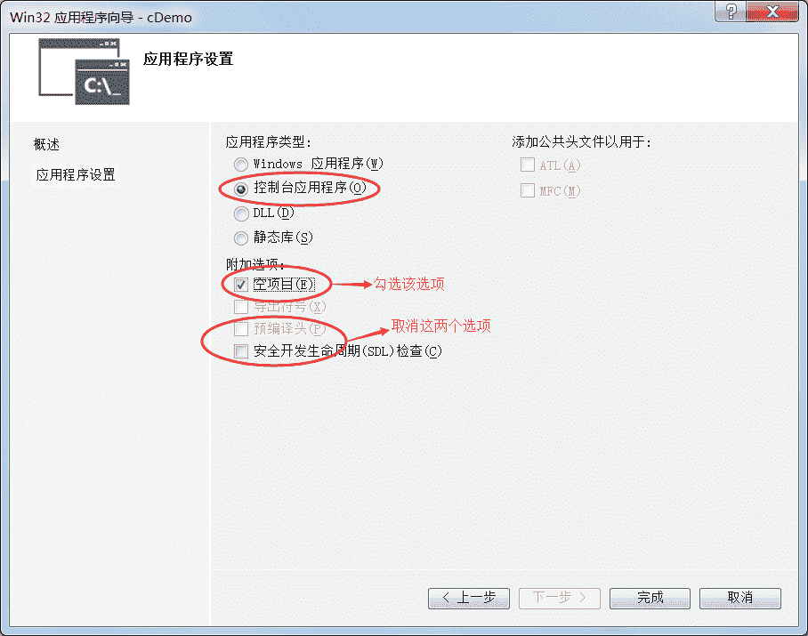

# VS 安全函数问题（C 语言安全函数）是怎么回事？如何解决？

> 原文：[`c.biancheng.net/view/473.html`](http://c.biancheng.net/view/473.html)

在 VS（Visual Studio）下编译 C 语言程序，如果使用了 scanf()、gets()、strcpy()、strcat() 等与字符串读取或操作有关的函数，有时候 VS 会报错，提示该函数可能不安全，并且建议替换为带有`_s`后缀的安全函数，如下图所示：

## 什么是安全函数（safe function）

scanf()、gets()、fgets()、strcpy()、strcat() 等都是 C 语言自带的函数，它们都是标准函数，但是它们都有一个缺陷，就是不安全，可能会导致数组溢出或者缓冲区溢出，让黑客有可乘之机，从而发起“缓冲区溢出”攻击。

scanf_s()、gets_s()、fgets_s()、strcpy_s()、strcat_s() 是微软自己发明的安全函数，它们仅适用于 VS，在其它编译器下无效。这些安全函数在读取或操作字符串时要求指明长度，这样一来，过多的字符就会被过滤掉，避免了数组或者缓冲区溢出。

下面我们以 scanf_s() 为例来讲解。

scanf() 在读取字符串时不会检查字符个数，它不知道数组或缓冲区到底能容纳多少个字符，例如：

```

char buf[5]={0};
scanf(“%s”, buf);
```

当用户输入`abcdeABCDE`这 10 个字符时，scanf() 会全部读取，并放入 buf 中，不过 buf 最多只能存储 5 个字符，不足以容纳用户输入的全部数据，所以多出来的 5 个字符就会使用 buf 后面的内存，而 buf 后面的内存可能没有使用权限，或者已经被别的数据占用，这就导致程序在运行时可能会出现不可预知的错误。

最要命的是，这种错误只能等到程序运行时才能检测出来，在编译期间根本无法检测；一旦检测出来只有一种后果，就是程序被操作系统终止，也就是我们常说的“程序崩溃”。

更改上面的代码，使用 scanf_s() 代替 scanf()：

```

char buf[5] = {0};
scanf_s(“%s”, buf, 5);
```

scanf_s() 最后一个参数用来指明数组或者缓冲区的大小，假设它的值为 n，那么最多只允许读取 n-1 个字符（因为最后要存储`'\0'`），多出来的字符就不再读取了，这样就可以避免读入过多的字符。与 scanf() 相比，scanf_s() 显然更加安全。

但是，安全函数不利于大家学习，它们不但使用麻烦，而且也不被绝大多数教程采用。另外，安全函数是微软自己发明的，只适用于 VS 编译器，在其他编译器下无效。

## 如何取消安全函数的限制

我们通过对 VS 做适当的设置，让它不再强制使用安全函数，从而可以使用 scanf()、gets()、fgets()、strcpy()、strcat() 等 C 语言的标准函数去编程。

VS 之所以会提示使用安全函数，是因为它进行了 SDL 检查（安全性开发生命周期检查），只要将它取消就可以了。

1) 菜单栏中选择 “项目 --> xxx 属性”（xxx 为创建的项目名称），或者直接按下组合键“Alt+F7”，如下图所示：

2) 此时会弹出如下图所示的一个对话框，选择“C/C++ --> SDL 检查”，将“是”改为“否”，如下图所示：
3、最后点击“确定”按钮，重新运行程序，你会发现程序可以正常运行了。

另外，VS2010、VS2015 等低版本的 VS 可以在创建项目之处就取消 SDL 检查（如下图所示），但是到了 VS2017 时就不行了，创建项目时没有这个选项了，只能在创建项目完成以后再按照以上步骤取消 SDL 检查。