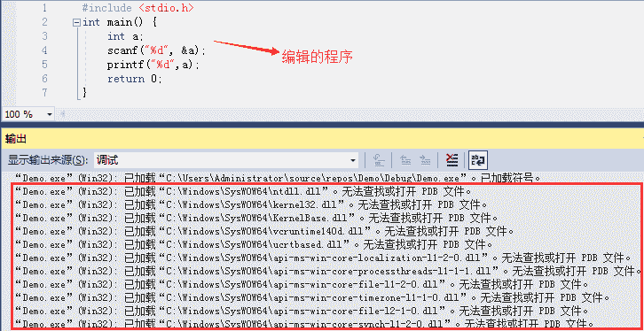
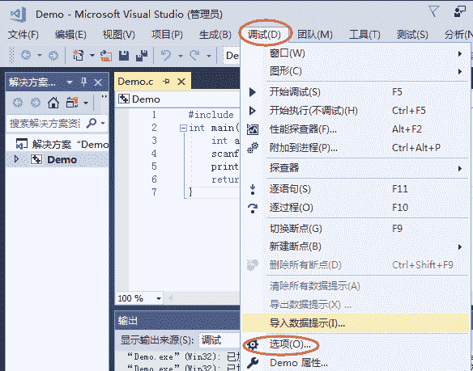
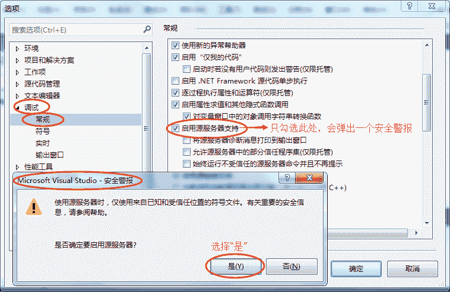
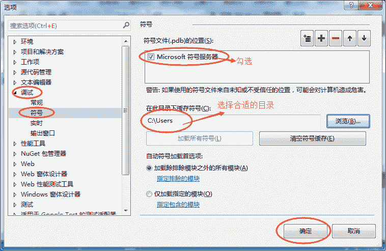
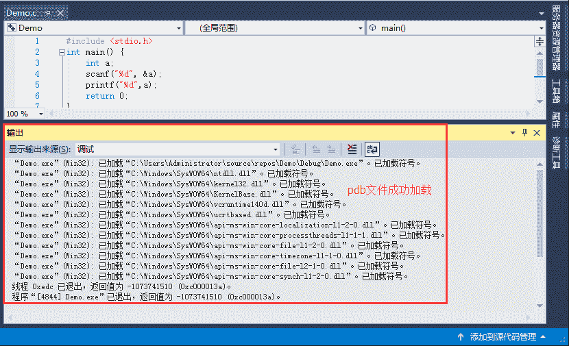

# VS“无法查找或打开 PDB 文件”是怎么回事？如何解决

> 原文：[`c.biancheng.net/view/474.html`](http://c.biancheng.net/view/474.html)

有时候，我们使用 VS（Visual Studio）编译程序时会出现“无法查找或打开 PDB 文件”的提示，并且此时程序会生成失败，无法运行，如下图所示：
大家不要惊慌，出现这种提示并不是代码写错了，而是编译器设置的问题，改一下设置就 OK 了。

## 先说一下 PDB 文件是什么

当程序在 VS 上编译时，程序所依赖的所有动态链接库（dll 文件）也会被编译，编译过程中每个 dll 都会产生一个 pdb 文件，又称为“符号文件”，是一个存储数据的信息文件，其包含 dll 库在编译过程的某些调试信息，例如程序中所用到的全局变量、局部变量、函数名以及他们的入口地址等。

pdb 文件主要用于调试程序，多用于当 VS 中有多个项目，且项目之间互有依赖关系时，使用 pdb 文件调试程序，往往会事半功倍，初学者一般不会用到。

当使用 VS 调试程序时，会默认加载你的程序以及程序依赖的 dll 库产生的所有 pdb 文件，但是结果往往是 VS 自己找不到依赖库的 pdb 文件，于是就提示给你“无法查找或打开 pdb 文件”。

## 如何修复这个错误

我们可以通过对 VS 做适当的设置，使之能够查找到相应的 PDB 文件，具体步骤如下（这里我们以 VS2017 为例进行说明，其它版本的 VS 操作步骤也一样）。

1) 选择菜单栏中的“调试  --> 选项”，如下图所示：
2) 弹出“选项”对话框后，选择“调试 --> 常规”，在右侧选项栏中勾选“启用源服务器支持”（包含的 3 个子选项不用勾选），此时会弹出一个安全警报框，选择“是”即可，如下图所示：
3) 还是在“选项”对话框中，选择“调试 --> 符号”，在右侧选项栏中勾选“Microsoft 符号服务器”，此时会弹出一个提示对话框，点击“确定”即可。同时，对于缓存符号的目录，选择图示中的目录即可：
4) 确定之后，重新运行你的程序，首次运行时，由于编译器会加载所有动态链接库的 pdb 文件，可能会等到几秒钟。程序运行后，之前输出窗口中的“无法查找或打开 pdb 文件”的提示不见了，如下图所示：
如上图所示，由于 pdb 文件，又名“符号文件”，所以“已加载符号”，也就是成功加载了动态链接库对应的 pdb 文件。