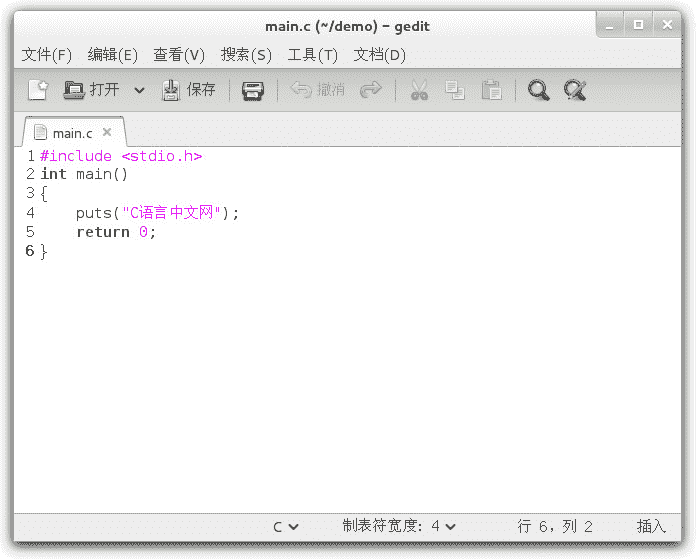
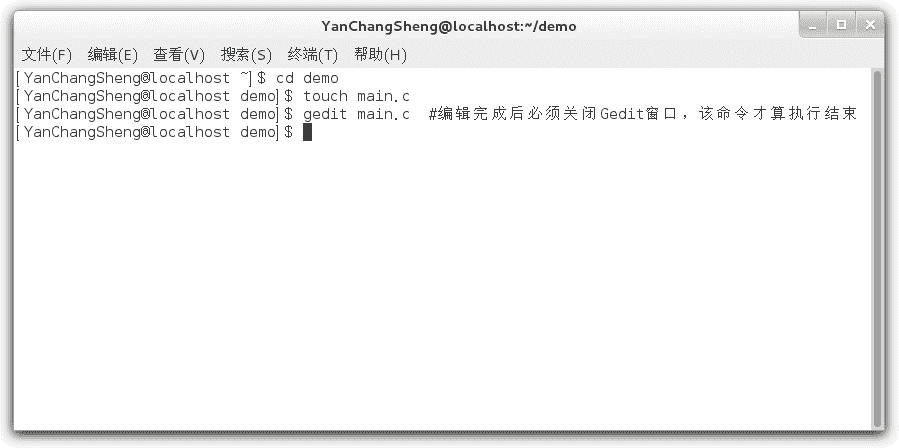
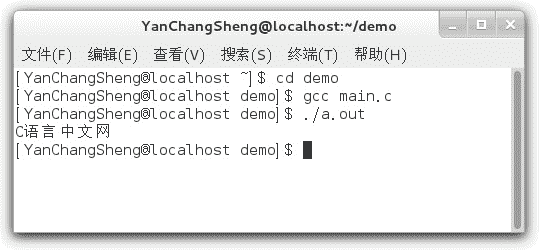
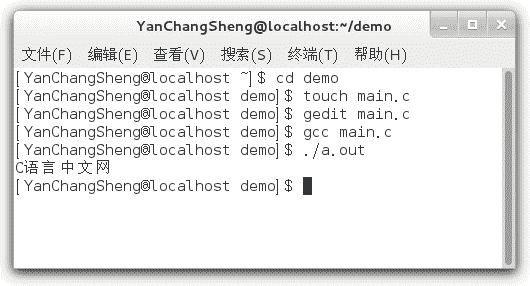
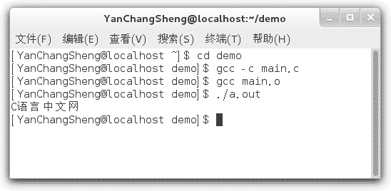

# Linux GCC 简明教程（使用 GCC 编写 C 语言程序）

> 原文：[`c.biancheng.net/view/475.html`](http://c.biancheng.net/view/475.html)

市面上常见的 Linux 都是发行版本，典型的 Linux 发行版包含了 Linux 内核、桌面环境（例如 GNOME、KDE、Unity 等）和各种常用的必备工具（例如 Shell、GCC、VIM、Firefox 等），国内使用较多的是 CentOS、Ubuntu（乌班图）、Debian、Redhat 等。

Linux 主要应用于各种服务器（例如网站服务器、数据库服务器、DNS 服务器、邮件服务器、路由器、负载均衡集群等），而不是我们常见的个人电脑。Linux 是服务器操作系统的绝对霸主，占据了 80% 以上的份额，在未来的服务器领域，Linux 是大势所趋。

这其中，又以 CentOS 和 Ubuntu 为主，CentOS 占有压倒性的优势。服务器操作系统 80% 以上的市场份额被 Linux 占据，而 Linux 80% 以上的份额又被 CentOS 占据。本教程以 CentOS 为例来讲述如何编译 C 程序。

> 服务器上的 Linux 是不安装图形界面的，只能在控制台模式下使用，以尽量节省服务器资源。而我们在学习过程中使用的 Linux 是带图形界面的，以满足初学者的需求，降低学习成本。

在 Linux 下我们仍然可以使用带界面的、傻瓜式的 IDE，例如 CodeLite、CLion（收费）、Code::Blocks、Netbeans、Eclipse CDT 等。微软的 Visual Studio 也支持 Linux 了，在 Windows 下用惯了 Visual Studio 的用户也可以毫无障碍地迁移到 Linux 平台。

但是作为初学者，我建议大家在命令行模式下编译 C 语言程序，这样能够了解生成一个可执行程序的详细步骤，以及编译命令的各种设置选项，为以后的 Linux C/C++ 开发打好坚实的基础。

## Gedit 编辑器

在 Linux 下，很多程序员都推崇使用 Vim、Emacs 等命令行模式的编辑器，它们功能强大，逼格够高，不管有没有桌面环境都能使用，是 Linux C/C++ 程序员必备的神器。但是 Vim 和 Emacs 并不容易上手，使用者需要记忆很多命令和快捷键，熟练才能生巧，所以需要一段时间的学习和适应，这会增加初学者的学习成本，所以这里不推荐大家使用。

CentOS 下有一款自带的图形界面编辑器，叫做 Gedit。Gedit 是一款简单实用的文本编辑器，界面优雅，支持语法高亮，比 Vim 容易上手，它和 Windows 下的编辑器没有什么两样。本教程将 Gedit 作为 C 语言代码的编辑器。

> 如果你使用的是其它的 Linux 发行版，可能没有默认安装 Gedit，这个时候就得自己安装，具体步骤为：
> 
> $ sudo apt-add-repository ppa:ubuntu-on-rails/ppa    #添加 ubuntu 的软件源
> $ sudo apt-get update    #更新软件列表
> $ sudo apt-get install gedit-gmate    #安装

首先，在我们自己的用户目录下新建一个名为`demo`的文件夹。这个文件夹专门用来存放与 C 语言相关的文件，例如源文件、目标文件、可执行文件等，它专供我们学习使用。

> 用户目录有时候也叫 home 文件夹或者主文件夹，它的路径是`/home/username`，其中 username 就是我们登录 Linux 时使用的用户名。Linux 会在 home 目录下为每一个登录的用户创建一个文件夹，专门用来存放该用户使用到的配置文件、文本文档、图片、可执行程序等，以和其他用户区分开来。

接下来需要创建一个空白的 main.c 源文件。main.c 其实就是一个纯文本文件，并没有任何特殊格式，但是 Linux 不像 Windows，可以在右键菜单中新建文本文档，Linux 必须使用命令来创建，如下所示：

$ cd demo  #进入 demo 目录，这是源文件所在的目录
$ touch main.c  #使用 touch 命令创建一个名为 main.c 的空文件
$ gedit main.c  #使用 gedit 命令编辑 main.c

这样就完成了源文件的创建，并能够使用 Gedit 编辑源文件了。

在 Gedit 中输入下面的 C 语言代码：

```

#include <stdio.h>
int main()
{
    puts("C 语言中文网");
    return 0;
}
```

输入完成后的效果如下图所示：`Ctrl+S`保存文件，就完成了源代码的编辑工作。此时需要关闭 Gedit 的窗口，`$ gedit main.c`命令才算执行结束，才能在控制台继续输入其它命令。

下图演示了在控制台上的实际效果：注意，在 CentOS 下，使用`touch`命令创建完 main.c 后，进入 demo 目录，在右键菜单中也可以使用 Gedit 打开 main.c，如下图所示：

## GCC 编译器

Linux 下使用最广泛的 C/C++ 编译器是 GCC，大多数的 Linux 发行版本都默认安装，不管是开发人员还是初学者，一般都将 GCC 作为 Linux 下首选的编译工具。本教程也毫不犹豫地使用 GCC 来编译 C 语言程序。

GCC 仅仅是一个编译器，没有界面，必须在命令行模式下使用。通过`gcc`命令就可以将源文件编译成可执行文件。

#### 1) 生成可执行程序

最简单的生成可执行文件的写法为：

$ cd demo  #进入源文件所在的目录
$ gcc main.c  #在 gcc 命令后面紧跟源文件名

打开 demo 目录，会看到多了一个名为 a.out 的文件，这就是最终生成的可执行文件，如下图所示：这样就一次性完成了编译和链接的全部过程，非常方便。

> 注意：不像 Windows，Linux 不以文件后缀来区分可执行文件，Linux 下的可执行文件后缀理论上可以是任意的，这里的`.out`只是用来表明它是 GCC 的输出文件。不管源文件的名字是什么，GCC 生成的可执行文件的默认名字始终是`a.out`。

如果不想使用默认的文件名，那么可以通过`-o`选项来自定义文件名，例如：

$ gcc main.c -o main.out

这样生成的可执行程序的名字就是`main.out`。

因为 Linux 下可执行文件的后缀仅仅是一种形式上的，所以可执行文件也可以不带后缀，例如：

$ gcc main.c -o main

这样生成的可执行程序的名字就是`main`。

通过`-o`选项也可以将可执行文件输出到其他目录，并不一定非得在当前目录下，例如：

$ gcc main.c -o ./out/main.out

或者

$ gcc main.c -o out/main.out

表示将可执行文件输出到当前目录下的`out`目录，并命名为`main.out`。`./`表示当前目录，如果不写，默认也是当前目录。

> 注意：out 目录必须存在，如果不存在，gcc 命令不会自动创建，而是抛出一个错误。

#### 2) 运行可执行程序

上面我们生成了可执行程序，那么该如何运行它呢？很简单，在控制台中输入程序的名字就可以，如下所示：

$ ./a.out

`./`表示当前目录，整条命令的意思是运行当前目录下的 a.out 程序。如果不写`./`，Linux 会到系统路径下查找 a.out，而系统路径下显然不存在这个程序，所以会运行失败。

> 所谓系统路径，就是环境变量指定的路径，我们可以通过修改环境变量添加自己的路径，或者删除某个路径。很多时候，一条 Linux 命令对应一个可执行程序，如果执行命令时没有指明路径，那么就会到系统路径下查找对应的程序。

输入完上面的命令，按下回车键，程序就开始执行了，它会将输出结果直接显示在控制台上，如下所示：

$ cd demo
$ gcc main.c
$ ./a.out
C 语言中文网
$

下图演示了在控制台上的实际效果：如果程序在其它目录下，运行程序时还要带上目录的名字，例如：

$ ./out/main.out

或者

$ out/main.out

这个时候加不加`./`都一样，Linux 能够识别出`out`是一个目录，而不是一个命令，它默认会在当前路径下查找该目录，而不是去系统路径下查找，所以不加`./`也不会出错。

注意，如果程序没有执行权限，可以使用`sudo`命令来增加权限，例如：

$ sudo chmod 777 a.out

## 完整的演示

为了让读者有一个更加全面的认识，我们不妨将上面两部分的内容连接起来，完整的演示一下从编辑源文件到运行可执行程序的全过程：

$ cd demo  #进入源文件所在目录
$ touch main.c  #新建空白的源文件
$ gedit main.c  #编辑源文件
$ gcc main.c  #生成可执行程序
$ ./a.out  #运行可执行程序
C 语言中文网
$   #继续等待输入其它命令

下图是在控制台上的实际效果：

## 分步骤编译

上面讲解的是通过`gcc`命令一次性完成编译和链接的整个过程，这样最方便，大家在学习 C 语言的过程中一般都这么做。实际上，`gcc`命令也可以将编译和链接分开，每次只完成一项任务。

#### 1) 编译（Compile）

将源文件编译成目标文件需要使用`-c`选项，例如：

gcc -c main.c

就将 main.c 编译为 main.o。打开 demo 目录，就会看到 main.o：对于微软编译器（内嵌在 Visual C++ 或者 Visual Studio 中），目标文件的后缀为`.obj`；对于 GCC 编译器，目标文件的后缀为`.o`。

一个源文件会生成一个目标文件，多个源文件会生成多个目标文件，源文件数目和目标文件数目是一样的。通常情况下，默认的目标文件名字和源文件名字是一样的。

如果希望自定义目标文件的名字，那么可以使用`-o`选项，例如：

gcc -c main.c -o a.o

这样生成的目标文件的名字就是 a.o。

#### 2) 链接（Link）

在`gcc`命令后面紧跟目标文件的名字，就可以将目标文件链接成为可执行文件，例如：

gcc main.o

就将 main.o 链接为 a.out。打开 demo 目录，就会看到 a.out。

在`gcc`命令后面紧跟源文件名字或者目标文件名字都是可以的，`gcc`命令能够自动识别到底是源文件还是目标文件：如果是源文件，那么要经过编译和链接两个步骤才能生成可执行文件；如果是目标文件，只需要链接就可以了。

使用`-o`选项仍然能够自定义可执行文件的名字，例如：

gcc main.o -o main.out

这样生成的可执行文件的名字就是 main.out。

下面是一个完整的演示：

$ cd demo
$ gcc -c main.c
$ gcc main.o
$ ./a.out
C 语言中文网
$ 

在控制台上的真实效果为：