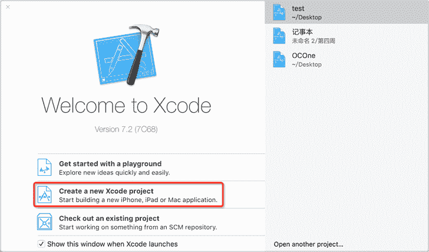
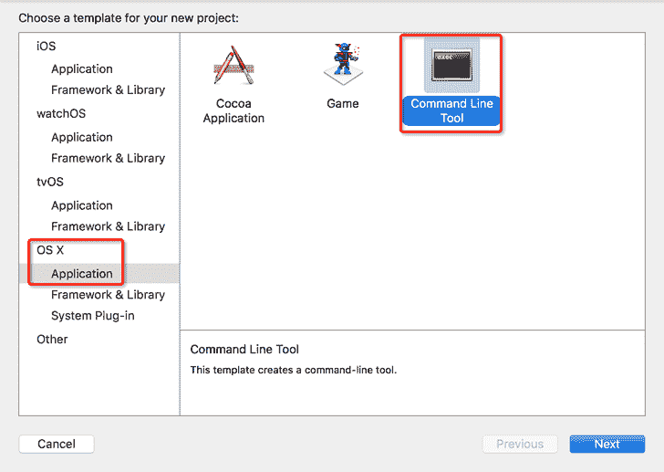
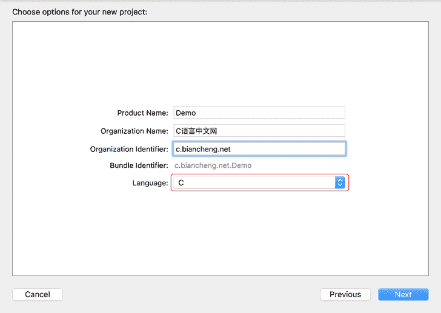
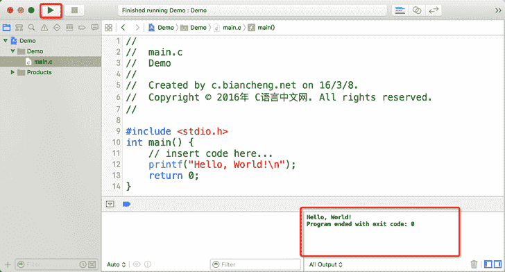

# Xcode 简明教程（使用 Xcode 编写 C 语言程序）

> 原文：[`c.biancheng.net/view/476.html`](http://c.biancheng.net/view/476.html)

在 Mac OS X 下学习 C 语言使用 Xcode。Xcode 是由 Apple 官方开发的 IDE，支持 C、C++、Objective-C、Swift 等，可以用来开发 Mac OS X 和 iOS 上的应用程序。Xcode 最初使用 GCC 作为编译器，后来由于 GCC 的不配合，改用 LLVM/Clang。

Xcode 的安装非常简单，在 APP Store 上直接下载即可，这里不再赘述。

## 在 Xcode 上运行 C 语言程序

在 Xcode 上运行 C 语言程序需要先创建工程，再在工程中添加源代码。

1) 打开 Xcode，选择“Create a new Xcode project”创建一个新工程，如下图所示：

2) 接下来，选择要创建的工程类型，如下图所示：

3) 选择“OS X --> Application --> Command Line Tool”，点击“Next”。Command Line Tool 是“命令行工具”的意思，也就是控制台程序。

这里需要填写和工程相关的一些信息：

*   Product Name：产品名称，即工程名称。
*   Organization Name：组织名称，即公司、个人、协会、团队等的名称。
*   Organization Identifier：组织标识符，即有别于其他组织的一个标记，例如身份证号、公司网址、组织机构代码证等。
*   Bundle Identifier：程序标识符，即有别于其他程序的一个标记，由 Organization Identifier + Product Name 组成。
*   Language：工程所用的编程语言，这里选择 C 语言。

4) 点击“Next”，保存文件后即可进入当前工程，如下图所示：

左侧是工程目录，主要包含了工程所用到的文件和资源。单击“main.c”，即可进入代码编辑模式，这里 Xcode 已经为我们创建好了一个“Hello World”小程序。点击上方的“运行”按钮，即可在右下角的选项卡中看到输出结果。