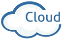

# 云计算技术与应用学习教程（精华版）

> 原文：[`c.biancheng.net/cloud_computing/`](http://c.biancheng.net/cloud_computing/)

云计算是一种全新的使用计算资源（硬件和软件）的模式。计算资源所在地（远方的一个或者多个机房）称为云端，人们使用的输入/输出设备（PC、手机、PAD 等）称为云终端，两者通过网络连接在一起。

这套《云计算技术与应用学习教程》是一本通俗读物，不要求读者具备深厚的编程功底，非技术人员也可以学习。

本教程讲解了云计算的概念、底层架构、基础组件、技术支撑、安全控制、行业应用、部署方案等，阅读完本教程你将会重新连接大脑中碎片信息，建立全面的云计算知识体系，具备 IT 环境的全局观和哲学观。