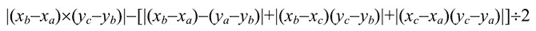
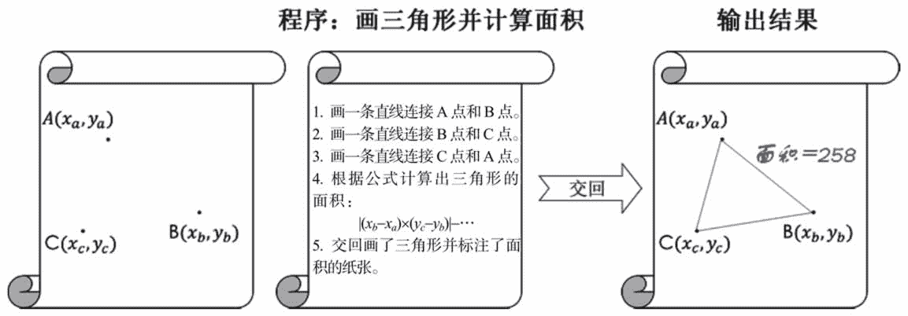
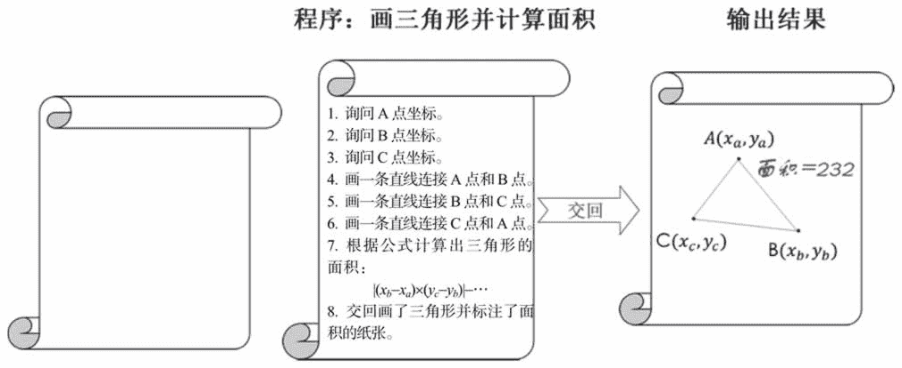
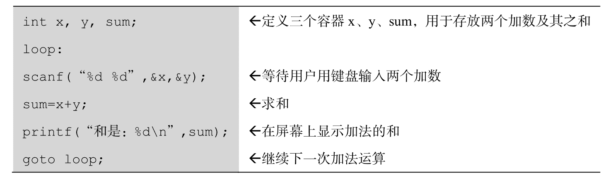
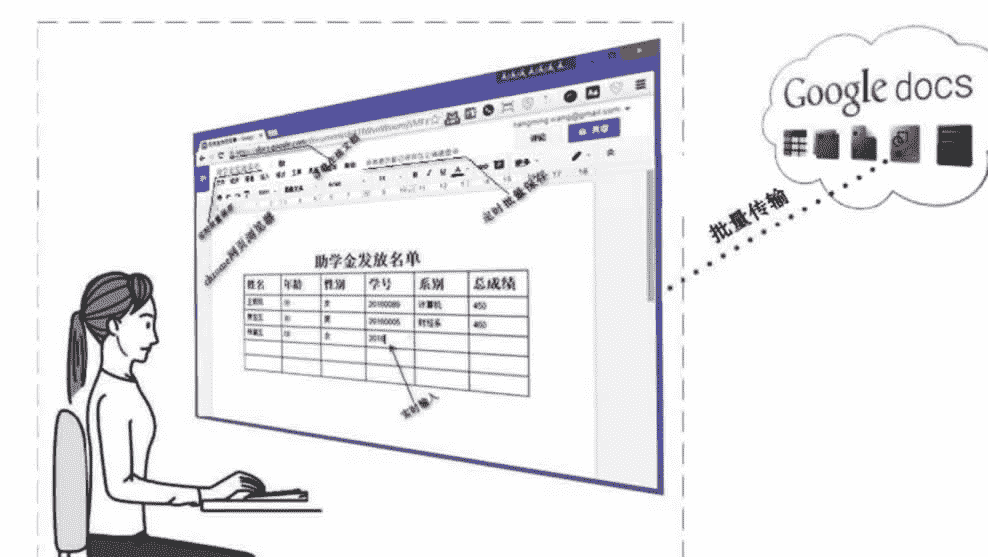
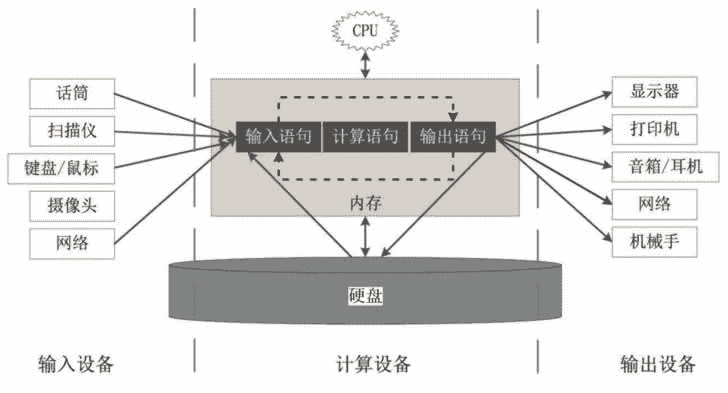

# 软件（程序）是什么？

> 原文：[`c.biancheng.net/view/3771.html`](http://c.biancheng.net/view/3771.html)

软件，也叫程序，那么究竟什么是软件？在回答这个问题之前，先来看下面的例子。

老李要求他的痴呆儿子（下称小李）在一张纸上画三角形并计算出三角形的面积。老李准备了两张白纸：一张白纸上标注了三个点：A 点、B 点和 C 点，以及每个点的坐标；另一张白纸上写下了画三角形的步骤和计算三角形面积的方法。小李只要按照这些步骤和计算方法动手即可。步骤如下：

1）画一条直线连接 A 点和 B 点。

2）画一条直线连接 A 点和 C 点。

3）画一条直线连接 B 点和 C 点。

4）根据下面的公式计算三角形的面积并写在纸上：

老李把这两张纸交给小李后，小李在书桌上摊开这两张纸开始工作。大概过了十分钟，老李得到了一张画好三角形并标注了面积的纸张，任务完成，如图 1 所示。

图 1  画三角形并计算面积
现在把小李比喻成计算机的 CPU（中央处理器），那么书桌就是内存，绘制三角形的步骤就是软件，一个步骤就是一条指令（语句），老李就相当于程序员，而那张画了三角形并标注了面积的纸张就相当于软件的输出（在屏幕上显示或者打印出来），“画一个三角形并计算面积”就是软件要完成的任务（程序要处理的数据）。

几天后，老李要画更多形状不同的三角形并计算出各自的面积，如果还是按照原来的方式，那么针对每个三角形，老李都要给小李提交两张纸，一张纸标明三个点，另一张纸写明步骤。这样做一方面浪费了纸张，另一方面增加了工作量。于是老李想出了一个办法，只交给小李一张写有步骤的纸张，画一个三角形并计算面积的步骤改为：

1）询问 A 点的坐标。

2）询问 B 点的坐标。

3）询问 C 点的坐标。

4）画一条直线连接 A 点和 B 点。

5）画一条直线连接 A 点和 C 点。

6）画一条直线连接 B 点和 C 点。

7）根据下面的公式计算三角形的面积并写在纸上：

8）把那张画了三角形并标注了面积的纸张交回给老李。

这样小李收到老李递过来的纸张后，先询问老李三角形的三个顶点的坐标，然后再去画三角形并计算面积，如图 2 所示。

图 2  画三角形并计算面积（2）
现在不只是老李，任何人只要复印那张写了步骤的纸张，都可以叫小李画出任何他们想要的三角形，只不过小李在画三角形前要询问顶点的坐标。继续把这些步骤比喻成软件，那么相对于前面的软件，这次增加了三条输入语句，用户在运行这个软件时，要用键盘输入三角形的三个顶点的坐标，然后就会在屏幕上看到一个三角形以及这个三角形的面积。

至此，我们总结出这个软件已经具备如下特征。

*   完成任务：画三角形并计算面积。
*   输入数据：顶点坐标。
*   输出结果：三角形及三角形的面积。
*   指令集：详细定义画一个三角形的步骤和计算三角形面积的方法。

指令集保存在一个文件中，这个文件就叫可执行程序，允许存放在硬盘、U 盘、光盘或者网盘中，可以任意复制和传播。比如，Windows 操作系统中的“计算器”这个程序（指令集）保存在硬盘上的 C：\Windows\system32\calc.exe 文件中，用鼠标双击它或者单击“开始”（“所有程序”（“附件”（“计算器”，即表示命令 CPU 现在就按照里面的步骤进行操作（专业术语叫执行指令）。

最后，我们通俗地定义一下软件：由程序员写的需要让 CPU 来完成某项任务的步骤。只不过这些步骤是用计算机语言来描述的。常见的计算机语言有 C 语言、C++、Java、PHP、Go 等，编程人员必须严格按照计算机语言的语法规则来写程序，如下面用 C 语言语句实现的加法运算。

上面左侧灰色框内就是程序员用 C 语言写的两个数相加的程序语句，右侧是额外加上的说明信息。

软件必须包含输入/输出语句和计算语句，没有包含输入/输出语句的软件没有任何用途，因为它就像一个黑盒子，既不能输入任何东西，也不能从它那里得到任何东西。

在这里，我们要澄清两个概念：实时输入/输出和批量输入/输出。

*   实时输入/输出是指 CPU 执行输入/输出步骤时，立即完成输入/输出动作。
*   批量输入/输出是一次性输入全部的信息，一次性输出全部的计算结果。

大部分计算机软件，如办公软件，都要求实时输入/输出。绝大部分网站都是批量输入/输出的，比如注册一个在线免费邮箱，我们要一次性输入全部的注册信息，然后再单击“提交”按钮，送出全部的输入信息。

实时输入/输出软件可进一步划分为强交互性软件和弱交互性软件两种，强交互性软件是指在运行时需要实时地进行大量输入/输出操作，且输入之后马上能看到输出结果；而弱交互性软件是指软件运行时实时地进行少量的输入操作，然后就源源不断地输出了。

属于强交互性软件的有：微软的办公软件（Word、Excel、PowerPoint）、记事本、QQ、Photoshop、AutoCAD、金山的办公软件 WPS、金山词霸、Visual Studio、Eclipse、Vim、飞信等，共同特点是用键盘输入的东西马上能在屏幕上显示出来。

下面这些软件属于弱交互性软件：酷狗音乐播放器、暴风影音、千千静听、PPTV、Adobe Reader、家庭相册、迅雷下载等，共同特点是在程序运行初期只需输入少量信息，然后就源源不断地输出了。

在规划云计算方案时，要特别关注软件的输入/输出是实时的还是批量的。如果是实时的，那么还要进一步区分是强交互性的还是弱交互性的。对于实时的强交互性软件，有两种解决方法：

1）计算机网络的延时控制在合理的范围内（一般要小于 100 毫秒），手段是就近部署云计算分支中心。如果延时过大，那么当使用诸如 Word 等排版软件时，需要等一会儿才能在屏幕上看到刚才用键盘输入的字符，用户体验很差。

2）改造软件以便能通过网页浏览器访问，用户只与本地的网页浏览器进行实时输入/输出交互，而网页浏览器与“云”中软件进行批量输入/输出传输，示意图如图 3 所示。
图 3  使用浏览器改造强交互性软件
计算机网络延时的概念在教程后面会详细介绍。

最后，我们用图 4 来表示一个软件运行模型。

图 4  软件运行模型
一个软件以文件的形式保存在硬盘上，当我们用鼠标双击它时，这个软件就被读到内存，此后 CPU 就按照里面的步骤一步步执行。

执行到一些输入步骤时，就要从输入设备上获取信息（常见的输入设备有键盘、鼠标、扫描仪、话筒、摄像头、网络等）。

执行一些计算步骤时，要用到计算设备。

执行输出步骤时，把计算的结果通过输出设备输出（常见的输出设备有计算机显示器、打印机、绘图仪、音箱、耳机、网络、机械手等）。

对于一些较大的软件，不一定就是按照“输入—计算—输出”的顺序进行的，在软件执行的过程中，随时可能需要输入，也随时可能会输出，计算步骤也可能安排在任意时刻。

注意：硬盘上的文件既可以作为输入设备，也可以作为输出设备。例如，编辑一个已经存在的 PPT 文档，首先作为输入设备，PPT 文档中的内容被读到内存，编辑完成后保存时又作为输出设备，内存中被修改的内容又被写到这个 PPT 文档中。

计算设备一般指 CPU、内存、存储（硬盘属于最典型的存储）和网络，为什么网络也算计算设备呢？在云端运行一个分布式应用程序时，网络是必需的。换个角度来看，计算设备就是程序运行时需要使用的资源——计算资源。

硬盘上的 PPT 文档本身不是程序，只是用于输入/输出的数据文件，双击它能打开进行编辑，实际上运行了微软的办公套件中的 powerpoint.exe 程序，因为在安装办公软件时自动建立了数据文件和程序的关联，建立好关联之后，只要双击数据文件，就能运行关联的程序。

#### 本节的知识点

1.  软件是由程序员写的让 CPU 来完成某项任务的步骤。
2.  这些步骤包括输入/输出步骤和计算步骤两大类。
3.  输入/输出步骤要使用输入/输出设备，计算步骤要使用计算设备，计算设备也称为计算资源。
4.  键盘和鼠标是最常见的输入设备，显示器和音箱是最常见的输出设备，CPU、内存、存储和网络统称为计算资源。
5.  软件平时保存在硬盘里，但必须读到内存中去执行，一个软件可以被多次执行。

计算设备和输入/输出设备的分离是云计算的特征之一。也就是说，对于云计算而言，计算设备位于远方的云端，而输入/输出设备就在眼前。究竟如何分离计算设备和输入/输出设备，请看后续章节。