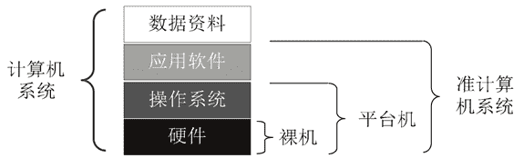

# 计算机由哪些软件和硬件组成？

> 原文：[`c.biancheng.net/view/3773.html`](http://c.biancheng.net/view/3773.html)

组装一台计算机的步骤大概就是写好计算机配单、采购零部件、组装、安装操作系统和各种应用、交付给用户使用，更详细的描述如下。

1.  写好配单，重点考虑用户的需要和各种零配件之间的兼容性。
2.  买齐配件，包括 CPU、主板、内存、电源、硬盘、机箱、显示器、键盘、鼠标、音箱、光驱。
3.  把配件组装到一起，此时我们得到一台纯硬件的裸机。
4.  安装操作系统，如 Windows 8。
5.  安装驱动软件，此时我们得到一台只安装了操作系统的计算机，称为平台机。
6.  安装需要的应用软件，如聊天软件、办公软件、音视频播放软件、上网软件和游戏软件等，此时我们得到安装了操作系统和应用软件的准计算机系统。
7.  最后把以前备份的数据资料（如文档、照片、视频等）复制到计算机硬盘中，这样完整的计算机系统就诞生了。

由此可知，完整的计算机系统包括硬件、软件和数据资料。软件又可分为平台软件和应用软件，操作系统和数据库软件是典型的平台软件。应用软件种类繁多，涉及人们生活的方方面面，如聊天软件、办公软件、上网软件、音视频播放软件、图片处理软件等。计算机系统体现出如图 1 所示的逻辑层次结构。

图 1  计算机系统逻辑层次结构
传统的个人计算机由于操作系统没有固化，感染病毒、不正常关机、误删除重要文件、配置不正确等都可能导致操作系统损坏，由此导致死机、蓝屏等各种问题。这些问题一直困扰着计算机用户，而重装操作系统、应用软件并恢复数据资料要消耗大量的时间和精力，严重时甚至丢失数据资料或者外泄私人资料。所以说，传统的计算机系统是专家系统，意思是说只有计算机专家才能很好地使用计算机，普通民众使用计算机会面临很多困难。

现在有两个趋势：第一个趋势是操作系统固化，用户自己不能安装和更改操作系统，只能在线对操作系统进行升级。应用软件也不能随便安装，只能从官方应用软件库中在线安装，如平板电脑、智能手机、老年机等。第二个趋势是云计算，后面的章节会展开讨论。

人们为什么要购买和使用计算机？也就是说人们购买和使用计算机的目的是什么？

目的只有一个，那就是处理数据资料，如上网查看别人的网站信息、编辑自己的 PPT、写个人简历、编辑图片、听音乐、看电影、和他人传递聊天信息（聊天）、发微博等，其实这些只是一些数据资料的浏览、编辑、传递和存储罢了。

如果没有裸机，或者有了裸机但没有安装操作系统，或者安装了操作系统但没有安装应用软件，那么我们就无法达到处理数据资料的目的。

由此可以说，准计算机系统（硬件、操作系统、应用软件）是手段，数据资料是目的。不难想象，如果没有数据资料要处理，就根本没必要购买和使用计算机。

手段与目的分离是云计算的另一个特征，即云计算服务提供商拥有计算资源这个“手段”，而云计算用户拥有数据资料这个“目的”。