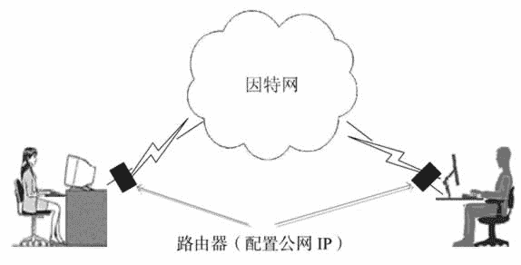
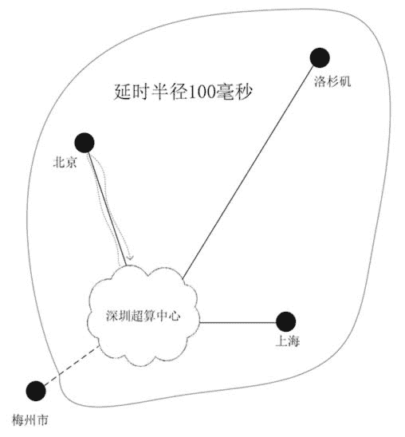
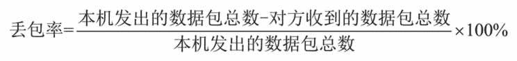
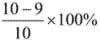

# 计算机网络（因特网）是什么？

> 原文：[`c.biancheng.net/view/3775.html`](http://c.biancheng.net/view/3775.html)

今天是周末，位于深圳南山区荔湾小区 28 栋 801 房间的云计算专家正在通过计算机和北京海淀区学院路文山花园 30 栋 2802 房间的做服装生意的朋友解释什么叫“云计算”，双方你一句我一句地在计算机上互传信息。做服装生意的朋友越说越糊涂，最后云计算专家输入了如下一句话：

“如果我能给你解释清楚，那么我的智商就下降到和你一样的水平了。”

然后单击“发送”按钮，对方马上反馈了一个晕倒的表情，聊天就这样无疾而终。

现在的问题是，单击“发送”按钮后，“如果我能给你解释清楚，那么我的智商就下降到和你一样的水平了。”这句话如何能准确无误地立即显示在北京海淀区学院路文山花园 30 栋 2802 房间里的那台计算机屏幕上呢？而地球上千千万万的其他计算机就不会显示这句话呢？

这两个问题可归结为：如何把一台计算机发出的信息准确无误地发送到另外一台计算机上？这个问题就是计算机网络所要解决的问题，示意图如图 1 所示。
图 1  两台计算机进行通信
写过纸质信件的人很清楚，为了能使信件送到对方手中，必须要在信封上写上收信人的详细地址和姓名，且“地址+姓名”是唯一的。至于这封信具体如何传递，那就是邮局的事了，不用我们操心。

如果两台计算机之间要通信，那么同样每台计算机要定义一个唯一的地址——32 个由 0 和 1 组成的二进制数字。

为了便于人们记忆，常把 32 位 0 和 1 组成的数字分成四段，每段 8 位，8 位二进制数再换算成十进制数，最后写成 xxx.xxx.xxx.xxx 格式。

如 192.168.0.10 对应的二进制分段为 11000000.10101000.00000000.00001010，因此最终的 32 位二进制地址是 11000000101010000000000000001010，有点类似于身份证号码，且必须全球唯一，这不同于邮局寄信的“XX 市 XX 区 XX 街 XX 号”格式的地址，计算机的地址称为 IP 地址，格式是“xxx.xxx.xxx.xxx”。

有读者可能马上会想到这样一个问题：32 位二进制数字最多能给多少台计算机分配唯一的 IP 地址呢？答案是 2 的 32 次方，约等于 43 亿台计算机。目前 32 位的地址（简称为 IPv4 地址）早已分配完毕，其中分配给中国的 IPv4 地址非常少，只与微软一家企业的数量相当。

在中国，公网 IPv4 极度匮乏，因此租用一个公网 IP 地址，价格非常昂贵。为了解决 IPv4 地址不够用的问题，人们发明了 IPv6。

IPv6 采用 128 位二进制数字编码，可以分配的地址数量可达 2 的 128 次方，这是一个天文数字，平摊下来，地球上每平方米可以分配上百万个 IPv6 地址。但是现在 IPv6 地址还没有被普遍采用，尽管现在的网络设备都已支持 IPv6。

聪明的中国人还发明了动态域名服务（DDNS，比较有名的产品有花生壳等），利用花生壳，解决了外网如何通过域名访问局域网内的计算机的问题。

现在我们再来看看深圳的云计算专家发送的“如果我能给你解释清楚，那么我的智商就下降到和你一样的水平了。”消息是如何传递到北京朋友面前的计算机的。单击“发送”按钮后，消息、自己计算机的 IP 地址、对方计算机的 IP 地址被打包在一起并通过宽带发送给深圳电信，然后电信内部传递，最后到达北京海淀区电信局后，由海淀区电信局通过对方的宽带发送给对方计算机。

注意：消息的打包和传递都是由计算机网络自动完成的，而且以电或光的速度传播，所以速度非常快。传递路径上转发机构（通常是路由器）的多少决定了一条消息到达对方计算机所消耗的时间（术语称延时），因此位于深圳的用户给美国的朋友发送消息有可能比给武汉的朋友发送消息还快。

实时输入/输出的软件对计算机网络的延时要求较高，尤其是实时强交互性软件，对计算机网络延时更苛刻。而批量输入/输出的软件对计算机网络的延时要求并不高，比如在线看电影，刚开始有点延时，后面就一直流畅地播放了。

一个云计算中心的延时半径通常为 100 毫秒，即一个数据包从云中心出发，50 毫秒所能到达的范围（返回也要 50 毫秒），这个数字与地理位置没有直接关系，而与网络路径上的转发机构和数目有关。比如深圳的超算中心 50 毫秒延时半径可能包括了美国的洛杉矶，但没有包括广东省内的梅州市，因为深圳与梅州市之间要经过太多性能低下的转发设备，而达到美国只经过少数几台高速路由器，如图 2 所示。
图 2  延时半径 100 毫秒
计算机网络的另一个指标是带宽，定义为每秒钟能传递的数据量。带宽越大，则每秒钟传递的数据量就越大。如果把计算机网络比喻为布满收费站的高速公路（车子从一个收费站开到另一个收费站的时间可以忽略不计，但是收费站交钱时要消耗时间），那么带宽就与车道数直接相关，延时就是从出发点到目的地经过收费站交钱时所消耗的时间之和。

计算机网络的第三个指标是丢包率（或称为掉包率），是指在一定时间内被丢掉的数据包数目占总发送数据包数目的百分比。公式如下：

本机发送的一个数据包如果在规定的时间内没有得到对方的确认，就认为此数据包被丢失，于是重发此数据包。比如对方一共收到 8 个数据包，而本机一共发送了 10 个数据包（因为重发了 2 个数据包），所以丢包率为 20%，即丢包率越小，说明网络越稳定，当丢包率超过 10% 时就很严重了，这时需要检查网络。

接下来我们再来谈谈叠加网络技术。为了方便大家去网上搜索，在这里给出这个术语的英文名称：Overlay Networks，在 Google 上搜索英文的技术资料，往往能获得很多你想要的结果。叠加网络，顾名思义就是在一张网络平面上叠加出更多层的网络平面，手法无非就是“包中之包”——把叠加协议和信息数据打包，作为底层网络平面传递的应用层数据。

实现叠加的最新技术有 VXLAN、NVGRE 和 STT，这些技术主要用来解决在大规模、多机房、跨地区的云计算中心部署多租户环境问题。叠加网络技术非常类似于在邮政系统上建立一个情报网络，利用现有的邮局来收发间谍情报。为了防止未经授权的人获取情报信息，需要先做加密处理，然后再放入信封，当然对方事先要知道解密方法。

叠加网络与虚拟局域网有着本质的不同，虚拟局域网通过分割一张大的局域网来减少广播风暴，本质是“分割”网络；而叠加网络是把“局域网”延伸到底层网络平面的任何地点，本质是“连通”。这里的“局域网”是虚拟的概念，对用户是透明的。

VPN 就是一个典型的在广域网中通过叠加网络技术构建地理位置跨度很大的局域网的例子，如果不采用叠加网络技术，那么一个公司很难或者根本不可能建立一个跨城市的局域网。为了进一步说明叠加网络的概念，请看下面的多租户环境的情景案例。

中国微算科技有限公司运营一个大型公共云，包含北京、上海和西安三个计算中心，共拥有 80 万台服务器，构造出近 5000 万台虚拟机，主营业务是对外出租虚拟机（IaaS 云服务）。

中国慧献是一家全国性的集团公司，机构分布在中国各地，为了节约成本和快速部署应用，该公司向中国微算科技有限公司长期租赁 1 万台虚拟机，因而成为中国微算科技有限公司的最大租户。这 1 万台虚拟机由中国慧献集团内部的技术工程师规划成近 300 个局域网（VXLAN），每个局域网内的虚拟机个数相对固定，但是虚拟机运行的地点与使用虚拟机的员工紧密相关。

比如中国慧献员工郭淑敏在北京出差十天，她的虚拟机就在北京的云中心运行，等她返回上海后，虚拟机也将“漂移”到上海的云中心运行。这一切，对郭淑敏来说都是透明的，她只是感觉首次在北京登录云端时稍微慢一点，几分钟之后就很流畅了，首次在上海登录时也是如此。

不管在哪里，郭淑敏都是登录相同的 IP 地址，输入相同的账户和密码，然后看到自己熟悉的计算机桌面。是的，昨天编辑的 PPT 继续打开在桌面上，光标停在“公司今年的财务”处，郭淑敏继续输入“状况好于去年……”郭淑敏的虚拟机归口于财务部局域网，财务部局域网横跨北京、上海和西安云中心，这是一个典型的叠加网络案例。

#### 本节的知识点

1.  计算机网络解决位于不同地区的两台计算机之间如何通信的问题。
2.  需要与外界通信的计算机必须拥有一个唯一的 IP 地址。
3.  计算机网络的三个重要指标是带宽、延时和丢包率。
4.  延时由网络路径上的转发机构的速度和数量决定，与通信双方地理位置的远近无关。
5.  叠加网络技术解决了在广域网上灵活构建虚拟局域网的问题。

我们要重点关注带宽和延时，因为它们是部署云计算时不可忽视的两个重要因素。