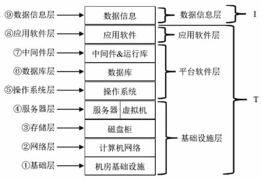
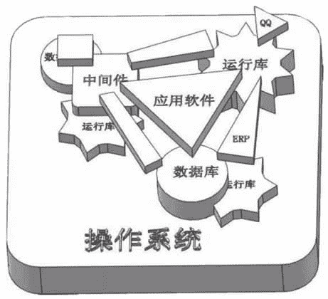

# IT 系统组成

> 原文：[`c.biancheng.net/view/3783.html`](http://c.biancheng.net/view/3783.html)

当今，任何一家企业，无论大小，都要采用计算机来处理日常事务，如写文档、做表格、发邮件、管理库存、管理客户等。为此，企业需要建设计算机网络，购买计算机设备，安装各种平台软件和应用软件。

随着公司的发展壮大，企业中的计算机网络变得越来越复杂，计算机设备越来越多，安装的软件也五花八门，到后来各种问题就出现了：病毒肆虐、数据丢失、客户流失、源代码被盗、网速下降、数据孤岛难以共享、运维复杂等。

为了搞清楚企业中复杂的 IT 系统结构，我们假设一家投资 8000 万元的公司诞生了，他们购买了一栋办公楼，现在需要计算机工程师们把 IT 系统搭建起来。工程师们制订了如下工作计划：

1.  机房基础建设，包括机房选址、装修、供电、温湿度控制、监控、门禁等。
2.  组建计算机网络，包括大楼综合布线、机柜安装、网络设备购买安装和调试。
3.  安装存储磁盘柜。
4.  购买和配置服务器。注意，还可能是虚拟出来的服务器。
5.  安装操作系统。
6.  安装数据库。
7.  安装各种中间件和运行库。
8.  安装各种应用软件。
9.  导入公司的初始化业务数据。

至此，公司的整体 IT 系统搭建完毕，员工可以入驻办公了。根据上面的工作计划，我们可以很容易地总结出企业 IT 系统的逻辑层次结构，如图 1 所示。
图 1  IT 系统的逻辑层次结构
一个典型的 IT 系统从逻辑上分为九层，施工时也是严格按照从第 1 层到第 9 层的顺序进行的，这就是所谓的“竖井”式施工。其中，第 1～4 层可归并为基础设施层，第 5～7 层可归并为平台软件层。

九层归并之后形成四层结构，分别是基础设施层、平台软件层、应用软件层和数据信息层，IT 系统的四层结构是最为普遍并被广泛接受的划分方法。在后续章节中，我们将采用四层结构展开讨论。

基础设施层、平台软件层、应用软件层可以进一步归并到 T（Technology 的首字母，表示技术），而数据信息层就是 I（Information 的首字母，表示信息），这就是 IT 的含义——信息技术。

对于一家企业而言，随着时间的推移，积累的数据信息会越来越多，数据信息是企业的宝贵资产，甚至是关乎企业生死存亡的重要财富。“如果数据丢失，80% 的企业要倒闭。”此话并非是危言耸听。

信息是目的，技术只是手段，如果一家企业没有业务数据需要处理，那么花大量资金组建基础设施层、平台软件层、应用软件层又有什么意义呢？

记住：IT 就是信息（Information）与技术（Technology），其中 I 是目的，T 是手段，T 是用来加工处理 I 的。T 广义上还包括企业中的计算机技术人员。

这里要重点介绍平台软件层的作用。很多计算机专业人士对平台软件难以理解，平台软件存在的唯一理由就是让应用软件能在计算机上运行。换句话说，平台软件就是应用软件运行时所依赖的环境。

比如，要想使用 QQ 这个应用软件，就必须先安装操作系统（如 Windows 10），QQ 需要的运行库在安装操作系统时会自动安装，然后才可以安装并运行 QQ 和朋友聊天。应用软件与平台软件的关系如图 2 所示。
图 2  应用软件与平台软件的关系
从图 2 可知，在操作系统平台上再搭中间件、运行库和数据库三个“台”，最后在最上层放置应用软件。不过，中间件可能还需要运行库和数据库的支撑，数据库可能还需要运行库的支撑。

并不是每个应用软件都要同时压在中间件、运行库和数据库三个“台”上，有的应用软件只需要运行库（如 QQ），有的应用软件只需要中间件，有的应用软件同时需要运行库和数据库，但是不需要运行库的应用软件很少，静态编译的软件运行时不需要运行库。

运行库有点像电工人员的工具袋，里面有螺丝刀、电笔、老虎钳、剥线钳等，应用软件在运行时需要使用各种小工具（术语叫系统库函数调用），操作系统提供了绝大多数常用的小工具，并分门别类地保存在硬盘的文件中。

Windows 操作系统中以 .dll 为扩展名的文件，通常保存在 C：\Windows\System32 下（比如文件 GDI32.dll 就是 QQ 软件运行时要用到的工具箱之一，如果把此文件删除，那么 QQ 就无法运行）。Linux 操作系统中一般以 .so 作为扩展名，保存在 /lib 目录下。

不同操作系统提供的“工具”和使用方法也不同，所以能在 Windows 操作系统上运行的应用软件不能在 Linux 操作系统上运行，也不能在苹果计算机的 Macintosh 操作系统上运行，反之亦然。为此，应用软件开发商会针对不同的操作系统发行不同的软件版本，比如腾讯公司开发的 QQ，目前就有 4 种版本，分别针对 Windows、Linux、Mac OS（苹果操作系统）和 Android 操作系统。

“中间件”是一个技术含义很强的概念，在家庭计算机和个人计算机上很少用到它，在企业中使用很普遍。中间件也就是“中间软件”的意思，为一类软件的统称。

“中间”包含两方面含义：一是指处于操作系统和应用软件之间；二是指介于应用软件与应用软件之间，目的是为了隐藏差异，以便共享资源和通信。中间件有点类似于电源插座面板，不管插座里面是什么构造，面板上的插接孔都是一样的，这样插座面板一方面隐藏了插座内部结构，另一方面能接插所有的电源插头。

中间件的引入目的就是要隐藏通信对端的内部结构，而呈现统一的调用界面。

掌握企业 IT 系统的四层逻辑结构很重要，这对于理解后续章节中的云计算概念非常有帮助。