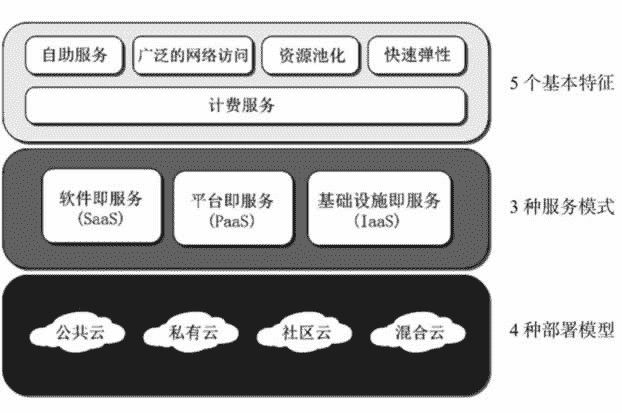
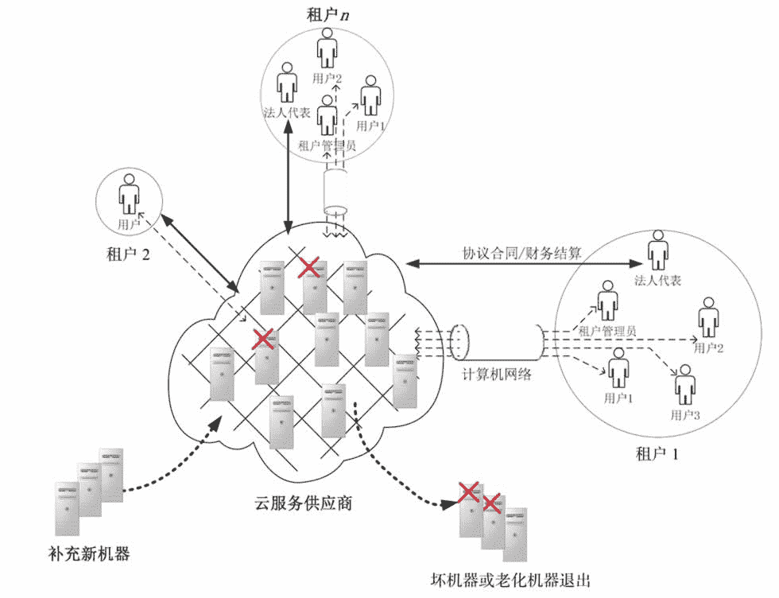

# 云计算是什么？它有哪些形式？

> 原文：[`c.biancheng.net/view/3784.html`](http://c.biancheng.net/view/3784.html)

在 IT 行业，存在一个 15 年周期现象，从 1966 年开始到可预知的未来若干年，可分为 6 个周期，每个周期的技术热点分别如下：

*   1966—1980 年为大型机时代；
*   1981—1995 年为个人计算机时代；
*   1996—2010 年为互联网时代；
*   2011—2025 年为云计算时代；
*   2026—2040 年为人工智能时代；
*   2041—2055 年为机器人时代。

每一个周期都以前一周期的产品为基础，诞生并迅猛发展出新的产业，但这并不意味着前一周期的产品会消亡。显然，当前正处于云计算蓬勃发展的时代。

云计算在眼下的中国呈现出冰火两重天的怪象：这边厢，云服务提供商们个个摩拳擦掌、热情高涨，大家恨不得从“万亿云计算市场”蛋糕中分得一大块，却鲜有人脚踏实地做产品；那边厢，用户们迷茫、观望者甚多，大家纷纷捂紧各自的钱袋，弱弱地问：“云计算到底是什么东西？能给我带来什么好处？”

政府也不甘示弱，大手笔的云计算中心像雨后春笋般在神州大地上拔地而起，只见机房机器轰鸣，壁挂大屏幕闪烁，却不见云应用，这等同于天上电闪雷鸣，就是不见下雨。深圳超算中心，强大的计算能力没有得到充分利用，能源无谓消耗严重。

## 什么是云计算？

在《什么是软件》教程中，我们谈到，软件就是程序员写的需要 CPU 来执行以便完成某项任务的步骤，这些步骤包括输入/输出步骤和计算步骤。而 CPU 在执行输入/输出步骤时需要使用输入/输出设备，在执行计算步骤时需要使用计算设备。对于普通的计算机来说，计算设备指 CPU、内存和硬盘，输入/输出设备指键盘、鼠标、显示器、话筒和音箱等。

如果计算机还要与其他设备通信，那么计算设备还应包括网络。对于传统的个人计算机而言，计算设备和输入/输出设备通过主板连接在一起，也就是说，有了主板这个纽带，计算设备和输入/输出设备就可以协同工作了。其特征如下：

*   计算资源就在本地。
*   计算资源不易扩展或收缩。
*   其他人无法共享你的计算资源。
*   既是计算资源的所有者，又是计算资源的使用者。

我们再次重申一下：计算设备也称为计算资源，计算资源包括 CPU、内存、硬盘和网络。而在机房中，磁盘只是存储大类中的一种，存储还包括磁带库、阵列、SAN、NAS 等，这些统称为存储资源。另外，CPU、内存只是服务器的部件，我们统一用服务器资源来代替 CPU 和内存资源的说法。

广义的计算资源还包括应用软件和人力服务，如果不特别声明，那么后续章节中提到的计算资源就是指服务器、存储、网络、应用软件和人力服务。

不同于传统的计算机，云计算引入了一种全新的方便人们使用计算资源的模式，即云计算能让人们方便、快捷地自助使用远程计算资源。

计算资源所在地称为云端（也称为云基础设施），输入/输出设备称为云终端。

云终端就在人们触手可及的地方，而云端位于“远方”（与地理位置远近无关，需要通过网络才能到达），两者通过计算机网络连接在一起。

云终端与云端之间是标准的 C/S 模式，即客户端/服务器模式——客户端通过网络向云端发送请求消息，云端计算处理后返回结果。云计算的可视化模型如图 1 所示。
图 1  云计算的可视化模型云计算具有 5 个基本特征、4 种部署模型和 3 种服务模式。

## 云计算的 5 个基本特征

#### 1）自助服务

消费者不需要或很少需要云服务提供商的协助，就可以单方面按需获取云端的计算资源。

#### 2）广泛的网络访问

消费者可以随时随地使用任何云终端设备接入网络并使用云端的计算资源。常见的云终端设备包括手机、平板、笔记本电脑、PDA 掌上电脑和台式机等。

#### 3）资源池化

云端计算资源需要被池化，以便通过多租户形式共享给多个消费者，也只有池化才能根据消费者的需求动态分配或再分配各种物理的和虚拟的资源。消费者通常不知道自己正在使用的计算资源的确切位置，但是在自助申请时允许指定大概的区域范围（比如在哪个国家、哪个省或者哪个数据中心）。

#### 4）快速弹性

消费者能方便、快捷地按需获取和释放计算资源，也就是说，需要时能快速获取资源从而扩展计算能力，不需要时能迅速释放资源以便降低计算能力，从而减少资源的使用费用。对于消费者来说，云端的计算资源是无限的，可以随时申请并获取任何数量的计算资源。

但是我们一定要消除一个误解，那就是一个实际的云计算系统不一定是投资巨大的工程，也不一定要购买成千上万台计算机，也不一定具备超大规模的运算能力。其实一台计算机就可以组建一个最小的云端，云端建设方案务必采用可伸缩性策略，刚开始时采用几台计算机，然后根据用户数量规模来增减计算资源。

#### 5）计费服务

消费者使用云端计算资源是要付费的，付费的计量方法有很多，比如根据某类资源（如存储、CPU、内存、网络带宽等）的使用量和时间长短计费，也可以按照每使用一次来计费。但不管如何计费，对消费者来说，价码要清楚，计量方法要明确，而云服务提供商需要监视和控制资源的使用情况，并及时输出各种资源的使用报表，做到供/需双方费用结算清清楚楚、明明白白。

## 云计算的 4 种部署模型

#### 1）私有云

云端资源只给一个单位组织内的用户使用，这是私有云的核心特征。而云端的所有权、日常管理和操作的主体到底属于谁并没有严格的规定，可能是本单位，也可能是第三方机构，还可能是二者的联合。云端可能位于本单位内部，也可能托管在其他地方。

#### 2）社区云

云端资源专门给固定的几个单位内的用户使用，而这些单位对云端具有相同的诉求（如安全要求、云端使命、规章制度、合规性要求等）。云端的所有权、日常管理和操作的主体可能是本社区内的一个或多个单位，也可能是社区外的第三方机构，还可能是二者的联合。云端可能部署在本地，也可能部署于他处。

#### 3）公共云

云端资源开放给社会公众使用。云端的所有权、日常管理和操作的主体可以是一个商业组织、学术机构、政府部门或者它们其中的几个联合。云端可能部署在本地，也可能部署于其他地方，比如中山市民公共云的云端可能就建在中山，也可能建在深圳。

#### 4）混合云

混合云由两个或两个以上不同类型的云（私有云、社区云、公共云）组成，它们各自独立，但用标准的或专有的技术将它们组合起来，而这些技术能实现云之间的数据和应用程序的平滑流转。由多个相同类型的云组合在一起属于多云的范畴。

比如两个私有云组合在一起，混合云属于多云的一种。由私有云和公共云构成的混合云是目前最流行的——当私有云资源短暂性需求过大（称为云爆发，Cloud Bursting）时，自动租赁公共云资源来平抑私有云资源的需求峰值。

例如，网店在节假日期间点击量巨大，这时就会临时使用公共云资源来应急。

## 云计算的 3 种服务

#### 1）软件即服务（Software as a Service，SaaS）

云服务提供商把 IT 系统中的应用软件层作为服务出租出去，消费者不用自己安装应用软件，直接使用即可，这进一步降低了云服务消费者的技术门槛。更详细的介绍参见后续章节。

#### 2）平台即服务（Platform as a Service，PaaS）

云服务提供商把 IT 系统中的平台软件层作为服务出租出去，消费者自己开发或者安装程序，并运行程序。更详细的介绍参见后续章节。

#### 3）基础设施即服务（Infrastructure as a Service，IaaS）

云服务提供商把 IT 系统的基础设施层作为服务出租出去，由消费者自己安装操作系统、中间件、数据库和应用程序。更详细的介绍参见后续章节。

云计算的精髓就是把有形的产品（网络设备、服务器、存储设备、各种软件等）转化为服务产品，并通过网络让人们远距离在线使用，使产品的所有权和使用权分离。正如洗衣店老板把洗衣机这种有形产品转化为洗衣服务一样，消费者直接投币自助洗衣，这样一方面提高了洗衣机的使用率，另一方面又降低了消费者购买洗衣机的支出。

洗衣店不是一种新的洗衣技术，而是一种新的洗衣服模式，可能洗衣店老板还会进一步细分市场，推出干洗服务、洗衣烘干一条龙服务等。

计算设备一旦转化为服务，使用率就会得到显著提高，设备的寿命反而会更长，因为电子产品不比机械产品会产生磨损，经常不开机的电子设备反而比常年开机满负荷运转的电子设备更容易出故障。

另外，作为计算资源的软件可以无限复制运行，这一点与洗衣店的洗衣机等物理设备有本质的不同，一台洗衣机被他人使用，就不能同时再被另外的人使用；而软件则没有这个限制，同样一个软件，可以同时给任意多的人使用。还有，计算资源使用率的高低与成本无关，对于一台计算机而言，直接的成本是用电费用，计算机空转与满负荷运转耗费的电力几乎相当；而洗衣店的用户越多，开启的洗衣机就越多，耗费的电力也就越多。

目前，世界范围内传统计算设备远远超过云端的计算设备，这些传统的计算设备由于没有共享，因此很多计算产能被白白浪费掉了。加入云端的计算设备在得到充分使用的情况下，云计算才算是“绿色”计算，但是在中国政府主导的几大云计算中心，计算设备的利用率却非常低，机器众多、耗电巨大，这根本就是与“绿色”计算背道而驰。

通过云计算，提供商把计算资源转化为服务产品并销售给用户，服务产品有别于其他的有形产品（如空调、桌子、啤酒、书籍等），所以有人提出了云计算的第 4 种服务模式——DaaS（数据即服务，就是出租 IT 系统的最顶层）。

这等同于说空调即服务、桌子即服务，这是不恰当的，因为数据是一种有形产品（以纸张、U 盘、磁盘作为载体，正如书籍是知识的载体），而且在目前的技术条件下，几乎不可能把数据转化为服务。服务的一个主要属性是所有权和使用权分离，使用一次服务能预先摊算费用。而用户一旦使用了一次数据，其实他就拥有了该数据，此后他可以无限制使用，而且还可能传播和转卖。

前面多次提到租户和用户，那么这两个概念到底有什么区别呢？

以一个单位组织（如企业、部门或团体等）的名义去租赁云计算服务时，云服务提供商称呼该单位组织为一个租户，而一个租户包含若干个用户（单位内的员工），这些用户当中有的是该租户的管理员，有的是操作员等。

比如 XXX 企业向 SaaS 云服务提供商租赁了 ERP 系统，云服务提供商认为 XXX 企业是一个租户，然后给它分配管理员账号和密码。XXX 企业指定员工张三为租户管理员，张三登录云平台自助网站创建更多的普通账号，然后把这些账号分配给公司内部的相关业务人员（如会计人员、人事经理、仓库管理员等）。

一个租户允许只有一个用户，也允许有多个用户。云服务提供商只与租户（法人代表）之间存在租赁合同关系，并与租户进行费用结算，示意图如图 2 所示。

图 2  云服务提供商与租户