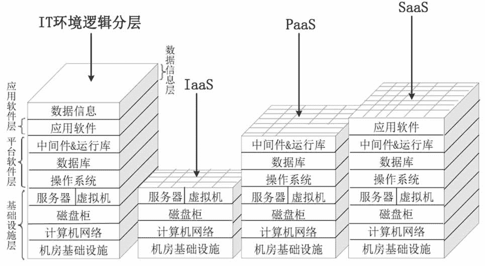

# IaaS、PaaS 和 SaaS：云计算的三种服务模式（精讲）

> 原文：[`c.biancheng.net/view/3787.html`](http://c.biancheng.net/view/3787.html)

我们在《IT 系统的组成》教程中讲到，IT 系统的逻辑组成分为四层，自下至上依次是基础设施层、平台软件层、应用软件层和数据信息层。

云计算是一种新的计算资源使用模式，云端本身还是 IT 系统，所以逻辑上同样可以划分为这四层。底三层可以再划分出很多“小块”并出租出去，这有点像立体停车房，按车位大小和停车时间长短收取停车费。因此，云服务提供商出租计算资源有 3 种模式，满足云服务消费者的不同需求，分别是 IaaS、PaaS、SaaS，如图 1 所示。

图 1  云计算的 3 种服务模式
需要注意的是，云服务提供商只负责出租层及以下各层的部署、运维和管理，而租户自己负责更上层次的部署和管理，两者负责的“逻辑层”加起来刚好就是一个完整的四层 IT 系统（见图 1 最左侧）。

比如有一家云服务提供商对外出租 IaaS 云计算业务，云服务提供商负责机房基础设施、计算机网络、磁盘柜和服务器/虚拟机的建设和管理，而云服务消费者自己完成操作系统、数据库、中间件和应用软件的安装和维护。另外，还要管理数据信息（如初始化、数据备份、恢复等）。

再比如，另一家云服务提供商出租 PaaS 业务，那么云服务提供商负责的层数就更多了，云服务消费者只需安装自己需要的应用软件并进行数据初始化即可。总之，云服务提供商和消费者各自管理的层数加起来就是标准的 IT 系统的逻辑层次结构。

在一篇文章中详细讲解三种服务模式会导致篇幅过长，所以我们分成三节，请大家猛击下面的链接进行阅读：

*   云计算 IaaS 服务模式
*   云计算 PaaS 服务模式
*   云计算 SaaS 服务模式