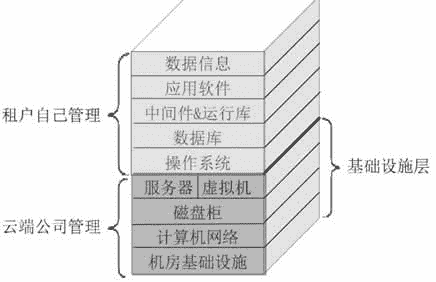
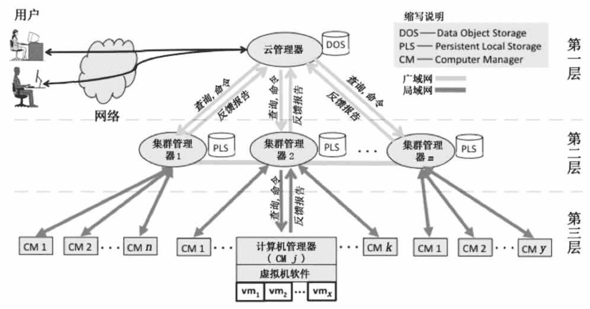

# 云计算 IaaS 服务模式精讲

> 原文：[`c.biancheng.net/view/3788.html`](http://c.biancheng.net/view/3788.html)

IaaS 是“Infrastructure as a Service”的首字母缩写，意思是基础设施即服务，即把 IT 系统的基础设施层作为服务出租出去。由云服务提供商把 IT 系统的基础设施建设好，并对计算设备进行池化，然后直接对外出租硬件服务器、虚拟主机、存储或网络设施（负载均衡器、防火墙、公网 IP 地址及诸如 DNS 等基础服务）等。

云服务提供商负责管理机房基础设施、计算机网络、磁盘柜、服务器和虚拟机，租户自己安装和管理操作系统、数据库、中间件、应用软件和数据信息，所以 IaaS 云服务的消费者一般是掌握一定技术的系统管理员，如图 1 所示。
图 1  IaaS 云
IaaS 云服务提供商计算租赁费用的因素包括 CPU、内存和存储的数量，一定时间内消耗的网络带宽，公网 IP 地址数量及一些其他需要的增值服务（如监控、自动伸缩等）等。

出租的物理服务器和虚拟机统称为主机，云服务提供商如何对外出租主机呢？或者是租户如何使用这些租来的主机呢？相对于租户来说，这些主机不在现场而在“远方”，租赁之后并不是把这些主机从云端搬到租户的办公室来使用。

出租前后主机的物理位置并没有改变，租户仍然是通过网络使用这些云端主机。租户登录云服务提供商的网站，填写并提交主机配置（如需要多少个 CPU、多少内存、多少网络带宽等）表后付款，然后云服务提供商向租户颁发账号和密码，最后租户以此账号和密码登录云端的自助网站。

在这里，租户可以管理自己的主机：启动和关闭机器、安装操作系统、安装和配置数据库、安装应用软件等。其实只有启动机器和安装操作系统必须要在自助网站上完成，其他操作可以直接登录到已经安装了操作系统并配置好网卡的主机中完成。

对于租来的主机，租户只关心计算资源（CPU、内存、硬盘）的容量是否与租赁合同上标注的一致，就像租赁同一层楼上的一间房间一样，租户只关心面积是否足够，而不关心房间的墙壁是钢筋水泥结构还是砖块石灰结构。但是对于云服务提供商来说，出租硬件服务器和虚拟机，内部的技术处理是不一样的，其中硬件服务器必须要集成远程管理卡并要池化到资源池中。

远程管理卡是插接在服务器主板上或者直接集成在主板上的一个嵌入式系统，需要接网线并配置 IP 地址。只要服务器的电源插头插到插座上，不管有没有按下服务器的电源开关，这个远程管理卡都会启动，其他人就可以通过网络登录到远程管理卡（需要账号和密码），成功登录后就可以进行启动和关闭服务器、安装操作系统等操作。只不过云服务提供商把远程管理卡的功能集成到了租户自助网站中，从而实现了物理机和虚拟机的统一管理。

租户到底是租赁硬件服务器还是虚拟机呢？这个问题留到后面教程的章节来讨论。

IaaS 云端的基本架构模型如图 2 所示。
图 2  IaaS 云端基本架构模型
IaaS 云端的基本架构模型逻辑上分为三层：第一层管理全局，第二层管理计算机集群（一个集群内的机器地理位置上可能相距很远），第三层负责运行虚拟机。

第一层的云管理器与第二层的集群管理器之间一般通过高速网络连接，当增加数据中心为云端扩容时，就能体现网速的重要性。而集群内的计算机之间倾向于采用本地局域网（如 10Gbit/s 以太网）或者超高速广域网，如果采用局域网，则灾难容错差；如果跨广域网，则网络带宽会成为瓶颈。

图 2 中，每一层具体的任务介绍如下。

#### 第一层（云管理器）

云管理器是云端对外的总入口，在这里验证用户身份，管理用户权限，向合法用户发放票据（然后用户持此票据使用计算资源）、分配资源并管理用户租赁的资源。

#### 第二层（集群管理器）

每一个集群负责管理本集群内部的高速互联在一起的计算机，一个集群内的计算机可能有成百上千台。

集群管理器接受上层的资源查询请求，然后向下层的计算机管理器发送查询请求，最后汇总并判断是部分满足还是全部满足上层请求的资源，再反馈给上层。如果接下来收到上层分配资源的命令，那么集群管理器指导下层的计算机管理器进行资源分配并配置虚拟网络，以便能让用户后续访问。

另外，本层 PLS 中存储了本集群内的全部虚拟机镜像文件，这样一台虚拟机就能在集群内任意一台计算机上运行，并轻松实现虚拟机热迁移。

#### 第三层（计算机管理器）

每台计算机上都有一个计算机管理器，它一方面与上层的集群管理器打交道，另一方面与本机上的虚拟机软件打交道。它把本机的状态（如正在运行的虚拟机数、可用的资源数等）反馈给上层，当收到上层的命令时，计算机管理器就指导本机的虚拟机软件执行相应命令。这些命令包括启动、关闭、重启、挂起、迁移和重配置虚拟机，以及设置虚拟网络等。

租赁 IaaS 云服务，对租户而言，最大优点是其灵活性，由租户自己决定安装什么操作系统、需不需要数据库且安装什么数据库、安装什么应用软件、安装多少应用软件、要不要中间件、安装什么中间件等，相当于购买了一台计算机，要不要使用、何时使用以及如何使用全由自己决定。

一些搞研发的计算机技术人员倾向于租赁 IaaS 主机。但是对于租户来说，IaaS 云主机除管理难度大外，还有一个明显的缺陷：计算资源浪费严重。因为操作系统、数据库和中间件本身要消耗大量的计算资源（CPU、内存和磁盘空间），但它们消耗的资源对租户来说做的是无用功，来看下面这个极端的案例。

假设张三租用了一台 IaaS 主机，配置为 CPU1.0GHz，内存 1GB，硬盘空间 10GB，然后他安装了 Windows7 操作系统、MySQL 数据库，最后再想安装和运行绘图应用软件几乎是不可能了，因为 Windows7 操作系统和 MySQL 数据库就要把 CPU、内存和硬盘空间消耗殆尽了。

没有硬盘空间，如何安装应用软件？没有空闲的内存，又如何能运行应用软件？张三本来打算租赁云端主机来搞图形设计，这样一来，目的就没达到，至少租来的主机的配置要翻倍才行。

下面是一些 IaaS 云服务的实际应用。

1.  备份和恢复服务。
2.  计算服务：提供弹性资源。
3.  内容分发网络（CDN）：把内容分发到靠近用户的地方，对于一些基于网页的应用系统，为了提高用户体验，往往在各个地方（人口稠密的地方）设立分支服务器，当用户浏览网页时，被重定向到本地 Web 服务器，所以数据必须实时分发并保持一致。
4.  服务管理：管理云端基础设施平台的各种服务。
5.  存储服务：提供用于备份、归档和文件存储的大规模可伸缩存储。