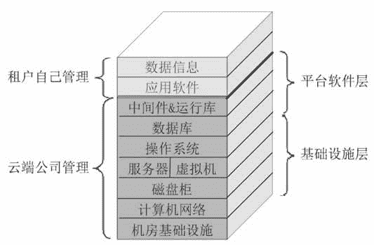
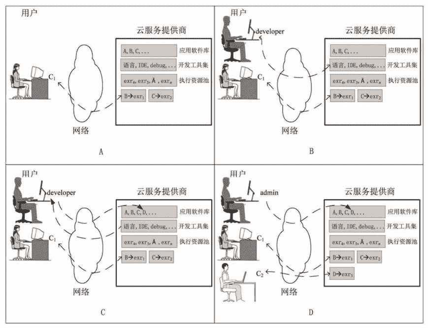

# 云计算 PaaS 服务模式精讲

> 原文：[`c.biancheng.net/view/3791.html`](http://c.biancheng.net/view/3791.html)

PaaS 是“Platform as a Service”的首字母缩写，意为平台即服务，即把 IT 系统的平台软件层作为服务出租出去，如图 1 所示。
图 1  PaaS 云
相比于 IaaS 云服务提供商，PaaS 云服务提供商要做的事情增加了，他们需要准备机房、布好网络、购买设备、安装操作系统、数据库和中间件，即把基础设施层和平台软件层都搭建好，然后在平台软件层上划分“小块”（习惯称之为容器）并对外出租。

PaaS 云服务提供商也可以从其他 IaaS 云服务提供商那里租赁计算资源，然后自己部署平台软件层。另外，为了让消费者能直接在云端开发调试程序，PaaS 云服务提供商还得安装各种开发调试工具。相反，租户要做的事情相比 IaaS 要少很多，租户只要开发和调试软件或者安装、配置和使用应用软件即可。PaaS 云服务的消费者主要包括以下人员。

*   程序开发人员：写代码、编译、调试、运行、部署、代码版本控制等，一揽子解决。
*   程序测试人员。
*   软件部署人员：把软件部署到 PaaS 云端，便于管理不同版本之间的冲突。
*   应用软件管理员：便于配置、调优和监视程序运行性能。
*   应用程序最终用户：这时 PaaS 云服务相当于 SaaS 云服务。

PaaS 云服务的费用计算一般根据租户中的用户数量、用户类型（如开发员、最终用户等）、资源消耗量及租期等因素计算。图 2 所示描绘了 PaaS 云服务供/需双方的动态交互情况。
图 2  PaaS 云服务供/需双方动态交互示意图
云服务提供商拥有一个应用软件库（图 1 中“A，B，C，…”代表库中的应用软件）、开发工具集（如编程语言、IDE、调试工具等）和软件执行资源池（图 1 中“exr1，exr2，…”代表资源），消费者通过网络远程租赁软件执行资源并运行相关的应用软件，或者使用各种开发工具。

软件执行资源有“可用”和“占用”两个状态，同一个资源不能同时运行多个程序。软件执行资源可能是物理机、虚拟机、容器或者一个正在运行的服务程序（响应消费者的请求，启动虚拟机或容器，甚至是租赁其他云端的计算资源）。

图 2A 中，用户 C1 申请了两个资源：exr1 和 exr2，并运行 B、C 两个程序。

图 2B 中，新来了一个程序开发员，他正在使用开发工具开发程序。

图 2C 中，程序开发员开发完成并部署了一个新程序 D。

图 2D 中，一个管理员发布了程序 D，然后新来的用户申请资源 exr3 并执行程序 D。

PaaS 云服务供/需交互还有很多情景，这里不再一一列出。

比如我们要安装和使用 OpenERP 软件，这个应用软件要用到 PostgreSQL 数据库和 Python 语言，那么只需要租赁一个 PaaS 型容器并在里面安装 OpenERP 即可，但这个容器必须支持 PostgreSQL 数据库和 Python 语言，让租户无须再去安装和配置它们。

同样，我们可以租赁一个支持 PHP 语言和 MySQL 数据库的 PaaS 容器，然后采用 WordPress 开源建站工具，只需几步，就可以搭建一个个人博客网站。应用软件数不胜数，支撑它们的语言、数据库、中间件和运行库可能都不一样。

PaaS 云服务提供商不可能安装全部的语言、数据库、中间件和运行库来支持所有的应用软件，因此目前普遍的做法是安装主流的语言、数据库、中间件和运行库，使得出租的 PaaS 容器支持有限的、使用量排名靠前的应用软件以及支持最流行的编程语言，并在网站上发布公告。当然，云服务提供商也鼓励租户直接开发支持 PaaS 的应用软件，每家云服务提供商都想尽可能地黏住更多的用户，这无可厚非。

不知道你有没有遭遇过这样的痛苦：企图安装一个要用的软件，结果报“没有找到 XXX 中间件”的错误，于是急忙找来相关资料安装需要的中间件，但又报错：“此中间件需要 YYY 数据库的支持”，那么只好安装数据库，却再次报错：“此数据库需要 ZZZ 运行库”，于是又去安装相应的运行库，但报错又出现了……最后你怒了：我不用这个应用软件总可以了吧？但你的计算机中已经安装了一大堆用不上的软件，硬盘快满了，于是又不得不去一个一个地卸载，卸载时又不断跳出调查表，询问你卸载的原因：是软件不够好吗？是售后服务跟不上吗？影响计算机速度吗……安装过 Linux 操作系统的人估计都会有这样的痛苦经历。

PaaS 的优势就是解决应用软件依赖的运行环境（如中间件、数据库、运行库等），其所依赖的软件全部由云服务提供商安装，所以当租户安装应用软件时，就不会再出现连续报错的情况。应用软件就像歌唱家，当其唱歌表演时需要一个舞台，这个舞台就是由基础设施层和平台软件层堆叠起来的。

前面讲过，平台软件层包括操作系统、数据库、中间件和运行库四部分，但并不是说在具体搭建平台软件层时一定要安装和配置这四部分软件，需要哪部分以及安装什么种类的平台软件要根据应用软件来定。比如一家只针对 PHP 语言开发（应用软件用 PHP 编写）的 PaaS 云服务提供商，就没必要安装类似 Tomcat 的中间件了。根据平台软件层中安装的软件种类多少，PaaS 又分为两种类型。

#### 1）半平台 PaaS

平台软件层中只安装了操作系统，其他的留给租户自己解决。最为流行的半平台 PaaS 应用是开启操作系统的多用户模式，为每个租户创建一个系统账号，并对他们做权限控制和计算资源配额管制。半平台 PaaS 更关注租户的类型，如研发型、文秘型等，针对不同类型的租户做不同的权限和资源配置。

Linux 操作系统的多用户模式和 Windows 操作系统的终端服务都属于半平台 PaaS，私有办公云多采用半平台 PaaS。

#### 2）全平台 PaaS

全平台 PaaS 安装了应用软件依赖的全部平台软件（操作系统、数据库、中间件、运行库）。不同于半平台 PaaS，全平台 PaaS 是针对应用软件来做资源配额和权限控制的，尽管最终还需要通过账号实现。公共云多采用全平台 PaaS。

相对于 IaaS 云服务，PaaS 云服务消费者的灵活性降低了，租户不能自己安装平台软件，只能在有限的范围内选择。但优点也很明显，租户从高深烦琐的 IT 技术中解放出来，专注于应用和自己的核心业务。

下面是一些 PaaS 云服务的实际应用。

1.  商业智能（BI）：用于创建仪表盘、报表系统、数据分析等应用程序的平台。
2.  数据库：提供关系型数据库或者非关系型数据库服务。
3.  开发和测试平台。
4.  软件集成平台。
5.  应用软件部署：提供应用软件部署的依赖环境。