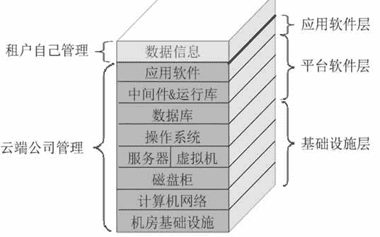
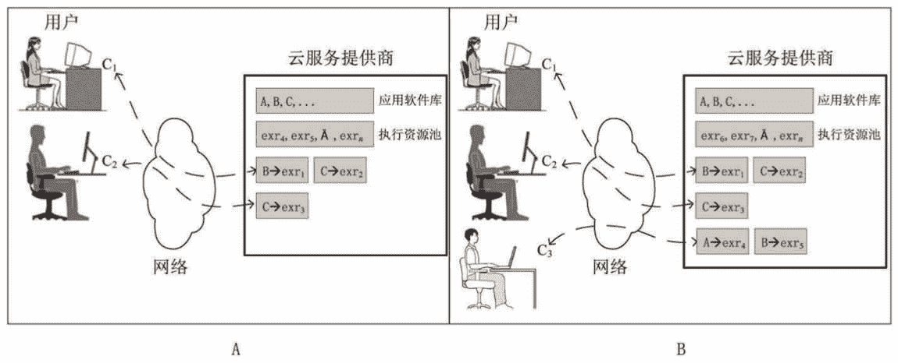
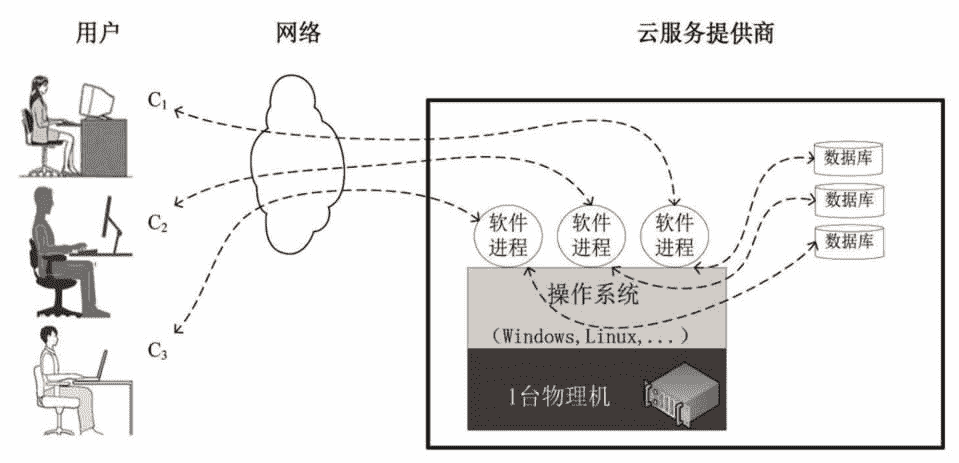
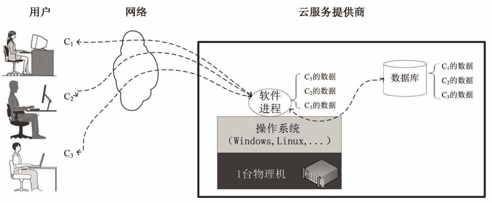

# 云计算 SaaS 服务模式精讲

> 原文：[`c.biancheng.net/view/3792.html`](http://c.biancheng.net/view/3792.html)

SaaS 是“Software as a Service”的首字母缩写，意为软件即服务。简言之，就是软件部署在云端，让用户通过因特网来使用它，即云服务提供商把 IT 系统的应用软件层作为服务出租出去，而消费者可以使用任何云终端设备接入计算机网络，然后通过网页浏览器或者编程接口使用云端的软件。这进一步降低了租户的技术门槛，应用软件也无须自己安装了，而是直接使用软件，如图 1 所示。

图 1  SaaS 云 SaaS 云服务提供商这时有 3 种选择：

1.  租用别人的 IaaS 云服务，自己再搭建和管理平台软件层和应用软件层。
2.  租用别人的 PaaS 云服务，自己再部署和管理应用软件层。
3.  自己搭建和管理基础设施层、平台软件层和应用软件层。

总之，从云服务消费者的角度来看，SaaS 云服务提供商负责 IT 系统的底三层（基础设施层、平台软件层和应用软件层），也就是整个 T 层，最后直接把应用软件出租出去。图 2 所示是 SaaS 云服务供/需双方的动态交互示意图。
图 2  SaaS 云服务供/需双方动态交互示意图
云服务提供商拥有一个应用软件库（图 2 中“A，B，C，…”代表库中的应用软件）和应用软件执行资源池（图 2 中“exr1，exr2，…”代表资源），消费者通过网络远程租赁软件执行资源并运行相关的应用软件。

在图 2A 中，有两个用户正在使用云端的软件，其中用户 C1 运行两个程序 B 和 C，云端为该用户分配了 exr1 和 exr2 两个执行资源，exr1 执行资源用于执行 B 应用程序（图 2 中用“B（exr1”表示），exr2 执行资源用于执行 C 应用程序（图 2 中用“C（exr2”表示）。而用户 C2 正在执行一个程序 C（图 2 中用“C（exr3”表示）。

在图 2B 中，一个新用户 C3 进来了，云端从可用的执行资源池中为他分配了 exr4 和 exr5 两个执行资源，分别执行 A 和 B 应用程序，而执行资源池中可用的资源数减少了两个。

云服务提供商选择若干种使用面广且有利可图的应用软件，如 ERP（企业资源计划）、CRM（客户关系管理）、BI（商业智能）等，并精心安装和运维，让租户用得放心、安心。

## 适合做 SaaS 的应用软件有的几个特点

#### **1）复杂**

软件庞大、安装复杂、使用复杂、运维复杂，单独购买价格昂贵，如 ERP、CRM 系统及可靠性工程软件等。

#### **2）主要面向企业用户**

#### **3）模块化结构**

按功能划分成模块，租户需要什么功能就租赁什么模块，也便于按模块计费，如 ERP 系统划分为订单、采购、库存、生产、财物等模块。

#### **4）多租户**

能适合多个企业中的多个用户同时操作，也就是说，使用同一个软件的租户之间互不干扰。租户一般指单位组织，一个租户包含多个用户。

#### **5）多币种、多语言、多时区支持**

这一点对于公共云尤其明显，因为其消费者来自五湖四海。

#### **6）非强交互性软件**

如果网络延时过大，那么强交互性软件作为 SaaS 对外出租就不太合适，会大大降低用户的体验度，除非改造成弱交互性软件或者批量输入/输出软件。

如微软的 Office 365 和谷歌的在线办公等——通过浏览器运行远程 SaaS 办公软件，本质上就是 I/O 本地化，而浏览器与云端之间批量化传输（单击“保存”按钮或者浏览器定时保存）。

软件的云化就是对传统应用软件进行改造，使之满足（3）、（4）、（5）三个特点。

这里要着重介绍一下特点“（4）多租户”，即允许多个租户同时使用软件而互不影响，因此多租户的第一个要求就是软件支持多个用户登录，用户一般为非系统管理账户（如不是操作系统用户或者数据库用户），且保存在数据库的业务表中。

在《软件的概念》教程中已经讲过，软件就是由程序员写的让 CPU 来完成某项任务的步骤，包括输入/输出步骤和计算步骤，只有输入/输出步骤与多租户的特点相关。

如张三的输入/输出就是张三的，绝对不允许“窜”到李四那边去，反之亦然。这里重点关注的是硬盘文件作为输入/输出设备的情景，因此多租户的第二个要求就是用户身份信息必须作为数据记录的检索字段之一，这样用户之间的数据才可以实现隔离。

数据记录包括软件的配置信息和业务数据，配置信息指租户选择的语言、设置的时区、指定的币种、定义的面板参数等；而业务数据就是日常业务处理产生的数据，一般保存在数据库中，而数据库保存在云端的存储中。在具体设计隔离方案时，需要综合考虑隔离效果和资源使用效率，如图 3 和图 4 所示，更详细的租户隔离内容参见后面的章节。
图 3  注重隔离效果 
图 4  注重资源使用效率

## 适合云化并以 SaaS 模式交付给用户的软件

#### 1）企事业单位的业务处理类软件

这类软件一般被单位组织用来处理提供商、员工、投资者和客户相关的业务，如开具发票、资金转账、库存管理及客户关系管理等。

#### **2）协同工作类软件**

这类软件用于团队人员一起工作，团队成员可能都是单位组织内部的员工，也可能包含外部的人员。例如日历系统、邮件系统、屏幕分享工具、协作文档创作、会议管理及在线游戏。

#### **3）办公类软件**

这类软件用于提高办公效率，如文字处理、制表、幻灯片编辑与播放工具，以及数据库程序等。基于 SaaS 云服务的办公软件具备协同的特征，便于分享，这是传统的本地化办公软件所没有的。

#### **4）软件工具类**

这类软件用来解决安全性或兼容性问题，以及在线软件开发，如文档转换工具、安全扫描和分析工具、合规性检查工具及线上网页开发等。

随着因特网进一步延伸到世界各地，带宽和网速进一步改善，以及云服务提供商通过近距离部署分支云端，从而进一步降低网络延时，可以预计，能够云化的软件种类将越来越多。但是无论如何，下面三类软件不适合作为公共 SaaS 云服务出租。

## 不适合作为公共 SaaS 云服务出租的软件

#### **1）实时处理软件**

比如飞行控制系统、工厂作业机器人控制等，这类软件要求任务完成时间非常精准（甚至达到微秒级）。假如云化，单单横亘在 SaaS 云端与消费者之间的网络延时就是一个难以承受的不可控因素，更不要说其他因素了。

#### **2）时时产生并处理大量消费者数据的软件**

诸如视频监控、环境信息收集处理等时时产生并要处理大规模的数据信息（可能每秒达 GB 级）的软件，在目前和未来几年内的因特网宽带条件下，不适合云化，因为如此大规模的数据很难实时传输到 SaaS 云端进行处理。

#### **3）关键软件**

这类软件如果运行异常，将会导致人员伤亡或者重大财产损失。为了提高这类软件的可靠性，最主要的方法是降低软件的复杂度——软件本身的复杂度和运行环境的复杂度，因为越简单就越可靠。而 SaaS 云服务环境包含着复杂的软/硬件栈（9 层的 IT 系统），以及不可预测的网络带宽、延时、丢包因素，绝对不合适云化此类关键软件并以公共 SaaS 云服务模式交付给用户使用。

针对私有云或者社区云，如果云端就在本地，且消费者通过局域网接入云端，那么上面三类软件也可以 SaaS 模式部署。

**4\. 与传统的软件运行模式相比，SaaS 模式具有的优点：**

#### **1）云终端少量安装或不用安装软件**

直接通过浏览器访问云端 SaaS 软件，非常方便且具备很好的交互体验，消费者使用的终端设备上无须额外安装客户端软件。

配置信息和业务数据没有存放在云终端里，所以不管用户何时何地使用何种终端操作云端的软件，都能看到一样的软件配置偏好和一致的业务数据。云终端成了无状态设备。

#### **2）有效使用软件许可证**

软件许可证费用能大幅度降低，因为用户只用一个许可证就可以在不同的时间登录不同的计算机；而在非 SaaS 模式下，必须为不同的计算机购买不同的许可证（即使计算机没被使用）——过度配置许可证现象。

另外，专门为保护软件产权而购置的证书管理服务器也不用买了，因为在 SaaS 模式下，软件只运行在云端，软件开发公司只跟云服务提供商打交道并进行软件买卖结算即可。

#### **3）数据安全性得到提高**

对于公共云和云端托管别处的其他云来说，意味着 SaaS 型软件操纵的数据信息存储在云端的服务器中，云服务提供商也许把数据打散并把多份数据副本存储在多个服务器中，以便提高数据的完整性，但是从消费者的视角看，数据被集中存放和管理。

以上那么做有一个明显的好处，那就是云服务提供商能提供专家管理团队和专业级的管理技术和设备，如合规性检查、安全扫描、异地备份和灾难恢复，甚至是建立跨城市双活数据中心。当今大的云服务提供商能够使数据安全性和应用软件可用性达到 4 个“9”的级别。

对于云端就在本地的私有云和社区云来说，好处类似于公共云，但是抗风险能力要差一些，除非对大的意外事件提前做好预案，如为应对天灾（地震、洪水等）人祸（火灾等），建立异地灾备中心。另外，无处不在的网络接入，使人们再也不用复制数据并随身携带，从而避免数据介质丢失或者被盗。数据集中存放和管理还有利于人们分享数据信息。

#### **4）有利于消费者摆脱 IT 运维的技术泥潭而专注于自己的核心业务**

SaaS 云服务消费者只要租赁软件即可，而无须担心底层（基础设施层、平台软件层和应用软件层）的管理和运维。

#### **5）消费者能节约大量前期投资**

消费者不用装修机房，不用建设计算机网络，不用购买服务器，也不用购买和安装各种操作系统和应用软件，这样就能节省成百上千万元的资金。

众所周知，在非云计算模式下，这些巨额的前期投资在一到两年的时间内是不会产生任何效益的，因为一个中等规模的 IT 系统建设工期就要几年的时间——包括机房选址和装修，网络设备采购和综合布线，机器设备采购、安装和调试，软件部署、测试和转产上线等。

但是 SaaS 云服务也给人们带来了新的挑战，如完全依赖网络、跨因特网对安全防范措施要求更高、云端之间的数据移植性不够好、租户隔离和资源使用效率二者之间需要综合平衡考虑（详见教程后面章节“租户隔离”的相关内容）等。

## SaaS 云服务的实际应用

#### 1）电子邮件和在线办公软件

用于处理邮件、文字排版、电子表格和演示文档的应用软件，如谷歌邮箱（http：//mail.google.com）、网易邮箱（http：//mail.163.com/）、微软 Office 365 在线办公、谷歌在线文档（https：//docs.google.com）等。

#### 2）计费开票软件

用于处理客户有关使用和订阅产品及服务所产生的账单。

#### 3）客户关系管理系统（CRM）

功能涵盖从客户呼叫中心到销售自动化的各种应用程序。

#### 4）协作工具

这种软件能促进企业内部或者跨企业的团队中的成员协同合作。

#### 5）内容管理系统（CMS）

用于管理数字内容，包括文本、图形图像、Web 页面、业务文档、数据库表单、视频、声音、XML 文件等，引入版本控制、权限管理、生命周期等。

#### 6）财务软件。

#### 7）人力资源管理系统。

#### 8）销售工具。

#### 9）社交网络：如微信、WhatsApp、LINE 等。

#### 10）企业资源计划（ERP）。

#### 11）谷歌在线翻译。