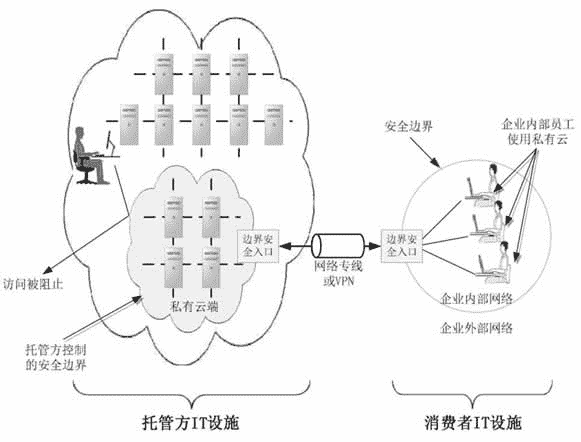
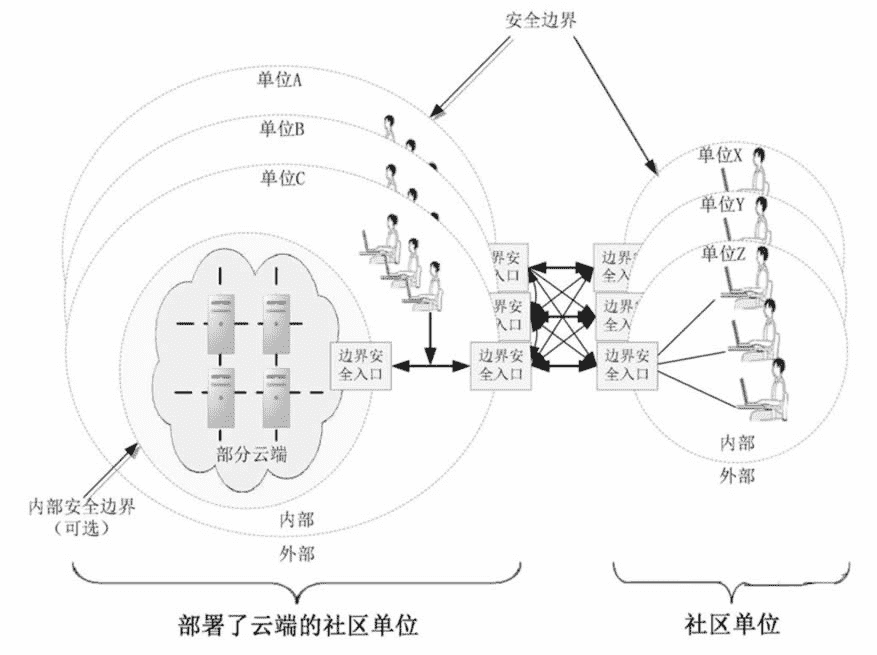
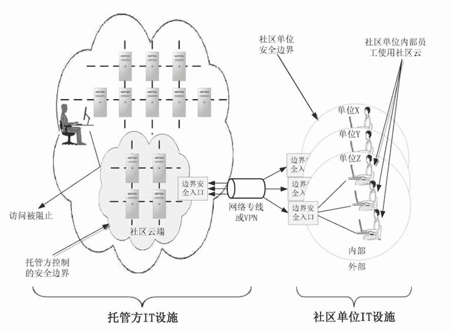
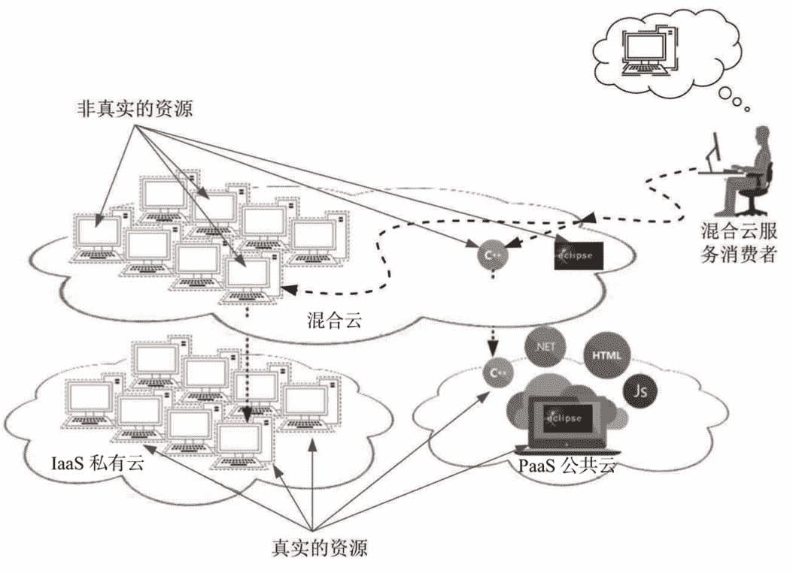
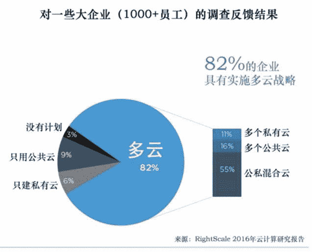

# 私有云、社区云、公共云和混合云：云计算的 4 种部署模型

> 原文：[`c.biancheng.net/view/3795.html`](http://c.biancheng.net/view/3795.html)

云计算有 4 种部署模型，分别是私有云、社区云、公共云和混合云，这是根据云计算服务的消费者来源划分的，即：

*   如果一个云端的所有消费者只来自一个特定的单位组织（如微算科技公司），那么就是私有云。
*   如果一个云端的所有消费者来自两个或两个以上特定的单位组织，那么就是社区云。
*   如果一个云端的所有消费者来自社会公众，那么就是公共云。
*   如果一个云端的资源来自两个或两个以上的云，那么就是混合云。

目前绝大多数混合云由企事业单位主导，以私有云为主体，并融合部分公共云资源，也就是说，混合云的消费者主要来自一个或几个特定的单位组织。

## 私有云

私有云的核心特征是云端资源只供一个企事业单位内的员工使用，其他的人和机构都无权租赁并使用云端计算资源。至于云端部署何处、所有权归谁、由谁负责日常管理，并没有严格的规定。

#### 云端部署何处

这有两个可能，一是部署在单位内部（如机房），称为本地私有云；二是托管在别处（如阿里云端），称为托管私有云。本地私有云如图 1 所示。
图 1  本地私有云
由于本地私有云的云端部署在企业内部，私有云的安全及网络安全边界定义都由企业自己实现并管理，一切由企业掌控，所以本地私有云适合运行企业中关键的应用。

托管私有云是把云端托管在第三方机房或者其他云端，计算设备可以自己购买，也可以租用第三方云端的计算资源，消费者所在的企业一般通过专线与托管的云端建立连接，或者利用叠加网络技术在因特网上建立安全通道（VPN），以便降低专线费用，如图 2 所示。
图 2  托管私有云
托管私有云由于云端托管在公司之外，企业自身不能完全控制其安全性，所以要与信誉好、资金雄厚的托管方合作，这样的托管方抵御天灾人祸的能力更强。

#### 云端所有权归谁

这存在两种可能，一种是归企业自身所有；另一种是归他人所有，企业租用。绝大多数本地私有云属于第一种情况，而对于托管私有云来说，租赁计算设备更具成本优势，云端规模伸缩也更自如。

#### 云端由谁负责日常管理

一个云端的日常管理包括：管理、运维和操作。管理是指制定规章制度、合规性监督、定期安全检查、灾难演练、数据恢复演练、SLA 制订与落地检查等，侧重于制度和人员层面。运维指日常运行维护，具体包括机器性能监控、应用监控、性能调优、故障发现与处理、建立问题库、问题热线坐席、定期输出运维报告、产能扩容与收缩、应用转产与退出等，侧重于设备层面。

云端的操作不是指云服务消费者的操作，而是指云端的例行日常工作，包括数据备份、服务热线坐席、日常卫生、与消费者的一些操作互动等。云端的日常管理可以完全由自己承担，也可以完全外包出去或者部分外包出去。

私有云的规模可大可小，小的可能只有几个或者十几个用户，大的会有数万个甚至十几万个用户，但是过小的私有云不具备成本优势且计算资源配置的灵活性体现不出来，比如家庭和小微型企业，直接采用虚拟化即可，技术简单、管理方便。就像智能照明系统不适合三口之家的小居室一样，因为只有几盏灯、几个开关，手动操作简单、方便，成本也低。

企业私有办公云现在被很多大中型单位组织采用，用云终端替换传统的办公计算机，程序和数据全部放在云端，并为每个员工创建一个登录云端的账号，账号和员工一一对应，相比传统的计算机办公有如下好处：

*   员工可在任何云终端登录并办公，可实现移动办公。
*   有利于保护公司文档资料。
*   维护方便。终端是纯硬件，不用维护，只要维护好云端即可。
*   降低成本。购买费用低，使用成本低，终端使用寿命长，软件许可证费用降低。
*   稳定性高。对云端集中监控和布防，更容易监控病毒、流氓软件和黑客入侵。

## 社区云

社区云的核心特征是云端资源只给两个或者两个以上的特定单位组织内的员工使用，除此之外的人和机构都无权租赁和使用云端计算资源。参与社区云的单位组织具有共同的要求，如云服务模式、安全级别等。具备业务相关性或者隶属关系的单位组织建设社区云的可能性更大一些，因为一方面能降低各自的费用，另一方面能共享信息。

比如，深圳地区的酒店联盟组建酒店社区云，以满足数字化客房建设和酒店结算的需要；又比如，由一家大型企业牵头，与其提供商共同组建社区云；再比如，由卫生部牵头，联合各家医院组建区域医疗社区云，各家医院通过社区云共享病例和各种检测化验数据，这能极大地降低患者的就医费用。

与私有云类似，社区云的云端也有两种部署方法，即本地部署和托管部署。由于存在多个单位组织，所以本地部署存在三种情况：

*   只部署在一个单位组织内部；
*   部署在部分单位组织内部；
*   部署在全部单位组织内部。

如果云端部署在多个单位组织，那么每个单位组织只部署云端的一部分，或者做灾备，如图 3 所示。

图 3  本地社区云
当云端分散在多个单位组织时，社区云的访问策略就变得很复杂。如果社区云有 N 个单位组织，那么对于一个部署了云端的单位组织来说，就存在 N-1 个其他单位组织如何共享本地云资源的问题。换言之，就是如何控制资源的访问权限问题，常用的解决办法有“用户通过诸如 XACML 标准自主访问控制”、“遵循诸如‘基于角色的访问控制’安全模型”、“基于属性访问控制”等。

除此之外，还必须统一用户身份管理，解决用户能否登录云端的问题。其实，以上两个问题就是常见的权限控制和身份验证问题，是大多数应用系统都会面临的问题。

托管社区云的示意图如图 4 所示。
图 4  托管社区云
类似于托管私有云，托管社区云也是把云端部署到第三方，只不过用户来自多个单位组织，所以托管方还必须制订切实可行的共享策略。

## 公共云

公共云的核心特征是云端资源面向社会大众开放，符合条件的任何个人或者单位组织都可以租赁并使用云端资源。公共云的管理比私有云的管理要复杂得多，尤其是安全防范，要求更高。

公共云的一些例子：深圳超算中心、亚马逊、微软的 Azure、阿里云等。

## 混合云

混合云是由两个或两个以上不同类型的云（私有云、社区云、公共云）组成的，它其实不是一种特定类型的单个云，其对外呈现出来的计算资源来自两个或两个以上的云，只不过增加了一个混合云管理层。云服务消费者通过混合云管理层租赁和使用资源，感觉就像在使用同一个云端的资源，其实内部被混合云管理层路由到真实的云端了，示意图如图 5 所示。

图 5  混合云
在图 5 中，假如用户在混合云上租赁了一台虚拟机（IaaS 型资源）及开发工具（PaaS 型资源），那么用户每次都是连接混合云端，并使用其中的资源。用户并不知道自己的虚拟机实际上位于另一个 IaaS 私有云端，而开发工具又在另一个公共云上。

由于私有云和社区云具有本地和托管两种类型，再加上公共云，共有 5 种类型，所以混合云的组合方式就有很多种形式了，如图 6 所示。

图 6  混合云的组合方式
混合云属于多云这个大类，是多云大类中最主要的形式，而公/私混合云又是混合云中最主要的形式，因为它同时具备了公共云的资源规模和私有云的安全特征。从图 7 中可以看出（https：//www.rightscale.com/），私有云和公共云构成的混合云占比达到 55%。下面将围绕这种形式的混合云来展开阐述。

图 7  Rightscale 公司给出的 2016 年报告

#### 公/私混合云的优势

1.  架构更灵活：可以根据负载的重要性灵活分配最适合的资源，例如将内部重要数据保存在本地云端，而把非机密功能移动到公共云区域。
2.  技术方面更容易掌控。
3.  更安全：具备私有云的保密性，同时具有公共云的抗灾性（在公共云上建立虚拟的应急灾备中心或者静态数据备份点）。
4.  更容易满足合规性要求：云计算审计员对多租户的审查比较严格，他们往往要求云计算服务提供商必须为云端的某些（或者全部）基础设施提供专门的解决方案。而这种混合云由于融合了专门的硬件设备，提高了网络安全性，更容易通过审计员的合规性检查。
5.  更低的费用：租用第三方资源来平抑短时间内的季节性资源需求峰值，相比自己配置最大化资源以满足需求峰值的成本，这种短暂租赁的费用要低得多，如图 8 所示。

图 8  平抑季节性资源需求峰值

#### 公/私混合云的构成

1.  私有云：这是混合云的主要组成部分，企业部署混合云的步骤一般是先“私”后“公”。
2.  公共云。
3.  公/私云之间的网络连接：一般为公共云提供商提供的高速专线，或者是第三方的 VPN。
4.  混合云管理平台：是用户的统一接入点，实现资源的自动化、费用结算、报表生成、云端日常操作及 API 调用等，可以进一步细化为数据管理、虚机管理、应用管理等几个层面的软件。目前混合云管理平台产品有 VMware vRealize、Microsoft System Center、RightScale 等。

#### 公/私混合云的功能

混合云可以做多个层面的事情，基本可以分为数据层面和业务负载层面。在这两个层面，有一些典型的应用场景，具体如下。

1.  数据备份：将私有云的数据备份到更便宜和可靠的公共云上。
2.  灾备：在私有云出现故障时，由公共云上的灾备环境提供服务。
3.  负载延伸：当私有云无法提供新增负载所需要的资源时，在公共云上创建虚拟主机来支持新的负载，当负载下降后再删除这些虚拟主机回到纯私有云。
4.  使用公共云作为开发测试云。