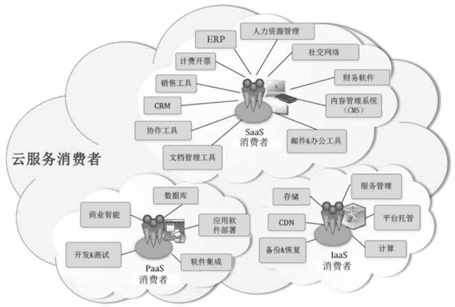

# 用户如何使用云服务产品？

> 原文：[`c.biancheng.net/view/3828.html`](http://c.biancheng.net/view/3828.html)

云服务消费者（用户）从云服务提供商或者云服务代理商那里租赁云服务产品，在合同期内和云服务提供商保持一种供/需业务关系。

首先准消费者浏览云服务提供商的官方网站，在云服务分类中找到能够满足自己需求的服务产品，然后和云服务提供商签订合同，最后按照合同条款使用云计算资源并付款。付款的方式有很多种，如按年、按季、按月付款及按次数付款等。

需要注意的是，云服务消费者应与云服务提供商仔细落实服务水平协议（SLAs）中的条款，这些条款涵盖服务质量、安全保障、应用中断的弥补措施等内容。

另外，云服务提供商可能在 SLAs 中列举针对所有用户的承诺条款以及云服务消费者必须接受的限制和义务条款。

通常一个云服务提供商的报价和 SLAs 条款是不可以讨价还价的，除非你是一个令他们心动的大客户，一般客户只有在货比三家后挑选信誉良好、财力技术雄厚、报价实惠、服务条款更具吸引力的云服务提供商。

不同云服务类型的消费者使用云服务产品的活动和流程也有所区别，如图 1 所示，描绘了不同类型的消费者可能使用到的云服务产品。
图 1  不同类型的消费者可能使用到的云服务产品
SaaS 型消费者通过网络访问云端的 SaaS 型应用程序。如果消费者是一个单位组织，那么它的内部成员才是真正的 SaaS 程序操作者，不过有的成员是使用软件的最终用户，有的成员是为最终用户配置软件的管理员。SaaS 型消费者付款的计算因素包括最终用户数、使用时间的长短、消耗的网络带宽、存储的数据规模或者数据保存期限等。

PaaS 型消费者使用云端的工具和计算资源来开发、测试、部署和管理驻留于云中的应用程序，因此消费者的具体角色可能是程序开发员、软件测试工程师、应用程序部署人员或者应用程序管理员等。与 PaaS 型消费者付款有关的因素包括处理器消耗、网络带宽消耗、数据库存储规模及使用时间的长短等。

IaaS 型消费者使用云端的虚拟机、NAS 存储、网络设施及其他能部署和运行任何软件的基础计算资源，因此 IaaS 消费者一般为系统开发人员、系统管理员或者热衷于掌控基础设施的 IT 部经理。计费的因素包括虚拟机使用 CPU 的小时数、存储的数据规模和时间、消耗的网络带宽，以及申请的公网 IP 地址的数量等。