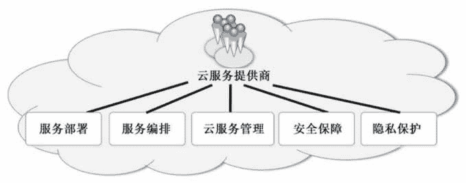
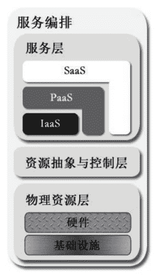
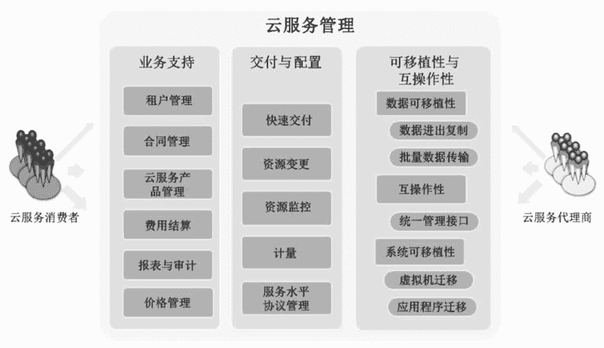
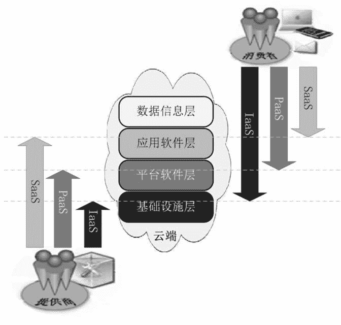

# 云服务提供商需要做什么？

> 原文：[`c.biancheng.net/view/3830.html`](http://c.biancheng.net/view/3830.html)

云服务提供商是个人或者单位组织，他们负责搭建云端并对外提供云服务产品。支撑云服务的 IT 层可以由云服务提供商自己组建，也可以租赁其他人的云服务。比如，一个云服务提供商租赁其他人的虚拟机（IaaS 云服务），并在此虚拟机上部署 PaaS 云服务，然后再出租出去。

云服务提供商的五大任务包括服务部署、服务编排、云服务管理、安全保障和隐私保护，如图 1 所示。
图 1  云服务提供商的五大任务
其中，服务部署任务可参考《云计算的 4 种部署模型》部分，下面重点介绍其余四大任务。

## 服务编排

服务编排是指把各种系统组件合理地整合在一起，以便向云服务消费者提供云服务产品。

图 2 所示是从参考模型中单独截取出来的云服务编排模型，全部的系统组件分为 3 种类型，分别对应云服务编排模型中的 3 个叠加层，从下至上依次是物理资源层、资源抽象与控制层、服务层。
图 2  从参考模型中单独截取的云服务编排模型
顶部的服务层定义了云服务消费者访问计算资源的接口（简称访问接口）——IaaS、PaaS 和 SaaS。

SaaS 应用程序可以（但不是必须）搭建在 PaaS 组件上，PaaS 组件可以（但不是必须）搭建在 IaaS 组件上，这三者层叠在一起是组合方式的一种。

另外，从图 2 中可以看出，PaaS 和 SaaS 存在直角的单腿直立部分，表明可以单独构建各自的底层架构，比如 SaaS 云服务直接部署在物理服务器上，而不层叠在 PaaS 和 IaaS 组件上。对于一个具体的云服务提供商而言，其可定义全部的（3 种）服务模式或者其中的一到两种。

中间层是资源抽象与控制层，包括两类系统组件：

#### 1）抽象组件

主要用于对物理计算资源进行虚拟化，虚拟化之后的资源就可以放入资源池中，以便将来供云服务消费者弹性租赁。抽象组件包括虚拟机管理平台（Hypervisor）、虚拟机软件（VM）、软件定义存储（SDS）、软件定义网络（SDN）等，其中虚拟机技术是最常见的资源抽象组件。无论如何，抽象组件必须能确保高效、安全和可靠地运用底层的物理资源。

#### 2）控制组件

主要负责资源分配、访问控制和监控资源使用等。总之，本层的主要功能是把物理资源池化并有效管理被池化后的资源。

底层是物理资源层，包含所有的物理计算资源——物理服务器（主要包含 CPU、内存计算资源）、网络设备（路由器、防火墙、交换机、网卡等）、存储设备（如硬盘、存储阵列），以及其他物理的计算设施；也包含基础设施资源，如加热器、空调、通风设备、供电设备等。

三层叠加在一起，上层依赖直接下层。资源抽象与控制层利用下层的物理资源，向上层暴露资源池，而顶部的服务层利用下层的资源池向云服务消费者暴露服务接口，而云服务消费者不能直接操纵底层的物理资源。

## 云服务管理

云服务管理是指云服务提供商必须履行的一套流程和任务，以便圆满地把云服务交付给消费者。这些流程和任务分为三大类：业务支持、交付与配置、可移植性与互操作性，具体如图 3 所示。
图 3  云服务管理

#### 1）业务支持

这是与客户有关的活动和服务，具体包括如下表所示。

| 名称 | 说明 |
| --- | --- |
| 租户管理 | 管理租户账号、激活/禁用/终止账号、管理用户资料、解决租户提出的问题、处理投诉等。 |
| 合同管理 | 管理服务合同、洽谈/签订/关闭/终止合同等。 |
| 云服务产品管理 | 建立和管理云服务产品目录，以便用户浏览和选择等。 |
| 费用结算 | 生成发票并送交客户，回收款项，尽量做到现收现付。 |
| 报表与审计 | 监视用户消耗资源状况，产生有关报表，履行事后监督和审计。 |
| 价格管理 | 给云服务产品建立价格点和价格分层，监视竞争对手的报价并及时调整产品价格以确保竞争力。云服务提供商通常会给大客户提供价格折扣或者信用消费（先消费后付款）。 |

#### 2）交付与配置

这是与资源有关的管理活动，具体包括如下表所示。

| 名称 | 说明 |
| --- | --- |
| 快速交付 | 能快速响应用户的弹性需求，最好是自动化响应。 |
| 资源变更 | 包括替换故障设备、升级设备、添加新设备，从而扩充资源容量，以及重新配置现有的设备。 |
| 资源监控 | 发现和监视虚拟资源，监视云端操作和事件，并且产生性能报表。 |
| 计量 | 定义付费的计量方法，比如根据某类资源（如存储、CPU、内存、网络带宽等）的使用量和时间长短计费，也有按照每使用一次计费的，还有的是较复杂的公式。 |
| 服务水平协议（SLA）管理 | 具体涵盖 SLA 定义、SLA 实施监督和 SLA 执行评价，目的是保证服务质量。 |

#### 3）可移植性与互操作性

云计算能节约成本，快速满足用户对资源的弹性需求，这使得一些潜在的云服务消费者有兴趣把计算迁入云端。然而，这些潜在的云服务消费者能否变成真实的云服务消费者，在很大程度上依赖于云服务提供者如何对待用户关心的安全、可移植性和互操作性问题。

关于可移植性，潜在的消费者非常想知道他们是否能够以较低的成本和最小的中断时间在多个云端之间迁移数据或应用程序。而对于互操作性，用户关心在两个或多个云端之间的互通能力。

为了便于用户进行数据移动、服务交互和系统迁移，云服务提供者应该提供一些有利机制（包括策略和工具），而不是故意设置障碍，以便黏住用户。

数据移动是指把数据复制到云端或从云端复制出来或者进行批量传输。

理想的服务交互能力是指用户能够通过统一的管理接口使用他们的横跨于多个云端的数据和服务。

系统迁移是指将一台完全关闭的虚拟机从一个云服务提供商的云端迁移到另一个云服务提供商的云端，或者在不同云服务提供商的云端之间迁移应用、服务和相应的内容。但是要特别注意的是，不同的云服务模式（IaaS、PaaS、SaaS）在可移植性和互操作性方面的侧重点不同。

例如，IaaS 模式侧重于迁移虚拟机并能在新的云端启动，因此，为了能迁移一台虚拟机镜像到另一个采用不同虚拟机技术的云端，必须移除云服务提供商加入到虚拟机镜像文件中的特有的扩展技术。如果这种扩展技术非常好且被广泛接受，那么云服务提供商应该公开这种技术细节，从而使得所有的 IaaS 云服务提供商都接受并把该技术融入自己的虚拟机镜像中。而 SaaS 侧重于数据可移植性方面，因此最好按照业界通行的标准进行数据抽取和备份，以便保证数据的可移植性。

## 安全保障

我们必须清晰地认识到安全性问题涉及云计算参考模型的各个方面，纵向上从最底层的基础设施到最顶层的应用，横向上包括全部的参与角色，如云服务提供商、云服务消费者、云服务代理商等。

基于云的系统仍然需要满足这些传统 IT 系统中的安全要求，如认证、授权、可用性、保密性、身份管理、完整性、审计、安全监控、事件响应及安全策略管理，对这些技术展开详细论述超出了本书的范围，下面着重讨论一下云计算特有的一些安全问题。

#### 1）3 种云服务模式蕴含的安全问题

云计算的 3 种服务模式 Iaas、PaaS 和 SaaS 为用户提供了不同类型的接入云端的接口，同时也不可避免地成为不怀好意者的攻击入口。因此，在设计和实施云计算的过程中，需要充分考虑这 3 种云服务模式的内部机制和各自侧重的安全性问题。

例如，人们通常使用网页浏览器通过因特网访问云端的 SaaS 应用，那么在考察 SaaS 的安全性时，就需要重点关注网页浏览器的安全性。而 IaaS 消费者一般是远程登录并使用云端的虚拟机，那么在设计 IaaS 云服务时，就要重点关注虚拟机软件的隔离效果，因为运行在同一台物理机上的虚拟机相互之间的隔离效果越好就越安全。

#### 2）4 种部署模型蕴含的安全问题

4 种部署模型也蕴含着安全问题，其中从租户的隔离程度来考察部署模型中的安全问题是一个不错的方法。

由于私有云只供一个单位组织内部的员工使用，所以在租户隔离方面就没有公共云那么重要。公共云上的租户来自五湖四海，身份复杂且不可预测，所以公共云上的租户必须严格隔离开来。

另一个观察部署模型所蕴含的安全问题的方法是采用安全边界（在《云计算的四种部署模型》节中介绍过），例如一个本地私有云的云端就不必再额外增加一道安全边界，因为云端本身就在消费者单位组织的网络安全边界之内，但是人们更倾向于给托管私有云的云端再建立一道安全防护边界。

#### 3）安全职责共担

由于云服务提供商和云服务消费者对于云端的计算资源栈具有不同的控制范围（见图 4），与传统 IT 系统完全由一家单位组织控制不同，云计算系统要求云服务提供商和云服务消费者在设计、建设、部署和操作云系统时必须通力合作，双方共同努力才能构建一个安全的云计算环境。我们必须仔细分析每一项安全控制措施，再结合具体的云服务模式，确认其最佳的责任方（云服务提供者或云服务消费者）。

比如对于 IaaS 云服务模式来说，具备初始系统权限的用户账户管理通常由 IaaS 云服务提供商负责，而部署在 IaaS 环境（如虚拟机）中的应用程序的账户管理则由云服务消费者负责。
图 4  云服务提供商和云服务消费者的控制范围

## 隐私保护

上一小节的“安全保障”涵盖了隐私保护的内容，但是在云计算时代，个人信息、操作行为和习惯都存储在云端或者在云端留下印迹，所以隐私保护的重要性是前所未有的，有必要单独拿出来讨论。

隐私是指关于个人或者单位组织本身的信息，信息的主体不愿意公开而且法律没有规定必须公开的信息。隐私包括个人信息（PI）和个人身份信息（PII），PII 描述了个体的静态信息，如姓名、年龄、性别、住址、电话等，而 PI 描述了与个体关联的周边信息，如家庭、存款、社会关系、行动路线、驾照号码等。

主体的身份不同，隐私的具体内容也不尽相同。比如，普通民众的个人财产是隐私，但是公务员的财产就不是隐私（法律规定必须公开）；再比如，企业的财务报表是隐私，但是上市企业的财务报表就不是隐私。

如果云服务提供商收集了消费者的身份信息或者操作行为和习惯模式，那么他们必须确保这些隐私信息能得到可靠保护，除消费者本人外，其他任何人都不能获取这些信息。对于全球性的或者跨国经营的云服务提供商来说，隐私保护的问题变得异常复杂，因为各国关于隐私保护的法律都不尽相同。