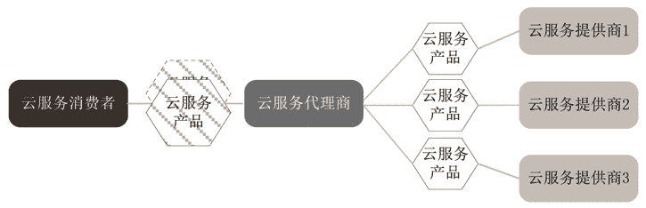

# 云服务审计员、云服务代理商和云服务承运商

> 原文：[`c.biancheng.net/view/3839.html`](http://c.biancheng.net/view/3839.html)

这一节我们主要来介绍一下云服务审计员、云服务代理商和云服务承运商。

## 云服务审计员

云计算审计员能对云计算利益相关者开展独立检查并发布评估结果，审计的核心任务就是通过对客观证据的审查来评估是否符合预设的标准。针对云服务提供商的审计主要包括安全审计、隐私保护审计和性能审计等。

#### 1）安全审计

云计算审计员评估云服务提供商是否具备足够的且准备妥当的安全控制措施以及是否严格遵守切实可行的安全流程。例如，云计算审计员审查云服务提供商是否遵守了 ISO 27001 安全标准。

#### 2）隐私保护审计

隐私保护审计主要检查云服务提供商是否保护了个人信息（PI）和个人身份信息（PII）。

#### 3）性能审计

云服务提供商必须满足在服务水平协议（SLA）中列举的服务质量（QoS）的要求，但是云服务消费者往往抱怨其利益受到损害，而云服务提供商也常常表示无辜，只有通过第三方独立开展性能审计才能消除供/需双方的分歧。

## 云服务代理商

随着云计算的不断发展，云服务公司提供的产品越来越多，如何整合这些产品以满足用户的需求也变得越来越复杂。例如，登录亚马逊官方网站，你会发现有上百种云服务产品，有的产品可以单独租赁，但有的需要整合其他产品才能发挥最佳效果。

所以，不少潜在云服务消费者宁愿把需求告诉给云服务代理商，由云服务代理商全权负责选购产品并做最佳的整合，也不愿耗费时间和精力直接跟众多的云服务提供商打交道。

云服务代理商管理云服务的使用、性能和交互，并且协调云服务供/需双方的关系。随着云服务市场的繁荣，可以预计，将来还会出现云服务一级代理、二级代理，甚至更多级代理的现象。

通常，云服务代理商的主要工作有以下三个方面。

#### 1）服务中介

云服务代理商处于云服务提供商和云服务消费者之间，他是云服务提供商的客户，又充当云服务消费者的云服务提供商。云服务代理商尽可能地改善一些云服务产品并给消费者提供增值服务，这些改善措施包括但不限于强化安全、完善性能报告、优化身份管理、做好本地化（语言、本地人的习惯、本地法律法规等）以及增强用户的交互体验等。示意图如图 1 所示。
图 1  服务中介

#### 2）服务聚合

云服务代理商把多个服务整合成一个或几个新的服务，以满足用户复杂的需求，同时提供数据集成，使得云服务消费者和多个云服务提供商之间的数据移动是安全的。示意图如图 2 所示。

#### 3）服务套利

“套利”意为快速买卖以赚取差价。这里的服务套利类似于服务聚合，但是被聚合的服务是不固定的，云服务代理商可随时在多个云服务提供商的产品中筛选最好的服务。比如，云服务代理商可以使用信用评分措施来衡量和挑选分数最高的云服务提供商。
图 2  服务聚合

## 云服务承运商

云服务承运商负责在云服务提供商和云服务消费者之间建立连接媒介，以便把云计算服务产品从云服务提供商那里转移到云服务消费者手中。

云服务的分发工作通常由网络和电信运营商或者专门的传输代理机构完成。传输代理机构是指提供诸如大容量磁盘这种物理的传输存储媒介的业务机构。为了保证服务质量，云服务提供商会和云服务承运商签订服务水平协议（SLA），还可能要求云服务承运商提供专线，以保证云服务供需双方的连接安全。