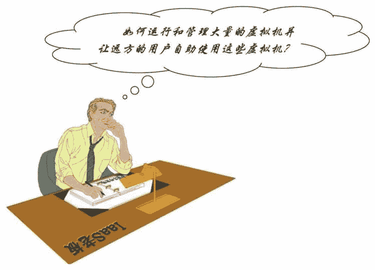
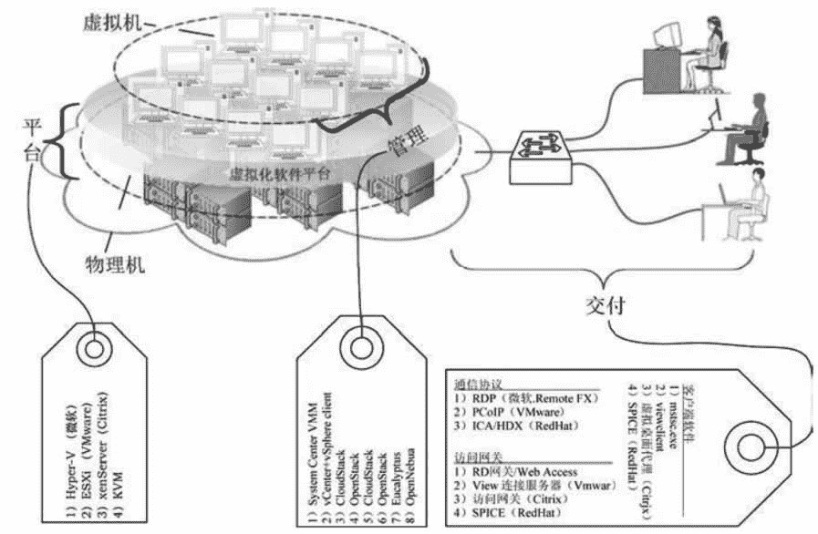

# 一套完整的云计算产品需要解决哪些问题？

> 原文：[`c.biancheng.net/view/3840.html`](http://c.biancheng.net/view/3840.html)

目前，最主要的云服务产品是 IaaS 虚拟机，一套完整的对外出租虚拟机的 IaaS 云计算解决方案必须解决下面这个问题：

如何运行和管理大量的虚拟机并让远方的用户自助使用这些虚拟机？问题中的三个动词“管理”、“运行”和“使用”意味着一个 IaaS 云计算系统包含以下三部分，如图 1 所示。
 图 1  IaaS 云计算解决方案
1）虚拟化平台（硬件、虚拟软件）——解决如何运行虚拟机的问题。

2）管理工具——解决如何管理大量虚拟机的问题，包括创建、启动、停止、备份、迁移虚拟机，以及计算资源的管理和分配。

3）交付部分——解决如何让远端的用户使用虚拟机的问题。

#### 1\. 虚拟化平台

虚拟化平台中的硬件部分主要指服务器、存储和网络。对于服务器，大的云计算提供商倾向于自己定制，这种针对特定应用定制的服务器具备更高的计算效率和更低的成本，因此目前的通用服务器硬件厂商面临很大的市场压力。

有一些云计算厂商推出云计算一体机，即把平台和管理两部分打包成一台服务器出售，用户购买这样的一体机后，可以直接向员工交付计算机桌面。

平台中的虚拟软件安装在物理机器或者操作系统上面，然后通过它创建若干个虚拟机并运行这些虚拟机。当然，虚拟机中还要安装操作系统，如 Windows 8、Linux 等。一个云端可能有很多台服务器，每台服务器上又有很多个虚拟机，那么如何管理这些虚拟机呢？这就是云管理平台的任务了。

#### 2\. 管理工具

管理工具就是一套软件，是用来管理云端的资源（服务器、存储、网络）和虚拟机的。虚拟机是资源申请的基本单位，因此管理平台的核心任务就是管理虚拟机，即进行创建、销毁、启动、关闭、资源分配、迁移、备份、克隆、快照及安全控制等操作。

这一点非常类似于传统操作系统的进程管理，所以有人说云管理工具就是云操作系统，即用来管理云端资源（计算、存储、网络），虚拟机是云端资源分配的主体，而传统的操作系统是用来管理计算机资源（CPU、内存、硬盘等）的，进程是计算机资源分配的主体。但是把云管理工具称作云操作系统不太恰当，称其为平台也勉勉强强，所以还是称其为虚拟机管理工具比较合适。

#### 3\. 交付部分

云计算的本质是计算与输入/输出分离，那么处于远方的云端资源如何交付给用户呢？换句话说就是，用户如何使用云端的计算资源（如电脑桌面），这是很关键的问题。

交付主要以下三部分组成：

*   通信协议
*   访问网关
*   客户端

#### 1）通信协议

通信协议就是规定终端与云端的通信规则，比如中国香港警匪片的警察用对讲机通话时，以“Over”作为本人说话的结束语，对方听到“OVER”后开始说话，这是一种最简单的通信协议。协议的好坏与终端用户的体验息息相关，也是最具技术含量的部分，目前也就三四家大企业才有能拿得出手的协议。

#### 2）访问网关

访问网关相当于云端的大门，终端用户必须由此“门”进入云端。

#### 3）客户端

客户端是指安装在云终端上的软件，专门负责与云端的通信——接收用户的输入并发到云端，然后接收云端的返回结果并显示在云终端屏幕上。一台云终端上可以安装多个不同公司发布的客户端，不同的客户端，一般通信协议也是不同的，这样的云终端具备接入多个由不同提供商运营的云端的能力。

比如笔者开发的云终端，既可以接入微软的 RDP 协议云端，也可以接入 VMware 的 PCoIP 协议云端，还可以接入 Citrix 的 HDX 协议云端，以及红帽的 SPICE 协议云端。

上面提到的是云计算系统的三个“主心骨”，实现了云计算的基本功能，但是在生产环境中，还必须满足性能和产能的要求，因此下面这些附加部分也是不可或缺的：负债均衡、故障转移、身份认证、权限控制、入侵检测等。

无论如何，云端本身还是一个 IT 系统，仍然遵循九层逻辑架构，每一层都由若干组件构成。下面对构成云端的各个组件做一个简单介绍，更详细的资料请浏览相应的官方网站。