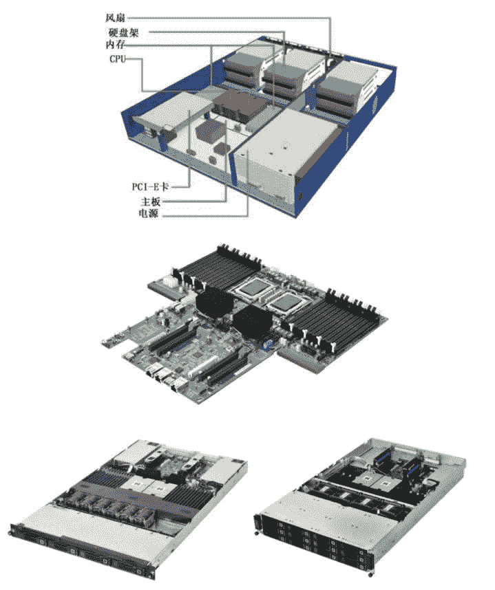
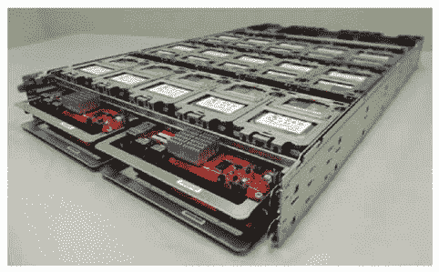

# OCP（开源计算项目）简介

> 原文：[`c.biancheng.net/view/3841.html`](http://c.biancheng.net/view/3841.html)

说起开源软件，大家应该多少都听过一些，就是软件源代码公开，任何人都可以下载和免费使用并遵循某种开源协议的软件。而开源计算项目（Open Compute Project，OCP）是一套开源硬件，它是由 Facebook 公司主导，众多 IT 巨头公司参与的针对数据中心定制的硬件设计规范，包括机房、机柜、服务器、存储、网络设备的定制设计规范，以及云端硬件的管理规范。

只要一个人有资金并且有时间，参考这些规范和购买相应的配件，也能单独做出非常可靠的东西（如设计合理的机房、服务器、交换机等）。可参考[开源计算项目的官方网站](https://www.opencompute.org/)。

开源计算项目针对的是 IT 架构的第一层——基础设施层，目前大型的云服务提供商或者社交网站热衷于定制自己数据中心的硬件，包括机柜、服务器、存储和网络设备。由于这种硬件是针对应用软件的特点定制的，所以计算效率非常高；完成相同的计算任务，相比其他硬件，能源消耗要低很多。云端硬件发展的另一个趋势是云设备提供商提供的云计算一体机（具体可参考《IT 系统组成》教程）。

开源计算项目中的主板和服务器设计规范包括针对 ARM、AMD、INTEL 的 CPU 的主板的设计规范，高可用性服务器、片上系统和电源的设计规范，同时提供了物理结构的 CAD 设计图纸。图 1 所示的主板和服务器是 PenguinComputing 公司根据这些规范生产的。
图 1  PenguinComputing 公司生产的主板和服务器
开源计算项目中的子项目“存储”，分别就冷存储、Fusion-io 等发布设计规范，图 2 所示的存储器就是参考此规范设计并生产的。

图 2  存储器
另外，也有一些开源存储软件的解决方案，比较有名的有 Openindiana、Nexentastor、FreeNAS、OpenFiler，性能也是依次降序排列的。当然，如果只是自己使用，那么建议采用 Oracle Solaris 11+Napp-It 的最佳方案，Oracle Solaris 11 可从 [https：//www.oracle.com/solaris/solaris11/index.html](https://www.oracle.com/solaris/solaris11/index.html) 下载，Napp-It 可从 [http：//www.napp-it.org/](http://www.napp-it.org/) 下载。这些解决方案的核心都采用了 ZFS 文件系统。

ZFS 文件系统最早是由 Sun 公司开发的，Oracle 公司收购 Sun 后，从 ZFS 2.8 版本之后就不再开源了，闭源的 ZFS 增加了不少新功能，如加密，但是有人在 ZFS 2.8 版本的基础上继续开发新功能，这样开源的代码就与正宗的 ZFS 代码分道扬镳了。

除这些专门的存储设备外，在云计算和大数据时代，分布式存储系统具备更大的优势，采用成百上千台甚至上万台计算机组成海量数据存储系统，拥有更高的带宽、更高的 IOPS 和更好的可用性，容量也具备更佳的伸缩性。例如 Ceph、Lustre、GlusterFS、pNFS、GPFS，都是一些优秀的企业级的开源分布式存储项目。