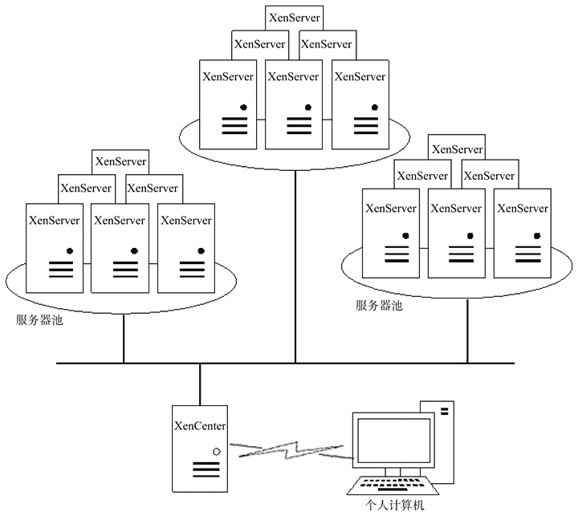
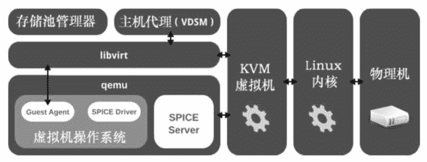
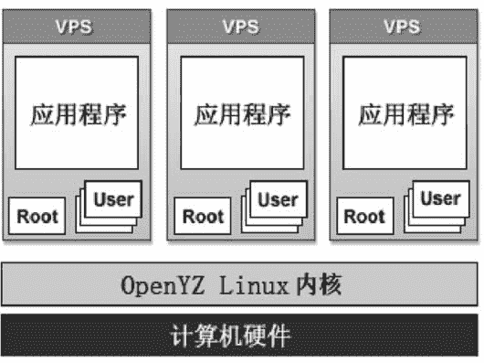
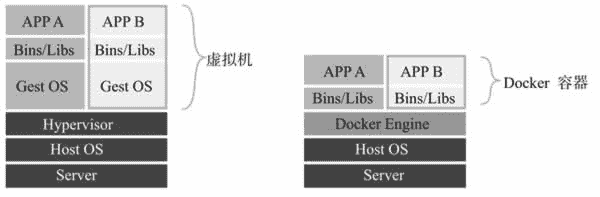

# 服务器虚拟化组件有哪些？

> 原文：[`c.biancheng.net/view/3842.html`](http://c.biancheng.net/view/3842.html)

在云端，虚拟化属于基础设施层，具体包括服务器虚拟化、网络虚拟化和存储虚拟化，虚拟的目的是为了池化物理资源。在服务器虚拟化领域，VMware（现已被 EMC 收购）已耕耘了很多年，把持了大部分的市场。后来者微软、思杰都想有所突破。

微软推出 Hyper-V 并在短时间内进行了版本快速更替，其与操作系统紧密捆绑、简单易用的特征，使得采用微软的云计算解决方案成为了最简洁的商业化方案。另外，微软拥有从操作系统到应用软件的全部产品线，再加上成千上万个基于 Windows 的第三方应用软件，微软具备很强的竞争优势。

思杰自从收购 XEN 并进军虚拟化市场以来，表现平平，于是被逼开源它的 XenServer 产品，使得 XEN 重新回到开源社区。另外，思杰还把云管理工具 CloudPlatform 卖掉，重回 OpenStack 社区。

在开源社区，美国的红帽公司一直也在尝试整合开源资源并形成自己的一整套云计算产品，其核心是已经并入 Linux 内核的 KVM 虚拟机。

开源社区中的另一个不容忽视的成员就是 Oracle VM，Oracle 公司有点怪，其总裁拉力·埃里森一方面讨厌开源软件，另一方面又离不开开源软件，比如他们推出的 Oracle Linux 采用 Linux 内核，推出的 Oracle VM 采用开源的 Xen。

红帽与微软类似，拥有从操作系统到应用软件的完整产品线，而且全部是开源的。云计算提供商都是技术性的公司，他们更倾向于采用开源的云计算解决方案，稳定、可靠、低成本注定了红帽公司在未来的云计算市场会有更大的作为。下面对开源的服务器虚拟化组件做简单介绍。

#### 1\. XenServer

XenServer 是基于 Xen 的虚拟平台，直接安装在物理的计算节点上，然后在上面创建更多的虚拟机。XenCenter 是云计算管理平台，通过它来管理众多的安装了 XenServer 的服务器（计算节点）、网络、存储及虚拟机。

XenCenter 把通过计算节点池来管理服务器，属于同一个池的服务器共享存储，而且最好是相同配置的机器，池里的虚拟机保存在共享存储中，一个虚拟机允许在池中的任何一台服务器上运行。

如图 1 示，包含三个服务器池，池中的每台服务器必须安装 XenServer，这些池通过一台安装了 XenCenter 的服务器来集中管理：创建池、把服务器添加到池或者从池中移除、在池中创建虚拟机、创建虚拟机模板、热迁移虚拟机、创建虚拟机快照等。

采用 XenServer 搭建最简单的云端就是只有一台安装了 XenServer 的服务器，然后在一台个人计算机上安装 XenCenter 来管理这台 XenServer 服务器。XenServer 和 XenCenter 都可以从 [http：//xenserver.org/](http://xenserver.org/)下载，XenCenter 支持简体中文。

图 1  XenCenter

#### 2\. Red Hat Virtualization（RHV）

这是红帽公司发布的基于 KVM 的虚拟化平台软件。RHV 包含虚拟化管理工具（Red Hat Virtualization Manager，RHVM）、虚拟化软件（Red Hat Virtualization Host，RHVH）和虚拟化存储（Red Hat Virtualization Storage，RHVS）三个主要组件。其中，RHVH 直接安装在物理计算节点上，然后可在 RHVH 上运行虚拟机，如图 2 所示，通过 RHVM 集中管理众多的 RHVH 服务器。

逻辑上，先有数据中心（DataCenter），数据中心包含多个集群（Cluster）、存储池和网络。一个集群由多台安装了 RHVH 的服务器组成，虚拟机创建在集群上，一台虚拟机允许运行在集群中的任何一台服务器上。存储是基于数据中心层面的，“数据中心”是一个逻辑概念，不一定是局限在地理位置上的机房，也可能跨机房，或者在一个机房里存在多个数据中心。
图 2  RHVH 架构
用户通过 SPICE 协议连接到虚拟机（需要安装 SPICE 客户端软件），访问格式是 SPICE：//＜计算节点 IP＞：端口，这里的 IP 是虚拟机的宿主服务器的 IP 地址，每台虚拟机在宿主机上对应一个端口，后面教程中会讲解具体内容。更详细的介绍参考[红帽官方网站](https://access.redhat.com/documentation/en/)。

#### 3\. Oracle VM Server

Oracle VM Server 是由 Oracle 公司发行的、集成 Linux 内核和 Xen 的服务器虚拟软件，因此与 XenServer 大同小异。配套发行的 Oracle VM Manager 云管理工具采用 Java 语言开发，不过其视野中的云端架构相对而言比较复杂。

#### 4\. OpenVZ

OpenVZ 容器是一个轻量级虚拟机，容器里是一个完整的操作系统环境，它的主要用途是充当虚拟私有服务器，即 VPS。OpenVZ 是在 Linux 操作系统上（修改了宿主机上的 Linux 内核）创建隔离的运行环境，每个运行环境拥有自己的 IP、Root 用户、根目录和运行库，但是共享操作系统内核，即容器中不能再安装操作系统，允许安装更多的应用软件，如图 3 所示。

现在很多的 VPS 租赁公司几乎都是采用它来创建 Linux 的 VPS。Windows 的 VPS 目前有 Windows Server Container 和 Hyper-V Container。相对于其他虚拟机软件而言，在相同配置的物理机上，用 OpenVZ 可以运行更多的容器，从而大大降低每个用户的成本。在公共云中，更多的公司倾向于采用容器。类似的开源容器还有 Linux-VServer、LXC、FreeBSD jail、Solaris Containers。

图 3  OpenVZ 架构
但是最近兴起的 Docker 容器更轻便（容器只运行一个应用程序），其在谷歌公司的大力推动下发展迅速，而且谷歌发布了构建于 Docker 之上的开源的 Kubernetes 管理平台，使得管理运行在成千上万台计算机上的数十万个 Docker 容器变得异常轻松和简单。容器和虚拟机的区别如图 4 所示。
图 4  容器和虚拟机的区别

#### 5\. VirtualBox

这是 Oracle 发布的虚拟机软件，单机版，是 VMware Workstation 的替代品，能安装在 Windows、Linux、Mac OX X 和 Solaris 操作系统上。在由 VirtualBox 创建的虚拟机上，可以安装 Windows、Linux、FreeBSD 操作系统。VirtualBox 支持虚拟机快照、睡眠和分组、虚拟机导入导出、虚拟机克隆等。