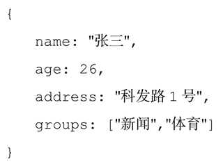
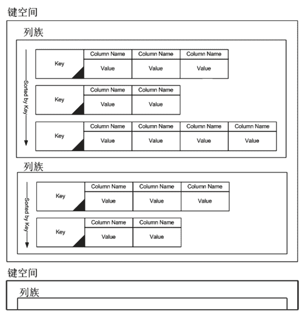

# 常用数据库有哪些（附带数据库排名）？

> 原文：[`c.biancheng.net/view/3856.html`](http://c.biancheng.net/view/3856.html)

表 1 所示列出了每一类数据库的前 3～5 名，排名会不断变化，实时的排名参见 [http：//db-engines.com/en/ranking](http://db-engines.com/en/ranking) 网站。

**表 1 各类数据库排名**

| 大类 | 类别 | 前 3~5 名 | 说明 |
| --- | --- | --- | --- |
| SQL | 关系数据库 | Oracle、MySQL/MariaDB、SQL Server、PostgrcSQL、 DB2 | 遵循“表一记录”模型。按行存储在文件中(先第 1 行，然后第 2 行……) |
| NoSQL | 时序数据库 | InfluxDB、RRDtool、Graphite、OpcnTSDB、Kdb+    | 存储时间序列数据，每条记录都带有时间戳。如存储从感应器采集到的数据 |
| 键/值数据库 | Redis、Memcached、Riak KV、Hazelcast、Ehcache  | 遵循“键——值”模型，是最简单的数据库管理系统 |
| 文档数据库 | MongoDB、Couchbase、Amazon DynamoDB、CouchDB、MarkLogic | 无固定结构，不同的记录允许有不同的列数和列类型。列允许包含多值，记录允许嵌套 |
| 图数椐库 | Neo4j、OrientDB、Titan、Virtuoso、ArangoDB     | 以“点——边”组成的网络（图结构）来存储数据 |
| 搜索引擎 | Elasticsearch、Solr、Splunk、MarkLogic、Sphinx  | 存储的目的是为了搜索，主要功能是搜索 |
| 对象数据库 | Caché、db4o、Versant Object Database、ObjcctStore、Matisse  | 受面向对象编程语言的启发，把数据定义为对象并存储在数据库中，包括对象之问的关系，如继承 |
| 宽列数据库 | Cassandra、HBase、Accumulo | 按照列（由“键——值”对组成的列表）在数据文件中记录数据，以获得更好的请求及遍历效率。一行中的列数允许动态变化，且列的数目可达数百万，每条记录的关键码不同，支持多值列。 |

下面对排名靠前的开源数据库做一些简单介绍。

#### 1\. MySQL/MariaDB

2008 年美国 Sun 公司花费 10 亿美元收购 MySQL，一年后 Oracle 公司又花费 60 亿美元收购了 Sun 公司，从此 Sun 公司的服务器、操作系统、MySQL 等产品线全部归属 Oracle 公司。

拉力·艾立森奉行的经营哲学是“竞争不过它，我就买了它”。竞争不过，说明竞争对手的产品更具优势，所以收购它，从而变成自己的优势。几十年来，Oracle 从一家小型数据库公司变成今天覆盖硬件、平台软件、数据库、中间件、应用软件各个层次产品线的 IT 巨无霸，靠的就是美国的良好环境和总裁奉行的收购策略。

MySQL 数据库占据中小型数据库应用市场的半壁江山，在这块市场，Oracle 数据库明显占下风，巅峰时世界上超过 70% 的网站后台都采用 MySQL 数据库。但是自从被 Oracle 公司收购后，MySQL 发展明显趋缓，是继续开源还是闭源，Oracle 公司一直没下定论。于是 MySQL 的原班人马陆续离开 Oracle 公司，另立炉灶，推出了 MariaDB 开源数据库。

MariaDB 继承了 MySQL 小巧精悍、简洁高效、稳定可靠的特征，并与 MySQL 保持兼容。时至今日，已有 Google、Facebook 等知名企业把应用从 MySQL 切换到了 MariaDB 上，各种 Linux 发行版的操作系统默认数据库都开始采用 MariaDB；而 Apple 公司反应更快，当 Oracle 公司收购 Sun 公司时，就切换到了 PostgreSQL 数据库。

截至 2014 年年末的数据库综合排名，MySQL 继续位居第二名，但是其表现出来的颓势较明显，而 MariaDB 却具备强劲的生命力。

MariaDB 是一个开源的免费的关系数据库，截至发稿前的最新版本是 10.0.15，安装包可从 [https：//downloads.mariadb.org](https://downloads.mariadb.org) 网站下载。整个安装包大约 200MB，几乎能在所有的操作系统上安装和运行，与 Oracle 数据库、SQL Server、DB2 等商业数据库动辄好几张光盘相比，算是短小精悍了。

另外，也可以从这个网站下载数据库的源代码。对于非数据库型的 SaaS 云提供商来说，云端采用 MariaDB 是最好的选择，而且可以轻松搭建数据库集群。

#### 2\. PostgreSQL

PostgreSQL 能被苹果公司大量使用并替换早期的 MySQL 数据库，说明其一定有不俗的表现。在 2014 年年末的数据库排行榜上，PostgreSQL 位居第四位，号称世界上最先进的、最安全的开源数据库，也是面向对象的关系数据库。

华为内部局域网接入控制系统 SPES 也采用 PostgreSQL 数据库，在 Linux 操作系统上运行，极少出问题。经过十多年的磨砺，如今 PostgreSQL 数据库具备如下特点：

*   面向对象，安全性极高，能运行在全部主流的操作系统上，完全 ACID 兼容。
*   支持外键、连接、视图、触发器和存储过程（多语言）。
*   支持最新的 SQL 2008 标准的数据类型，包括整型、数字型、字符型、布尔型、可变字符型、日期型、时间戳、自增长型以及各种二进制对象（如图片、声音和视频等）。
*   提供了各种流行语言的编程接口，如 C/C++、Java、.NET、Perl、Python、Ruby、Tcl、ODBC 等。

PostgreSQL 数据库同时具备很多众多令人振奋的优点，比如在线备份、数据域、表分区、表空间、嵌套事务、时刻点恢复、两段式提交、多版本并发控制、子查询等。

在 PostgreSQL 中，数据库大小没有限制，表大小上限为 32TB，一条记录的大小上限为 1.6TB，字段大小上限是 1GB，一个表包含的记录数没有限制，一条记录的字段数上限为 1600 个，一个表上创建的索引数目没有限制。

另外，SQLite 是一个非常小型的 ACID 兼容的关系数据库，适合嵌入式系统。

#### 3\. InfluxDB

InfluxDB 是一个开源的时间序列数据库，能应付极高的写和查询并发数，主要用于存储大规模的时间戳数据（每条记录自动附加时间戳），如 DevOps 监控数据、应用系统运行指标数据、物联网感应器采集的数据及实时分析的结果数据等。InfluxDB 具备如下特征：

*   全部用 Go 语言编写，并被编译成单一运行程序，无须第三方依赖。
*   简洁、高效地写和查询 HTTP（S）编程接口（API）。
*   通过插件能与其他的数据采集工具集成，如 Graphite、collectd、OpenTSDB。
*   可以搭建高可用性的 InfluxDB 环境。
*   量身定制化的类-SQL 语言。
*   允许给序列数据附加标签来创建索引，以便快速高效查询。
*   通过定义策略轻松实现自动失效过时的数据。
*   基于 Web 的管理界面。

对于一个具体的时间序列应用来说，除存储外，还需要集成数据采集、可视化和告警功能。为此，InfluxData 社区相应提供了 Telegraf（数据采集）、Chronograf（数据可视化）、Kapacitor（告警）三个开源项目，再加上 InfluxDB，能部署成一个完整的时间序列应用系统（简称为 TICK）。这四者的关系如图 1 所示。

图 1  数据采集示意图

#### 4\. Redis

Redis 是遵循 BSD 开源协议的存储系统，数据存储在内存中，因此具备极高的性能，可用作数据库、缓存和消息中间件。Redis 支持多种类型的数据结构，如字符串、哈希、列表、集合、带范围查询的有序集合、位图、hyperloglogs 和带半径查询的地理空间索引。

Redis 内置了复制、脚本语言编程、最近最少使用（LRU）淘汰、事务以及不同级别的磁盘持久化等功能，通过 Redis Sentinel 和集群自动分区机制实现高可用性。Redis 采用 C 语言编写，能运行在 Windows、MacOS X、Linux、Solaris 等操作系统上，不过 Linux 是其最佳的运行平台，无须第三方依赖，它提供了最广泛的编程语言接口。

#### 5\. MongoDB

MongoDB 是排名第一的文档数据库，属于 NoSQL 大类，诞生于 2009 年，正好是云计算兴起的前夜。MongoDB 采用 C++ 语言开发，能运行在 Windows、MacOS X、Linux、Solaris 操作系统上，提供了绝大部分计算机语言的编程接口。保存在 MongoDB 中的一条记录称为一个文档，类似 JSON 语法，例如：从上面的例子可以看出，一个文档就是“键：值”对的集合。

MongoDB 的主要优势包括：高性能、富查询语言（支持 CRUD、数据聚合、文本搜索和地理空间查询）、高可靠性、自动伸缩架构、支持多存储引擎。MongoDB 适合文档存储、检索和加工的应用场合，如大数据分析。

#### 6\. Neo4j

Neo4j 是一个用 Java 语言开发的图数据库，它将结构化数据存储在由“点—边”组成的网络（数学术语叫“图”）上而不是表中。与关系数据库相比，图数据库擅长处理大量复杂、互连接、低结构化的数据。这些数据变化迅速，需要频繁查询，如果使用关系数据库，那么这些查询会导致大量的表连接，因此会产生性能上的问题。

Neo4j 重点解决了拥有大量连接的传统关系数据库在查询时出现的性能衰退问题。Neo4j 还提供了非常快的图算法、推荐系统和 OLAP 风格的分析，而这一切在目前的关系数据库系统中都无法实现。Neo4j 提供了广泛使用的 REST 接口，能够方便地集成到基于 Java、PHP、.NET 和 JavaScript 的环境里。

Neo4j 使用 Cypher 语言进行增删改操作，例如：创建了两个节点：变量“e1”和“e2”，标签“员工”，属性“{……}”。创建了一条边，最终形成下图，如图 2 所示。
图 2  最终形成

#### 7\. Elasticsearch

Elasticsearch 是一个高度可扩展的开源全文搜索和分析引擎，用于存储、搜索和近乎实时地分析大规模数据。Elasticsearch 常被人们用于构建具备复杂搜索功能的应用系统，比如维基百科和优步的搜索，再比如网店中搜索商品、商业智能、日志收集与分析、价格告警等。利用 Elasticsearch 实现的数据采集、存储和可视化套件 ELK（Elasticsearch、Logstash、Kibana）在日志分析领域应用最为广泛。

#### 8\. Caché

大概 20 年前，人们提出了后关系型数据库的概念，目前已有不少产品，其中由 InterSystems 公司开发的 Caché 是后关系型数据库中的领头羊，它提供 3 种方式访问数据：对象访问、SQL 访问、直接对多维数据数组访问，而且 3 种访问方式能够并发访问同一数据。多维数据结构和多种数据库访问方式构成了后关系型数据库的基础。

Caché 数据库具备如下一些特点：

#### 1）速度快

Caché 数据库在同等条件下查询相同数据，比 Oracle 等普通数据库要快 7～20 倍。

#### 2）节省存储空间

存储空间可能节省 2/3，而基于 Caché 的应用程序，比原来基于关系型数据库的应用程序运行有可能快 20 倍。

#### 3）使用简单

Caché 数据库支持标准 SQL 语句，因此不太熟悉 M 语言的用户依然可以轻松对数据库中的数据进行操作。

#### 4）接口容易

Caché 数据库支持 ODBC 标准接口，因此在与其他系统进行数据交换时非常容易，同时 Caché 亦可以将数据输出为文本文件格式，以供其他系统访问调用。

#### 5）真正的三层结构

Caché 数据库能够在真正意义上实现 3 层结构，实现真正的分布式服务，便于做横向扩张。

#### 6）对象型编辑

Caché 数据库是真正的对象型数据库，开发时用户可直接用数据库定义自己想要的对象，然后再在其他开发工具中调用该对象的方法和属性即可完成开发工作，非常方便。

#### 7）支持 Web 开发

Caché 数据库提供自带的 Web 开发工具，使用、维护非常方便，符合当今软件业发展的趋势。

#### 8）价格便宜

Caché 数据库的价格比 Oracle 数据库要便宜很多。

Caché 数据库在欧美的医疗系统使用最为普遍，被医疗界公认为首选的数据库，国内中山大学第三附属医院、深圳南山医院、北京安贞医院等也采用 Caché 数据库

#### 9\. Cassandra

Cassandra 是在 Google 的 Bigtable 基础上发展起来的 NoSQL 数据库，由脸谱于 2008 年用 Java 语言开发，目前被贡献给 Apache 基金会。Cassandra 被称为“列数据库”，这里的“列”不是指关系数据库中一个表中的列，而是由“键—值”对组成的列表（语法与 Python 语言中的列表相同），如：Cassandra 中一行数据语法是“一行的键={列，列，…}”，一行可包含上百万列，比如：Cassandra 中的列族（ColumnFamily）格式是“列族名={若干行}”，一个列族可包含几十亿行，例如：一个 Cassandra 运行实例管理很多键空间（Keyspace），Keyspace 相当于关系数据库管理系统中的数据库，一个键空间包含很多列族。键空间、列族、行、列的关系如图 3 所示。
图 3  键空间、列族、行、列的关系
所以，Cassandra 中的寻址是一个四维或者五维哈希表：比如：返回广东理工职业学院（gdpi）计算机系（computer）张三（zsan）这个学生的年龄。

OpenStack 生态中的 HBase 也是列数据库，目前排名第二。