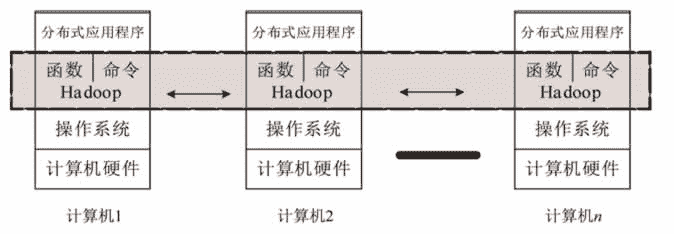
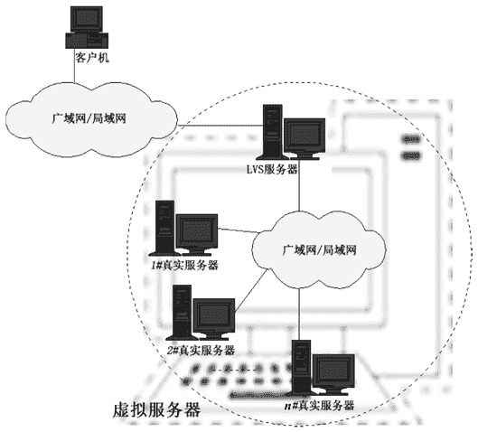
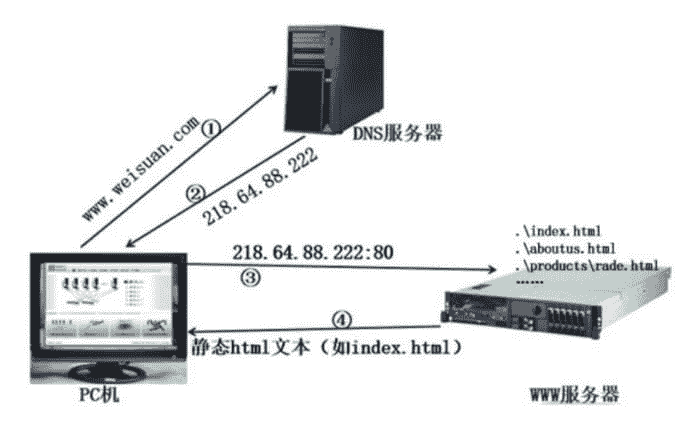

# 什么是中间件？常见中间件有哪些？

> 原文：[`c.biancheng.net/view/3860.html`](http://c.biancheng.net/view/3860.html)

这一节我们主要来学习一下什么是中间件，为什么使用中间件和主要中间件的分类。

## 中间件是什么

中间件是一种独立的系统软件或服务程序，分布式应用软件借助这种软件在不同的技术之间共享资源。中间件位于客户机/ 服务器的操作系统之上，管理计算机资源和网络通讯。是连接两个独立应用程序或独立系统的软件。相连接的系统，即使它们具有不同的接口，但通过中间件相互之间仍能交换信息。

执行中间件的一个关键途径是信息传递。通过中间件，应用程序可以工作于多平台或 OS 环境。

中间件是介于操作系统和应用软件之间，为应用软件提供服务功能的软件，有消息中间件，交易中间件，应用服务器等。由于介于两种软件之间，所以，称为中间件。

## 为什么使用中间件

具体地说，中间件屏蔽了底层操作系统的复杂性，使程序开发人员面对一个简单而统一的开发环境，减少程序设计的复杂性，将注意力集中在自己的业务上，不必再为程序在不同系统软件上的移植而重复工作，从而大大减少了技术上的负担。

中间件带给应用系统的，不只是开发的简便、开发周期的缩短，也减少了系统的维护、运行和管理的工作量，还减少了计算机总体费用的投入。

## 主要中间件的分类

#### 1\. Hadoop

当一个大的任务由一台机器在规定的时间内不能完成时，人们就要采用分布式计算，即很多台机器联合起来共同完成任务。换句话说，就是把大任务拆分成许多个小任务，然后再把这些小任务分配给多台计算机去完成。参与计算的多台计算机组成一个分布式系统，需要运行一系列的分布式基础算法。

Hadoop 就是一个分布式计算平台，用 Java 语言开发，包含 Common、MapReduce 和 HDFS 三个核心部件（HDFS 和 MapReduce 是最核心的两个部件）。其中：

*   Common 为 Hadoop 的其他项目提供了一些常用工具，主要包括系统配置工具 Configuration、远程过程调用 RPC、序列化机制和 Hadoop 抽象文件系统等。
*   MapReduce 是处理海量数据的计算模型。
*   而 HDFS 用于存储海量数据，它具备高度容错性，能在低成本的通用硬件机器上稳定运行。

Hadoop 实现了分布式计算中的基础算法（如一致算法、选举算法、故障检测、快照等），同时为用户提供了编程和命令接口。程序员调用这些函数能轻松写出分布式应用程序，我们都知道，如果一切从头开始，要完成一个分布式程序的编写是异常艰难的。

Hadoop 在海量非结构化数据处理方面能充分展示它的优势，如消费者购买行为分析、商品推荐、关键词检索、信贷风险评估等。

如图 1 所示，Hadoop 其实就是一个分布式计算平台，它“覆盖”在操作系统之上，向上提供函数调用（API）和命令接口，在水平方向完成分布式系统的基础算法。作为编程人员和用户，只要了解 API 和命令即可。

图 1  Hadoop
基于 Hadoop 平台衍生出来的开源项目主要有 Yarn、HBase、Hive、ZooKeeper、Avro、Sqoop、Mahout、Crossbow 等。

以 Hadoop 为基础的生态目前已经成为大数据的标准方案，被广泛用于金融、市场、电信、交通等行业的海量数据分析，在即将到来的大数据时代，它将会发挥更大的作用。

在中国，很多行业（如银行、电信、移动、电力、石油、交通等）沉淀了大量的业务数据，对这些海量数据进行挖掘和分析，将会带来巨大的价值。

用 Hadoop 构建的应用实例对于计算资源的消耗具备两个明显的特征：

*   资源需求大：表明 Hadoop 需要大量的存储、计算和网络带宽。
*   资源需求具备季节性：表明除存储需求是经常性占用外，在运行 Mapreduce 时才需要大量的计算和网络资源，而分析大量数据的工作并不是经常性的——称为季节性

因此，云计算是大数据天生的计算资源供应途径，云计算的资源弹性很好地满足了大数据的季节性计算资源需求。也就是说，大数据是云计算经典的应用案例。当然，也可以按照大数据对计算资源的波峰需求静态配给计算资源，但是这种方案会造成资源的巨大浪费。

#### 2\. LVS

LVS 是 Linux Virtual Server 的首字母缩写，意为 Linux 虚拟服务器，即把许多台物理 Linux 计算机逻辑上整合成一台超级计算机，对用户来说感觉只有一台计算能力很强的服务器，如图 2 所示。

LVS 就是一个由软件实现的负载均衡器，工作在网络 OSI 的第四层（应用层），是中国人章嵩开发的，代码已经并入了 Linux 内核。利用它，再加上一台廉价的计算机，就能构建一台企业级的负载均衡器。而那些外国大公司的负载均衡器，售价都要十几万元，甚至几十万元，便宜的也要几万元，LVS 出来后，这些产品都不得不降价。

负载均衡器的作用就是把任务分配给最合适的服务器。比如一个大型购物网店，有 100 台同样配置的服务器在运行，如果某一时刻有 10 万用户在线购物，那么通过负载均衡器，每台服务器差不多承担 1000 个在线购物用户。

LVS 的官网网站是 [http：//www.linuxvirtualserver.org](http://www.linuxvirtualserver.org)。另外，两个较为流行的第七层负载均衡器是 Nginx 和 HAProxy，针对应用做均衡，所以能适应的负载种类没有 LVS 多。

图 2  LVS 原理图

#### 3\. Linux-HA

也许有读者会问：“负载均衡器本身故障怎么办？”是的，如果负载均衡器出现故障，那么整个系统（如网店）将会瘫痪。所以人们开发了各种集群软件，如 Linux-HA 和 Keepalive 等，而微软干脆就在 Windows 服务器版中集成故障转移集群软件。

集成故障转移集群软件的核心思想是，实时检测故障机器并及时让好的机器接管工作，对外提供高可用性。Linux-HA 意为 Linux 高可用性项目，此项目具体包含如下几个组件。

| 名称 | 作用 |
| --- | --- |
| Heartbeat | 负责维护集群中各节点的信息及它们之间的心跳通信。 |
| Pacemaker | 集群资源管理器，是核心组件，客户端通过 Pacemaker 来配置、管理并监控整个集群。此组件的社区网站为 [http：//clusterlabs.org/](http://clusterlabs.org/)。OpenStack 高可用性部署实例中一般都采用 Pacemaker 和 HAProxy。 |
| Resource Agent | 为用于控制服务启停、监控服务状态的脚本集合，本地资源管理器（LRM）调用这些脚本来启动、停止、监控各种集群资源。 |
| Cluster Glue | 包含一套函数库和工具，在集群栈中，除集群消息传输（由 Heartbeat 承担）、集群资源管理（由 Pacemaker 承担）和资源代理（由 Resource Agent 承担）功能外，其他功能都由 Cluster Glue 来完成。它包含的两个主要部分是 LRM 和 Stonith，前者是本地资源管理器，后者的任务是隔离故障机器。 |

通过心跳信号（Heartbeat）检测故障，一台好的计算机会不断向其他计算机发送心跳信号，也会接收其他计算机发送过来的心跳信息。当在规定的时间内没有收到对方计算机的心跳信号时，就启动应急预案，进一步确认故障并准备接管那台计算机的任务。

例如，我们采用两台 LVS 计算机，并分别安装和配置 Linux-HA，一台 LVS 计算机作为工作机，另一台作为备份机，两台 LVS 计算机互相监督对方的运行状态。当工作机故障时，备份机接管负载均衡任务并报警。相反，当备份机出故障时，只报警，提醒技术员维修备份机。

两台 LVS 计算机同时出故障是比较糟糕的情况，不过这种情况发生的概率很小，除非机房断电或者遭到雷击。对于一些非常关键的应用，可以增加参与负载均衡的服务器数量来提高可靠性，如民航飞机上采用 5 台服务器。

#### 4\. 静态网站服务器

我们浏览一家公司的网站时，很可能就是跟那家公司服务器上的 Apache 程序打交道，网页浏览器与 Apache 成了标准的 C/S 模式，浏览器是客户端，而 Apache 是服务端。Apache 首先把主页对应的文件 index.html 发给我们，我们看到主页内容后，点击主页上的某个链接，它又把该链接对应的文件发给我们，过程如图 3 所示。
图 3  访问静态网页的过程
配合 PHP 引擎，Apache 也支持 PHP 动态网页。过程为：

1）当 Apache 收到用户要浏览的 PHP 文件后，把这个 PHP 文件发给 PHP 执行引擎。

2）PHP 执行引擎执行该 PHP 文件，产生一个临时的静态网页文件并发回给 Apache。

3）最后 Apache 把这个临时的静态网页文件发给用户。

采用 Perl、Python 和 Ruby 脚本语言编写的动态网页，其工作过程与 PHP 类似。

Apache 是最流行的开源网站服务器，在世界排名前 100 万的网站中，有 60.6% 的网站采用 Apache；在排名前 1000 的大型网站中，Apache 占到了 34.5%，而 Ngnix 占到了 34.9%，略胜于 Apache。

#### 5\. 动态应用服务器

开源的动态应用服务器有 JBoss、Tomcat、Geronimo、JOnAS，关于这些项目更详细的介绍，请参考相应的官方网站。