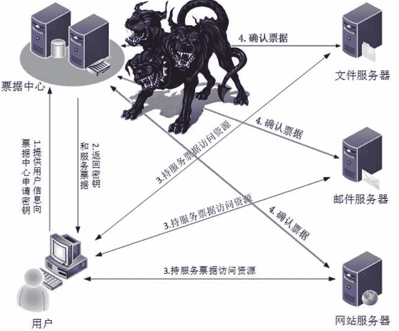
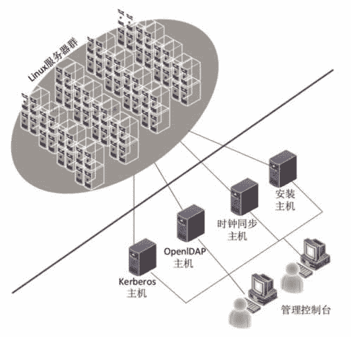
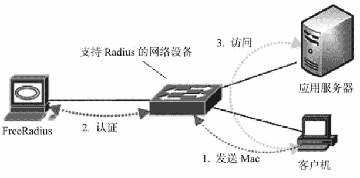

# DNS、DHCP、Kerberos 和 Radius：云计算基础服务组件

> 原文：[`c.biancheng.net/view/3861.html`](http://c.biancheng.net/view/3861.html)

基础服务组件包括 DNS、DHCP、用户管理、身份鉴别、权限管理、事后审计、域控等。

#### 1\. DNS

DNS 是一个倒树形结构的分布式数据库，里面存储的信息主要有 IP 地址到域名的映射记录、域名到 IP 地址的映射记录、邮件路由记录等。Bind 就是用于实现这个数据库并且允许人们通过域名查询 IP、通过 IP 查询域名或者查询邮件服务器的信息等，我们在配置计算机网卡参数时要指定多个 DNS 服务器 IP 地址。

在中国，这些 DNS 服务器大部分都在电信机房，如果不设置或者 IP 地址设置错误，则计算机无法上网。不过，建议大家使用谷歌提供的 DNS 服务器，IP 地址是 8.8.8.8 和 8.8.4.4，速度快又方便记忆。

BIND（Berkeley Internet Name Domain）是一款开源的 DNS 服务器软件，是目前互联网上使用最广泛的 DNS 服务器软件，能在各种流行的操作系统上运行。现由互联网系统协会负责开发与维护，可从该组织的官方网站 [http：//www.isc.org/](http://www.isc.org/) 下载源代码，然后编译安装，目前稳定版本是 9.11.0。

#### 2\. DHCP

DHCP（Dynamic Host Configuration Protocol，动态主机配置协议）允许一台计算机通过 DHCP 服务器自动获取网络配置参数，如网卡的 IP 地址、网关、掩码和主机名字等，这样只要启动计算机就能上网，而不用手工去配置计算机的网络参数。

DHCP 服务器的第二个功能是定义一些与自动安装操作系统有关的参数，比如一台计算机设置从网卡启动，只要 DHCP 服务器配置了 PXE 启动有关的参数，那么用户的计算机就能自动根据配置参数来启动或者安装操作系统，而不管原来有没有安装操作系统。这一点在可伸缩云端和零存储云终端的环境下非常有用，服务器随时加入随时启用，云终端启动就自动下载统一的操作系统内核并运行统一的登录程序。

dhcp3-server 和 isc-dhcp-server 都是目前比较流行的开源 DHCP 软件项目，前者已经被广泛使用；后者发展迅速，操作系统 Ubuntu12.04 版本开始使用它了。isc-dhcp-server 也是由互联网系统协会负责开发与维护的，可从该组织的官方网站 [http：//www.isc.org/](http://www.isc.org/) 下载源代码，然后编译安装，目前稳定版本是 4.3.5。

#### 3\. Kerberos

Kerberos 这一名词来源于希腊神话“三个头的狗——地狱之门守护者”。但在 IT 领域，Kerberos 是指一种计算机网络上的身份认证协议，主要用来在非安全的计算机网络中，对个人通信以安全的手段进行身份认证。

Kerberos 又指麻省理工学院为这个协议开发的一套计算机软件（参见官方网站 [http：//web.mit.edu/kerberos/](http://web.mit.edu/kerberos/)），软件设计上采用客户机/服务器结构，并且能够进行相互认证，即客户端和服务器端均可对对方进行身份认证，可以用于防止窃听、防止重放攻击、保护数据完整性等场合，是一种应用对称密钥机制进行密钥管理的系统。Kerberos 的扩展产品也使用公开密钥加密方法进行认证。

当有 N 个人使用该系统时，为确保在任意两个人之间进行秘密对话，系统至少保存有其与每个人的共享密钥，所需的最少会话密钥数为 N 个。Kerberos 身份认证流程如图 1 所示。

如果想进一步了解 Kerberos 的原理，请在网上搜索“Kerberos 原理对话”，其以四幕话剧的形式来阐述 Kerberos 的原理，非常经典。

Kerberos 可用来部署单点登录环境——只要记住一个密码就能登录到任何一个应用，类似购买景点通票。微软的 AD 域就采用了 Kerberos。另外，图 2 所示是笔者为国内一家大型企业部署的单点登录草图，实现了企业内部上千台 Linux 服务器的单点登录。

图 1  Kerberos 身份认证流程
 
图 2  某大型企业部署的单点登录草图
另一套采用 Kerberos 实现身份认证和权限管理的开源软件是 OpenAM/OpenDJ/OpenIDM，由 ForgeRock 公司开发和维护，可从其官方网站 [https：//forgerock.org/downloads/](https://forgerock.org/downloads/) 下载软件源代码。

OpenAM 提供集中认证、授权、单点登录，以及与其他单位建立联邦治理的全面解决方案，它是完全开源的，其前身是 Sun 公司的 OpenSSO。OpenAM 具有高度可扩展的、模块化的、易于部署的架构，具体包括如下内容。

#### 1）身份认证

允许通过使用者的周边信息实现动态的身份识别，使用者的周边信息包括地理位置、时区、IP 地址、接入设备、一天的特定时点等，当然也支持密码认证。身份认证模块相当于门卫，控制哪些人可以进入，哪些人不可以进入，至于进去后能做什么事情，它不会加以限制。

#### 2）权限管理

根据事先定义好的权限和策略方案来控制用户登录后的行为，即允许他能做什么，不能做什么。

#### 3）联邦和单点登录

每个用户只需一个账户和密码，就可以访问众多的应用系统和网络资源。想必大多数人都有过这样的痛苦经历：要记住众多的用户名和密码，以便访问许多系统，如邮件系统、工作网站、论坛、微博等，单点登录彻底解决了这个问题。

#### 4）外围系统认证集成

允许集成认证目前流行的社交网站，如推特、脸谱、微博等。

#### 5）自适应风险评估

根据登录用户的操作行为来评估其动机，如果怀疑其动机不纯，那么自动提升身份级别鉴别，要求提供额外的身份信息，以便进一步确认其真实身份。

OpenDJ 是一款遵循 LDAPv3 协议的目录服务器，采用 Java 语言开发，完全开源。它的前身是太阳微系统公司的 OpenDS 项目，现在由 ForgeRock 公司接手。用 OpenDJ 可以搭建高性能、高可用性和高安全性的企业级目录服务系统，处理上千万条数据记录，响应时间均在毫秒级以内。

OpenDJ 允许多主/复制部署（Multi-Master），数据可以集中式存储，也可分布式存放，这一点要优于另一个目录服务开源项目——OpenLDAP。另外，OpenDJ 消耗很少的计算机资源（CPU、内存等），由于是纯 Java 开发，所以 OpenDJ 可以在任何平台上运行。

利用 OpenIDM，企业可以轻松集中管理用户信息，包括用户账号和权限管理，适合在企业级、云端和移动社交网络使用。

另外，耶鲁大学开发的 CAS 项目也是非常有名的认证系统，官方网站为 [https：//www.apereo.org/projects/cas/](https://www.apereo.org/projects/cas/)。

#### 4\. Radius

Radius 是指局域网接入认证，用于解决一台计算机需要认证才能接入和使用局域网的问题。比如一个公司外的人带了笔记本电脑进来，他找到一根网线插入笔记本电脑，如果他能使用公司内部的局域网（不管是自动分配 IP 还是手工配置网卡参数），那么这时公司内部的很多资源就面临危险，因为一个恶意的人就可以做网络窥探、运行额外的 DHCP 使网络紊乱、广播病毒、端口扫描、消耗网络带宽等。

有了局域网接入认证系统后，只有合法的设备（通常捆绑了网卡的 Mac 地址）才能接入局域网，没有事先登记的设备被拒绝接入，即使配好了网卡参数。

FreeRadius 是一款开源的实现局域网接入认证的软件，可从网站 [http：//freeradius.org/](http://freeradius.org/) 下载源代码，目前稳定的版本是 3.0.12。具体的认证示意图如图 3 所示。
图 3  FreeRadius 认证过程