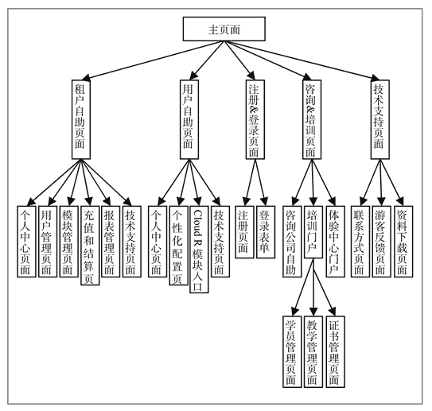

# 云计算管理工具简介

> 原文：[`c.biancheng.net/view/3863.html`](http://c.biancheng.net/view/3863.html)

首先我们看看一个基于虚拟机的 IaaS 云端的形成过程。

虚拟机要运行在虚拟机软件里，而虚拟机软件运行在物理机上。一台物理机通过虚拟机软件可以虚拟出多个虚拟机，虚拟机里再安装 Windows 或者 Linux 操作系统及各种应用软件，然后用户通过远程桌面等方式连接到虚拟机并使用虚拟机中的应用软件。如果一个云中心只有一台物理机，那么只要一个虚拟机软件即可，到此一个最小的准云端就创建完成了。

接下来继续增加物理机，每台物理机上运行多个虚拟机，这样云端虚拟机的数量就增加了很多。但是问题来了，如何避免因为一些物理机故障导致部分云终端用户不能使用虚拟机？为了解决这个问题，人们引入了集群技术，允许虚拟机在集群中的任何一台机器上运行，这样故障机器上的虚拟机就能“漂移”到其他机器上并继续运行。

但这样又产生了一个新的问题，那就是如何保存虚拟机本身（虚拟机就是对应宿主机上的若干文件）才能确保“漂移”动作既快速又正确地完成呢？对此，人们又引入了中央存储技术，即把全部的虚拟机镜像文件保存在中央存储设备上，让集群里的物理机都能共享访问。这样，一个由多台物理机组成集群、由多个集群组成的云端雏形就形成了。

然后我们又会自然而然地想到其他问题：

如何管理云端众多的虚拟机？

于是人们开发了云端管理工具，采用此工具可以很轻松地创建、删除、迁移、启动、关闭、冻结和备份虚拟机。

如何给多台虚拟机组建网络？

为此，人们又发明了虚拟网卡、虚拟交换机、网络功能虚拟化和软件定义网络技术。

云端最核心的部分就是虚拟化软件、中央存储设备和虚拟机管理工具（有的人喜欢称云管理平台，甚至直接称云计算操作系统）。称其为“云计算操作系统”是有一定道理的，与计算机操作系统（如 Windows、Linux 等）类似，计算机操作系统的核心功能是管理进程，只有进程才能申请资源（CPU、内存、打印机等）；而在云端，虚拟机是申请资源（计算、存储、网络等）的基本主体，管理虚拟机是云计算操作系统最核心的功能。但是云计算操作系统远没有计算机操作系统那么复杂，称其为操作系统有点夸大其词。

云管理工具分为 IaaS、PaaS 和 SaaS 3 种类别，SaaS 类别的云管理工具与网店差不多，主要是租户注册、自助、购买、结算等，与业务关联性大，所以目前没有统一的标准版产品。比如，针对一款大型可靠性软件系统的云化项目，SaaS 云管理软件包含两大部分：一是 SaaS 业务门户，二是 SaaS 管理门户，其结构分别如图 1 和图 2 所示。
图 1  SaaS 业务门户组成
图 2  SaaS 管理门户组成
尽管框架类似，但由于 SaaS 云计算与具体的应用软件紧密相关，所以截至目前，还没有出现通用的开源或者商业化的 SaaS 云计算管理工具。目前的 SaaS 云计算提供商都是自己开发自己使用。

PaaS 管理工具有红帽公司的 Openshift 和 Cloud Foundry 社区的 CloudFoundry，两者都是开源的，在 [https：//financesonline.com/](https://financesonline.com/) 网站上，Openshift 的得分要高于 CloudFoundry。

下面我们分四节介绍一下常用的云计算管理工具：

*   OpenStack 是什么？
*   CloudStack(CloudPlatform)是什么？
*   谈谈 Eucalyptus 云端管理工具
*   Oracle VM Manager 简介