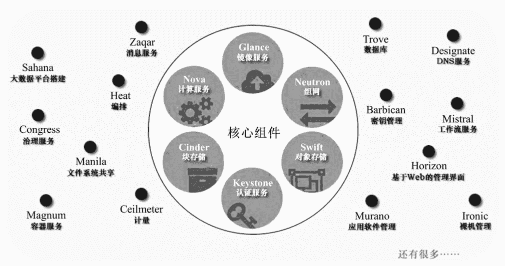
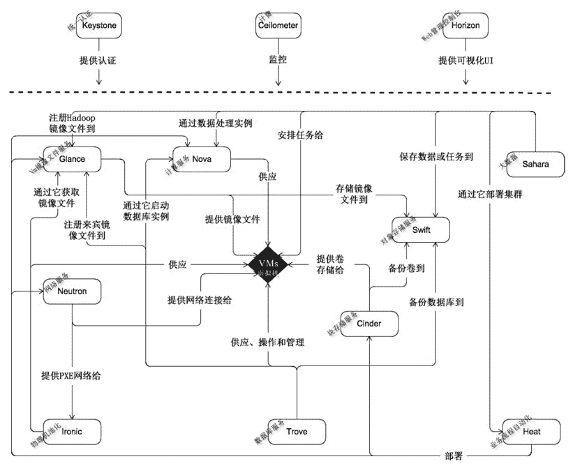
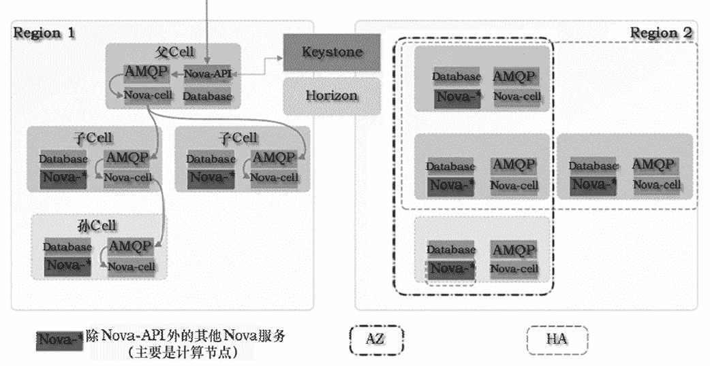
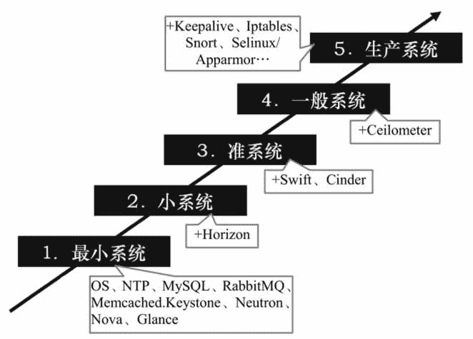

# OpenStack 是什么？

> 原文：[`c.biancheng.net/view/3892.html`](http://c.biancheng.net/view/3892.html)

OpenStack 是当今最具影响力的云计算管理工具——通过命令或者基于 Web 的可视化控制面板来管理 IaaS 云端的资源池（服务器、存储和网络）。它最先由美国国家航空航天局（NASA）和 Rackspace 在 2010 年合作研发，现在参与的人员和组织汇集了来自 100 多个国家的超过 9500 名的个人和 850 多个世界上赫赫有名的企业，如 NASA、谷歌、惠普、Intel、IBM、微软等。

OpenStack 系统或其演变版本目前被广泛应用在各行各业，包括自建私有云、公共云、租赁私有云及公私混合云，用户包括思科、贝宝（Paypal）、英特尔、IBM、99Cloud、希捷等，具体名请参考网站 [http：//www.openstack.org/user-stories](http://www.openstack.org/user-stories)。

OpenStack 支持 KVM、Xen、Lvc、Docker 等虚拟机软件或容器，默认为 KVM。通过安装驱动，也支持 Hyper-V 和 VMware ESXi，不过有些功能暂时不支持，具体的虚拟机管理器支持矩阵参见网站 [http：//docs.openstack.org/developer/nova/support-matrix.html](http://docs.openstack.org/developer/nova/support-matrix.html)。

OpenStack 采用 Python 语言开发，遵循 Apache 开源协议，因此相比 CloudStack 来说，更轻量化，效率更高。

OpenStack 每半年发行一个新版本，截至发稿前最新版本是第十四版本 Newton，不同于其他软件的版本号采用数字编码，OpenStack 采用一个单词来描述不同的版本，其中单词首字母指明版本的新旧。比如目前的版本 Newton 就比之前的 Mitaka 要新，同时“N”在 26 个字母中排行第十四，所以称第十四版本。各个版本的发行时间表参考网站 [https：//releases.openstack.org/](https://releases.openstack.org/)。

围绕 OpenStack 发展起来的企业很多，为客户提供 OpenStack 实施、培训、运维、定制等业务，之前企业总是或多或少地加入自己的一些封闭技术，从而导致 OpenStack 的互操作性受损。为此，2015 年 OpenStack 基金会在温哥华峰会上正式推出互操作性认证，通过认证的产品被贴上“OpenStack Powered”标识。

虽然第一批只有 14 家厂商经过认证测试，但这却是一个重要的里程碑事件，基金会已经拿出足够的诚意来解决问题，并且众多厂商也开始真正跟进。对用户而言，选择经过认证的云服务提供商，能够实现在不同 OpenStack 云计算之间的自由迁移。

OpenStack 生态系统已从“孵化/集成”模式转移到“大帐篷”模式，在此模式下，既保持了对规模较小的核心项目的关注，也积极鼓励在更广泛的主流生态环境中的自由创新，而以前的“孵化/集成”模式只是把孵化成功的项目集成到主流生态中。

“大帐篷”模式把 OpenStack 的组件进行分类，目前包括 6 个核心组件（Nova、Neutron、Swift、Cinder、Keystone、Glance）和 14 个可选组件，每个组件包含若干个服务，后续版本中组件分类及数量都可能会发生变化，如图 1 所示。

图 1   “大帐篷”模式下的组件
表 1 列出了 Newton 版本中各个组件的功能介绍。

**表 1 Newton 版本中各个组件的功能介绍**

| 分类  | 组件名称 | 功能 |
| --- | --- | --- |
| 核心组件 | Nova | 管理虚拟机的整个生命周期:创建、运行、挂起、调度、关闭、销毁等。这是真正的执行部件。接受 DashBoard 发來的命令并完成具体的动作。但是 Nova 不是虛拟机软件，所以还需要虚拟机软件（如 KVM、Xen、Hyper-v 等）配合 |
| Neutron | 管理网络资源，提供/一组应用编程接口(API)，用户可以调用它们来定义网络(如 VLAN )，并把定义好的网络附加给租户。Networking 是一个插件式结构，支持当前主流的网络设备和最新网铬技术 |
| Swift | 是 NoSQL 数据库，类似 HBase，为虚拟机提供非结构化数据存储，它把相同的数据存储在多台计箅机上，以确保数据不会丢失。用户可通过 RESTful 和 HTTP 类型的 API 来和它通信。这是实际的存储项目，类似 Ceph，不过在 OpcnStack 具体实施时，人们更愿意采用 Ceph。 |
| Cinder | 管理块设备，为虚拟机管理 SAN 设备源。但是它本身不是块设备源， 需要一个存储后端来提供实际的块设备源（如 iSCSI、FC 等）。Cinder 相当于一个管家，当虚拟机需要块设备时，询问管家去哪里获取具体的块设备。它也是插件式的，安装在具体的 SAN 设备里。Cinder 支持的存储后端品牌参见 [`wiki.openstack.org/wiki/CinderSupportMatrix`](https://wiki.openstack.org/wiki/CinderSupportMatrix)，驱动参见 [`github.com/openstack/cinder/tree/master/cinder/volume/drivers`](https://github.com/openstack/cinder/tree/master/cinder/volume/drivers)。 |
| Keystone | 为其他服务提供身份验证、权限管理、令牌管理及服务名册管理。要使用云计算的所有用户事先需要在 Keystone 中建立账号和密码，并定义权限（注意:这里的“用户”不是指虚拟机里的系统账户，如 Windows 7 中的 Administrator )。另外，OpenStack 服务（如 Nova、Neutron、Swift、Cinder 等）也要在里面注册，并且登记具体的 API，Keystone 本身也要注册和登记 API |
| Glance   | 存取虚拟机磁盘镜像文件，Compute 服务在启动虚拟机时需要从这里获取镜像文件。这个组件不同于上面的 Swift 和 Cinder，这两者提供的 存储是在虚拟机里使用的 |
| 可选组件 | Horizon  | 提供了一个网页界面，用户登录后可以做这些操作：管理虚拟机、配置权限、分配 IP 地址、创建租户和用户等。本质上就是通过图形化的 操作界面控制其他服务（如 Compute、Networking 等)。当然，如果你熟悉命令，也可以直接采用命令来完成相应的任务 |
| Heat | 如果要在成千上万个虚拟机里安装和配置同一个软件，该怎么办？采用 Orchestrates 是一个不错的主意，它向每个虚拟机里注人一个名叫 heat-cfntools 的客户端工具，然后就能同时操作很多虚拟机 |
| Sahana   | 使用户能够在 OpenStack 平台上（利用虚拟机）一键式创建和管理 Hadoop 集群，实现类似 AWS 的 EMR（Amazon Elastic MapReduce Service）功能。用户只需要提供简单的配置参数和模板，如版本信息（CDH 版本）、集群拓扑（几个 Slave、几个 Datanode）、节点配置信息（CPU、内存）等，Sahara 服务就能够在几分钟内根据提供的模板快速 部署 Hadoop、Spark 及 Storm 集群。Sahana 是一个大数据分析项目 |
| Ironic | 把裸金属机器（与虚拟机相对）加人到资源池中 |
| Zaqar | Zaqar 为 Web 和移动开发者提供多租户云消息和通知服务，开发人员可以通过 REST API 在其云应用的不同组件中通过不同的通信模式（如 生产者/消费者或发布者/订阅者）来传递消息 |
| Ceilometer | 结合 Aodh、CloudKitty 两个组件，完成计费任务，如结算、消耗的 资源统计、性能监控等。OpenStack 之所以能管理公共云，一是因为 Ceilometer 的存在，二是因为引人了租户的概念 |
| Barbican | 是 OpenStack 的密钥管理组件，其他组件可以调用 Barbican 对外暴露的 REST API 来存储和访问密钥 |
| Manila | 为虚拟机提供文件共享服务，不过需要存储后端的配合 |
|   | 其他组件：Congress（策略服务）、Designate（DNS 服务）、Freezer（备份及还原服务）、Magnum（容器支持）、Mistral（工作流服务）、Monasca（监控服务）、Searchlight（索引和搜索）、Senlin（集群服务）、Solum（APP 集成开发平台）、Tacker（网络功能 虚拟化）、Trove（数据库服务） |

各个组件的关系图如图 2 所示。
图 2  OpenStack 组件关系图
OpenStack 的组件众多，根据云端的实施过程，再结合图 2，我们来梳理一下各个组件的作用：云端要运行很多虚拟机，所以需要在很多服务器中安装并运行虚拟机软件（如 KVM、Xen 等），有的客户为了安全起见，愿意出高价直接租赁物理机（裸金属机器），所以要用 Ironic 组件来池化物理机，以便用户能远程使用。

这些运行了虚拟机软件的服务器和被池化的物理机统称为计算节点。为了让 Horizon 组件以可视化的 Web 页面来统一操纵计算节点上的虚拟机，需要在计算节点上安装 Nova 组件，Nova 组件还与其他组件打交道。为了让一台虚拟机能在集群内的任一计算节点上快速漂移，虚拟机对应的镜像文件必须存放在共享场所，到底存放在哪里，由 Glance 组件指定。

例如在图 4 中，由 Glance 指定存放在 Swift 组件内，在实际的实施案例中，也可以存放在 Ceph 中。虚拟机之间需要联网，由 Neutron 组件负责。虚拟机里面可能还要使用块设备（如硬盘），这需要 Cinder 组件的配合；虚拟机里可能需要用到共享文件服务，由 Manila 组件提供服务。

云端的计算节点很多（如 1000 台），所以虚拟机就更多（如 10 万台），如果要给它们统一安装一个软件或配置某项参数，那么是不是需要手工一台一台操作呢？显然，手工操作费时费力，而且容易出错，有了 Heat 组件，我们就可以轻松完成这个任务。

OpenStack 的各个组件都是对外暴露 REST API 接口，以便于其他程序调用，调用时都要进行身份验证和权限管理，这由 Keystone 组件完成。跟踪用户消耗的资源并计费的任务由 Ceilometer 组件完成（需要 Aodh 和 CloudKitty 组件的配合）。

对于 OpenStack 管理的 IaaS 云服务，有人想在上面部署 Hadoop 大数据分析系统怎么办？这时 Sahala 组件可以帮上忙。各组件之间需要通过消息互相联络，所以 Zaqar 和 RabbitMQ 就派上用场了。另外，很多组件需要在数据库中保存配置数据，所以需要用到数据库管理系统（如 MySQL）。

OpenStack 组件的主要作用是充当“中间人”，它不履行具体的实际任务，而由各种第三方软件来完成，比如虚拟机软件由 KVM 承担，网站任务由 Apache 承担，虚拟网络任务由 iptables、DNSmasq、Linux vSwitch、Linux 网桥承担或者统一由 OpenContrail 承担，结构化数据存储任务由 MySQL 或者 PostgreSQL 承担，中央存储任务由 Ceph 承担（也可采用其他产品）。当然，OpenStack 中也有实现具体功能的组件，比如 Swift 做中央存储，我们也可以选择相对发展多年并且被大量使用的第三方产品，如 Ceph。

一个云端往往包含成千上万台服务器，而且还可能分布在世界各地，分别服务符合延时半径范围内的用户。OpenStack 中的“地区”（Region）就是对应地理位置不同的分中心，如中国北京、美国纽约、英国等。

在同一个 Region，还可能包含成千上万台机器，如果用一套 OpenStack 中的组件来管理，势必会导致这些组件本身成为瓶颈（随着集群规模的不断增大，消息系统和数据库系统很可能最先成为瓶颈），所以人们又引入了 Cell 功能，以便增强 OpenStack 集群的扩展性，即把一个 Region 划分成多个 Cell，这些 Cell 组成树形结构，父 Cell 主要用于服务通信，它不包含计算节点，子 Cell 具有自己的消息队列、数据库和 Noval-cell 服务。

Nova cell 在 OpenStack 的 Newton 版本中将成为默认项，之前的版本是可选项。在创建虚拟机时，为了规定它能在哪些计算节点集上运行，人们又提出了两个概念，即“可用域”（Availability Zones，AZ）和“主机集”（Host Aggregates，HA），前者可以看成后者的一个特例。

“主机集”其实就是根据计算节点的某些属性对计算节点进行逻辑分组的方法，比如可以分成如下几个“主机集”：万兆网卡的机器、拥有两路 CPU 的机器、惠普机器、自组装的机器、A 机柜里的机器、由 UPS 供电的机器等。然后我们创建一台虚拟机，指明在上海云端分部的惠普机器上运行，这样只要全部的惠普机器不同时坏，那么虚拟机就能一直正常运行（但每一时刻只能在一台机器上运行，只有当运行的那台机器出故障时，才会“漂移”到其他惠普机器上继续运行）。

“可用域”是用户可见的，用户把自己的多个虚拟机分散到不同的“可用域”中，是为了降低所有虚拟机同时不可用的概率，而“主机集”是管理员可见的，目的是用来隔离虚拟机，从而降低一些特定虚拟机的运行行为对其他虚拟机产生的影响。Region、Cell（第 2 版本）、AZ、HA 的关系如图 5 所示。

从图 3 中可以看出，多个 Region 允许共享 Keystone 和 Horizon 服务，也可以完全独立。HA 可以跨 Cell，但是不能跨越 Region，一台机器可以同时属于多个 HA，因为 AZ 是 HA 的特例，所以一台机器允许同时属于 AZ 和 HA。当一个创建虚拟机的请求到达父 Cell 的 Nova-API 时，父 Cell 会通过 Nova-cell 向各个子孙 Nova-cell 广播请求，并一次性决定在哪个子孙 Cell 中的哪台计算节点上创建虚拟机。
图 3  Region、Cell（第 2 版本）、AZ、HA 的关系
在具体部署 OpenStack 时应该遵循“逐步扩展部署法”，如图 7 所示。
图 7  OpenStack 逐步扩展部署法
最小系统具备基本的 IaaS 功能，能通过命令来进行管理，这一步只需安装 OpenStack 的 Keystone、Neutron、Nova 和 Glance 四个组件；此后再安装 Horizon 就成了小系统，这时可通过 Web 图形化界面来执行管理；继续安装 Swift 和 Cinder 就成了准系统，这时能给虚拟机附加磁盘块设备，并能满足大规模的存储需求；再加上计费组件 Ceilometer，就上升为一般系统，一般系统具备公有 IaaS 的功能。但是由一般系统跨到生产系统，需要完成的工作就特别多，其中性能和安全是两个不得不面对的棘手问题。

图 6 中标注的 Iptables（设立门卫）、Selinux 或 Apparmor（加固系统）和 Snort（巡逻）都是为了强化安全。性能和安全涉及的知识太多，这里不再展开讨论。图 7 取自网上，主要考量了安全当中的可用性，供大家参考。