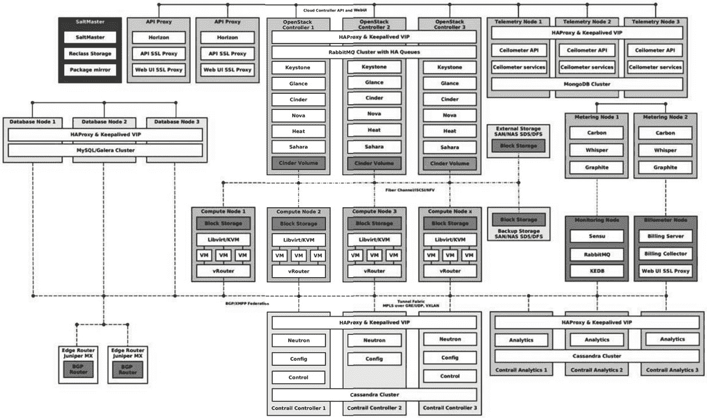
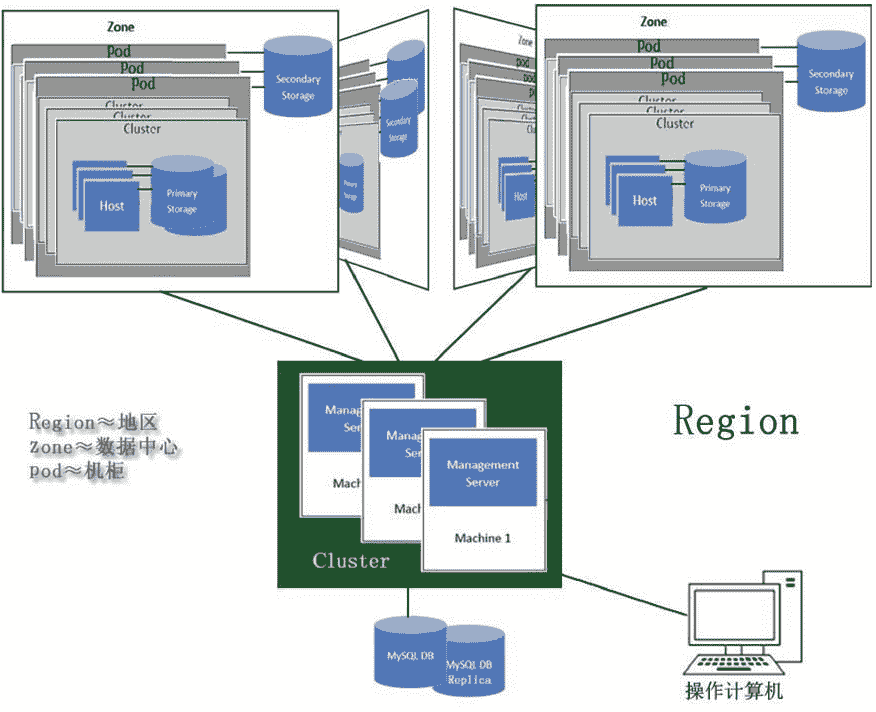

# CloudStack(CloudPlatform)是什么？

> 原文：[`c.biancheng.net/view/3893.html`](http://c.biancheng.net/view/3893.html)

思杰（Citrix）收购 CloudStack 后让其开源，并捐献给 Apache 基金会（项目网站 [http：//cloudstack.apache.org/](http://cloudstack.apache.org/)），让世界上许许多多的开源软件爱好者参与开发、测试和讨论。

当社区版趋于稳定时，思杰公司及时把它转化为服务收费版 CloudPlatform。2016 年 1 月思杰把 CloudPlatform 出售给了 Accelerite 公司，自己又重回 OpenStack 的怀抱，曾经离开时思杰痛陈 OpenStack 的数条罪状，至今让人记忆犹新。采用 CloudStack 或 CloudPlatform 管理的云端逻辑架构图如图 7 所示。
图 6  OpenStack 高可用性部署架构图

图 7  CloudPlatform 管理的云端逻辑架构图
从图 7 可知，整个云端包含若干个 Region（地区，可以理解为地理位置上的一个城市、一个省份等），默认情况下只有一个 Region。每个 Region 包含多个 Zone（大致相当于数据中心，也允许一个实际的数据中心划分为多个 Zone），每个 Zone 又包含若干个 Pod（相当于机柜，一个 Pod 中的机器位于同一个子网中）和若干个二级存储，每个 Pod 又包含若干个 Cluster（集群），每个集群又包含若干台 Host（服务器）和若干主存储。

一个集群不能跨越多个 Pod。每个 Zone 的 Secondary Storage（二级存储）存放与该 Zone 相关的虚拟机模板、操作系统的 ISO 安装镜像文件和磁盘卷快照。

Cluster 中的 Primary Storage（主存储）存放虚拟机镜像文件，这些虚拟机可在集群中的任一台 Host 上运行，当一台 Host 发生故障时，其上的虚拟机将被转移到同一集群中的其他 Host 上，并一直保持运行状态，这叫作热迁移；相反，冷迁移要求先关闭虚拟机，然后再在其他计算机启动虚拟机，所以在冷迁移过程中，用户是无法使用虚拟机的。

CloudStack 或 CloudPlarform 安装在 Management Server（管理服务器）上，其能管理的虚拟机软件有：Xen、RedHat KVM、Citrix XenServer、VMware vSphere、Oracle VM（OVM）等，可以说绝大部分软件都支持。允许多台 Management Server 机器组成管理集群，当然也可以用一台，但是一台可靠性很差，会形成单点故障。

CloudStack 采用 Java 语言开发，采用 Tomcat 做应用服务器，采用 MySQL 开源数据库存储配置信息。CloudPlatform 自带了一个安装脚本，利用它安装云端管理工具比较方便，即通过“点菜（单）”方式。云计算管理工程师通过工作台式机或者笔记本、平板电脑使用网站浏览器打开管理服务器上的 Web 页面：http：//<管理服务器 IP 地址>：8080/client，即可登录管理页面。

关于 Apache CloudStack 中各种概念更详细的介绍，请参见其官方网站 [http：//docs.cloudstack.apache.org/en/latest/concepts.html](http://docs.cloudstack.apache.org/en/latest/concepts.html)。

CloudPlatform 能管理私有云、公共云和公私混合云，在生产环境中，建议采用 CloudPlatform，而不要采用 CloudStack。