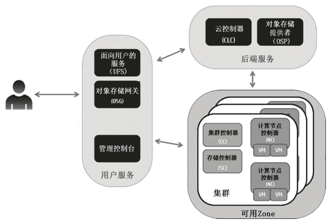

# 谈谈 Eucalyptus 云端管理工具

> 原文：[`c.biancheng.net/view/3894.html`](http://c.biancheng.net/view/3894.html)

桉树（Eucalyptus）云管理工具被慧与公司收购后改名为 Helion Eucalyptus，其继续开源，不过在 OpenStack 的竞争下，桉树发展渐行渐远，昔日风光已不在。

桉树是一个基于 Linux 的模块化的软件架构，在企业现有的 IT 基础架构中部署可扩展的高效私有云或混合云，属于本地 IaaS 云。为了隔离不同用户的网络流量及允许多个集群同属于一个局域网，桉树提供了一种虚拟叠加网络技术。另外，桉树提供的 API 兼容亚马逊的 EC2、S3、IAM、ELB、EC2 资源自动伸缩和云监控服务，这些都便于人们使用桉树部署混合云。

桉树由若干个组件组成，这些组件之间的关系如图 8 所示。
图 8  桉树各个组件之间的关系

#### 1）云控制器（Cloud Controller，CLC）

在很多部署案例中，云控制器和面向用户的服务（UFS=User-Facing Services）一般安装在同一台服务器上，这台服务器也就成了管理员、开发员、项目经理和终端用户进入云端的入口点。CLC 处理具有持久性并且作为 UFS 的后端。桉树的一个部署实例只允许存在一个云控制器。

#### 2）面向用户的服务（User-Facing Services，UFS）

桉树提供了很多兼容 AWS 的服务，如 EC2（计算）、AS（EC2 资源自动伸缩）、CW（云监控）、ELB（负载均衡）、IAM 等，UFS 为这些服务提供了 API 调用接口。一个桉树部署实例允许存在多台 UFS 服务器。

#### 3）管理控制台

是基于 Web 的可视化的管理桉树云的界面，直观、易用。管理控制台一般与 UFS 部署在同一台服务器上，一个桉树云实例允许存在多个管理控制台服务器。

#### 4）对象存储网关（Object Storage Gateway，OSG）

一方面负责把用户的请求传递给对象存储提供者，另一方面和持久存储层（数据库）合作完成身份认证。

#### 5）对象存储提供者（Object Storage Provider，OSP）

可以是桉树自带的 Walrus 组件，也可以是第三方的 Riak S2。Riak S2 兼容亚马逊 S3 和 OpenStack 的 Swift，能灵活扩展并存储数 P 级的数据，数据对象类型包括图片、文本、视频、文档、数据库备份以及二进制程序。

#### 6）集群控制器（Cluster Controller，CC）

必须部署在能同时与计算节点控制器和云控制器联网的机器上，集群控制收集集群内计算节点的信息并把虚拟机调度到特定的计算节点上。集群控制器通过管理组网模式和非 VLAN 管理组网模式两种方式管理虚拟机的网络，这两种组网模式会使用户到虚拟机的网络流量都通过集群控制器，而边沿组网模式就不存在这个缺点。集群内的所有计算节点必须处于同一个网段。

#### 7）存储控制器（Storage Controller，SC）

类似亚马逊的弹性块存储（EBS），SC 支持大多数的存储设备作为其存储后端，SC 暴露出的存储卷可以附加到虚拟机上，并且在虚拟机里面被当作原始块设备，用户可以分区和格式化这些原始块设备。

EBS 卷可以在 VM 终止后继续被保留，因此通常用于存储持久数据。在同一时刻，一个 EBS 卷只能附加到一台虚拟机，而且只能用于虚拟机所在的那个 Zone。对此，用户可以对 EBS 创建快照，对象存储网关把快照存储到指定的地方，并且其他的可用 Zone 都能使用这些快照。在桉树云中，支持使用企业级的 SAN 存储设备作为 SC 的存储后端。

#### 8）计算节点控制器（Node Controller，NC）

安装并运行在虚拟机的宿主机上。NC 控制虚拟机的活动（包括虚拟机的运行、检查和终止），获取并维护本地缓存中的虚拟机镜像，同时轮询和控制宿主机的系统软件（操作系统和虚拟机软件），以便响应集群控制器的请求。NC 通过边沿组网模式管理虚拟机的网络。