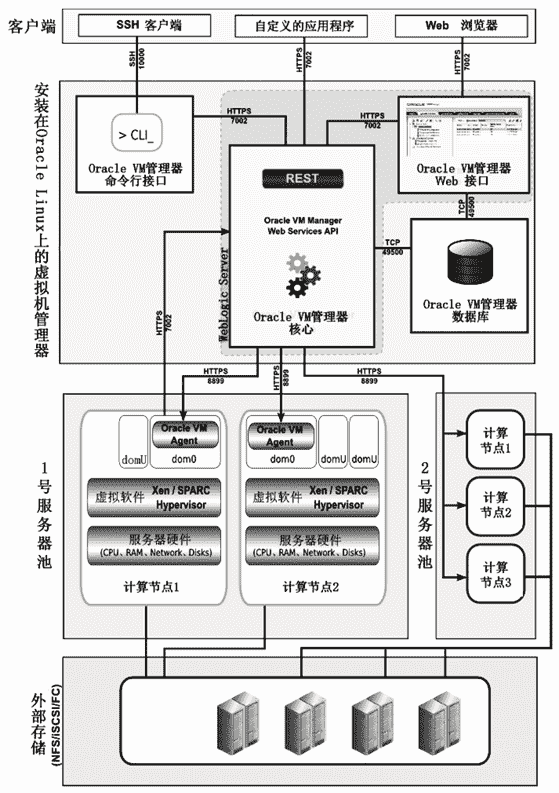

# Oracle VM Manager 简介

> 原文：[`c.biancheng.net/view/3895.html`](http://c.biancheng.net/view/3895.html)

在 IT 行业，Oracle 公司具有举足轻重的地位，Oracle 公司发行的虚拟化管理工具 Oracle VM Manager，采用 Java 语言开发，图 9 所示是 Oracle 公司官方给出的虚拟环境架构图。严格意义上讲，Oracle VM Manager 只是虚拟机管理工具，而不是云管理工具。
图 9  Oracle VM Manager 虚拟环境架构图
从图 9 可以看出，云端由若干服务器池和一个外部存储组成，每个服务器池包含若干台服务器（称为计算节点）。服务器池可以是集群，也可以不是集群。

服务器池中的计算节点上安装 Oracle VM Server 虚拟软件（基于 Xen 虚拟化技术），然后运行若干个 dom。其中 dom0 为管理 dom，里面安装和运行 Oracle VM Agent，dom0 有权限访问硬件和驱动，并且负责与 OracleVM 管理器通信。其他 dom 统称为 domU，为用户使用的普通虚拟机，由 dom0 启动并管理。

客户端“自定义的应用程序”是指 Oracle Enterprise Manager 或者采用 Web Service API 编写的应用程序或脚本。

基于 Oracle VM Manager 的云计算解决方案中，支持虚拟机热迁移——在不关闭虚拟机的情况下，从一台服务器移动到同一个服务器池中的另一台服务器上继续运行。在迁移的过程中，虚拟机的状态为 Migrating（迁移）。