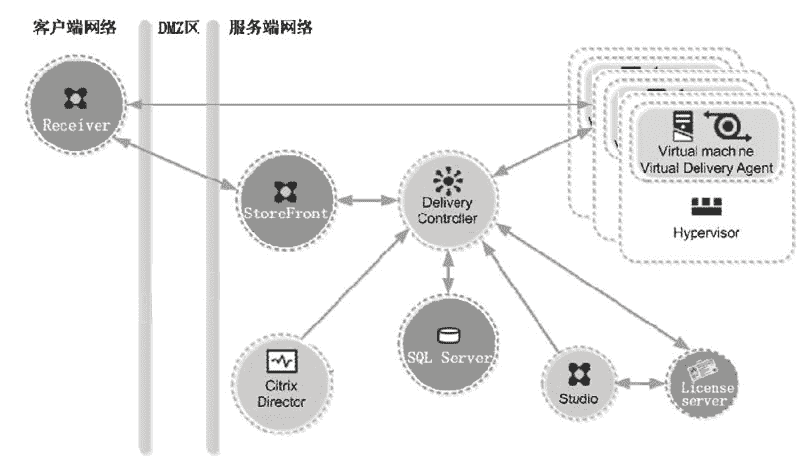
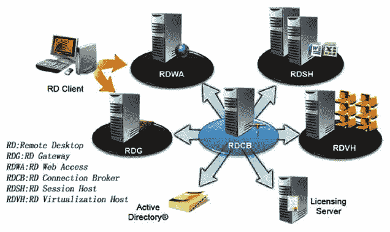

# 商业化的云计算组件有哪些？

> 原文：[`c.biancheng.net/view/3874.html`](http://c.biancheng.net/view/3874.html)

在教程《一套完整的云计算产品需要解决哪些问题》中讲到，一套完整的云计算产品包含虚拟化平台、管理工具和交付三部分。注意，这里讨论的是构建云计算的组件，而不是云计算服务，云计算服务提供商需要采用云计算组件来构建云端。

目前商业的云计算组件不多，但云计算服务商却很多。本节对当下比较有影响的商业云计算组件做一个简单介绍，不过这些公司发布了很多组件，却很少讲明这些组件在整个云计算解决方案中处于什么地位、完成什么任务，所以要搞清楚一家企业的云计算组件并非易事。通信协议除 HTTP/HTTPS 外，各个公司都发布了自己的协议。

## ⅤMware

VMware 由虚拟机起家，后来不断发展和完善云计算的管理平台和交付部分，如今已经推出了全套的云计算产品。

#### 1\. 虚拟化平台

VMware 公司的虚拟化技术做得最早，目前应用得也最广，虚拟化产品线丰富，覆盖计算机虚拟化、网络虚拟化、存储虚拟化。其中，计算机虚拟化产品包括桌面版（X86 平台和苹果电脑）和服务器版。计算机虚拟化是云计算产品的核心，桌面版有 Workstation、Fusion（苹果电脑），简化的桌面版 VMware Player Plus 对个人用户是免费的；服务器版有 EXSi，免费版 vSphere Hypervisor 是在 EXSi 的基础上简化而成的，可以直接安装在裸机上。

#### 2\. 管理工具

VMware 公司的云计算管理平台是 VMware vCenter 系列套件，其中 vCenter Server 是管理控制中心。VMware vCenter 管理私有云，而 VMware vCloud 套件用来管理公共云。

#### 3\. 交付部分

VMware 的远程桌面协议 PCoIP 是交付部分的核心，此协议基于 UDP，即使在低带宽网络环境下，也会有不俗的表现。在较高速的网络中，能传递高质量的屏幕画面。VMware 公司的客户端能同时兼容微软的 RDP 协议，客户端产品是 VMware Horizon Client。Horizon View Connection 是局域网内的交付网关，Horizon View Security 是因特网的入口网关，Horizon Client 只有通过这些网关，才能访问虚拟化平台上的桌面。

VMware 组合 EXSi、PCoIP、vCenter、View Client 核心组件及其他一些周边工具，推出一系列面向客户应用的解决方案套件，以便降低部署难度。这些套件包括公共云套件 VMware vCloud Suite、办公桌面虚拟化套件 Workspace Suite、混合云套件 VMware vRealize™Suite、快速混合云部署套件 VMware vCloud® Air™。

采用 VMware 云计算产品搭建的云计算中心架构复杂。

## Citrix

Citrix（思杰）公司由远程交付 IT 资源的产品起家，后逐步发展云计算的其他产品线，如虚拟机、管理平台等。不过在激烈竞争的云端产品市场，Citrix 逐步迎难而退，2016 年年初把 CloudPlatform 出售给 Accelerite 公司，自己又重回 OpenStack 社区。Citrix 集中精力发展自己的优势产品——云服务交付，包括软件虚拟化和虚拟桌面。桌面虚拟化架构如图 1 所示。
图 1  XenDesktop 架构

#### 1）Delivery Controller（交付控制器）

至少一个。控制器定义了一系列与虚拟化软件平台通信的服务，这些服务完成的任务是：分发应用程序和桌面、验证和管理用户访问、代理用户和其虚拟桌面及应用程序之间的连接、优化使用连接、负载平衡等。

#### 2）StoreFront（存储前端）

StoreFront 验证用户身份，管理用户访问的桌面和应用程序，存储企业的应用程序库，以便让用户自助访问。它还跟踪用户的应用程序订阅、快捷方式名称和其他数据，以确保用户在多个设备上拥有一致的体验。

#### 3）Director

专门提供给 IT 运维人员和前台服务团队使用的 Web 控制台，通过它可以集中监控 IT 环境、处理问题，以及为终端用户提供支持。

#### 4）Studio

统一的管理控制台。

#### 1\. 虚拟化平台

XenServer 是早期由 Citrix 收购 Xen 后推出的虚拟机软件，开源，直接安装在裸机上，核心代码是 Linux 和 Xen。开源是其最大的亮点。

#### 2\. 管理工具

Citrix 官网上已经没有云计算管理工具的产品了。

#### 3\. 交付部分

云服务交付是 Citrix 的强项，其交付产品已存在十几年，应该说相当成熟和稳定了。交付中的通信协议有 ICA 和 HDX，属于 TCP 类型，HDX 是颇具优势的协议，在低带宽网络环境下表现也不俗。

交付中的客户端软件 Receiver 是免费的，而且能在目前绝大部分流行的硬件和操作系统上安装运行，如 X86、ARM 等硬件平台，Windows、Linux、Android、Chrome OS 等软件平台。

Citrix 把 XenServer、CloudPlatform、Receiver 打包并加上一些周边产品，推出一些面向应用的方案套件，如统一移动、应用和桌面交付套件 Citrix Workspace Suite、私有办公云套件 XenDesktop 等。其他交付部件还有交付控制器（Delivery Controller）、StoreFront。

相对于 VMware，Citrix 云计算产品成本相对低廉，这是其优势。另外，在企业协同工作方面，Citrix 也有一些不俗的产品，如在线会议系统 GoToMeeting、企业级在线协作应用 Podio、在线培训应用 GoToTraining、DIY 网络研讨会 GoToWebinar。

## Microsoft

Microsoft（微软）远程桌面服务的架构图如图 2 所示。
图 2  微软远程桌面服务的架构图

#### 1\. 虚拟化平台

微软发展虚拟化软件比较晚，刚开始只是一个单机版 Virtual PC，虚拟机里只能安装 Windows 操作系统，后来看到虚拟化是大势所趋，其才在 Windows Server 2008 及以后的服务器操作系统中集成虚拟机 Hyper-V。

Hyper-V 作为一个角色由用户选择是否安装，而且管理单机的虚拟机极其简单方便，在 Windows Server 2012 版中，虚拟机软件已经相当稳定了，而且虚拟机里支持安装更多类型的操作系统，包括 Linux 操作系统。再后来，微软干脆推出了裸机版虚拟机 Microsoft Hyper-V Server 2012 R2。

微软的远程桌面会话主机（RDSH）是一大特色，这相当于多用户系统桌面，允许多个用户登录 Windows 系统，但是每个用户有自己的桌面，相对于虚拟机桌面来说，RDS 桌面消耗的计算资源更少，同一台计算机允许接入更多的用户。

最近一段时间，微软推出了两款容器产品：Windows Server Container 和 Hyper-V Container，后者综合了虚拟机的隔离效果和容器的轻量特征。

#### 2\. 管理平台

System Center 2016 是微软推出的最新的云计算管理平台。

#### 3\. 交付部分

RDP 通信协议起源于思杰的 ICA，后来由微软独立发展，由此推出 RDP 7 版、RemoteFX 和 RDP 8 版，在用户体验方面每个版本都有大幅度提高，在局域网内具有不错的表现。

客户端软件 mstsc.exe 一直随 Windows 操作系统自带，最近微软也发布能在 Android、Linux、Mac OS 上运行的客户端，但是用户体验远远不及 Windows 版。远程桌面代理（RD Connection Broker）对用户绘画进行负载均衡，远程桌面网关（RD Gateway）和远程桌面 Web 网关是交付入口点，但不是必需的。

微软的产品线极其丰富，几乎覆盖了全部的软件层面，从最底层的操作系统到最上层的应用软件，应有尽有。如果采用微软的产品搭建云计算环境，则架构最为简洁。