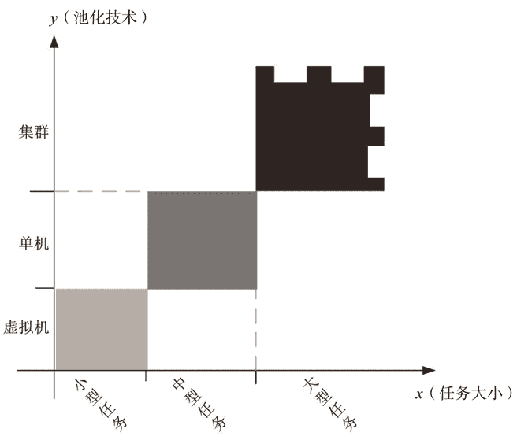

# 云端技术：组建云计算中心需要用到哪些技术？

> 原文：[`c.biancheng.net/view/3881.html`](http://c.biancheng.net/view/3881.html)

我们已经知道，一个完整的云系统包含 5 个角色，其中云服务提供商和云服务消费者是最主要的角色，这两个角色缺少任意一个都不能成为“云”。由这两者组成的“云”，算是最基本的“云”，如本地私有云就是只有供需双方的基本云。

本节开始重点介绍组建云端的技术、云端与终端的通信协议，末后顺带简单介绍一下云终端设备。

云端、通信协议（加上网络）和云终端简称为云计算的“云”、“管”、“端”。在建设具体的云端时到底采用什么技术，这与终端用户的类型密切相关，终端用户的类型间接决定了云服务的模式，以及需要在云端运行的软件种类。

总之，要根据云服务消费者的需求来选择技术并组建相应的云端，需求不同，组建云端的技术也不尽相同。

云端是云计算的核心，必须紧贴用户需求，同时应具备水平伸缩性——在需要的时候可随时增加服务器，从而扩充云端计算能力；在不需要的时候可自动让多余的机器睡眠，以达到节能减排的目的。

前面讲过，软件是让 CPU 来完成某项任务的步骤，云端是软件运行的场所，因此可以这样说：云端是运行各种软件来完成相应任务的地方。

云端采用的技术与任务的大小有关，大型任务（如核爆模拟、天气预报）和小型任务（如四则运算计算器、文字编辑等）采用的技术明显不同，前者很难用一台物理计算机按时完成任务，所以需要联合多台计算机（称为集群）共同完成任务；而后者占用一台物理计算机就浪费了资源，所以需要对单台物理计算机进行分割（称为虚拟化）。

将单台物理计算机分割成多台虚拟机，每台虚拟机完成一个任务，这意味着一台物理计算机并行执行多个任务。如果一个任务需要由一台物理计算机来完成，那么就直接分配一台物理计算机给此任务，这样的任务就是中型任务。用图 1 所示的坐标可以很好地表示这种关系。
图 1  技术与任务的关系
对一台物理计算机做分割（虚拟出很多更小的计算机），然后给小型任务分配一台虚拟机，从而充分利用资源。虚拟机的大小是由 CPU 速度、内存大小、硬盘容量和每月的网络带宽定义的，当然虚拟机越大，租金就越高。

由一台物理计算机无法完成的大型任务，就要采用多台物理计算机集群在一起组成分布式系统。分布式系统还涉及任务划分与分配、多机协同工作的问题，后面会做进一步阐述。

由于在一篇文章中讲解会导致篇幅太长不利于读者学习，所以我们在后面教程中一一讲述组建云计算中心需要用到的技术：

*   云计算中心应该如何选址？
*   云计算中心如何存储数据？
*   虚拟化技术和容器技术
*   VDI（远程桌面）是什么？
*   负载均衡（Load Balance）简介
*   服务器集群（cluster）简介
*   容错计算是什么？
*   家目录（主目录）漫游技术简介
*   云计算租户隔离：给小白的科普文
*   统一身份认证（IDS）是什么？云端如何应用统一身份认证？
*   SOA（面向服务的架构）是什么？
*   微服务是什么？微服务的优缺点有哪些？

这些云端技术不一定在所有云端都会采用，一些小型云端（如家庭云、小企业办公云等）根本不需要这么复杂的技术。