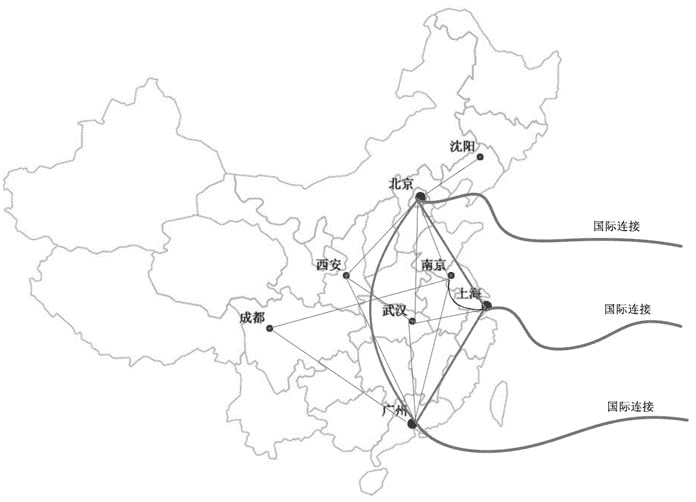
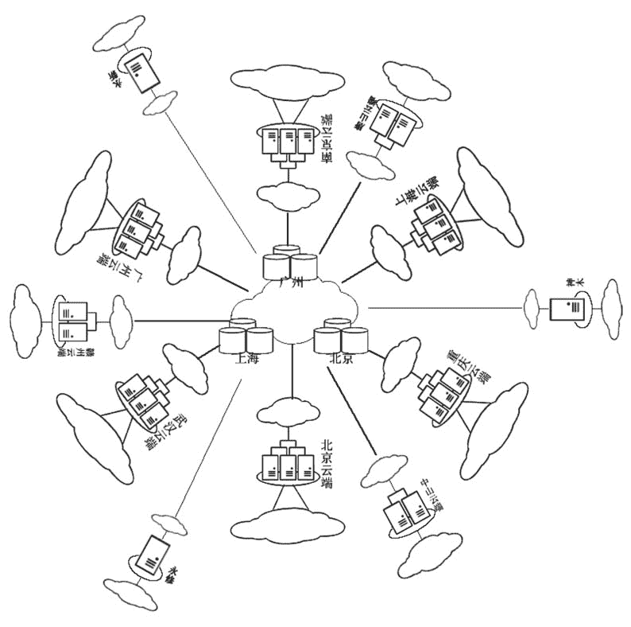
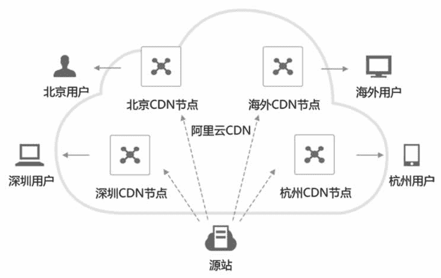

# 云计算中心应该如何选址？

> 原文：[`c.biancheng.net/view/3883.html`](http://c.biancheng.net/view/3883.html)

前面教程中我们讲到，延时是网络的一个关键属性，那么对于实时的强交互性软件来说，云端至终端的往返延时应该控制在 100 毫秒之内，否则就会大大降低操作云端软件的用户的体验。

比如编辑一份 Word 文档，输入的文字要过一会儿才能出现在屏幕上，这是谁都接受不了的。目前云化实时强交互性软件的途径有两条：

*   采用网页浏览器（可参考《什么是软件》教程）。
*   在人口密集区建立云端分部，从而降低网络延时。

降低延时的方法就是减少终端与云端的网络路径上的转发节点数目或者提高网络设备的转发速度，但我们不能直接修改广域网的网络，唯一能做的事情就是尽量把云端建在离用户最近的地方，这就是“让计算离用户最近”的原则。这里的“近”不是指地理位置上的近，而是指网络延时小。

比如美国的国际接入中心与中国的广州，地理位置上相距很远，但是网络延时却非常小，因为连通两地的是太平洋海底光缆，中途转发设备极少，几乎没有延时，所以两地相距很“近”。

在中国，较好的布局是：分别在北京、上海、广州、沈阳、南京、武汉、成都、西安人口密集区部署云端分部。这 8 个城市也是组成电信网的核心网部分，国际出口设在北京、上海和广州，所以如果云端要服务全球，最好的地方就是北京、上海、广州三个城市。图 1 所示是中国电信主干网络图。
图 1  中国电信主干网络图
对于一个服务全国的公共云端来说，一个不错的布局方案如下：

1.  在北京、上海和广州三地建设存储云，专门存储租户数据，这三个存储云互为备份，以确保数据万无一失。
2.  在省会城市分别建设一个中等规模的云端分部，这些云端分部的主要作用是计算，而不是保存数据，数据被保存到存储云。
3.  在地级市建设小型云端支部，完成辖区内的计算任务。
4.  如有必要，在县级市建设微型云端。

这些云端是各自独立的，没有从属关系，但是它们都与存储云建立联系。在租户登录时，会自动引导其进入最“近”的云端。比如，租户甲平时都在中山，自然是登录中山的云端，当他出差去北京时，就登录到北京的云端。公共云全国布局的示意图如图 2 所示。
图 2  公共云全国布局
这样，各个计算云与存储云之间的数据传输是在后台批量进行的，而计算云与终端之间是前台的、批量的或者实时的。对租户来说，实现了就近计算，从而可以大大降低网络延时。如果有国外租户，则可能还要在国外建立云端。

提醒：云端都应该规划成可伸缩性的——开始运行少量服务器，以后再根据租户数的增加不断增加服务器。

相比于“让计算离用户最近”的原则，目前有一个类似的概念，叫作“内容分发网络”，可以理解为“让内容离用户最近”，全称是 Content Delivery Network，简称为 CDN。用户就近访问网络内容（如网站、流媒体等）有两个好处：一是用户体验好，二是传输成本低。

如图 3 所示，为阿里云 CDN。除上面的“让计算离用户最近”和“让内容离用户最近”的布局原则外，还有“离能源丰富的地方最近”和“离寒冷的地方最近”的布局原则。云中心的能耗主要包括机器设备消耗的电力和温湿度控制设备消耗的电力，所以充足稳定的能源供应至关重要，同时尽量降低温湿控制设备的能耗，比如把云中心建在寒冷的地区（如南极洲），就不需要制冷设备了。

在传统的机房里，制冷设备的能耗会超过一半。最理想的建设云端的地区的特点有：寒冷、电力充裕、人口密集、无地质灾害、计算机网络设施发达，如图 4 所示。
图 3  阿里云 CDN
图 4  著名云中心选址