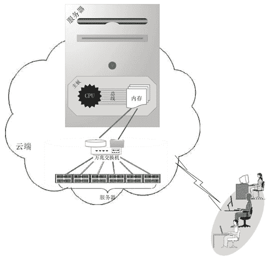

# 云计算中心如何存储数据？分布式存储+外部存储+直接存储

> 原文：[`c.biancheng.net/view/3884.html`](http://c.biancheng.net/view/3884.html)

前面讲过，云计算的精髓就是把有形的产品（如网络设备、服务器、存储设备、各种软件等）转化为服务产品，并通过网络让人们远距离在线使用。而计算资源主要是指服务器（CPU、内存）、存储和网络，存储一方面是虚拟内存的组成部分，另一方面也是软件、数据的存放场所，如图 1 所示。

图 1  存储
CPU 和内存通过主板紧密地捆绑在一起，二者利用主板上的高速并行总线进行通信，目前的技术还不能做到使它们分离，而且也没有这个必要。但是如果存储与 CPU 分离（不直接通过主板连在一起），就会有很多好处，比如可以共享存储、计算机可以无状态、便于计算资源横向伸缩等。

目前能使 CPU 与存储分离的技术很多，如 FC、FCoE、iSCSI、NFS、CIFS 等，前三个是磁盘块共享技术，后两个是文件共享技术，而且还出现了块共享的 SAN 产品和文件共享的 NAS 产品。

一个磁盘块等于整数个磁盘扇区，一个磁盘扇区能储存 512 个字节的数据（现在大容量硬盘是 4KB 扇区），而扇区是读写硬盘的最小单位。也就是说，一次不能从硬盘读写小于一个扇区的数据（512B 或 4KB）。直接读取磁盘块不需要操作系统参与，但是读取硬盘上的文件（如复制“我的简历.doc”到 U 盘上）必须要操作系统配合。根据存储与 CPU 分离的程度，存储可划分为如下 3 种类型。

#### 1）外部存储

存储和 CPU 不在同一台计算机上，如 SAN 和 NAS 存储是单独的存储设备，它们通过以太网线或者光纤与计算机连接。专门的存储网络设备很贵，随着以太网速度越来越快，基于以太网的存储技术逐渐流行起来，如 iSCSI，10Gbit/s 的网卡能提供 1GB/s 的理论速度。

注意，这里的单位 Gbit/s 和 GB/s，前者表示每秒多少比特，一个比特就是一位二进制数字，要么是 0，要么是 1；后者表示每秒多少字节，一个字节等于 8 个比特。计算机里的一个字节先要加上一位校验位和一位停止位，然后再通过网卡传递出去，所以一个字节传递到网络上就占据了 10 个比特位。外部存储的示意图如图 2 所示。
图 2  外部存储

#### 2）直接存储

存储直接接插到主板上，通过 PATA、SATA、mSATA、SAS、SCSI 或者 PCI-E 接口总线通信。传统的机械硬盘一般采用 PATA、SATA、SAS、SCSI 接口，相对于外部存储，直接接插主板的机械硬盘的速度优势越来越不明显，但是固态硬盘（如 mSATA、PCI-E）的速度优势还是比较明显的，尤其是 PCI-E 的固态硬盘，代表着业界顶尖的存储技术。直接存储的示意图如图 3 所示。
图 3  直接存储

#### 3）分布式存储

通过分布式文件系统把各台计算机上的直接存储整合成一个大的存储，对参与存储的每台计算机来说，既有直接存储部分，也有外部存储部分，所以说分布式存储融合了前面两种存储方案。由于需要采用分布式文件系统来整合分散于各台计算机上的直接存储，使之成为单一的名字空间，所以所涉及的技术、概念和架构非常复杂，而且还要消耗额外的计算资源。

服务器存储局域网（Server SAN）逐渐被数据中心采用，而且发展很快，Ceph 分布式存储系统就属于 Server SAN，被很多云中心采用。目前的软件定义存储（SDS）概念就是分布式存储。分布式存储的示意图如图 4 所示。

图 4  分布式存储
存储的评价指标有容量、速度、每秒读写次数（IOPS）、可用性。“容量”比较容易理解，就是能存储的数据总量。

在实际项目中，我们更在乎有效容量，比如四块 1TB 的硬盘，加起来容量是 4TB，但是如果这四块硬盘做成镜像（RAID-1），那么有效容量就是 2TB；如果做成 RAID-5，有效容量就又不一样了。容量要求很容易满足，一般采用横向扩容即可。“速度”指标是指每秒传输的数据量，速度与带宽是同一个概念。

IOPS 是最重要的指标，定义为每秒钟能响应的读（或写）操作的次数，体现的是并发性和随机访问能力。IOPS 与磁盘的转速、平均寻道时间密切相关，磁盘的平均寻道时间为 4～12ms，对于转速 7200rpm 的磁盘，我们可以计算出其 IOPS 近似值：1000÷[1000÷（7200÷60）÷2+8]=83。对单块磁盘来说，“读/写”磁盘从微观层面上看是串行的。

比如 100 个人同时访问磁盘，磁盘是一个一个地响应用户的请求，但在宏观上又表现为并行性，即 100 个人在一秒钟内同时访问到了磁盘，给人一种并行的错觉。提高 IOPS 的方法有很多，比如采用更好的硬盘（如固态盘），或者增加磁盘的数目并让访问分散到各个硬盘，也可以采用更多的缓存（Cache），从而让经常访问的内容驻留在缓存中。

如图 5 所示，如何将主机 IOPS 需求转换成磁盘实际 IOPS 负载，并计算出需要的磁盘数呢？
图 5  主机 IOPS 需求与磁盘实际 IOPS 负载
首先我们要明白，主机的 IOPS 需求并不一定等于磁盘实际 IOPS 负载。比如对于 RAID-1，主机写一次，磁盘实际要写两次（镜像的两个磁盘各写一次）；再比如 RAID-5 存储，主机写一次，磁盘要读两次、写两次，共 4 个 IOPS。主机写 1 次对应磁盘实际发生的读写次数称为写惩罚（Write Penalty），阵列类型不同，写惩罚也不同，具体参见图 5。RAID-5 写操作示意图如图 6 所示。
图 6  RAID-5 写操作示意图
在图 6 中，主机向 RAID-5 存储写 1001，存储中实际发生的步骤如下。

1）读取原始数据 0110 并与新的数据 1001 做异或操作：0110 xor 1001=1111。

2）读取原有的校验位 0010，并用第一步算出的数值 1111 与原校验位再做一次异或操作：0010 xor 1111=1101。

3）然后将 1001 新数据写入到数据磁盘，将第二步中计算出来的新校验位 1101 写入校验盘。

现在假设主机的 IOPS 需求是 x，读/写比率为 2：1，存储为 RAID-5，那么可以算出磁盘实际的 IOPS 负载 y：例如 x=360，则计算得出 y=720。假设一个 7200rpm 的 SATA II 硬盘的 IOPS 按 90 算，那么需要个磁盘，8 个磁盘做成 7+1 RAID-5。在上述公式中，“”表示每秒磁盘的读次数，“读”不存在惩罚，也就是说，主机的一次读对应磁盘的一次读。

存储的“可用性”指标关乎数据的安全性，是指保存在存储设备上的数据不会丢失的概率。由于磁盘故障而导致用户数据丢失，是一件非常糟糕的事情。通常用几个“9”来衡量可用性，比如 3 个“9”的可用性，意思是一年之中 99.9% 的时间内数据不会丢失。

提高可用性的方法也有很多，比如购买更稳定可靠的磁盘、做成多路镜像、采用不间断电源供电、提高备份的频率，甚至是建立多个异地灾备中心，乃至部署双活中心等。对于当前主流的硬盘产品，我们总结如下，如下表所示。 

|   | 容量 | 带宽 | IOPS | 可用性 |
| --- | --- | --- | --- | --- |
| 5400 转 PATA 硬盘 | 128GB~2TB | 1Gbit/s | 30~50 | 如果损坏，还可以恢复大部分数据 |
| 7200 转 SATA 硬盘 | 250GB~3TB | 3Gbit/s | 75~100 |
| 10000 转 SATA 硬盘 | 300GB~800GB | 3 或 6Gbit/s | 125~150 |
| 10000 转 SAS 硬盘 | 100GB~600GB |   | 140 |
| 15000 转 SAS 硬盘 | 100GB~300GB | 3~12Gbit/s | 175~219 |
| SATA SSD | 8GB~1TB | 3Gbit/s | 400~20000 | 如果损坏，则整块硬盘上的数据全部丢失 |
| SATA SSD | 8GB~1TB | 6Gbit/s | 60000~120000 |
| mSATASSD | 80GB~1GB | 4~8Gbits | 400~20000 |
| PCI-E SSD | 60GB~2TB | >8Gbit/s | 12 万~1 千万 |

注意，表 1 中的带宽单位，Gbit/s 是每秒 G 比特位，MB 是每秒多少兆的字节，一字节等于 8 比特。在带宽的计算中，有经验公式：1B≈10bit，加上了校验位和停止位。比如你家里申请了 4 兆的宽带上网，那么在网络通畅的情况下，下载文件的速度约等于 400KB，即 400KB×10=4MB。

在云端，往往设计两个层次的存储：一个是物理机器访问的存储，一个是虚拟机访问的存储。